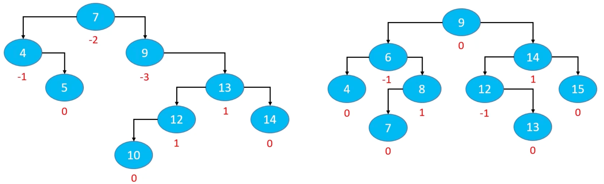
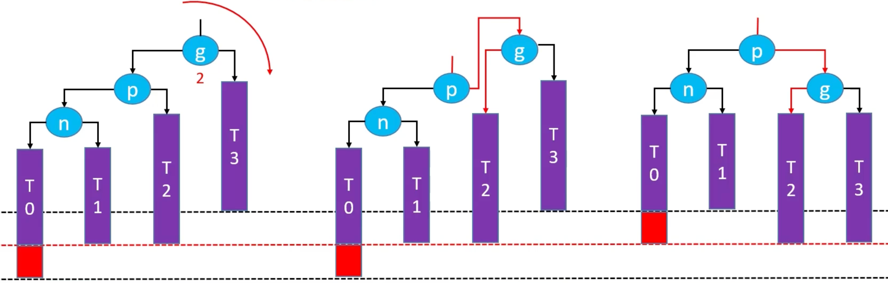
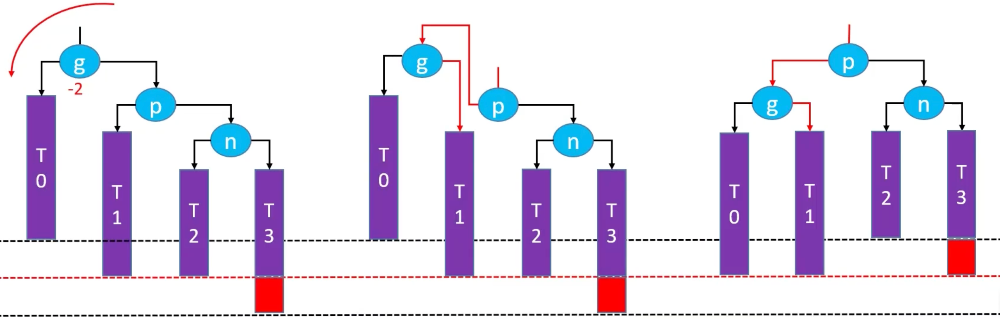
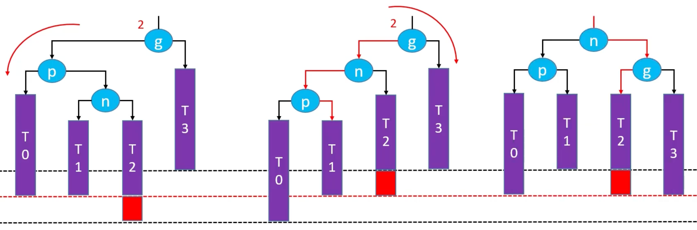
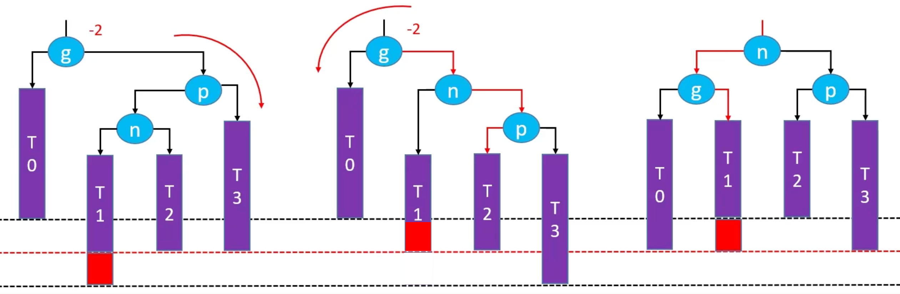

## 基本概念

| 概念     | 解释                     |      |
| -------- | ------------------------ | ---- |
| 平衡因子 | 某结点的左右子树的高度差 |      |
|          |                          |      |
|          |                          |      |

AVL树的特点：

- 每个节点的平衡因子只可能是1，0，-1（绝对值≤1，如果超过1，称之为失衡）
- 每个节点的左右子树的高度差不超过1
- 搜索、添加、删除的时间复杂度为O(logn)

## 添加导致的失衡

示例：往下面这棵子树中添加 13

- 最坏情况：可能会导致所有祖先节点都失衡
- 父节点、非祖先节点，都不可能失衡

修复添加导致的失衡，有如下几个操作：

- LL – 右旋转（单旋）
- RR – 左旋转（单旋）
- LR – 先左旋，再右旋（双旋）
- RL – 先右旋，再左旋（双旋）

### LL – 右旋转（单旋）

g.left = p.right

p.right = g

让p成为这棵子树的根节点

旋转后仍然是一棵二叉搜索树：T0 < n < T1 < p < T2 < g < T3

旋转后整棵树都达到平衡

还需要注意维护以下内容

- T2、p、g的`parent`属性
- 先后更新g、p的高度

### RR – 左旋转（单旋）

g.right = p.left

p.left = g

让p成为这棵子树的根节点

旋转后仍然是一棵二叉搜索树：T0 < g < T1 < p < T2 < n< T3

旋转后整棵树都达到平衡

还需要注意维护以下内容

- T1、p、g的`parent`属性
- 先后更新g、p的高度

### LR – 先左旋，再右旋（双旋）

- 先左旋转：`p.right = n.left; n.left = p`
- 再右旋转：`g.left = n.right; n.right = g`

### RL – 先右旋，再左旋（双旋）

- 先右旋转：`p.left = n.right; n.right = p`
- 再左旋转：`g.right = n.left; n.left = g`

## 删除导致的失衡

