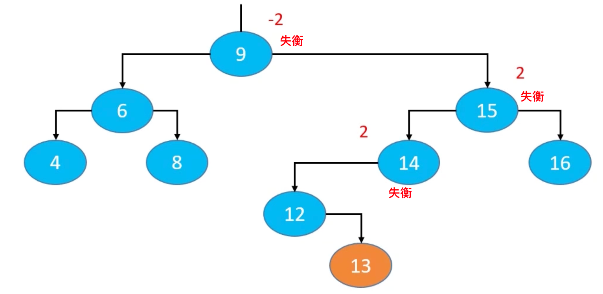

## 基本概念

平衡因子：某结点的左右子树的高度差

AVL树的特点：

- 每个节点的平衡因子只可能是1，0，-1（绝对值≤1，如果超过1，称之为失衡）
- 每个节点的左右子树的高度差不超过1
- 搜索、添加、删除的时间复杂度为O(logn)


## 添加导致的失衡

示例：往下面这棵子树中添加 13

- 最坏情况：可能会导致所有祖先节点都失衡
- 父节点、非祖先节点，都不可能失衡



修复添加导致的失衡，有如下几个操作：

- LL – 右旋转（单旋）
- RR – 左旋转（单旋）
- LR – 先左旋，再右旋（双旋）
- RL – 先右旋，再左旋（双旋）

### LL – 右旋转（单旋）

g.left = p.right

p.right = g

让p成为这棵子树的根节点

旋转后仍然是一棵二叉搜索树：T0 < n < T1 < p < T2 < g < T3

旋转后整棵树都达到平衡

还需要注意维护以下内容

- T2、p、g的`parent`属性
- 先后更新g、p的高度


### RR – 左旋转（单旋）

g.right = p.left

p.left = g

让p成为这棵子树的根节点

旋转后仍然是一棵二叉搜索树：T0 < g < T1 < p < T2 < n< T3

旋转后整棵树都达到平衡

还需要注意维护以下内容

- T1、p、g的`parent`属性
- 先后更新g、p的高度


### LR – 先左旋，再右旋（双旋）

- 先左旋转：`p.right = n.left; n.left = p`
- 再右旋转：`g.left = n.right; n.right = g`


### RL – 先右旋，再左旋（双旋）

- 先右旋转：`p.left = n.right; n.right = p`
- 再左旋转：`g.right = n.left; n.left = g`


### 添加节点后的修复

```go
// 添加节点后的处理
func (a *AVLTree) afterAdd(n *avlNode) {
    // 向上遍历父节点和祖先节点
	// 如果节点平衡，就更新高度
	// 如果节点不平衡，则恢复平衡，只需要处理高度最低的不平衡节点。
	for n.parent != nil {
        n = n.parent
       if a.isBalanced(n) {
           // 更新高度
           a.updateHeight(n)
       } else {
           // 恢复平衡
           a.rebalance(n)
           break
       }
    }
}
```


## 删除导致的失衡

示例：删除子树中的 16

可能会导致**父节点**或**祖先节点**失衡（只有1个节点会失衡），其他节点，都不可能失衡


### LL – 右旋转（单旋）

- 如果绿色节点不存在，更高层的祖先节点可能也会失衡，需要再次恢复平衡，然后又可能导致更高层的祖先节点失衡…
- 极端情况下，所有祖先节点都需要进行恢复平衡的操作，共 O(logn) 次调整


### RR – 左旋转（单旋）


### LR – 先左旋，再右旋（双旋）


### RL – 先右旋，再左旋（双旋）


### 删除节点后的修复

```go
// 删除节点后的处理
func (a *AVLTree) afterRemove(n *avlNode) {
	// 向上遍历父节点和祖先节点
    // 如果节点平衡，就更新高度
    // 如果节点不平衡，则恢复平衡。由于恢复平衡后，可能会导致祖先节点不平衡，所以需要继续循环遍历祖先节点。
    for n.parent != nil {
        n = n.parent
        if a.isBalanced(n) {
           // 更新高度
           a.updateHeight(n)
       } else {
           // 恢复平衡
           a.rebalance(n)
       }
    }
}
```

## 总结

添加

- 可能会导致所有祖先节点都失衡
- 只要让高度最低的失衡节点恢复平衡，整棵树就恢复平衡【仅需 O(1) 次调整】

删除

- 可能会导致**父节点**或**祖先节点**失衡（只有1个节点会失衡）
- **恢复平衡后，可能会导致更高层的祖先节点失衡**【最多需要 O(logn) 次调整】

平均时间复杂度

- 搜索：O(logn)
- 添加：O(logn)，仅需O(1)次的旋转操作
- 删除：O(logn)，最多需要 O(logn) 次的旋转操作
