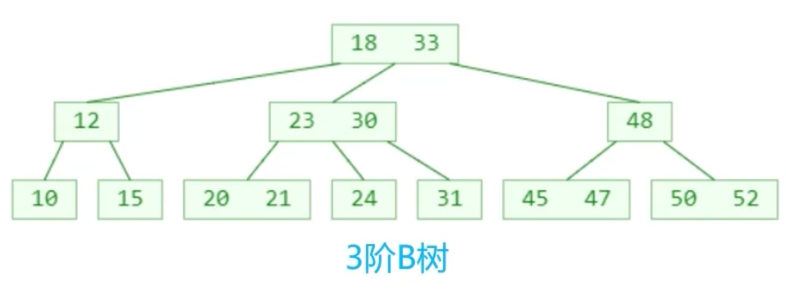
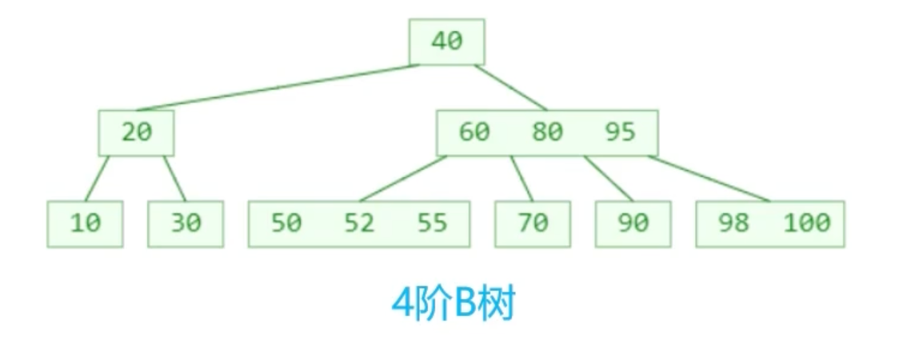
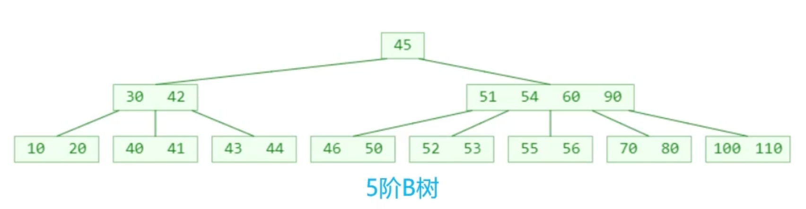

## B-tree、B-树

B树是一种平衡的多路搜索树，多用于文件系统、数据库的实现

B树特点：

- 1个节点可以存储超过2个元素、可以拥有超过2个子节点
- 拥有二叉搜索树的一些性质
- 平衡，每个节点的所有子树高度一致
- 比较矮

## m阶B树的性质（m≥2）

假设一个节点存储的元素个数为x，有如下性质：

- 根节点：x∈[1, m - 1]
- 非根节点：x∈[cell(m/2) - 1, m -1]
- 如果有子节点，子节点个数y = x + 1
  - 根节点子节点个数：y∈[2, m]
  - 非根节点子节点个数：y∈[cell(m/2), m]

比如m = 3，y∈[2, 3]，因此可以称为(2, 3)树、2-3树

比如m = 4，y∈[2, 4]，因此可以称为(2, 4)树、2-3-4树

比如m = 5，y∈[3, 5]，因此可以称为(3, 5)树

如果m = 2，那就是二叉搜索树了。

## B树 VS 二叉搜索树

B树和二叉搜索树在逻辑上是等价的

多代节点合并，可以获得一个超级节点

- 2代合并的超级节点，最多拥有4个子节点（至少是4阶B树）
- 3代合并的超级节点，最多拥有8个子节点（至少是8阶B树）
- n代合并的超级节点，最多拥有2^n^个子节点（至少是2^n^阶B树）

m阶B树，最多需要log~2~m 代合并

## 搜索

