## B-tree、B-树

B树是一种平衡的多路搜索树，多用于文件系统、数据库的实现

B树特点：

- 1个节点可以存储超过2个元素、可以拥有超过2个子节点
- 拥有二叉搜索树的一些性质
- 平衡，每个节点的所有子树高度一致
- 比较矮

## m阶B树的性质（m≥2）

假设一个节点存储的元素个数为x，有如下性质：

- 根节点：x∈[1, m - 1]
- 非根节点：x∈[cell(m/2) - 1, m -1]
- 如果有子节点，子节点个数y = x + 1
  - 根节点子节点个数：y∈[2, m]
  - 非根节点子节点个数：y∈[cell(m/2), m]

比如m = 3，y∈[2, 3]，因此可以称为(2, 3)树、2-3树

比如m = 4，y∈[2, 4]，因此可以称为(2, 4)树、2-3-4树

比如m = 5，y∈[3, 5]，因此可以称为(3, 5)树

如果m = 2，那就是二叉搜索树了。

## B树 VS 二叉搜索树

B树和二叉搜索树在逻辑上是等价的

多代节点合并，可以获得一个超级节点

- 2代合并的超级节点，最多拥有4个子节点（至少是4阶B树）
- 3代合并的超级节点，最多拥有8个子节点（至少是8阶B树）
- n代合并的超级节点，最多拥有2^n^个子节点（至少是2^n^阶B树）

m阶B树，最多需要log~2~m 代合并

## 搜索

跟二叉搜索树的搜索类似

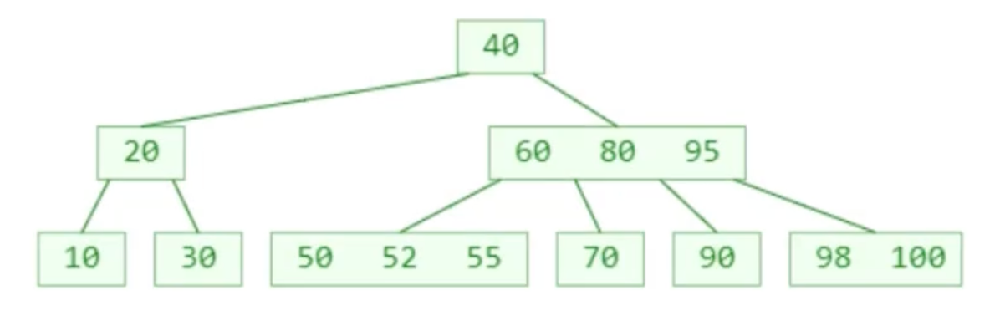

1. 先在节点内部从小到大开始搜索元素
2. 如果命中，搜索结束
3. 如果未命中，再去对应的子节点中搜索元素，重复步骤1

## 添加

新添加的元素必定是添加到叶子节点

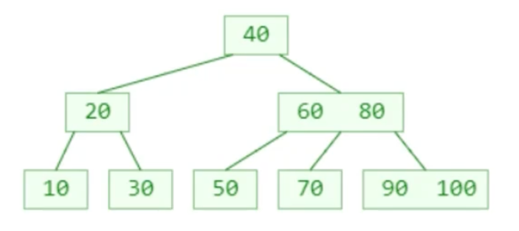

插入55

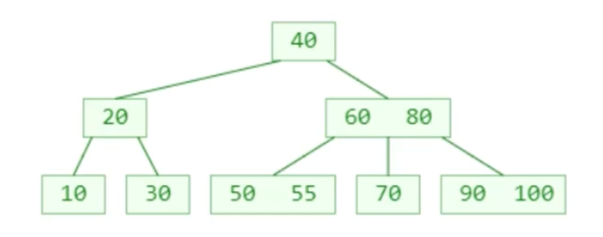

插入95

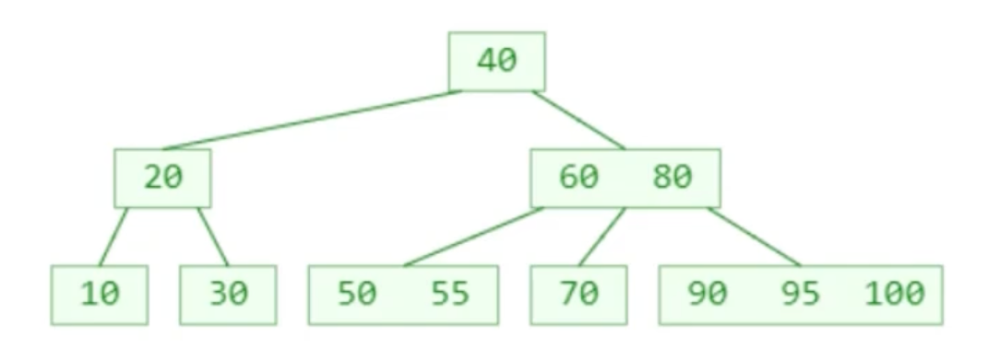

再插入98呢？（假设这是一个4阶B树）

- 最右下角的叶子节点的元素个数将超过限制
- 这种现象可以称之为：**上溢（overflow）**

### 添加 - 上溢的解决（假设5阶）

上溢节点的元素个数必然等于 m；

假设上溢节点最中间元素的位置为 k

- 将 k 位置的元素向上与父节点合并
- 将 [0, k - 1] 和 [k + 1, m - 1] 位置的元素分裂成 2 个子节点。这 2 个子节点的元素个数，必然都不会低于最低限制（cell(m/2) − 1）

一次分裂完毕后，有可能导致父节点上溢，依然按照上述方法解决

- 最极端的情况，有可能一直分裂到根节点

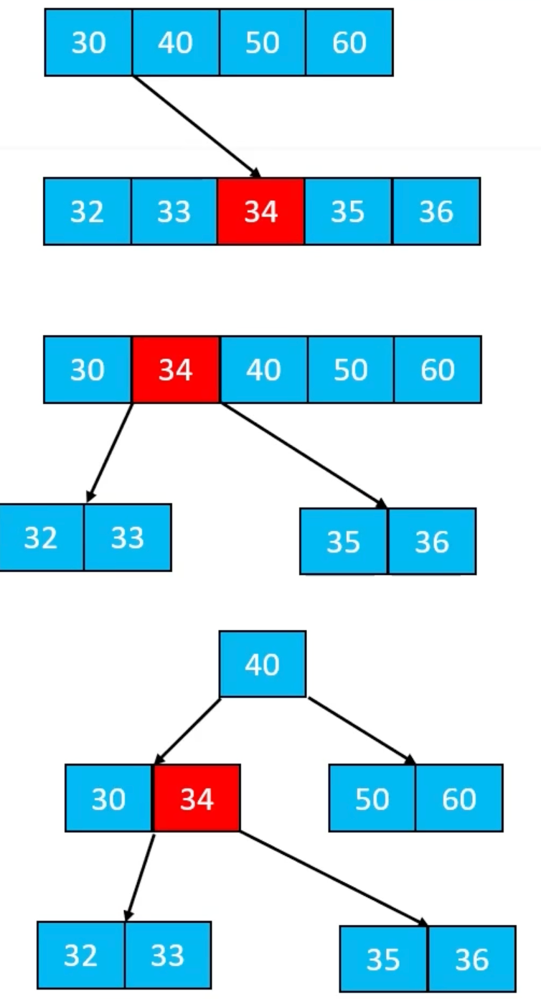

## 删除

### 删除 - 叶子节点

假如需要删除的元素在**叶子节点**中，那么**直接删除**即可；

例如：删除30

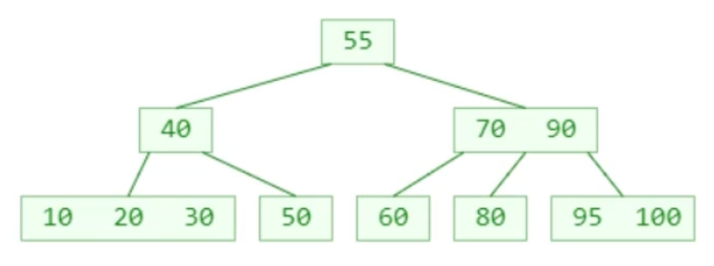

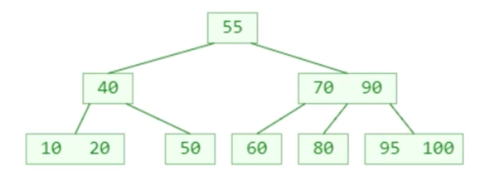

### 删除 - 非叶子节点

假如需要删除的元素在**非叶子节点**中

1. 先找到前驱或后继元素，覆盖所需删除元素的值
2. 再把前驱或后继元素删除

例如：删除60

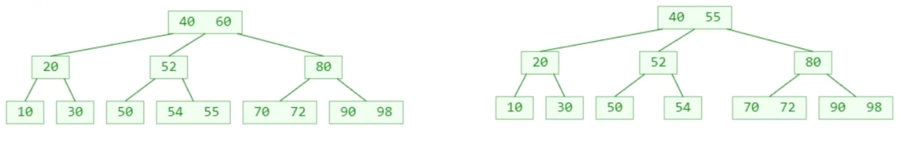

**非叶子节点的前驱或后继元素，必定在叶子节点中**；

- 所以这里的删除前驱或后继元素 ，就是最开始提到的情况：删除的元素在叶子节点中
- 真正的删除元素都是发生在叶子节点中；

### 删除 - 下溢

删除22（假设是一个5阶B树）

叶子节点被删掉一个元素后，元素个数可能会低于最低限制cell(m/2) - 1，这种现象称为：下溢

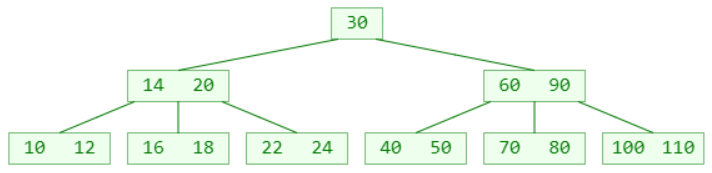

### 删除 - 下溢的解决

下溢节点的元素数量必然等于 ┌ m/2 ┐ − 2

如果下溢节点临近的兄弟节点，有至少 ┌ m/2 ┐ 个元素，可以向其借一个元素

- 将父节点的元素 b 插入到下溢节点的 0 位置（最小位置）
- 用兄弟节点的元素 a（最大的元素）替代父节点的元素 b
- 这种操作其实就是：旋转

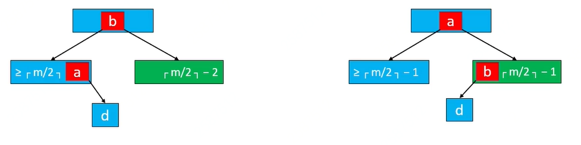

如果下溢节点临近的兄弟节点，只有 ┌ m/2 ┐ − 1 个元素

- 将父节点的元素 b 挪下来跟左右子节点进行合并
- 合并后的节点元素个数等于┌ m/2 ┐ + ┌ m/2 ┐ − 2，不超过 m − 1
- 这个操作可能会导致父节点下溢，依然按照上述方法解决，下溢现象可能会一直往上传播

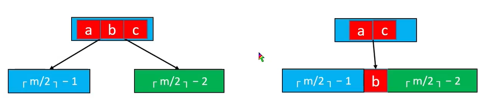

删除示例：

删除22（假设是5阶B树）

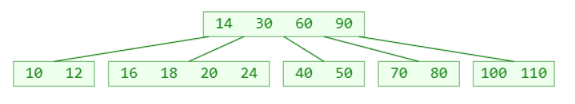

## 4阶B树

如果先学习 4 阶 B 树（2 - 3 - 4 树），将能更好地学习理解红黑树：

4阶B树的性质：

- 所有节点能存储的元素个数 x ：1 ≤ x ≤ 3
- 所有非叶子节点的子节点个数 y ：2 ≤ y ≤ 4

添加：从 1 添加到 22

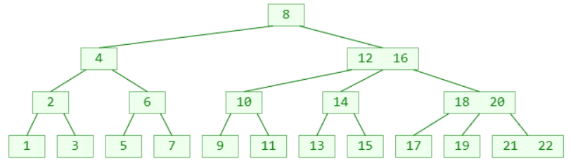
