## 红黑树介绍

**红黑树**也是一种**自平衡的二叉搜索树**

- 以前也叫做平衡二叉B树（Symmetric Binary B-tree）

## 红黑树性质

1. 节点是Red或者Black
2. 根节点必须是黑色
3. 叶子节点(外部节点、空节点)都是Black
4. Red节点的子节点都是Black
   - Red节点的parent都是Black
   - 从根节点到叶子节点的所有路径上，不能有2个连续的Red节点
5. 从任一节点到叶子节点的所有路径，都包含相同数目的Black节点

## 红黑树的等价变换

- 红黑树和4阶B树（2-3-4树）具有等价性
- BLACK节点与它的RED子节点融合在一起，形成一个B树节点
- 红黑树的BLACK节点个数与4阶B数的节点总个数相等
- 后面展示的红黑树都会省略NULL节点

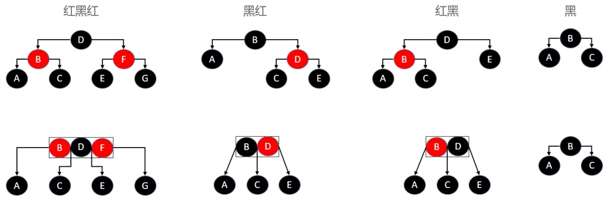

## 添加

已知

- B树种，新元素必定是添加到叶子节点中
- 4阶B树所有节点的元素个数x都符合x∈[1, 3]

建议新添加的节点默认为RED，这样能够让红黑树的性质尽快满足（性质1，2，3，5都满足，性质4不一定）

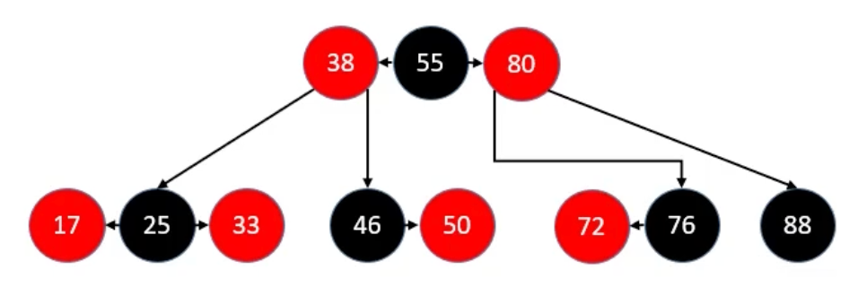

如果添加的是根节点，染成BLACK即可

### 添加的所有情况

一共有12种情况。

有4种情况满足红黑树的性质4：parent为Black的情况

- 同样也满足4阶B树的性质
- 因此不用做任何额外处理

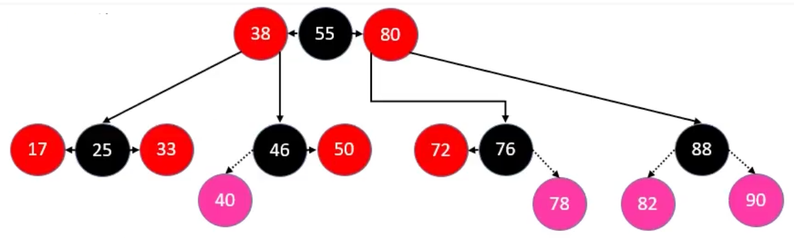

有8种情况不满足红黑树的性质4：parent为Red（Double Red）

- 其中前4种属于B树节点上溢的情况

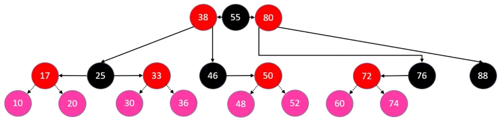

### 添加 - 修复性质4 - LL/RR

判定条件：uncle节点不是Red

修复操作：

1. parent染成Black，grand染成Red
2. grand进行单旋操作

添加52的时候，将50染成Black，46染成Red。同时符合RR的情况，需要对46进行左旋转。让50成为46和52的根节点。46成为50的left

添加60的时候，将72染成Black，76染成Red。同时符合LL的情况，需要对76进行右旋转。让72成为60和76的根节点，76成为72的right。

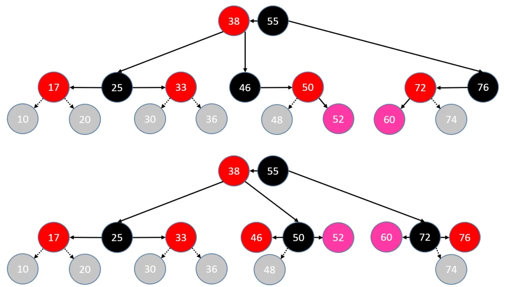

### 添加 - 修复性质4 - LR/RL

判定条件：uncle节点不是Red

修复操作：

1. 自己染成Black，grand染成Red
2. 进行双旋操作

添加48的时候，将48染成Black，46染成红色。同时符合RL的情况，需要先对50右旋转，再对46左旋转。让48成为46和50的根节点。

添加74的时候，将74染成Black，76染成红色。同时符合LR的情况，需要先对72左旋转，再对76右旋转。让74成为72和76的根节点。

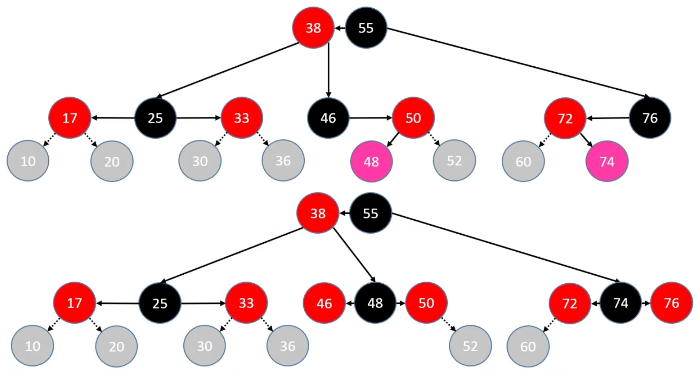

### 添加 - 修复性质4 - 上溢 - LL

判定条件：uncle是Red

修复操作：

1. parent、uncle染成Black
2. grand向上合并，将grand染成Red，当做是新添加的节点进行处理

grand向上合并时，可能继续发生上溢，若上溢持续到根节点，只需将根节点染成Black

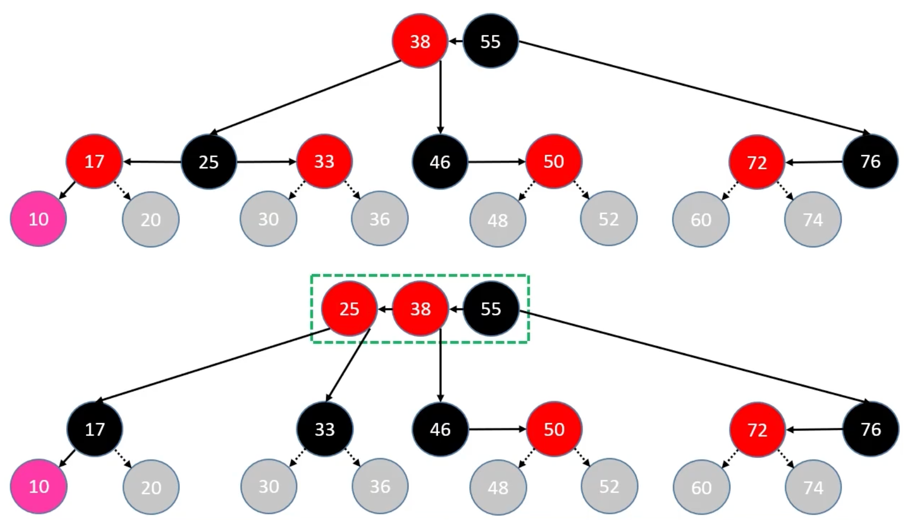

### 添加 - 修复性质4 - 上溢 - RR

判定条件：uncle是Red

修复操作：

1. parent、uncle染成Black
2. grand向上合并，将grand染成Red，当做是新添加的节点进行处理

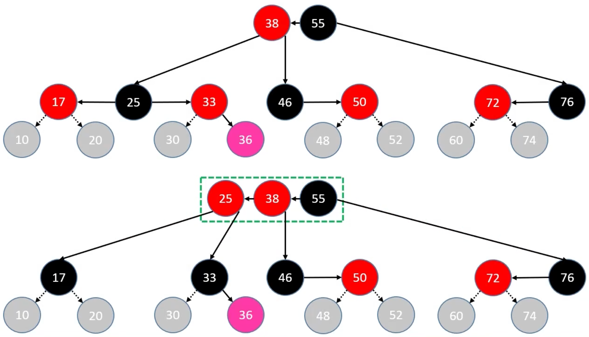

### 添加 - 修复性质4 - 上溢 - LR

判定条件：uncle是Red

修复操作：

1. parent、uncle染成Black
2. grand向上合并，grand染成Red，当做是新添加节点进行处理

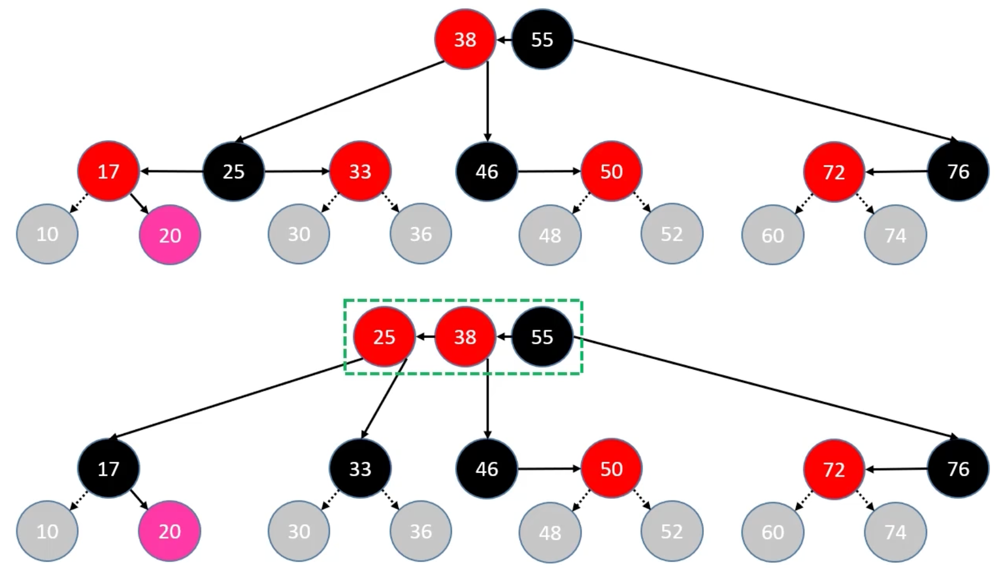

### 添加 - 修复性质4 - 上溢 - RL

判定条件：uncle是Red

修复操作：

1. parent、uncle染成Black
2. grand向上合并，grand染成Red，当做是新添加节点进行处理

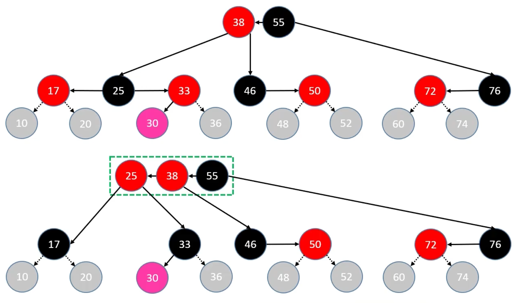

## 删除

在B树中，最后真正被删除的元素，都在叶子节点中

### 删除 - Red节点

删除Red节点后，不影响红黑树性质。所以Red节点可以直接删除，不用做任何调整。

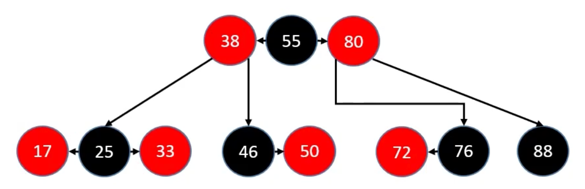

### 删除 - Black节点

有3种情况

- 拥有2个Red子节点的Black节点
- 拥有一个Red子节点的Black节点
- Black叶子节点

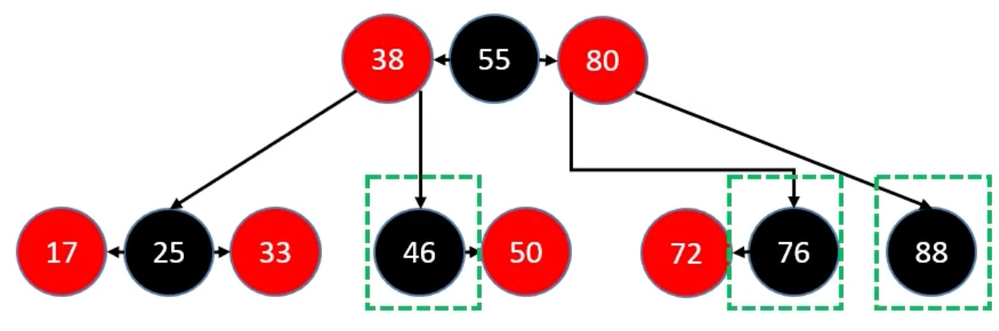

### 删除 - Black节点 - 情况2

判定条件：用以替代的子节点是Red

修复操作：将替代的子节点染成Black，即可保持红黑树的性质

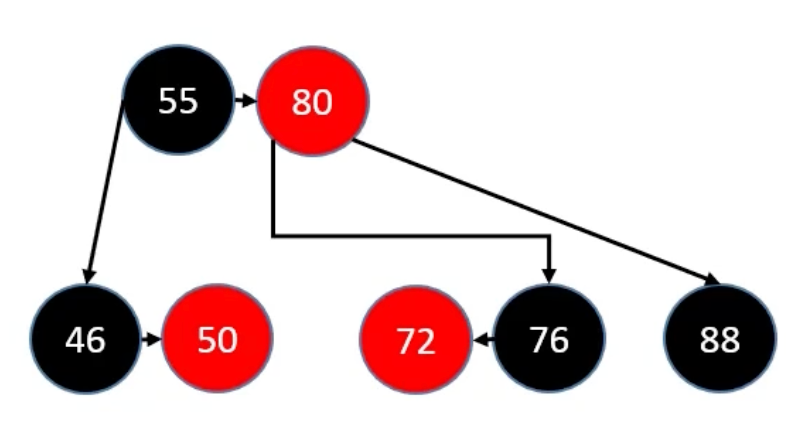

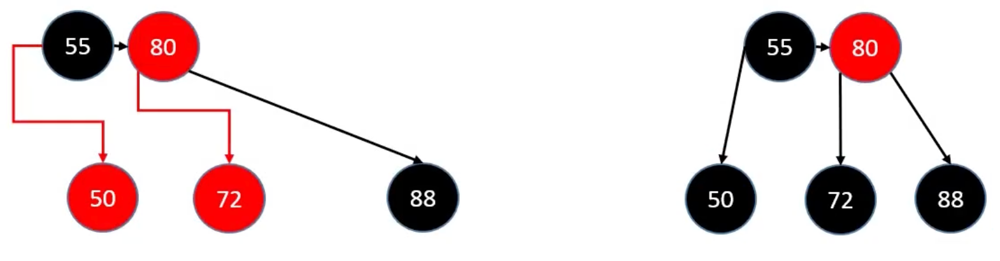

### 删除 - Black叶子节点

#### sibling为Black

Black叶子节点被删除后，会导致B树节点下溢（比如删除88）

如果sibling至少有1个Red子节点。可以通过旋转的方式，向sibling借节点。

- 进行旋转操作
- 旋转之后的中心节点继承parent的颜色
- 旋转之后的左右子节点染为Black

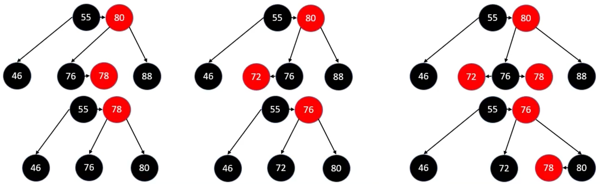

如果sibling没有1个Red节点。

- 如果parent是Red，就将sibling染成Red，parent染成Black即可修复红黑树性质（父节点下来和sibling合并，此时因为还有Black节点，所以不会导致parent下溢）
- 如果parent是Black，会导致parent也下溢。这时只需要把parent当做被删除节点处理即可。

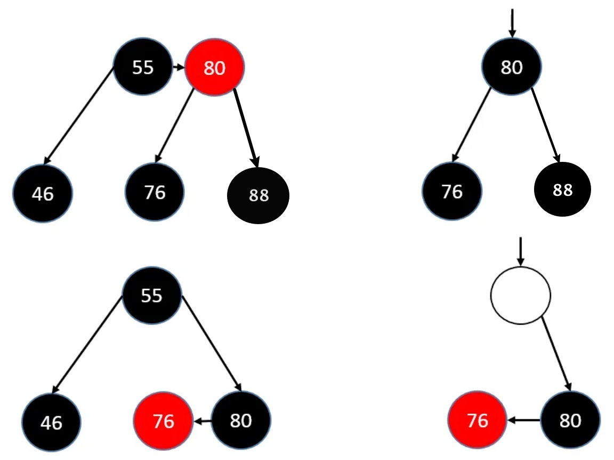

#### sibling为Red

删除88

如果sibling是Red，需要让76成为88的sibling然后套用上面sibling是Black的逻辑。如何让76成为88的sibling呢？

- sibling染成Black，parent染成Red，parent进行旋转。
- 于是又回到了sibling是Black的情况。

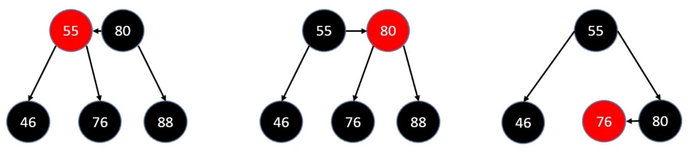

## 红黑树的平衡

为何那5条性质，就能保证红黑树是平衡的？

- 那5条性质，可以保证 红黑树 等价于 4阶B树
- 相比AVL树，红黑树的平衡标准比较宽松：没有一条路径会大于其他路径的2倍
- 是一种弱平衡、黑高度平衡
- 红黑树的最大高度是 2 × log2(n + 1) ，依然是 O(logn) 级别

## 平均时间复杂度

- 搜索：O(logn)
- 添加：O(logn)，O(1) 次的旋转操作
- 删除：O(logn)，O(1) 次的旋转操作

## AVL树 vs 红黑树

AVL树 

- 平衡标准比较严格：每个左右子树的高度差不超过1
- 最大高度是 1.44 × log2 n + 2 − 1.328（100W个节点，AVL树最大树高28）
- 搜索、添加、删除都是 O(logn) 复杂度，其中添加仅需 O(1) 次旋转调整、删除最多需要 O(logn) 次旋转调整

红黑树

- 平衡标准比较宽松：没有一条路径会大于其他路径的2倍
- 最大高度是 2 × log2(n + 1)（ 100W个节点，红黑树最大树高40）
- 搜索、添加、删除都是 O(logn) 复杂度，其中添加、删除都仅需 O(1) 次旋转调整

◼ 搜索的次数远远大于插入和删除，选择AVL树；搜索、插入、删除次数几乎差不多，选择红黑树

◼ 相对于AVL树来说，红黑树牺牲了部分平衡性以换取插入/删除操作时少量的旋转操作，整体来说性能要优于AVL树

◼ 红黑树的平均统计性能优于AVL树，实际应用中更多选择使用红黑树
