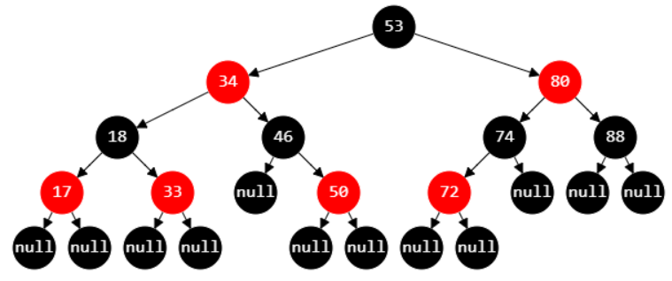
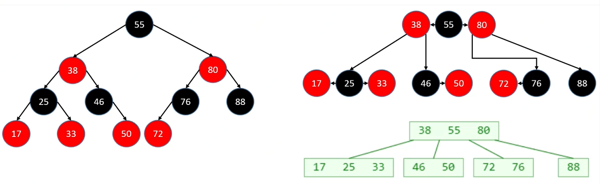

## 红黑树介绍

**红黑树**也是一种**自平衡的二叉搜索树**

- 以前也叫做平衡二叉B树（Symmetric Binary B-tree）

## 红黑树性质

1. 节点是Red或者Black
2. 根节点必须是黑色
3. 叶子节点(外部节点、空节点)都是Black
4. Red节点的子节点都是Black
   - Red节点的parent都是Black
   - 从根节点到叶子节点的所有路径上，不能有2个连续的Red节点
5. 从任一节点到叶子节点的所有路径，都包含相同数目的Black节点

## 红黑树的等价变换

- 红黑树和4阶B树（2-3-4树）具有等价性
- BLACK节点与它的RED子节点融合在一起，形成一个B树节点
- 红黑树的BLACK节点个数与4阶B数的节点总个数相等
- 后面展示的红黑树都会省略NULL节点