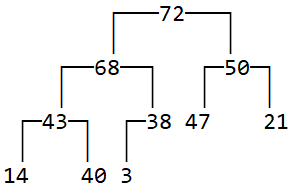
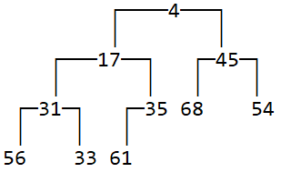
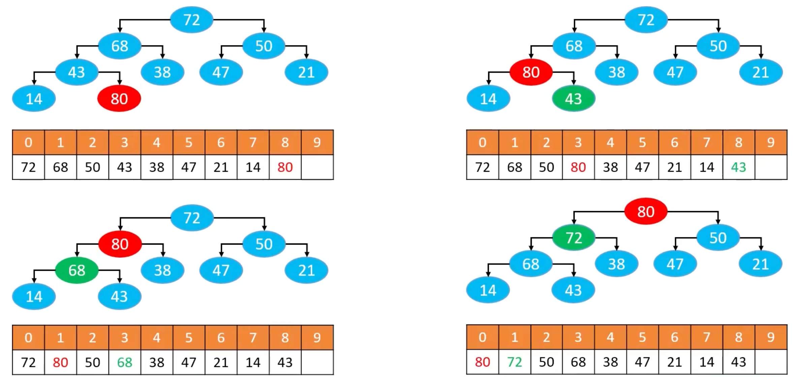
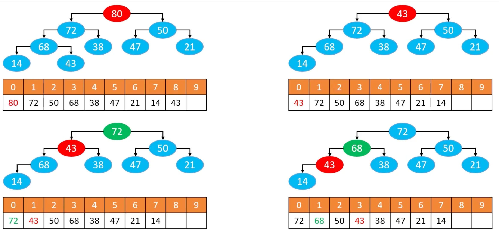
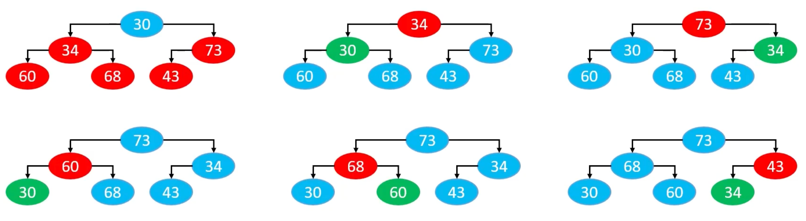

## 需求分析

设计一种数据结构，用来存放整数，要求提供3个接口

- 添加元素
- 获取最大值
- 删除最大值

动态数组、双向链表、有序动态数组、有序链表、平衡二叉搜索树都能解决，但是都有些问题

是否有更优的数据结构呢？

堆

|                           | 获取最大值 | 删除最大值 | 添加元素 |                |
| ------------------------- | ---------- | ---------- | -------- | -------------- |
| 动态数组/双向链表         | O(n)       | O(n)       | O(1)     | 性能差         |
| 有序动态数组/有序双向链表 | O(1)       | O(1)       | O(n)     | 全排序有点浪费 |
| BBST                      | O(logn)    | O(logn)    | O(logn)  | 杀鸡用牛刀     |
| 二叉堆                    | O(1)       | O(logn)    | O(logn)  |                |

 ## Top K问题

从海量数据中找出前K个数据，比如从100w个整数中找出最大的100个整数。可以用堆来解决。

## 堆（Heap）

堆（Heap）也是一种树状的数据结构（不要跟内存模型中的堆空间混淆），常见的堆实现有如下几种：

- 二叉堆（Binary Heap，完全二叉堆）
- 多叉堆（D-heap、D-ary Heap）
- 索引堆（Index Heap）
- 二项堆（Binomial Heap）
- 斐波那契堆（Fibonacci Heap）
- 左倾堆（Leftist Heap，左式堆）
- 斜堆（Skew Heap）

堆的一个重要性质：任意节点的值总是≥（≤）子节点的值

- 如果任意节点的值，总是≥子节点的值，称为：最大堆、大根堆、大顶堆
- 如果任意节点的值，总是≤子节点的值，称为：最小堆、小根堆、小顶堆

由此可见，堆中的元素必须具备可比较性（跟二叉搜索树一样）



<center>最大堆 二叉堆</center>




<center>最小堆 二叉堆</center>

## 堆的基本接口设计

```go
type IHeap interface {
    // 元素的数量
    Size() int
    // 是否为空
    IsEmpty() bool
    // 清空
    Clear()
    // 添加元素
    Add(e E)
    // 获取堆顶元素
    Get() E
    // 删除堆顶元素
    Remove() E
    // 删除堆顶元素的同时插入一个新元素
    Replace(e E)
}
```

## 二叉堆

二叉堆的逻辑结构就是一棵完全二叉树，所以也叫完全二叉堆

- 鉴于完全二叉树的一些特性，二叉堆的底层（物理结构）一般用数组实现即可。
- 索引i的规律（n是元素数量）
  - 如果i = 0，它是根节点
  - 如果i > 0，它的父节点的索引为floor( (i - 1) / 2 )
  - 如果2i + 1 ≤ n - 1，它的左子节点的索引为2i + 1
  - 如果2i + 1 > n - 1，它无左子节点
  - 如果2i + 2 ≤ n - 1，它的右子节点索引为2i + 2
  - 如果2i + 2 > n - 1，它无右子节点


| 0    | 1    | 2    | 3    | 4    | 5    | 6    | 7    | 8    | 9    |
| ---- | ---- | ---- | ---- | ---- | ---- | ---- | ---- | ---- | ---- |
| 72   | 68   | 50   | 43   | 38   | 47   | 21   | 14   | 40   | 3    |

## 最大堆 - 添加元素



循环执行以下操作（图中的 80 简称为 node）

如果 node > 父节点，则与父节点交换位置

如果 node < 父节点，或者node没有父节点，则退出循环

这个过程叫`上滤（Sift Up）`，时间复杂度：O(logn)

## 最大堆 - 删除元素



1. 用最后一个节点覆盖根节点

2. 删除最后一个节点

3. 循环执行以下操作（图中的43简称为node）

   如果node < 最大的子节点，则与最大的子节点交换位置

   如果node ≥ 最大的子节点，或者node没有子节点，则退出循环

这个过程叫做下滤（Sift Down），时间复杂度：O(logn)

## 最大堆 - Replace

删除堆顶元素，同时插入新元素

1. 用新插入的元素覆盖堆顶元素
2. 堆顶元素下滤

```go
// 删除堆顶元素的同时插入一个新元素
func (bh *BinaryHeap) Replace(e any) (any, error) {
    err := bh.elementNotNullCheck(e)
    if err != nil {
        return nil, err
    }

    var root any
    if bh.size == 0 {
        bh.elements[0] = e
        bh.size++
    } else {
        root = bh.elements[0]
        bh.elements[0] = e
        bh.siftDown(0)
    }
    return root, nil
}
```

## 最大堆 - 批量建堆

### 自上而下的上滤



```go
for i :=  1; i < size; i++ {
    siftUp(i)
}
```

### 自下而上的下滤


```go
for i := (size >> 1) - 1; i >= 0; i-- {
    siftDown(i)
}
```

### 效率对比

自上而下的上滤：所有节点的深度之和，O(nlogn)

自下而上的下滤：所有节点的高度之和，O(n)

所有节点的深度之和

- 仅仅是叶子节点，就有近 n/2 个，而且每一个叶子节点的深度都是 O(logn) 级别的

- 因此，在叶子节点这一块，就达到了 O(nlogn) 级别

- O(nlogn) 的时间复杂度足以利用排序算法对所有节点进行全排序


