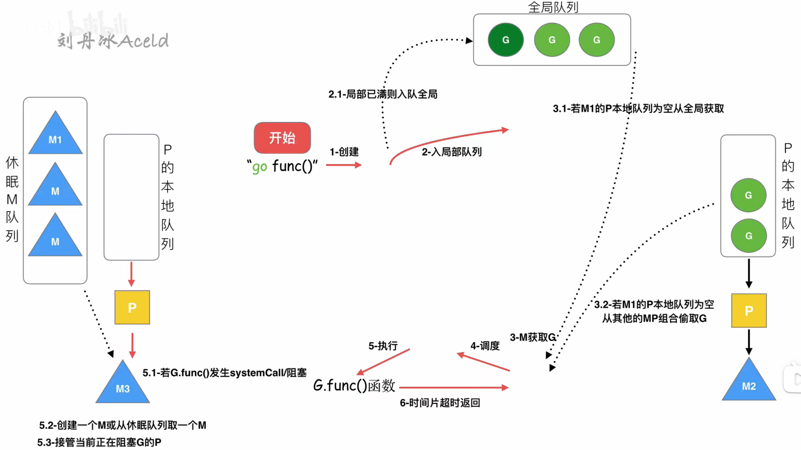
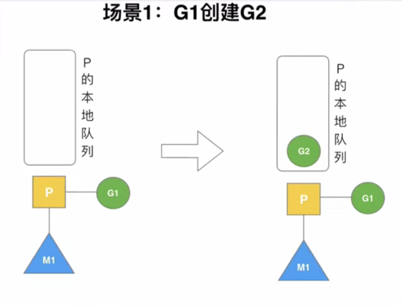
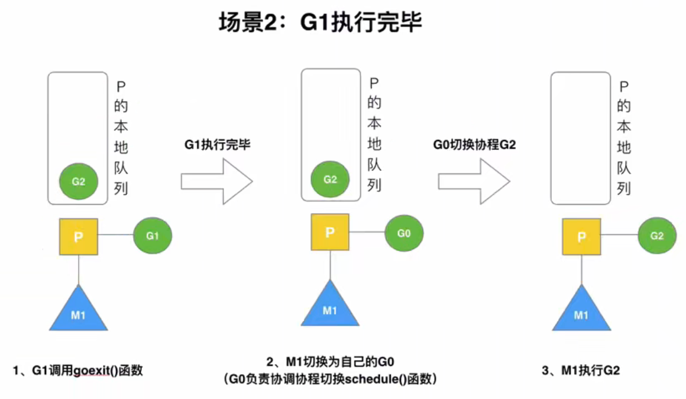
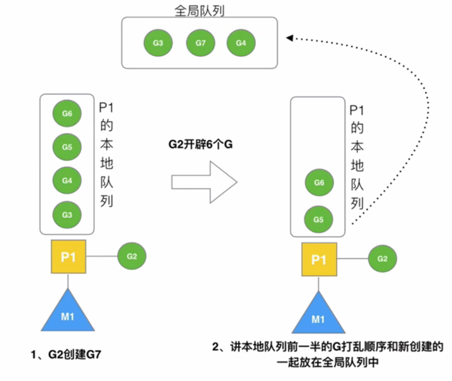
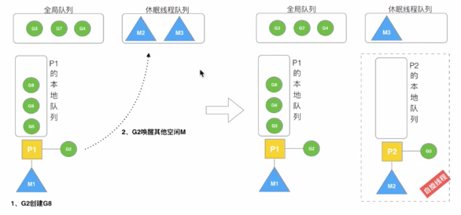
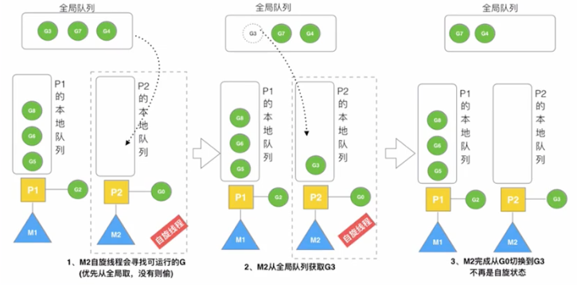
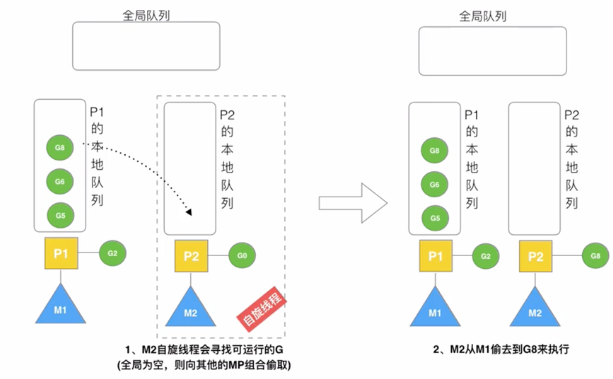
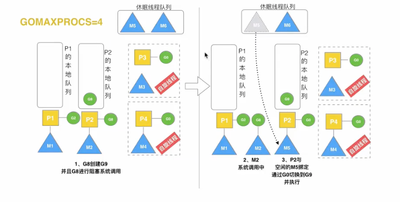

# GMP原理

## Golang调度器的由来

**单进程时代的两个问题**

1. 计算机只能一个一个任务的执行
2. 进程阻塞带来的CPU时间浪费

**多进程、多线程的问题**

1. 设计变的复杂，进程、线程越多，切换成本就越大，也就越浪费；
2. 存在同步竞争
3. 高内存占用，进程占用内存，虚拟内存4GB(32bit OS)；线程占用约4MB
4. 高CPU调度消耗

**协程(co-routine)引发的问题**

1. N:1：无法利用多个CPU，出现阻塞的瓶颈
2. 1:1：跟多线程、多进程模型无异，切换协程成本代价高昂
3. M:N：能够利用多核，过于依赖协程调度器的优化和算法

**调度器的优化**

1. Goroutine的优化：内存占用只有几KB；调度灵活，切换成本低
2. 早期的Go调度器利用全局Go队列，多个Thread轮询调度。
   1. 创建、销毁、调度G都需要每个M获取锁，这就形成了激烈的锁竞争。
   2. M转移G会造成延迟和额外的系统负载。
   3. 系统调用（CPU在M之间的切换）导致频繁的线程阻塞和取消阻塞，增加了系统开销。

## GMP模型的设计思想

### GMP模型的简介

| 核心概念    | 解释                                                         |
| ----------- | ------------------------------------------------------------ |
| G           | goroutine协程                                                |
| P           | processor处理器                                              |
| M           | Thread内核线程                                               |
| 全局队列    | 全局队列：存放等待运行的G                                    |
| P的本地队列 | P的本地队列：存放P上挂着的等待运行的G，队列数量有限制，不超过256个G，优先将新创建的G存放在P的本地队列中，如果队列满了，会放在全局队列中 |
| P列表       | 在程序启动时创建，最多有GOMAXPROCS个（可配置）               |
| M列表       | 当前操作系统分配到当前Go程序的内核线程数                     |
| P的数量     | 可以通过$GOMAXPROCS来设置，或者在程序中通过runtime.GOMAXPROCS(i int)来设置，默认为CPU核数runtime.NumCPU() |
| M的数量     | Go语言本身限定M的最大值是10000；有一个M阻塞，会创建一个新的M；如果有M空闲，那么就会回收或者睡眠；runtime/debug包中的func SetMaxThreads(threads int) int 函数来设置 |

### 调度器的设计策略

#### 复用线程

**work stealing机制：**某个P的本地队列空闲，那么会从其它P的本地队列中，偷取一半G过来运行。

**hand off机制：**如果P中正在M1上执行的G1阻塞，为了继续让后面的G可以正常执行，就会创建/唤醒一个thread，把P绑定到新的thread(M2)上。

#### 利用并行

通过通过`runtime.GOMAXPROCS(i int) int`来限制P的个数

#### 抢占

goroutine占用CPU时间最多10ms，超过10ms会被其它goroutine抢占

#### 全局G队列

当M执行work stealing从其它P偷不到G时，它可以从全局G队列获取G

### go func()经历的过程



### 调度器的生命周期

|      |                                                              |
| ---- | ------------------------------------------------------------ |
| M0   | M0是启动程序后编号为0的主线程，这个M对应的实例会在全局变量runtime.m0中，不需要在heap上分配，M0负责执行初始操作和启动第一个G，之后M0就和其他M一样了 |
| G0   | G0是每次启动一个M都会第一个创建的goroutine，G0仅用于负责调度的G，G0不指向任何可执行的函数，每个M都会有一个自己的G0。在调度或系统调用时会使用G0的栈空间，全局变量的G0是M0的G0 |


### 可视化GMP编程

#### runtime/trace

下面代码执行完之后，会生成一个trace.out的文件，执行`go tool trace trace.out`命令，浏览器 访问输出的地址。

```go
package main

import (
    "fmt"
    "os"
    "runtime/trace"
)

func main() {
    // 1. 创建一个trace文件
    f, err := os.Create("trace.out")
    if err != nil {
        panic(err)
    }
    defer f.Close()
    // 2. 启动trace
    err = trace.Start(f)
    if err != nil {
        panic(err)
    }
    // 正常要调试的业务
    fmt.Println("Hello GMP")
    
    // 3. 停止trace
    trace.Stop()
}
```

#### debug trace

**通过如下命令开启debug**

```bash
 GODEBUG=schedtrace=1000 ./xxx
```

**输出如下：**

```
SCHED 0ms: gomaxprocs=8 idleprocs=7 threads=2 spinningthreads=0 idlethreads=0 runqueue=0 [0 0 0 0 0 0 0 0]
...
```

**字段解释**

| 字段              | 解释                                          |
| ----------------- | --------------------------------------------- |
| SCHED             | 每一行代表一次调度器的调试信息                |
| 0ms               | 从程序启动到输出经历的时间                    |
| gomaxprocs        | P的数量                                       |
| idleprocs         | 空闲状态的P的数量                             |
| threads           | 线程数量（包括M0，包括GODEBUG调试的线程）     |
| spinningthreads   | 处于自旋状态的Thread数量                      |
| idlethreads       | 空闲状态的Thread数量                          |
| runqueue          | 全局G队列中的G的数量                          |
| [0 0 0 0 0 0 0 0] | 每个P的local queue本地队列中，目前存在G的数量 |


## Go调度器GMP调度场景过程分析

### 场景1：创建G

P1拥有G1，P1和M1绑定，M1运行G1，G1使用go func()创建G2，为了局部性，G2优先加入到P1的本地队列



### 场景2：G1执行完毕

1. G1运行完成后，调用goexit()，M上运行的goroutine切换为G0，G0负责调度时协程的切换（函数：schedule）。
2. 从P的本地队列取G2，从G0切换到G2，并开始运行G2（函数：execute）。实现了线程M1的复用



### 场景3：G2开辟过多的G

1. 如果新开辟出来的G没有超过P本地队列的限制，那么可以直接加入P的本地队列

2. 如果新开辟出来的G超过P本地队列数量的限制，那么会将P本地队列的前一半，打乱顺序，和新开辟的G一起放入全局队列

   

### 场景4：唤醒正在休眠的M

规定：在创建G时，运行的G会尝试唤醒其他空闲的P和M组合去执行。假定G2唤醒了M2，M2绑定了P2，并运行G0，但P2本地队列没有G，M2此时为自旋线程（没有G但为运行状态的线程，不断寻找G）



### 场景5：被唤醒的M2从全局队列取批量G

M2尝试从全局队列（简称：GQ）取一批G放到P2的本地队列（函数：findrunable()）。M2从GQ取的G的数量符合公式：

```
n = min(len(GQ) / GOMAXPROCS + 1, len(GQ/2))
```



### 场景6：M2从M1中偷取G

全局队列没有G，那么M就要执行work stealing偷取：从其他有G的P那里偷取一半G过来，放到自己的P的本地队列。



### 场景7：自旋线程的最大限制

```
自旋线程 + 执行线程 <= GOMAXPROCS
```

### 场景8：G发生系统调用/阻塞

假定当前除了M3和M4为自旋线程，还有M5和M6为空闲线程（没有绑定P）。G8创建G9，G8进行了阻塞的系统调用，M2和P2立即解绑，P2会执行以下判断：如果P2本地队列有G、全局队列有G或有空闲的M，P2都会立刻唤醒一个M和它绑定，否则P2会加入空闲P队列，等待M来获取可用的P。



### 场景9：G发生系统调用/非阻塞

场景8下，P2和M2解绑了，但是M2会记住P2。当G8和M2退出系统调用时，会尝试获取P2，如果无法获取，则从全局P队列获取空闲的P，如果依然没有，G8会被标记为可运行状态，并加入到全局队列。M2因为没有P绑定而进入休眠线程队列，进入休眠状态，长时间休眠将会被GC回收销毁。