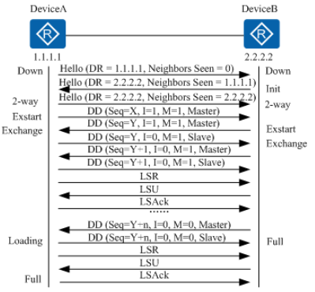

# OSPF

https://info.support.huawei.com/info-finder/encyclopedia/zh/OSPF.html

## 核心概念

| 核心概念  | 解释                                                         |
| --------- | ------------------------------------------------------------ |
| Router ID | Router ID是一个32比特无符号整数，是一台路由器在自治系统中的唯一标识。 |
| LSA       |                                                              |
| LSDB      |                                                              |
| 链路状态  | OSPF是一种链路状态协议。可以将链路视为路由器的接口。链路状态是对接口及接口与相邻路由器的关系的描述。例如接口的信息包括接口的IP地址、掩码、所连接的网络的类型、连接的邻居等。所有这些链路状态的集合形成链路状态数据库。 |
| COST      |                                                              |
| 邻居关系  | OSPF设备启动后，会通过OSPF接口向外发送Hello报文，收到Hello报文的OSPF设备会检查报文中所定义的参数，如果双方一致就会形成邻居关系，两端设备互为邻居。 |
| 邻接关系  | 形成邻居关系后，如果两端设备成功交换DD报文和LSA，才建立邻接关系。 |

### Router ID

华为设备OSPF Router-id 选举原则：

1. 手动配置的OSPF Router-id最优先
2. 如果没有手动配置Router ID，就会选择**全局Router-ID**充当OSPF协议的Router-ID
3. OSPF的Router-ID不会因为全局Router-ID的变化而改变，OSPF的Router-ID只能在清理OSPF进程之后才会改变

全局Router-ID生成原则：

- 设备使用第一个配置的接口IP作为全局Router-ID。
- 全局Router-ID不会因为接口状态改变而发生变化。
- 如果接口的IP地址变更了，那么全局Router-ID将会改变

## OSPF报文

OSPF报文类型

| 报文类型                                      | 报文作用                                                     |
| --------------------------------------------- | ------------------------------------------------------------ |
| Hello报文                                     | 周期性发送，用来发现和维持OSPF邻居关系。                     |
| DD报文（Database Description packet）         | 描述本地LSDB（Link State Database）的摘要信息，用于两台设备进行数据库同步。 |
| LSR报文（Link State Request packet）          | 用于向对方请求所需的LSA。设备只有在OSPF邻居双方成功交换DD报文后才会向对方发出LSR报文。 |
| LSU报文（Link State Update packet）           | 用于向对方发送其所需要的LSA。                                |
| LSAck报文（Link State Acknowledgment packet） | 用来对收到的LSA进行确认。                                    |

IP header

|          |                      |      |
| -------- | -------------------- | ---- |
| protocol | 89                   |      |
| SIP      | 发送报文的出接口地址 |      |
| DIP      | 224.0.0.5组播        |      |
| ttl      | 1                    |      |

## OSPF状态机

### OSPF邻居建立条件

1. 版本一致
2. Router-ID不冲突
3. 区域ID一致
4. 认证类型和认证密码一致
5. 两端接口IP同网段
6. 两端接口掩码相同
7. Hello时间一致
8. Dead时间一致
9. Option选项中 Nbit和Ebit需要一致
10. 双方接口的MTU一致

### 邻接关系建立过程

在广播网络中建立OSPF邻接关系。在广播网络中，DR、BDR和网段内的每一台路由器都形成邻接关系，但DR other之间只形成邻居关系。



在广播网络中建立OSPF邻接关系的过程如下：

1. 建立邻居关系

   1. RouterA的一个连接到广播类型网络的接口上激活了OSPF协议，并发送了一个Hello报文（使用组播地址224.0.0.5）。此时，RouterA认为自己是DR路由器（DR=1.1.1.1），但不确定邻居是哪台路由器（Neighbors Seen=0）。
   2. RouterB收到RouterA发送的Hello报文后，发送一个Hello报文回应给RouterA，并且在报文中的Neighbors Seen字段中填入RouterA的Router ID（Neighbors Seen=1.1.1.1），表示已收到RouterA的Hello报文，并且宣告DR路由器是RouterB（DR=2.2.2.2），然后RouterB的邻居状态机置为Init。
   3. RouterA收到RouterB回应的Hello报文后，将邻居状态机置为2-way状态，下一步双方开始发送各自的链路状态数据库。在广播网络中，两个接口状态是DR Other的路由器之间将停留在此步骤。

2. 主/从关系协商、DD报文交换

   1. RouterA首先发送一个DD报文，宣称自己是Master（MS=1），并规定序列号Seq=X。I=1表示这是第一个DD报文，报文中并不包含LSA的摘要，只是为了协商主从关系。M=1说明这不是最后一个报文。

      为了提高发送的效率，RouterA和RouterB首先了解对端数据库中哪些LSA是需要更新的，如果某一条LSA在LSDB中已经存在，就不再需要请求更新了。为了达到这个目的，RouterA和RouterB先发送DD报文，DD报文中包含了对LSDB中LSA的摘要描述（每一条摘要可以惟一标识一条LSA）。为了保证在传输的过程中报文传输的可靠性，在DD报文的发送过程中需要确定双方的主从关系，作为Master的一方定义一个序列号Seq，每发送一个新的DD报文将Seq加一，作为Slave的一方，每次发送DD报文时使用接收到的上一个Master的DD报文中的Seq。

   2. RouterB在收到RouterA的DD报文后，将RouterA的邻居状态机改为Exstart，并且回应了一个DD报文（该报文中同样不包含LSA的摘要信息）。由于RouterB的Router ID较大，所以在报文中RouterB认为自己是Master，并且重新规定了序列号Seq=Y。

   3. RouterA收到报文后，同意了RouterB为Master，并将RouterB的邻居状态机改为Exchange。RouterA使用RouterB的序列号Seq=Y来发送新的DD报文，该报文开始正式地传送LSA的摘要。在报文中RouterA将MS=0，说明自己是Slave。

   4. RouterB收到报文后，将RouterA的邻居状态机改为Exchange，并发送新的DD报文来描述自己的LSA摘要，此时RouterB将报文的序列号改为Seq=Y+1。

      上述过程持续进行，RouterA通过重复RouterB的序列号来确认已收到RouterB的报文。RouterB通过将序列号Seq加1来确认已收到RouterA的报文。当RouterB发送最后一个DD报文时，在报文中写上M=0。

3. LSDB同步（LSA请求、LSA传输、LSA应答）

   1. RouterA收到最后一个DD报文后，发现RouterB的数据库中有许多LSA是自己没有的，将邻居状态机改为Loading状态。此时RouterB也收到了RouterA的最后一个DD报文，但RouterA的LSA，RouterB都已经有了，不需要再请求，所以直接将RouterA的邻居状态机改为Full状态。

   2. RouterA发送LSR报文向RouterB请求更新LSA。RouterB用LSU报文来回应RouterA的请求。RouterA收到后，发送LSAck报文确认。

      上述过程持续到RouterA中的LSA与RouterB的LSA完全同步为止，此时RouterA将RouterB的邻居状态机改为Full状态。当路由器交换完DD报文并更新所有的LSA后，此时邻接关系建立完成。

### DR/BDR选举原则

1. 比较DR优先级，越大越优。默认为1
2. 优先级相同时，比较Router-ID。越大越优
3. 仅次于DR的设备成为BDR
4. 如果一台路由器的优先级为0，则它不会被选举为DR或BDR。
5. DR、BDR选举出来之后不会被抢占

### 判断唯一LSA

通过LSA三要素：

1. LSA类型（TYPE）
2. LSA链路状态ID（Link State ID）
3. LSA通告者（Adv Router）

### 判断LSA的新旧状态

1. 首先比较LSA的序列号，初始值为0x80000001，每次OSPF更新的时候都会+1。
2. 当序列号相同的时候，将会比较校验和，越大越优。
3. 当校验和相同，将会比较LSA的age时间：
   1. 首先age等于3600s的LSA，用于删除一条LSA
   2. 如果两条LSA的age时间相差大于900s，将会选择age数值小的SLA
   3. 如果两条LSA的age时间相差小于900s，将会认为相同，保持原有不变。

## OSPF的更新机制

触发更新：当链路状态发生改变之后OSPF将会触发更新，比如cost变了，网段变了，掩码变了，取消宣告。

周期更新：每个OSPF路由器自身产生的LSA，都会每隔30分钟周期更新一次自身产生的LSA，更新的时候将SEQ+1。校验和重新计算，age时间重新恢复到初始值

## OSPF的老化机制

OSPF路由器每产生一条LSA，都会存在一个age时间为3600s，初始值为1，当age递增到3600s之后，将会认为LSA老化，从自身LSDB中删除此LSA

## OSPF LSA的删除机制

当OSPF需要删除一条LSA的时候，将会把LSA的age时间变为3600s，当其他路由器接收到这条LSA之后，将会把自身LSDB中对应的LSA删除掉。

## OSPF实验

```bash
ospf 10
area 0
network 12.1.1.1 0.0.0.255
```

## 华为设备OSPF查看命令

```bash
```

