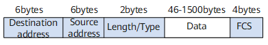
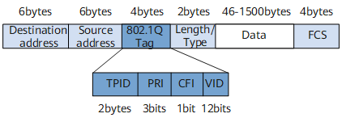

# 交换

https://support.huawei.com/enterprise/zh/doc/EDOC1100352659?idPath=24030814%7C21782165%7C21782236%7C252837173

ARP表：IP和MAC的对应关系，用于通信设备进行数据封装的，存在于任何要封装数据的设备。老化时间5分钟

MAC地址表：MAC和端口的对应关系，用于交换机中转发数据的。 存在于交换机中

## vlan

https://support.huawei.com/enterprise/zh/doc/EDOC1100352659/f69deee6?idPath=24030814|21782165|21782236|252837173

vlan帧格式

传统以太网数据帧格式



IEEE 802.1Q帧格式



vlan配置

```bash
[HUAWEI]vlan 10
[HUAWEI-vlan10]vlan 20
[HUAWEI-vlan20]int g1/0/0
[HUAWEI-GE1/0/0]port link-type access 
[HUAWEI-GE1/0/0]port default vlan 10
[HUAWEI-GE1/0/0]int g1/0/1
[HUAWEI-GE1/0/1]port link-type access 
[HUAWEI-GE1/0/1]port default vlan 20
```

路由器三层子接口封装dot1q

```bash
int g0/0/0.1
dot1q termination vid 2
```


