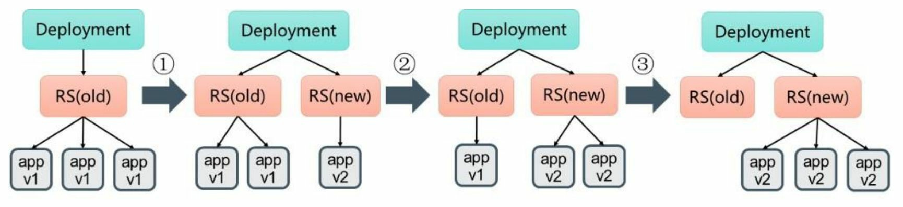

## Deployment概念

用于部署无状态服务，是最常用的控制器。一般用于管理维护企业内部无状态的微服务。可以管理多个Pod的副本，实现无缝迁移、自动扩容缩容、自动灾难恢复、一键回滚等功能。

## yaml文件定义

```yaml
apiVersion: apps/v1
kind: Deployment
metadata:
  name: nginx-deployment
  labels:
    app: nginx
spec:
  progressDeadlineSeconds: 600
  replicas: 3 # 副本数
  revisionHistoryLimit: 10 # 保留RS旧的revision的个数
  minReadySeconds: 0 # 可选。指定新创建的Pod在没有任何容器崩溃的情况下视为Ready最小的秒数，默认为0，即一旦被创建就视为可用。
  selector:
    matchLabels:
      app: nginx
  strategy:
    rollingUpdate:
      maxSurge: 25% # 可以超过期望Pod数的最大值。默认为25%
      maxUnavailable: 25% # 在更新过程中不可用状态的Pod数量的上限。可以是绝对值(如5)，可以是百分比如(25%)
    # Recreate: 重建，先删除旧的Pod，再创建新的Pod
    # RollingUpdate
    type: RollingUpdate
  template:
    metadata:
      labels:
        app: nginx
    spec:
      containers:
      - name: nginx
        image: nginx:1.7.9
        ports:
        - containerPort: 80
```

## deployment的升级回滚

### 滚动升级



**更新镜像**

方式一：`set image`

```bash
kubectl set image deployment nginx-rollingupdate nginx=nginx:1.9.1
```

方式二：`edit deployment`

```bash
kubectl edit deployment nginx-rollingupdate
```

**查看滚动更新过程**

```bash
kubectl rollout status deployment nginx-rollingupdate
```

### Pod的回滚

**查看Deployment的部署历史**

```bash
kubectl rollout history deployment nginx-rollingupdate
deployment.apps/nginx-rollingupdate 
REVISION  CHANGE-CAUSE
1         kubectl apply --filename=nginx-rollingupdate.yaml --record=true
2         kubectl apply --filename=nginx-rollingupdate.yaml --record=true
```

创建Deployment时使用`--record`参数，就可以在`CHANGE- CAUSE`列看到每个版本使用的命令了

**查看某个历史版本详情**

```bash
kubectl rollout history deployment nginx-rollingupdate --revision=2
deployment.apps/nginx-rollingupdate with revision #2
Pod Template:
  Labels:       app=nginx
        pod-template-hash=56f8998dbc
  Annotations:  kubernetes.io/change-cause: kubectl apply --filename=nginx-rollingupdate.yaml --record=true
  Containers:
   nginx:
    Image:      nginx:1.9.1
    Port:       80/TCP
    Host Port:  0/TCP
    Environment:        <none>
    Mounts:     <none>
  Volumes:      <none>
```

**回滚版本**

```bash
# 回滚到上一个版本
kubectl rollout undo deployment/nginx-rollingupdate

# 回滚到指定版本
kubectl rollout undo deployment/nginx-rollingupdate --to-revision=2
```

## 暂停和恢复

为了避免频繁触发deployment的更新，可以先暂停更新，然后修改配置，再恢复更新

**暂停**

```bash
kubectl rollout pause deployment/nginx-rollingupdate
```

**恢复**

```bash
kubectl rollout resume deployment nginx-rollingupdate
```

## 扩容和缩容

```bash
kubectl scale deployment nginx-deployment --replicas 3
```

## 自动扩缩容

```bash
kubectl autoscale deployment nginx-deployment --cpu-percent=50 --min=1 --max=10
```

