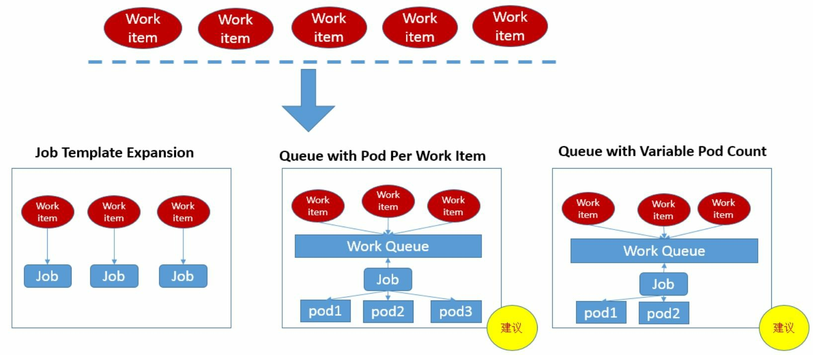
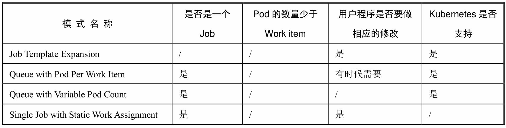
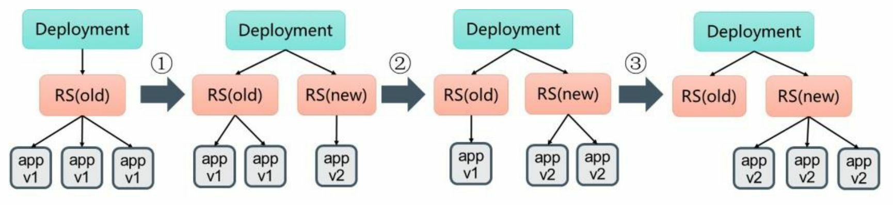

## yaml文件定义

```yaml
apiVersion: v1
kind: Pod
metadata:
  name: pod-demo
  namespace: default
  labels:
    app: myapp
    tier: frontend
spec:
  containers:
  - name: myapp
    image: ikubernetes/myapp:v1
    ports:
    - name: http
      containerPort: 80
    - name: https
      containerPort: 443
    # 存活探针
    livenessProbe:
      # 使用用户自定义命令作为探针命令，该命令必须在容器中存在
      exec:
        command:
      # 通过http请求的方式来探活
      httpGet:
        host:
        # 设置请求头
        httpHeaders:
        - name:
          value:
        # 设置请求路径
        path: /index.html
        # 设置请求端口, 此处的端口可以直接设置端口，也可以引用spec.containers.ports.name
        port: http
        scheme: HTTP
      # 探测多少次失败之后才认为失败，默认3次，最小为1次
      failureThreshold: 3
      # 探测周期时长，默认10s
      periodSeconds: 10
      # 探测超时时间，默认1s
      timeoutSeconds: 1
      # 容器初始化延迟时间，也就是容器启动后多长时间开始探测
      initialDelaySeconds: 10
    readinessProbe:
  - name: busybox
    image: busybox:latest
    imagePullPolicy: IfNotPresent # Always: 总是下载; Never: 有就用，没有也不下载; IfNotPresent: 镜像不存在的时候就下载; 默认值: 如果镜像tag是latest，则默认为Always，否则为IfNotPresent
    # command和args
    # 1. 如果command和args均没有写，那么用Dockerfile的配置。
    # 2. 如果command写了，但args没有写，那么Dockerfile默认的配置会被忽略，执行输入的command（不带任何参数，当然command中可自带参数）。
    # 3. 如果command没写，但args写了，那么Dockerfile中配置的ENTRYPOINT的命令行会被执行，并且将args中填写的参数追加到ENTRYPOINT中。
    # 4. 如果command和args都写了，那么Dockerfile的配置被忽略，执行command并追加上args参数。
    command:
    - "/bin/sh"
    - "-c"
    - "sleep 3600"
  nodeSelector:
    disktype: ssd
  nodeName: 
  # pod中容器重启策略
  # Never: 永远也不会重启
  # Always: 一旦容器挂了, 总是重启, 默认就是Always
  # OnFailure: 只有容器状态错误时才重启，正常退出的容器不会重启
  restartPolicy: Always
```

## Pod生命周期

## Pod调度

### Deployment

```yaml
apiVersion: apps/v1
kind: Deployment
metadata:
  name: nginx-deployment
  labels:
    app: nginx
spec:
  replicas: 3
  selector:
    matchLabels:
      app: nginx
  template:
    metadata:
      labels:
        app: nginx
    spec:
      containers:
      - name: nginx
        image: nginx:1.7.9
        ports:
        - containerPort: 80
```


### NodeSelector

给node添加标签

```bash
kubectl label nodes <node-name> <label-key>=<label-value>
```

在Pod定义中加上nodeSelector，该pod将只会往带有zone=north标签的node上调度

```yaml
apiVersion: apps/v1
kind: Deployment
metadata:
  name: nginx-deployment
  labels:
    app: nginx
spec:
  replicas: 3
  selector:
    matchLabels:
      app: nginx
  template:
    metadata:
      labels:
        app: nginx
    spec:
      containers:
      - name: nginx
        image: nginx:1.7.9
        ports:
        - containerPort: 80
      nodeSelector: # 节点选择器
        zone: north
```


### NodeAffinity

**requiredDuringSchedulingIgnoredDuringExecution**：必须满足指定的规则才可以调度Pod到Node上

**preferredDuringSchedulingIgnoredDuringExecution** ：优先满足指定规则，可以设置权重。

nginx-with-node-affinity.yaml

```yaml
apiVersion: apps/v1
kind: Deployment
metadata:
  name: nginx-with-node-affinity
  labels:
    app: nginx-with-node-affinity
spec:
  replicas: 9
  selector:
    matchLabels:
      app: nginx-with-node-affinity
  template:
    metadata:
      labels:
        app: nginx-with-node-affinity
    spec:
      affinity:
        nodeAffinity:
          requiredDuringSchedulingIgnoredDuringExecution:
            nodeSelectorTerms:
            - matchExpressions:
              - key: zone
                # 支持In、NotIn、Exists、DoesNotExist、Gt、Lt
                operator: In
                values:
                - north
          preferredDuringSchedulingIgnoredDuringExecution:
          - weight: 1
            preference:
              matchExpressions:
              - key: disk-type
                operator: In
                values:
                - ssd
      containers:
      - name: nginx
        image: nginx:1.7.9
        ports:
        - containerPort: 80
```

* 如果同时定义了nodeSelector和nodeAffinity，那么必须两个条件都得到满足，Pod才能最终运行在指定的Node上。
* 如果nodeAffinity指定了多个nodeSelectorTerms，那么其中一个能够匹配成功即可。 
* 如果在nodeSelectorTerms中有多个matchExpressions，则一个节点必须满足所有matchExpressions才能运行该Pod。

### PodAffinity

创建第一个pod，作为后续pod亲和性测试的目标pod

```yaml
apiVersion: v1
kind: Pod
metadata:
  name: busybox
  namespace: default
  labels:
    security: S1 # 给pod打上该标签
    app: busybox
spec:
  containers:
  - name: busybox
    image: busybox
    imagePullPolicy: Always
    args:
    - /bin/sh
    - -c
    - sleep 3600
```

创建第二批pod。该pod只运行在**有security=S1标签的pod**的node节点上。

```yaml
apiVersion: apps/v1
kind: Deployment
metadata:
  name: nginx-affinity
  labels:
    app: nginx-affinity
spec:
  replicas: 4
  selector:
    matchLabels:
      app: nginx-affinity
  template:
    metadata:
      labels:
        app: nginx-affinity
    spec:
      affinity:
        podAffinity:
          requiredDuringSchedulingIgnoredDuringExecution:
          - labelSelector:
              matchExpressions:
              - key: security
                operator: In
                values:
                - S1
            # 如果删掉该标签，则kubectl create -f 的时候报错
            topologyKey: kubernetes.io/hostname
      containers:
      - name: nginx
        image: nginx:1.7.9
        ports:
        - containerPort: 80
```

创建第三批pod。该pod要求和label为security=S1的pod在同一个region(node的failure-domain.beta.kubernetes.io/region标签值相同)，但是不能在同一个node上(kubernetes.io/hostname标签值不同)

```yaml
apiVersion: apps/v1
kind: Deployment
metadata:
  name: nginx-anti-affinity
  labels:
    app: nginx-anti-affinity
spec:
  replicas: 4
  selector:
    matchLabels:
      app: nginx-anti-affinity
  template:
    metadata:
      labels:
        app: nginx-anti-affinity
    spec:
      affinity:
        podAffinity:
          requiredDuringSchedulingIgnoredDuringExecution:
          - labelSelector:
              matchExpressions:
              - key: security
                operator: In
                values:
                - S1
            topologyKey: failure-domain.beta.kubernetes.io/region
        podAntiAffinity:
          requiredDuringSchedulingIgnoredDuringExecution:
          - labelSelector:
              matchExpressions:
              - key: app
                operator: In
                values:
                - busybox
            topologyKey: kubernetes.io/hostname
      containers:
      - name: nginx
        image: nginx:1.7.9
        ports:
        - containerPort: 80
```

如果创建的pod和目标pod不在一个namespace，则需要在与topologyKey同级，设置namespaces列表，对namespaces进行选择。如果目标pod所在namespace没在列表中，则pod会一直处于pending状态。describe报错如下

```
Warning  FailedScheduling  20s (x2 over 20s)  default-scheduler  0/2 nodes are available: 2 node(s) didn't match pod affinity rules, 2 node(s) didn't match pod affinity/anti-affinity
```

### Taints和Tolerations

Taint需要和Toleration配合使用，让Pod避开那些不合适的Node。在 Node上设置一个或多个Taint之后，除非Pod明确声明能够容忍这些污点，否则无法在这些Node上运行。Toleration是Pod的属性，让Pod能够（注意，只是能够，而非必须）运行在标注了Taint的Node上。

污点由key=value:effect三部分组成。key、value作为标签，effect描述污点的作用

**当前effect支持如下三个选项：**

* **NoSchedule** ：表示k8s将不会将Pod调度到具有该污点的Node上
* **PreferNoSchedule** ：表示k8s将尽量避免将Pod调度到具有该污点的Node上 
* **NoExecute** ：表示k8s将不会将Pod调度到具有该污点的Node上，同时会将Node上已经存在的Pod驱逐出去

**设置污点**

```bash
kubectl taint nodes node1 key=value:NoSchedule
```

**查看node污点**

```bash
kubectl describe nodes node1 | sed -n '/Taints/,+1p'
```

**去除污点**

```bash
kubectl taint nodes node1 key=value:NoSchedule-
kubectl taint nodes node1 key-
kubectl taint nodes node1 key:NoSchedule-
```

**定义pod容忍taint**

* Pod的Tolerations中的key和effect需要和Taint的设置保持一致。
* 如果operator的值是Exists，则无需指定value
* 如果operator的值是Equal，则value需要和Taint中value相等
* 如果不指定operator，则默认是Equal
* 空的key配合Exists可以匹配所有的键和值
* 空的effect匹配所有的effect

```yaml
apiVersion: apps/v1
kind: Deployment
metadata:
  name: nginx-deployment
  labels:
    app: nginx
spec:
  replicas: 9
  selector:
    matchLabels:
      app: nginx
  template:
    metadata:
      labels:
        app: nginx
    spec:
      tolerations:
      - key: key 

        # Exists
        # Equal
        operator: Equal
        value: value1

        # NoSchedule 
        # PreferNoSchedule
        # NoExecute
        effect: NoSchedule
      containers:
      - name: nginx
        image: nginx:1.7.9
        ports:
        - containerPort: 80
```

### Job批处理调度

Job的几种模式



批处理任务的模式对比



### Cronjob定时任务

yaml配置

```yaml
apiVersion: batch/v1beta1
kind: CronJob
metadata:
  name: hello
spec:
  schedule: "*/1 * * * *"
  jobTemplate:
    spec:
      template:
        spec:
          containers:
          - name: hello
            image: busybox
            args:
            - /bin/sh
            - -c
            - date; echo Hello from the Kubernetes cluster
          restartPolicy: OnFailure
```


```bash
kubectl get cj -o wide
NAME    SCHEDULE      SUSPEND   ACTIVE   LAST SCHEDULE   AGE   CONTAINERS   IMAGES    SELECTOR
hello   */1 * * * *   False     1        3s              12s   hello        busybox   <none>
```

```bash
kubectl get jobs 
NAME               COMPLETIONS   DURATION   AGE
hello-1652952900   1/1           6s         2m16s
```

## init Container

## Pod的滚动升级



**滚动更新的两个参数**

```
explain deployment.spec.strategy.rollingUpdate.maxSurge
```

Deployment在更新过程中不可用状态的Pod数量的上限。可以是绝对值(如5)，可以是百分比如(25%)

```
explain deployment.spec.strategy.rollingUpdate.maxUnavailable
```

用于指定在Deployment 更新Pod的过程中Pod总数超过Pod期望副本数部分的最大值。可以是绝对值(如5)，可以是百分比如(25%)

**更新镜像**

方式一：`set image`

```bash
kubectl set image deployment/nginx-rollingupdate nginx=nginx:1.9.1
```

方式二：`edit deployment`

```bash
kubectl edit deployment/nginx-rollingupdate
```

**查看滚动更新过程**

```bash
kubectl rollout status deployment/nginx-rollingupdate
```

## Pod的回滚

**查看Deployment的部署历史**

```bash
kubectl rollout history deployment nginx-rollingupdate
deployment.apps/nginx-rollingupdate 
REVISION  CHANGE-CAUSE
1         kubectl apply --filename=nginx-rollingupdate.yaml --record=true
2         kubectl apply --filename=nginx-rollingupdate.yaml --record=true
```

创建Deployment时使用`--record`参数，就可以在`CHANGE- CAUSE`列看到每个版本使用的命令了

**查看某个历史版本详情**

```bash
kubectl rollout history deployment nginx-rollingupdate --revision=2
deployment.apps/nginx-rollingupdate with revision #2
Pod Template:
  Labels:       app=nginx
        pod-template-hash=56f8998dbc
  Annotations:  kubernetes.io/change-cause: kubectl apply --filename=nginx-rollingupdate.yaml --record=true
  Containers:
   nginx:
    Image:      nginx:1.9.1
    Port:       80/TCP
    Host Port:  0/TCP
    Environment:        <none>
    Mounts:     <none>
  Volumes:      <none>
```

**回滚版本**

```bash
# 回滚到上一个版本
kubectl rollout undo deployment/nginx-rollingupdate

# 回滚到指定版本
kubectl rollout undo deployment/nginx-rollingupdate --to-revision=2
```

## 暂停和恢复

为了避免频繁触发deployment的更新，可以先暂停更新，然后修改配置，再恢复更新

**暂停**

```bash
kubectl rollout pause deployment/nginx-rollingupdate
```

**恢复**

```bash
kubectl rollout resume deployment nginx-rollingupdate
```

## DaemonSet的更新策略

```
DaemonSet.spec.updateStrategy.type.OnDelete
```

当使用OnDelete作为升级策略时，在创建好新的 DaemonSet配置之后，新的Pod并不会被自动创建，直到用户手动删除 旧版本的Pod，才触发新建操作。 

```
DaemonSet.spec.updateStrategy.type.RollingUpdate
```

旧版本的Pod将被 自动杀掉，然后自动创建新版本的DaemonSet Pod。整个过程与普通Deployment的滚动升级一样是可控的。不过有两点不同于普通Pod的滚动升级：

* 一是目前Kubernetes还不支持查看和管理DaemonSet的更新历 史记录；
* 二是DaemonSet的回滚（Rollback）并不能如同Deployment一样直接通过kubectl rollback命令来实现，必须通过再次提交旧版本配置的方式实现

## Pod的扩缩容

```bash
kubectl scale deployment nginx-deployment --replicas 3
```

## Pod自动扩缩容

```bash
kubectl autoscale deployment nginx-deployment --cpu-percent=50 --min=1 --max=10
```

