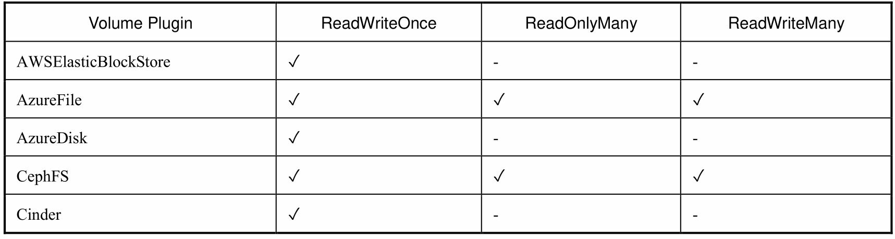
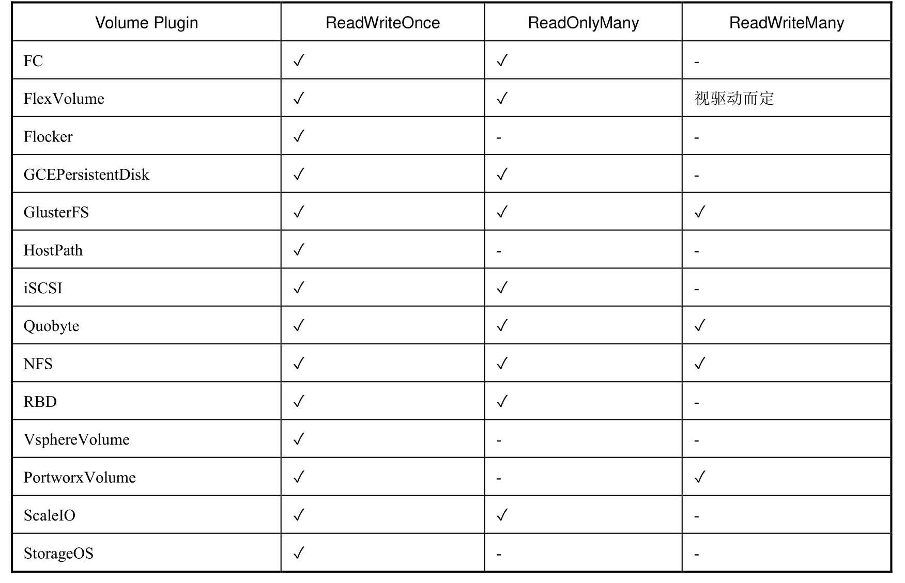

## 存储

### PV、PVC

#### YAML定义

```yaml
apiVersion: v1
kind: PersistentVolume
metadata:
  name: pv001
  labels:
    name: pv001
spec:
  nfs:
    path: /data/volumes/v1
    server: 10.0.48.3
    
  # ReadWriteOnce（RWO）：读写权限，但是只能被单个节点挂载
  # ReadOnlyMany（ROX）：只读权限，可以被多个节点挂载
  # ReadWriteMany（RWX）：读写权限，可以被多个节点挂载
  accessModes: ["ReadWriteMany","ReadWriteOnce"]
  
  # Retain（保留）- 保留数据，需要管理员手工清理数据
  # Recycle（回收）- 清除 PV 中的数据，效果相当于执行 rm -rf /thevoluem/*
  # Delete（删除）- 与 PV 相连的后端存储完成 volume 的删除操作，当然这常见于云服务商的存储服务。
  persistentVolumeReclaimPolicy: Recycle
  capacity:
    storage: 2Gi
---
apiVersion: v1
kind: PersistentVolume
metadata:
  name: pv002
  labels:
    name: pv002
spec:
  nfs:
    path: /data/volumes/v2
    server: 10.0.48.3
  accessModes: ["ReadWriteOnce"]
  capacity:
    storage: 5Gi
```

```yaml
apiVersion: v1
kind: PersistentVolumeClaim
metadata:
  name: mypvc
  namespace: default
spec:
  accessModes: ["ReadWriteMany"]
  storageClassName: ""
  resources:
    requests:
      # 可以小于等于pv，但是不能大于pv
      storage: 5Gi
---
apiVersion: v1
kind: Pod
metadata:
  name: pod-vol-pvc
  namespace: default
spec:
  containers:
  - name: myapp
    image: ikubernetes/myapp:v1
    imagePullPolicy: IfNotPresent
    ports:
    - name: http
      containerPort: 80
    volumeMounts:
    - name: html
      mountPath: /usr/share/nginx/html/
  volumes:
  - name: html
    persistentVolumeClaim:
      claimName: mypvc
```

不同的存储提供者支持的访问模式





#### PV生命周期

一个 PV 的生命周期中，可能会处于4中不同的阶段：

* Available（可用）：表示可用状态，还未被任何 PVC 绑定
* Bound（已绑定）：表示 PVC 已经被 PVC 绑定
* Released（已释放）：PVC 被删除，但是资源还未被集群重新声明
* Failed（失败）： 表示该 PV 的自动回收失败

### StorageClass

StorageClass作为对存储资源的抽象定义，对用户设置的PVC申请屏蔽后端存储的细节，一方面减少了用户对于存储资源细节的关注，另一 方面减轻了管理员手工管理PV的工作，由系统自动完成PV的创建和绑定，实现了动态的资源供应。基于StorageClass的动态资源供应模式将逐步成为云平台的标准存储配置模式。

StorageClass一旦被创建出来，则将无法修改。

#### YAML定义

```yaml
apiVersion: storage.k8s.io/v1
kind: StorageClass
metadata:
  name: jdcloud-ssd
parameters:
  fstype: ext4
  type: ssd.gp1
provisioner: zbs.csi.jdcloud.com
allowVolumeExpansion: true
reclaimPolicy: Delete
volumeBindingMode: WaitForFirstConsumer
```

#### 设置默认SC

要在系统中设置一个默认的StorageClass，则首先需要启用名为`DefaultStorageClass`的admission controller，即在kube-apiserver的命令行参数`--admission-control`中增加：

```
--admission-control=...,DefaultStorageClass
```

然后，在StorageClass的定义中设置一个annotation：

```yaml
storageclass.kubernetes.io/is-default-class: "true"
```

