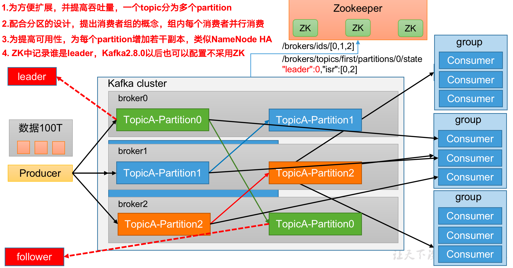
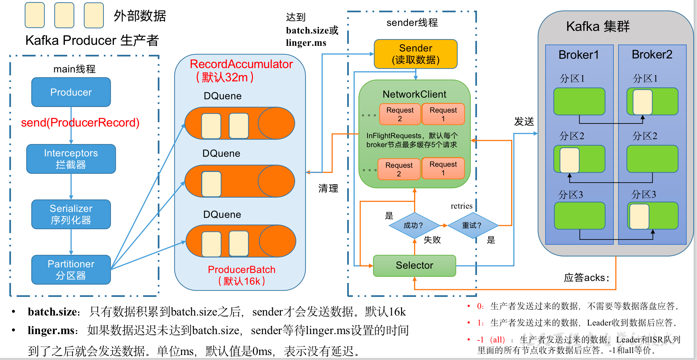

# kafka

## 应用场景

- 缓存消峰
- 解耦
- 异步通信

## 基础架构



## 命令行工具使用

### kafka-topics.sh

**常用参数：**

| 参数                                               | 描述                                 |
| -------------------------------------------------- | ------------------------------------ |
| --bootstrap-server <String: server toconnect to>   | 连接的Kafka Broker主机名称和端口号。 |
| --topic <String: topic>                            | 操作的topic名称。                    |
| --create                                           | 创建主题。                           |
| --delete                                           | 删除主题。                           |
| --alter                                            | 修改主题。                           |
| --list                                             | 查看所有主题。                       |
| --describe                                         | 查看主题详细描述。                   |
| --partitions <Integer: # of partitions>            | 设置分区数。                         |
| --replication-factor <Integer: replication factor> | 设置分区副本。                       |
| --config <String: name=value>                      | 更新系统默认的配置。                 |

**创建topic**

```bash
# ./kafka-topics.sh --bootstrap-server broker1:9092,broker2:9092 --create --topic first --partitions 1 --replication-factor 3
Created topic first.
```

**查看集群所有topic列表**

```bash
# ./kafka-topics.sh --bootstrap-server broker1:9092,broker2:9092 --list
first
```

**查看指定topic信息**

```bash
# ./kafka-topics.sh --bootstrap-server broker1:9092,broker2:9092 --describe --topic first
Topic: first    PartitionCount: 1       ReplicationFactor: 3    Configs: 
        Topic: first    Partition: 0    Leader: 1       Replicas: 1,0,2 Isr: 1,0,2
```

**修改分区数**

```bash
# ./kafka-topics.sh --bootstrap-server broker1:9092,broker2:9092 --alter --topic first --partitions 3

# ./kafka-topics.sh --bootstrap-server broker1:9092,broker2:9092 --describe --topic first
Topic: first    PartitionCount: 3       ReplicationFactor: 3    Configs: 
        Topic: first    Partition: 0    Leader: 1       Replicas: 1,0,2 Isr: 1,0,2
        Topic: first    Partition: 1    Leader: 2       Replicas: 2,1,0 Isr: 2,1,0
        Topic: first    Partition: 2    Leader: 0       Replicas: 0,2,1 Isr: 0,2,1
```

> 注意：
>
> 1. 分区数只能增加，不能减少
> 2. 命令行的方式无法修改副本数

### kafka-console-producer.sh

**生产消息**

```bash
# ./kafka-console-producer.sh --bootstrap-server kafka-dhfc0vh2b8-kafka-bootstrap.kafka-dhfc0vh2b8-hb.jvessel2.jdcloud.com:9092 --topic first
>hello
>
```

### kafka-console-consumer.sh

**消费消息**

```bash
# ./kafka-console-consumer.sh --bootstrap-server kafka-dhfc0vh2b8-kafka-bootstrap.kafka-dhfc0vh2b8-hb.jvessel2.jdcloud.com:9092 --topic first --from-beginning
hello
```

## kafka生产者

### 发送消息的流程



在消息发送的过程中，涉及到了两个线程——main线程和Sender线程。在main线程中创建了一个双端队列RecordAccumulator。main线程将消息发送给RecordAccumulator，Sender线程不断从RecordAccumulator中拉取消息发送到Kafka Broker。