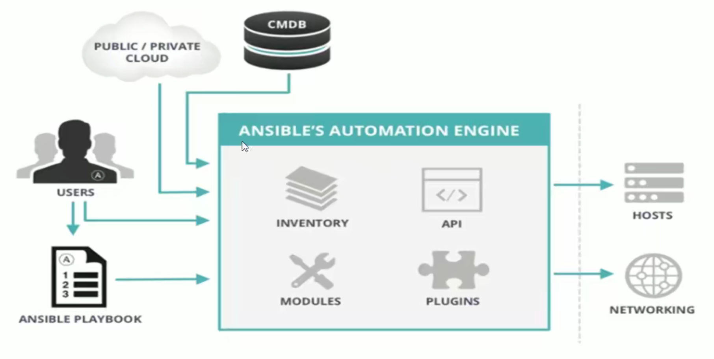

## ansible介绍和架构

### ansible特性

* 模块化：调用特定的模块，完成特定的任务
* Paramiko（Python对ssh的实现），PyYAML，Jinja2（模板语言）三个关键模块
* 支持自定义模块，可使用任何编程语言写模块
* 基于Python语言实现
* 部署简单，基于Python和SSH，agentless，无需代理，不依赖PKI（无需ssl）
* 安全，基于OpenSSH
* 幂等性：一个任务执行一次和执行n次效果一样，不因重复执行带来意外情况
* 支持playbook编排任务，YAML格式，编排任务，支持丰富的数据结构
* 较强大的多层解决方案role

### ansible架构

#### ansible组成



中间的绿框里的组件，可以理解为是ansible命令工具，其为核心执行工具

* INVENTORY：Ansible管理主机的清单`/etc/ansible/hosts`
* MODULES：Ansible执行命令的功能模块，多数为内置核心模块，也可以自定义
* PLUGINS：模块功能的补充，如连接类型插件、循环插件、变量插件、过滤插件等，不常用
* API：供第三方程序调用的应用程序编程接口

#### ansible命令执行来源

* USER：普通用户，即系统管理员
* PLAYBOOKS：任务剧本（任务集合），编排定义Ansible任务集的配置文件，由Ansible顺序依次执行，通常是JSON格式的文件
* CMDB（配置管理数据库）API调用
* USER -> Ansible playbook ->Ansible

#### 注意事项

* 执行ansible的主机一般称为主控端，中控，master或堡垒机
* 主控端Python版本需要2.6以上
* 被控端Python版本小于2.4需要安装python-simplejson
* 被控端如果开启SELinux需要安装libselinux-python
* windows不能作为主控端

## ansible安装

yum安装和源码编译安装

### yum安装

EPEL源的rpm包安装

```bash
yum install ansible
```


### 源码编译安装

```bash
yum -y install python-jinja2 PyYAML python-paramiko python-babel python-crypto
tar -zxf ansible-1.5.4.tar.gz
cd ansible-1.5.4
python setup.py build
python setup.py install
mkdir /etc/ansible
cp -r examples/* /etc/ansible
```

### Git方式安装

```bash
git clone git://github.com/ansible/ansible.git --recursive
cd ./ansible
source ./hacking/env-setup
```


### pip安装

使用Python的虚拟环境来安装

```bash
sudo pip install ansible
```


### 确认安装

```bash
ansible --version
```

## Ansible相关文件

### 配置文件

| 文件                     | 作用                            |
| ------------------------ | ------------------------------- |
| /etc/ansible/ansible.cfg | 主配置文件，配置ansible工作特性 |
| /etc/ansible/hosts       | 主机清单                        |
| /etc/ansible/roles/      | 存放角色的目录                  |


### ansible主配置文件

Ansible的主配置文件`/etc/ansible/ansible.cfg`，其中大部分的配置内容无需配置

```ini
[defaults]
# 主机列表配置文件
inventory       = /etc/ansible/hosts

# 库文件存放目录
library         = ~/.ansible/plugins/modules:/usr/share/ansible/plugins/modules

# 临时py命令文件存放的远程主机目录
remote_tmp      = ~/.ansible/tmp

# 本机的临时命令执行目录
local_tmp       = ~/.ansible/tmp

# 默认并发数，是ansible连接目标机的并发数
forks           = 5

# 默认sudo用户，用该账号连接目标主机
sudo_user      = root
# 每次执行ansible命令是否询问ssh密码
ask_sudo_pass  = True

ask_pass       = True

# 目标服务器ssh服务端口
remote_port    = 22

# 检查对应服务器的host_key，建议取消注释
host_key_checking = False

# 日志文件，建议启用
log_path = /var/log/ansible.log

# 默认模块，可以修改为shell模块
module_name = command
```

### inventory主机清单

默认是`/etc/ansible/hosts`

**主机清单文件格式**

```ini
# Ex 1: Ungrouped hosts, specify before any group headers:

green.example.com
blue.example.com
192.168.100.1
192.168.100.10

# Ex 2: A collection of hosts belonging to the 'webservers' group:

[webservers]
alpha.example.org:80
beta.example.org
192.168.1.100
192.168.1.110

# If you have multiple hosts following a pattern, you can specify
# them like this:

www[001:006].example.com

# Ex 3: A collection of database servers in the 'dbservers' group:

[dbservers]
db01.intranet.mydomain.net
db02.intranet.mydomain.net
10.25.1.56
10.25.1.57

# Here's another example of host ranges, this time there are no
# leading 0s:

db-[99:101]-node.example.com

```

## Ansible相关工具

| 工具             | 作用                                                       |
| ---------------- | ---------------------------------------------------------- |
| Ad-Hoc           | 利用ansible命令，主要用于临时命令的使用场景                |
| Ansible-playbook | 主要用于长期规划好的，大型项目的场景，需要有前期的规划过程 |
| ansible-doc      | 显示模块帮助                                               |


### ansible-doc

1. 列出所有模块

   ```bash
   ansible-doc -l
   ```

   

2. 查看指定模块用法

   ```bash
   ansible-doc ping
   ```

   

3. 查看指定模块用法片段

   ```bash
   ansible-doc -s ping
   ```

   

### ansible

**格式**

```
ansible <host-pattern> [-m module_name] [-a args]
```

**选项说明**

| 选项                               | 说明                             |
| ---------------------------------- | -------------------------------- |
| --version                          | 显示版本                         |
| -m MOUDLE                          | 指定模块，默认是command          |
| -v                                 | 执行详细过程，-vv -vvv更详细     |
| --list-hosts                       | 显示匹配的主机列表，可简写--list |
| -k, --ask-pass                     | 提示输入ssh连接密码，默认key验证 |
| -C, --check                        | 检查，并不执行                   |
| -T, --timeout=TIMEOUT              | 连接超时时间，默认10s            |
| -u REMOTE_USER, --user REMOTE_USER | 执行远程执行的用户               |
| -b, --become                       | 代替旧版的sudo切换               |
| --become-user RECOME_USER          | 指定sudo的run as用户，默认为root |
| -K, --ask-become-pass              | 提示输入sudo时的口令             |


| host-pattern | 解释                                       | 范例                                                         |
| ------------ | ------------------------------------------ | ------------------------------------------------------------ |
| all          | 表示所有inventory中的主机                  | ansible all -m ping                                          |
| 通配符*      |                                            | ansible "*" -m ping<br />ansible  192.168.1.\* -m ping       |
| 逻辑或       | :两边只要有一个有，就匹配                  | ansible "websrvs:appsrvs" -m ping<br />ansible "192.168.1.10:192.168.1.20" -m ping |
| 逻辑与       | :&两边都有，才匹配中                       | ansible "websrvs:&dbsrvs" -m ping                            |
| 逻辑非       | :!左边有，右边没有，则匹配，注意要用单引号 | ansible 'websrvs:!dbsrvs' -m ping                            |
| 综合逻辑     |                                            | ansible 'websrvs:dbsrvs:&appsrvs:!ftpsrvs' -m ping           |
| 正则表达式   |                                            | ansible "websrvs:&dbsrvs" -m ping<br />ansible "~(web\|db).*\\.magedu\\.com" -m ping |

**ansible命令执行过程**

1. 加载自己的配置文件，默认是`/etc/ansible/ansible.cfg`
2. 加载自己对应的模块文件，如：command
3. 通过ansible模块或命令生成对应的临时py文件，并将该文件传输至远程服务器的对应执行用户`$HOME/.ansible/tmp/ansible-tmp-数字/XXX.PY`文件
4. 给文件+x执行
5. 执行并返回结果
6. 删除临时py文件，退出

**示例**

```bash
# 以xinyulu用户执行ping存活探测
ansible all -m ping -u xinyulu -k
# 以xinyulu sudo到root执行ping存活探测
ansible all -m ping -u xinyulu -k -b
# 以xinyulu sudo至test用户执行ping存活探测
ansible all -m ping -u xinyulu -k -b --become-user test
# 以wang sudo至root用户执行ls
ansible all -m command -u xinyulu -a 'ls /root' -b --become-user root -k -K
```

### ansible-galaxy

此工具会连接https://galaxy.ansible.com下载相应的roles

**示例**

```bash
# 列出所有已经安装的galaxy
ansible-galaxy list
# 安装galaxy
ansible-galaxy install geerlingguy.redis
# 删除galaxy
ansible-galaxy remove geerlingguy.redis
```

### ansible-pull

该命令会推送ansible的命令至远程，效率无限提升，对运维要求较高

### ansible-playbook

此工具用于执行编写好的playbook任务

**示例**

```yaml
- hosts: websrvs
  remote_user: root
  tasks:
    - name: hello world
      command: /usr/bin/wall hello world
```

### ansible-vault

此工具可以用于加解密yml文件，避免明文存放

**格式**

```bash
ansible-vault {create,decrypt,edit,view,encrypt,encrypt_string,rekey} xxx.yml
```

**示例**

```bash
ansible-vault encrypt hello.yml   # 加密
ansible-vault decrypt hello.yml   # 解密
ansible-vault view hello.yml      # 查看加密文件
ansible-vault edit hello.yml      # 编辑加密文件
ansible-vault rekey hello.yml     # 修改口令
ansible-vault create new.yml      # 创建新文件
```

### ansible-console

## ansible常用模块

常用模块帮助文档：https://docs.ansible.com/ansible/latest/collections/index_module.html

### command模块

官方文档：https://docs.ansible.com/ansible/latest/collections/ansible/builtin/command_module.html#ansible-collections-ansible-builtin-command-module

功能：在远程主机上执行命令，此为默认模块，可忽略-m选项

注意：该模块不支持变量、重定向、管道符等，这些操作需要用shell模块执行

**示例**

```bash
ansible all -m 'command' -a 'chdir=/etc/ssh ls' -k
```

**常用参数**

| 参数    | 解释                                   |
| ------- | -------------------------------------- |
| chdir   | 运行命令前切换目录                     |
| creates | 当指定的文件存在时，就不执行对应命令   |
| removes | 当指定的文件不存在时，就不执行对应命令 |


### Shell模块

**示例**

```bash
ansible all -m 'shell' -a 'echo password | passwd --stdin root'
```

**常用参数**

| 参数    | 解释                                   |
| ------- | -------------------------------------- |
| chdir   | 运行命令前切换目录                     |
| creates | 当指定的文件存在时，就不执行对应命令   |
| removes | 当指定的文件不存在时，就不执行对应命令 |


### script模块

功能：在远程机器上执行ansible机器上的脚本

**示例**

```bash
ansible all -m script -a '/data/test.sh'
```

### copy模块

功能：从ansible服务器主控端复制文件到远程主机

```bash
# 如目标存在，默认会覆盖，此处指定先备份
ansible srv -m copy -a "src=/root/test1.sh dest=/tmp/test2.sh owner=root mode=600 backup=yes"

# 指定内容，直接生成目标文件
ansible srv -m copy -a "content='test content\n' dest=/tmp/test.txt"

# 复制/etc下文件，不包括/etc目录自身
ansible srv -m copy -a "src=/etc/ dest=/backup"
```

### fetch模块

功能：拉取远程机器的文件到ansible机器，会在ansible上创建对应IP的目录

### file模块

功能：设置文件属性
