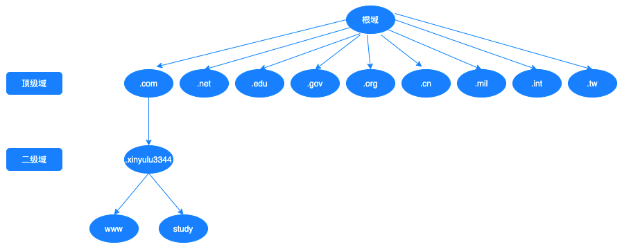

# DNS服务

## 核心概念

| 概念             | 解释                                                         |      |
| ---------------- | ------------------------------------------------------------ | ---- |
| ipv4根域名服务器 | 全球共13个，美国10个，荷兰、瑞典、日本各一个                 |      |
| ipv6根域名服务器 | 全球共25个，中国1主3从， 美国1主2从                          |      |
| 递归查询         |                                                              |      |
| 迭代查询         |                                                              |      |
| FQDN             |                                                              |      |
| tcp 53端口       |                                                              |      |
| udp 53端口       |                                                              |      |
| tcp 953端口      |                                                              |      |
| 主DNS服务器      |                                                              |      |
| 从DNS服务器      |                                                              |      |
| A记录            | FQDN->IP                                                     |      |
| AAAA记录         | FQDN->IPv6                                                   |      |
| PTR              | IP->FQDN                                                     |      |
| NS               | 标明当前区域的DNS服务器                                      |      |
| CNAME            | 别名记录                                                     |      |
| MX               | 邮件交换器                                                   |      |
| TXT              | 对域名进行标识和说明的一种方式，一般做验证记录时会使用此项，如：SPF(反垃圾邮件)记录，https验证等 |      |
| SOA              | Start Of Authority，起始授权记录；一个区域解析库有且只有一个SOA记录，必须位于解析库的第一条记录 |      |


## 域名结构



 ## DNS软件bind

DNS服务程序：bind、powerdns、unbound、coredns

### BIND相关软件包

- bind：服务器
- bind-libs
- bind-utils
- bind-chroot

### 配置文件

根服务器配置文件：**/var/named/named.ca**

主配置文件：**/etc/named.conf：**

```c
options {
        listen-on port 53 { localhost; };
        listen-on-v6 port 53 { ::1; };
        // 区域数据库配置目录
        directory       "/var/named";
        dump-file       "/var/named/data/cache_dump.db";
        statistics-file "/var/named/data/named_stats.txt";
        memstatistics-file "/var/named/data/named_mem_stats.txt";
        recursing-file  "/var/named/data/named.recursing";
        secroots-file   "/var/named/data/named.secroots";
        // 允许哪些机器来查询
        allow-query     { localhost;192.168.0.0/20;any; };
        // 只允许192.168.0.8同步数据
        // slave上需要配置为none
        allow-transfer { 192.168.0.8; };

        /* 
         - If you are building an AUTHORITATIVE DNS server, do NOT enable recursion.
         - If you are building a RECURSIVE (caching) DNS server, you need to enable 
           recursion. 
         - If your recursive DNS server has a public IP address, you MUST enable access 
           control to limit queries to your legitimate users. Failing to do so will
           cause your server to become part of large scale DNS amplification 
           attacks. Implementing BCP38 within your network would greatly
           reduce such attack surface 
        */
        recursion yes;

        dnssec-enable yes;
        dnssec-validation yes;

        /* Path to ISC DLV key */
        bindkeys-file "/etc/named.root.key";

        managed-keys-directory "/var/named/dynamic";

        pid-file "/run/named/named.pid";
        session-keyfile "/run/named/session.key";
};

logging {
        channel default_debug {
                file "data/named.run";
                severity dynamic;
        };
};

zone "." IN {
        type hint;
        file "named.ca";
};

include "/etc/named.rfc1912.zones";
include "/etc/named.root.key";
```

检查配置文件是否正确：

```bash
named-checkconf
```

区域数据库配置：

```bash
cp -p /var/named/named.empty /var/named/xinyulu3344.cn.zone
```

```bash
; 整个记录的TTL时间为1天
$TTL 1D
; @: 表示当前区域的变量
; ns1: 主DNS的名称
; admin.xinyulu3344.cn.: 表示管理员邮箱
@ IN SOA ns1 admin.xinyulu3344.cn. (
    2023072400  ;序列号,十进制表示,不能超过10位.其作用是主从同步.当主DNS服务器的解析文件发生变化时,管理员需要手动更新此值,主服务器比对主从序列号不一致,会立刻进行主从同步操作.否则会等待刷新时间到了才由从服务器同步主服务器数据.
    1H            ;刷新时间, 表示slave从master请求同步解析的时间间隔,默认以秒为单位. 支持1H, 1D表示
    10m           ;重试时间, slave同步失败后, 再次尝试同步的时间间隔
    1D            ;过期时间, 同步失败多久后, slave认为其缓存失效
    12H           ;否定答案缓存TTL, 表示不存在的记录缓存时长.
    )


; NS记录
; @: 当前区域
; TTL
@ IN NS ns1
@ IN NS ns2
ns1 IN A 1.1.1.1
ns2 IN A 2.2.2.2

; CNAME记录
; 格式: NAME TTL IN CNAME FQDN
; name: FQDN
; TTL
www CNAME websrv
websrv A 3.3.3.3
websrv A 4.4.4.4
* A 5.5.5.5

; MX记录
; 格式: NAME TTL IN MX PRI MailServer
; 优先级0-99, 数字越小越优先 
@ MX 10 mailsrv1
@ MX 20 mailsrv2
mailsrv1 A 6.6.6.6
mailsrv2 A 7.7.7.7

; A记录, AAAA记录
; name: FQDN
api A 8.8.8.8

; 等价于
; HOST1 A 1.2.3.1
; HOST2 A 1.2.3.2
$GENERATE 1-100 HOST$ IN A 1.2.3.$
```

区域配置文件：**/etc/named.rfc1912.zones**

```c
zone "xinyulu3344.cn" IN {
    type master;
    file "xinyulu3344.cn.zone";
};
```

### 主从配置

从服务器配置：**/etc/named.rfc1912.zones**

```bash
zone "xinyulu3344.cn" IN {
    type slave;
    masters { x.x.x.x; };
    file "slaves/xinyulu3344.cn.zone.slave";
};
```

### 子域配置

### 命令行工具

重启bind服务

```bash
systemctl restart named
rndc reload
```

清空bind缓存

```bash
rndc flush
```

