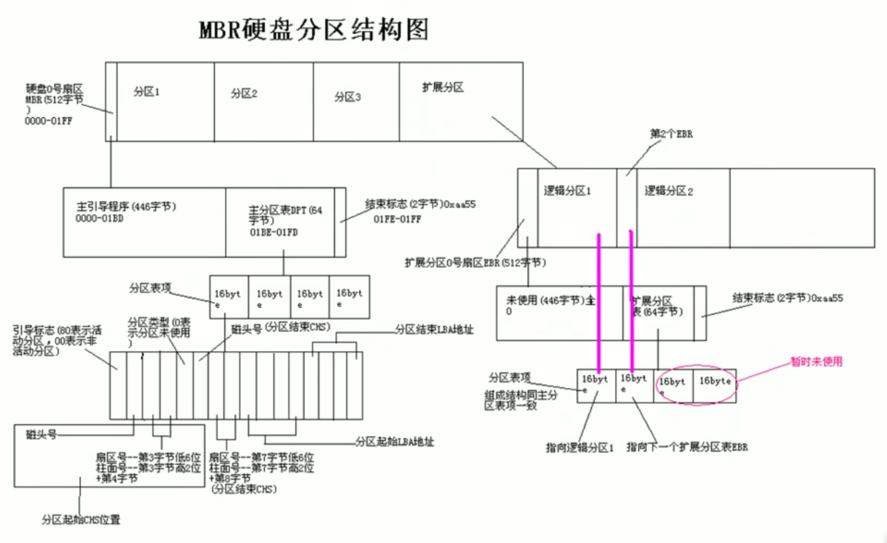
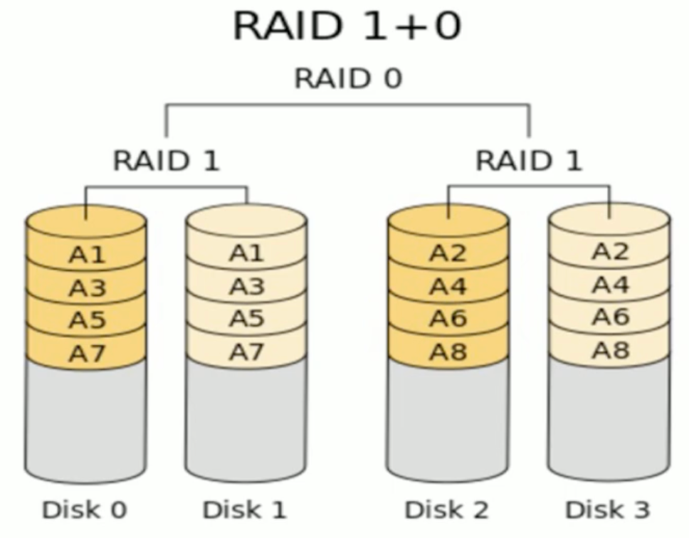

## 交互式接口shell

显示当前使用的shell

```bash
echo ${SHELL}
```

查看当前系统使用的所有shell

```bash
]# cat /etc/shells 
/bin/sh
/bin/bash
/sbin/nologin
/usr/bin/sh
/usr/bin/bash
/usr/sbin/nologin
/bin/tcsh
/bin/csh
```

## 设置主机名

查看主机名

```bash
hostname 
```

临时设置主机名

```bash
hostname NAME
```

永久修改

CentOS7及之后版本

```bash
hostnamectl set-hostname NAME
```

CentOS6

```
vim /etc/hostname
```

范例

```bash
]# hostname bj-yz-k8s-node1-100-10.jdcloud.com
```

注意：主机名不要使用下划线

## 显示提示符

```bash
]# echo $PS1
[\u@\h \W]\$
```

提示符格式说明

| 提示符 | 解释             |      |
| ------ | ---------------- | ---- |
| \e     | 控制符\033       |      |
| \u     | 当前用户         |      |
| \h     | 主机名简称       |      |
| \H     | 主机名全称       |      |
| \w     | 当前工作目录     |      |
| \W     | 当前工作目录基名 |      |
| \t     | 24小时时间格式   |      |
| \T     | 12小时时间格式   |      |
| !      | 命令历史数       |      |
| #      | 开机后命令历史数 |      |

范例

```bash
PS1="\[\e[1;32m\][\t \[\e[1;33m\]\u\[\e[35m\]@\h\[\e[1;31m\] \W\[\e[1;32m\]]\\[\e[0m\]\\$"
```

## 内外部命令

判断是否是内部命令

```bash
type -a COMMAND
```

列出所有内部命令

```bash
enable
help
```

禁用内部命令

```bash
enable -n COMMAND
```

查看外部命令路径

```bash
which COMMAND
whereis COMMAND
```

## hash 缓存表

执行过的shell命令路径会缓存住，下次可以直接找到命令

查看缓存的命令路径列表

```bash
]# hash
hits    command
   2    /bin/hostname
   1    /sbin/runlevel
   2    /bin/man
   1    /bin/ls
```

清除缓存

```bash
]# hash -r
```

## 命令别名

列出所有别名

```bash
alias
```

临时定义别名

```bash
alias cdnet="cd /etc/sysconfig/network-scripts/"
```

取消指定别名

```bash
unalias cdnet
```

取消所有别名

```bash
unalias -a
```

持久保存

```bash
vim .bashrc
```

如果别名同原命令同名，如果要执行原命令，可以加个`\`

```bash
]# \ls
```

## 查看CPU信息

```bash
]# lscpu
Architecture:          x86_64
CPU op-mode(s):        32-bit, 64-bit
Byte Order:            Little Endian
CPU(s):                2
On-line CPU(s) list:   0,1
Thread(s) per core:    2
Core(s) per socket:    1
Socket(s):             1
NUMA node(s):          1
Vendor ID:             GenuineIntel
CPU family:            6
Model:                 106
Model name:            Intel(R) Xeon(R) Platinum 8338C CPU @ 2.60GHz
Stepping:              6
CPU MHz:               2594.138
BogoMIPS:              5188.27
Virtualization:        VT-x
Hypervisor vendor:     KVM
Virtualization type:   full
L1d cache:             32K
L1i cache:             32K
L2 cache:              4096K
L3 cache:              16384K
NUMA node0 CPU(s):     0,1
Flags:                 fpu vme de pse tsc msr pae mce cx8 apic sep mtrr pge mca cmov pat pse36 clflush mmx fxsr sse sse2 ss ht syscall nx pdpe1gb rdtscp lm constant_tsc arch_perfmon rep_good nopl xtopology eagerfpu pni pclmulqdq vmx ssse3 fma cx16 pcid sse4_1 sse4_2 x2apic movbe popcnt tsc_deadline_timer aes xsave avx f16c rdrand hypervisor lahf_lm abm 3dnowprefetch tpr_shadow vnmi flexpriority ept vpid fsgsbase tsc_adjust bmi1 avx2 smep bmi2 erms invpcid avx512f avx512dq rdseed adx smap avx512ifma clflushopt clwb avx512cd sha_ni avx512bw avx512vl xsaveopt xsavec xgetbv1 arat avx512vbmi avx512_vpopcntdq
```

```bash
]# cat /proc/cpuinfo 
processor       : 0
vendor_id       : GenuineIntel
cpu family      : 6
model           : 106
model name      : Intel(R) Xeon(R) Platinum 8338C CPU @ 2.60GHz
stepping        : 6
microcode       : 0x1
cpu MHz         : 2594.138
cache size      : 16384 KB
physical id     : 0
siblings        : 2
core id         : 0
cpu cores       : 1
apicid          : 0
initial apicid  : 0
fpu             : yes
fpu_exception   : yes
cpuid level     : 27
wp              : yes
flags           : fpu vme de pse tsc msr pae mce cx8 apic sep mtrr pge mca cmov pat pse36 clflush mmx fxsr sse sse2 ss ht syscall nx pdpe1gb rdtscp lm constant_tsc arch_perfmon rep_good nopl xtopology eagerfpu pni pclmulqdq vmx ssse3 fma cx16 pcid sse4_1 sse4_2 x2apic movbe popcnt tsc_deadline_timer aes xsave avx f16c rdrand hypervisor lahf_lm abm 3dnowprefetch tpr_shadow vnmi flexpriority ept vpid fsgsbase tsc_adjust bmi1 avx2 smep bmi2 erms invpcid avx512f avx512dq rdseed adx smap avx512ifma clflushopt clwb avx512cd sha_ni avx512bw avx512vl xsaveopt xsavec xgetbv1 arat avx512vbmi avx512_vpopcntdq
bogomips        : 5188.27
clflush size    : 64
cache_alignment : 64
address sizes   : 46 bits physical, 57 bits virtual
power management:

processor       : 1
vendor_id       : GenuineIntel
cpu family      : 6
model           : 106
model name      : Intel(R) Xeon(R) Platinum 8338C CPU @ 2.60GHz
stepping        : 6
microcode       : 0x1
cpu MHz         : 2594.138
cache size      : 16384 KB
physical id     : 0
siblings        : 2
core id         : 0
cpu cores       : 1
apicid          : 1
initial apicid  : 1
fpu             : yes
fpu_exception   : yes
cpuid level     : 27
wp              : yes
flags           : fpu vme de pse tsc msr pae mce cx8 apic sep mtrr pge mca cmov pat pse36 clflush mmx fxsr sse sse2 ss ht syscall nx pdpe1gb rdtscp lm constant_tsc arch_perfmon rep_good nopl xtopology eagerfpu pni pclmulqdq vmx ssse3 fma cx16 pcid sse4_1 sse4_2 x2apic movbe popcnt tsc_deadline_timer aes xsave avx f16c rdrand hypervisor lahf_lm abm 3dnowprefetch tpr_shadow vnmi flexpriority ept vpid fsgsbase tsc_adjust bmi1 avx2 smep bmi2 erms invpcid avx512f avx512dq rdseed adx smap avx512ifma clflushopt clwb avx512cd sha_ni avx512bw avx512vl xsaveopt xsavec xgetbv1 arat avx512vbmi avx512_vpopcntdq
bogomips        : 5188.27
clflush size    : 64
cache_alignment : 64
address sizes   : 46 bits physical, 57 bits virtual
power management:
```

## 查看内存信息

```bash
]# cat /proc/meminfo 
MemTotal:        3881640 kB
MemFree:          245440 kB
MemAvailable:    3058008 kB
Buffers:               0 kB
Cached:          2882272 kB
SwapCached:            0 kB
Active:          2066672 kB
Inactive:        1084708 kB
Active(anon):     283668 kB
Inactive(anon):    23060 kB
Active(file):    1783004 kB
Inactive(file):  1061648 kB
Unevictable:           0 kB
Mlocked:               0 kB
SwapTotal:             0 kB
SwapFree:              0 kB
Dirty:                16 kB
Writeback:             0 kB
AnonPages:        269156 kB
Mapped:           103984 kB
Shmem:             37620 kB
Slab:             297960 kB
SReclaimable:     257160 kB
SUnreclaim:        40800 kB
KernelStack:        4032 kB
PageTables:         8220 kB
NFS_Unstable:          0 kB
Bounce:                0 kB
WritebackTmp:          0 kB
CommitLimit:     1940820 kB
Committed_AS:    1728840 kB
VmallocTotal:   34359738367 kB
VmallocUsed:       32300 kB
VmallocChunk:   34359685116 kB
HardwareCorrupted:     0 kB
AnonHugePages:     63488 kB
HugePages_Total:       0
HugePages_Free:        0
HugePages_Rsvd:        0
HugePages_Surp:        0
Hugepagesize:       2048 kB
DirectMap4k:      124752 kB
DirectMap2M:     4069376 kB
DirectMap1G:     2097152 kB
```

## 查看磁盘信息

```bash
]# lsblk
NAME   MAJ:MIN RM  SIZE RO TYPE MOUNTPOINT
vda    253:0    0   50G  0 disk 
├─vda1 253:1    0    1M  0 part 
├─vda2 253:2    0  100M  0 part 
└─vda3 253:3    0 49.9G  0 part /
vdb    253:16   0  100G  0 disk 
└─vdb1 253:17   0  100G  0 part /mnt
vdc    253:32   0  600G  0 disk 
└─vdc1 253:33   0  600G  0 part /vdc
```

```bash
]# cat /proc/partitions 
major minor  #blocks  name

 253        0   52428800 vda
 253        1       1024 vda1
 253        2     102400 vda2
 253        3   52324335 vda3
 253       16  104857600 vdb
 253       17  104856576 vdb1
 253       32  629145600 vdc
 253       33  629144576 vdc1
```

## 查看系统版本信息

查看内核版本

```bash
]# uname -r
3.10.0-693.el7.x86_64

]# uname -a
Linux CentOS74 3.10.0-693.el7.x86_64 #1 SMP Tue Aug 22 21:09:27 UTC 2017 x86_64 x86_64 x86_64 GNU/Linux
```

查看操作系统发行版本

```bash
]# cat /etc/redhat-release 
CentOS Linux release 7.4.1708 (Core) 

]# cat /etc/os-release 
NAME="CentOS Linux"
VERSION="7 (Core)"
ID="centos"
ID_LIKE="rhel fedora"
VERSION_ID="7"
PRETTY_NAME="CentOS Linux 7 (Core)"
ANSI_COLOR="0;31"
CPE_NAME="cpe:/o:centos:centos:7"
HOME_URL="https://www.centos.org/"
BUG_REPORT_URL="https://bugs.centos.org/"

CENTOS_MANTISBT_PROJECT="CentOS-7"
CENTOS_MANTISBT_PROJECT_VERSION="7"
REDHAT_SUPPORT_PRODUCT="centos"
REDHAT_SUPPORT_PRODUCT_VERSION="7"
```

## 时间

查看系统时间

```bash
]# date
Sun Apr  9 21:40:46 CST 2023
```

查看硬件时间

```bash
]# clock
Sun 09 Apr 2023 09:44:24 PM CST  -0.929108 seconds
```

使用硬件时间校准系统时间

```bash
]# clock -s
```

使用系统时间校准硬件时间

```bash
]# clock -w
```

查看当前时区

```bash
]# ll /etc/localtime 
lrwxrwxrwx 1 root root 35 Jan 22  2018 /etc/localtime -> ../usr/share/zoneinfo/Asia/Shanghai
```

```bash
# CentOS7及以上支持
]# timedatectl status
      Local time: Sun 2023-04-09 21:49:36 CST
  Universal time: Sun 2023-04-09 13:49:36 UTC
        RTC time: Sun 2023-04-09 13:49:35
       Time zone: Asia/Shanghai (CST, +0800)
     NTP enabled: no
NTP synchronized: yes
 RTC in local TZ: no
      DST active: n/a
```

查看所有时区

```bash
timedatectl list-timezones
```

修改时区

```bash
timedatectl set-timezone Asia/Shanghai
```

## 日历

查看当月日历

```bash
cal
```

查看当年日历

```bash
cal -y
```

查看某月日历

```bash
cal 10 2023
```

## 用户登录信息查看

- whoami: 显示当前登录的有效用户
- who：系统当前所有的登录会话
- w：系统当前所有的登录会话

```bash
]# whoami
root

]# who
root     tty1         2023-03-30 19:32
xinyulu  pts/0        2023-04-09 19:19 (192.168.21.9)

]# w
 22:04:33 up 17 days, 14:32,  2 users,  load average: 0.00, 0.02, 0.05
USER     TTY      FROM             LOGIN@   IDLE   JCPU   PCPU WHAT
root     tty1                      30Mar23  4days  0.06s  0.06s -bash
xinyulu  pts/0    192.168.21.9     19:19    1.00s  0.34s  0.02s sshd: xinyulu
```

## screen

查看所有screen会话列表

```bash
]# screen -ls
There is a screen on:
        29761.vnc       (Attached)
1 Socket in /var/run/screen/S-root.
```

创建新会话

```bash
]# screen -S vnc
```

加入screen会话

```bash
]# screen -x vnc
```

退出并关闭screen会话

```bash
]# exit
```

剥离当前screen会话

```bash
]# Ctrl+a, d
```

## tmux

tmux是一个终端复用器，类似screen，但是更易用，也更强大

功能如下：

- 允许在单个窗口中，同时访问多个会话。
- 可以让新窗口接入已经存在的会话
- 允许每个会话有多个连接窗口，因此可以多人实时共享会话
- 支持窗口任意垂直和水平拆分

安装

```bash
yum install tmux
```

启动与退出

```bash
tmux
exit
```

窗格快捷键

```bash
ctrl+b, " 上下拆分窗格
ctrl+b, % 左右拆分窗格
ctrl+b, <arrow key> 光标切换到其它窗格
ctrl+b, ; 光标切换到上一个窗格
ctrl+b, o 光标切换到下一个窗格
ctrl+b, { 当前窗格左移
ctrl+b, } 当前窗格右移
ctrl+b, ctrl+o 当前窗格上移
ctrl+b, alt+o 当前窗格下移
ctrl+b, x 关闭当前窗格
ctrl+b, ! 将当前窗格拆分为一个独立窗口
ctrl+b, z 当前窗格全屏显示，再使用一次会变回原来大小
ctrl+b, ctrl+<arrow key> 按箭头方向调整窗格大小
ctrl+b, q 显示窗格编号
```

列出所有Tmux命令及其参数

```bash
tmux list-commands
```

列出所有快捷键，及其对应的Tmux命令

```bash
tmux list-keys
```

## echo

```bash
-n 不输出结尾的换行
-E (默认)不支持\解释功能
-e 启用\字符的解释功能
```

如果使用-e选项，则出现以下字符，则特别加以处理，而不会将它当成一般文字输出

```bash
\a 发出警告
\b 退格
\c 最后不加上换行符号
\e escape，相当于\0333
\n 换行且光标移至行首，但不换行
\t 插入tab
\0nnn插入nnn(八进制)所代表的ASCII字符
\xHH插入HH(十六进制)所代表的ASCII数字
```

## 引号、反引号

- 单引号：变量和命令都不识别，就是普通字符串原样输出
- 双引号：不能识别命令，但能识别变量
- 反引号：变量和命令都识别，并且会将反引号的内容当成命令进行执行后，再交给调用反引号的命令继续执行

示例：

```bash
]# echo "$HOSTNAME"
CentOS74

]# echo '$HOSTNAME'
$HOSTNAME

]# echo `echo $HOSTNAME`
CentOS74
```

## 大括号

```bash
]# echo user{1,2,3}.txt
user1.txt user2.txt user3.txt

]# echo user{1..3}.txt
user1.txt user2.txt user3.txt

]# echo user{3..1}.txt
user3.txt user2.txt user1.txt

]# echo user{1..3..2}.txt
user1.txt user3.txt

]# echo {a..z}
a b c d e f g h i j k l m n o p q r s t u v w x y z

]# echo {z..a}
z y x w v u t s r q p o n m l k j i h g f e d c b a

]# echo {a..z..2}
a c e g i k m o q s u w y

]# echo {00..20..2}
00 02 04 06 08 10 12 14 16 18 20
```

## 历史命令

历史命令保存在`~/.bash_history`文件中

```bash
history命令
```

查看可以保存多少历史命令

```bash
]# echo $HISTSIZE
1000
```

修改可以保存的历史命令数量

```bash
]# vim /etc/profile
...
HISTSIZE=1000
...
```

常用选项

| 选项      | 解释                                                         |
| --------- | ------------------------------------------------------------ |
| -c        | 清空命令历史。不会清空文件中历史，只清空内存中历史           |
| -d offset | 删除历史中指定的第offset个命令                               |
| n         | 显示最近的n条历史                                            |
| -a        | 追加本次会话新执行的命令历史列表至历史文件                   |
| -r        | 读历史文件附加到历史列表                                     |
| -w        | 保存历史列表到指定的历史文件                                 |
| -n        | 读历史文件中未读过的行至历史列表                             |
| -p        | 展开历史参数成多行，但不存在历史列表中                       |
| -s        | 展开历史参数成一行，附加在历史列表后，相当于命令不真正执行。假冒历史 |

历史命令相关环境变量

| 环境变量       | 解释                       | 默认值          | 可选值                                                       |
| -------------- | -------------------------- | --------------- | ------------------------------------------------------------ |
| HISTSIZE       | 命令历史记录的条数         | 1000            |                                                              |
| HISTFILE       | 指定历史文件               | ~/.bash_history |                                                              |
| HISTFILESIZE   | 命令历史文件记录历史的条数 | 1000            |                                                              |
| HISTTIMEFORMAT | 历史命令格式               |                 | "%F %T $(whoami) "                                           |
| HISTIGNORE     | 忽略命令，支持通配符       |                 | "str1:str2*"                                                 |
| HISTCONTROL    | 控制命令历史记录的方式     | ignoredups      | ignoredups 忽略重复的命令，连续且相同为重复<br />ignorespace 忽略所有以空白开头命令<br />ignoreboth 相当于ignoredups, ignorespace的组合<br />erasedups 删除重复命令 |

给历史命令设置时间格式

```bash
export HISTTIMEFORMAT="%F %T "
```

永久设置

``` bash
vim ~/.bashrc
```

## bash快捷键

```bash
ctrl + l 清屏
Ctrl + o 执行当前命令，并重新显示本命令
Ctrl + s 阻止屏幕输出，实际已经执行，只是屏幕不显示。类似锁定效果
Ctrl + q 解锁
Ctrl + c 终止命令
Ctrl + z 挂起
Ctrl + a 光标移动到行首，相当于Home键
Ctrl + e 光标移动到行尾，相当于end键
Ctrl + f 光标右移一个字符
Ctrl + b 光标左移一个字符
Alt + f 光标右移一个单词尾
Alt + b 光标左移一个单词首
Ctrl + xx 光标在命令行首和光标之间移动
Ctrl + u 从光标处删除至命令行首
Ctrl + k 从光标处删除至命令行尾
Alt + r 删除当前整行
Ctrl + w 从光标处向左删除一个单词
Alt + d 从光标处向右删除一个单词
Ctrl + d 删除光标处的一个字符
Ctrl + h 删除光标前一个字符
Ctrl + y 将删除的字符粘贴到光标后
```

## 文件编码转换

```bash
dos2unix
unix2dos
```

查看有哪些编码方式

```bash
]# iconv -l
```

将文件从gb2312编码转为utf8编码

```bash
]# iconv -f gb2312 -t utf8 test.txt -o xxx.txt
```

## 通配符

```bash
*       匹配0个或多个字符, 但不匹配"."开头的文件
?       匹配任何单个字符
[0-9]   匹配数字
[a-z]   字母(小大小大...)
[A-Z]   字母(小大小大...)
[test]  匹配列表中的任何的一个字符
[^test] 匹配列表中的所有字符以外的字符
```

```bash
[:digit:]   任意数字
[:lower:]   任意小写字母
[:upper:]   任意大写字母
[:alpha:]   任意大小写字母
[:alnum:]   任意数字或字母
[:blank:]   水平空白字符
[:space:]   水平或垂直空白字符
[:punct:]   标点符号
[:print:]   可打印字符
[:cntrl:]   控制(非打印)字符
[:graph:]   图形字符
[:xdigit:]  十六进制字符
```

## 复制

cp命令

```bash
cp -r -p
cp -a
cp -r -p -d
```

## 文件名长度

文件名最长255个字节

包括路径在内文件名最长4095字节

## 硬链接和软链接

### 硬链接

硬链接本质上就给一个文件起一个新的名称，实质是同一个文件

硬链接特性：

- 创建硬链接会在对应目录中增加额外的记录项来引用文件
- 对应于同一文件系统上一个物理文件
- 每个目录引用相同的inode号
- 创建时链接数递增
- 删除文件时，链接计数递减，减到0时，文件才被删除
- 不能跨分区
- 不支持对目录创建硬链接

创建命令

```bash
ln source_file target_file
```

### 软链接

```bash
ln -s source_file target_file
```

> source_file的相对路径是target_file的相对路径，不是当前工作目录的相对路径

### 硬链接和软链接区别

|            | 硬链接                               | 软链接                                     |
| ---------- | ------------------------------------ | ------------------------------------------ |
| 本质       | 同一个文件                           | 不同文件                                   |
| 跨设备     | 不支持                               | 支持                                       |
| inode      | 相同                                 | 不同                                       |
| 链接数     | 创建新的，链接数增加；删除链接减少   | 创建删除都无变化                           |
| 目录       | 不支持                               | 支持                                       |
| 相对路径   | 原始文件相对路径是相对于当前工作目录 | 原始文件相对路径是相对于链接文件的相对路径 |
| 删除源文件 | 只是链接数减一，链接文件访问无影响   | 链接文件无法访问                           |
| 文件类型   | 和源文件相同                         | 链接文件，和源文件无关                     |

## 重定向

Linux给程序提供三种IO设备

- 标准输入，文件描述符0，默认接收来自终端的输入
- 标准输出，文件描述符1，默认输出到终端窗口
- 标准错误，文件描述符2，默认输出到终端窗口

```bash
1> 或 >
>|
2>
&>
>>
2>>
```

### tee命令

重定向到多个目标

```bash
-a, --append 追加
```

示例：

```bash
echo "Hello" | tee -a /data/test.log 
```

## 管道

设置密码

```bash
echo PASSWD | passwd --stdin root &> /dev/null
```

## 用户、组和权限

### 用户和组的关系

- 用户的主要组：用户必须属于一个且只有一个主组
- 用户的附加组：一个用户可以属于零个或多个附加组

### 主要配置文件

- /etc/passwd
- /etc/shadow
- /etc/group
- /etc/gshadow

#### /etc/passwd

```bash
# 1. 用户名
# 2. 密码，迁到了/etc/shadow
# 3. 用户ID
# 4. 用户组ID
# 5. 用户主组ID
# 6. 用户描述信息
# 7. 家目录
# 8. shell
xinyulu:x:1000:1000:xinyulu:/home/xinyulu:/bin/bash
```

#### /etc/shadow

```bash
# 1. 用户名
# 2. 加密后的密码
# 3. 密码最后修改的时间
# 4. 从密码最后修改时间开始，几天内不允许改密码，root不受限制
# 5. 从密码最后修改时间开始，几天后密码过期
# 6. 密码过期前多少天提示你
# 7. 密码过期后的宽限期
# 8. 账号有效期
xinyulu:$6$K3mIlKK$ZgX/mZcWrbPjTdN/2uFGcrS0ffrYRgSGfmUdXlYrmY3/DRUJnwUdfPjbf2s7e7Zcp7zz6ZSzQpKAX0tTQVKiN1:18973:0:99999:7:::
```

#### /etc/group

```bash
# 1. 组名
# 2. 组密码，迁到/etc/gshadow
# 3. 组ID
# 4. 组成员列表，该组是该成员的附加组
xinyulu:x:1000:
```

#### /etc/gshadow

```bash
# 1. 组名
# 2. 组密码，!表示没有密码
# 3. 组管理员
# 4. 组成员列表，该组是该成员的附加组
xinyulu:!::
```

### 用户和组管理命令

- useradd
- usermod
- userdel
- groupadd
- groupmod
- groupdel

#### useradd

常见选项：

```bash
-u, --uid UID                 UID
-o, --non-unique              配合-u，不检查UID唯一性
-g, --gid GROUP               指定用户基本组，可以为组名，也可以为GID
-c, --comment COMMENT         用户注释信息
-d, --home-dir HOME_DIR       指定家目录
-s, --shell SHELL             指明用户的默认shell程序，可用列表在/etc/shells文件中
-G, --groups GROUPS           为用户指定附加组，组要存在
-N, --no-user-group           不创建私用组做主组，使用users组做主组
-r, --system                  创建系统用户
-m, --create-home             创建家目录
-M, --no-create-home          不创建家目录
-e, --expiredate EXPIRE_DATE  用户的过期日期
-f, --inactive INACTIVE       密码过期后的宽限期
-k, --skel SKEL_DIR           新建账号的模板目录
```

范例：

```bash
useradd -r -u 48 -g apache -s /sbin/nologin -d /var/www -c "Apache" apache
```

useradd的默认值设定由`/etc/default/useradd`定义

```bash
]# cat /etc/default/useradd 
# useradd defaults file
GROUP=100
HOME=/home
INACTIVE=-1
EXPIRE=
SHELL=/bin/bash
SKEL=/etc/skel
CREATE_MAIL_SPOOL=yes
```

新建用户的相关文件

- /etc/default/useradd
- /etc/skel/*
- /etc/login.defs

批量改密码

```bash
echo root:PASSWD | chpasswd
cat /tmp/users.txt | chpasswd
echo PASSWD | passwd --stdin root
```

#### usermod

```bash
Usage: usermod [options] LOGIN
```

常见选项：

```bash
-u, --uid UID                 新UID
-g, --gid GROUP               新主组
-G, --groups GROUPS           新附加组，原附加组会被覆盖；若要保留需要加-a选项
-a, --append
-s, --shell SHELL             新的默认shell
-c, --comment COMMENT         新的注释信息
-d, --home HOME_DIR           新家目录不会自动创建：若要创建新家目录并移动数据，需要同时使用-m选项
-m, --move-home
-l, --login NEW_LOGIN         新的用户名
-L, --lock
-U, --unlock
-e, --expiredate EXPIRE_DATE  用户的过期日期
-f, --inactive INACTIVE       密码过期后的宽限期
```

#### userdel

```bash
Usage: userdel [options] LOGIN
```

选项：

```bash
-f, --force
-r, --remove  remove home directory and mail spool
```

#### groupadd

```bash
Usage: groupadd [options] GROUP
```

常用选项：

```bash
-g, --gid GID  指明GID号
-r, --system   创建系统组
```

#### groupmod

```bash
Usage: groupmod [options] GROUP
```

常用选项：

```bash
-g, --gid GID                 change the group ID to GID
-n, --new-name NEW_GROUP      change the name to NEW_GROUP
-o, --non-unique              allow to use a duplicate (non-unique) GID
-p, --password PASSWORD       change the password to this (encrypted) PASSWORD
-R, --root CHROOT_DIR         directory to chroot into
```

#### groupdel

```bash
Usage: groupdel [options] GROUP
```

### 文件权限

#### 对文件的权限

```bash
r  可以获取文件内容
w  可修改其内容
x  可执行
```

#### 对目录的权限

```bash
r  可以使用ls查看此目录中文件列表
w  可在此目录中创建文件，也可删除此目录中的文件
x  可以使用ls -l查看此目录中文件元数据(需配合r权限)，可以cd进入此目录
X  
```

### chown

修改文件属主、属组

```bash
Usage: chown [OPTION]... [OWNER][:[GROUP]] FILE...
  or:  chown [OPTION]... --reference=RFILE FILE...
```

### chgrp

修改文件属组

```bash
Usage: chgrp [OPTION]... GROUP FILE...
  or:  chgrp [OPTION]... --reference=RFILE FILE...
```

### chmod

```bash
Usage: chmod [OPTION]... MODE[,MODE]... FILE...
  or:  chmod [OPTION]... OCTAL-MODE FILE...
  or:  chmod [OPTION]... --reference=RFILE FILE...
```

### setfacl

```bash
setfacl 2.2.51 -- set file access control lists
Usage: setfacl [-bkndRLP] { -m|-M|-x|-X ... } file ...
  -m, --modify=acl        modify the current ACL(s) of file(s)
  -M, --modify-file=file  read ACL entries to modify from file
  -x, --remove=acl        remove entries from the ACL(s) of file(s)
  -X, --remove-file=file  read ACL entries to remove from file
  -b, --remove-all        remove all extended ACL entries
  -k, --remove-default    remove the default ACL
      --set=acl           set the ACL of file(s), replacing the current ACL
      --set-file=file     read ACL entries to set from file
      --mask              do recalculate the effective rights mask
  -n, --no-mask           don't recalculate the effective rights mask
  -d, --default           operations apply to the default ACL
  -R, --recursive         recurse into subdirectories
  -L, --logical           logical walk, follow symbolic links
  -P, --physical          physical walk, do not follow symbolic links
      --restore=file      restore ACLs (inverse of `getfacl -R')
      --test              test mode (ACLs are not modified)
  -v, --version           print version and exit
  -h, --help              this help text
```

示例：

```bash
setfacl -m u:xinyulu:- f1.txt
setfacl -m g:admins:rw f1.txt
setfacl -x u:xinyulu f1.txt
setfacl -b f1.txt
```

### getfacl

```bash
getfacl 2.2.51 -- get file access control lists
Usage: getfacl [-aceEsRLPtpndvh] file ...
  -a,  --access           display the file access control list only
  -d, --default           display the default access control list only
  -c, --omit-header       do not display the comment header
  -e, --all-effective     print all effective rights
  -E, --no-effective      print no effective rights
  -s, --skip-base         skip files that only have the base entries
  -R, --recursive         recurse into subdirectories
  -L, --logical           logical walk, follow symbolic links
  -P, --physical          physical walk, do not follow symbolic links
  -t, --tabular           use tabular output format
  -n, --numeric           print numeric user/group identifiers
  -p, --absolute-names    don't strip leading '/' in pathnames
  -v, --version           print version and exit
  -h, --help              this help text
```

## 文本处理工具

### cat

### tac

### rev

### hexdump

常用选项:

```bash
-s offset  从第offset字节开始查看
-C   十六进制ASCII展示
-n length  查看length字节
```


```bash
hexdump -C -n 512 /dev/vdb
00000000  00 00 00 00 00 00 00 00  00 00 00 00 00 00 00 00  |................|
*
000001b0  00 00 00 00 00 00 00 00  94 09 fe 46 00 00 00 00  |...........F....|
000001c0  21 02 83 0c 2c b2 00 08  00 00 00 f8 7f 0c 00 00  |!...,...........|
000001d0  00 00 00 00 00 00 00 00  00 00 00 00 00 00 00 00  |................|
*
000001f0  00 00 00 00 00 00 00 00  00 00 00 00 00 00 55 aa  |..............U.|
00000200
```

```bash
echo -n {a..z} | tr -d ' ' | hexdump -C
00000000  61 62 63 64 65 66 67 68  69 6a 6b 6c 6d 6e 6f 70  |abcdefghijklmnop|
00000010  71 72 73 74 75 76 77 78  79 7a                    |qrstuvwxyz|
0000001a
```

### od

dump files in octal and other formats

```bash
echo {a..z} | tr -d ' ' | od -t x1z
0000000 61 62 63 64 65 66 67 68 69 6a 6b 6c 6d 6e 6f 70  >abcdefghijklmnop<
0000020 71 72 73 74 75 76 77 78 79 7a 0a                 >qrstuvwxyz.<
0000033
```

### xxd

```bash
echo -n {a..z} | tr -d ' ' | xxd
00000000: 6162 6364 6566 6768 696a 6b6c 6d6e 6f70  abcdefghijklmnop
00000010: 7172 7374 7576 7778 797a                 qrstuvwxyz
```

### less和more

### tail和head

### cut

```bash
-d, --delimiter=DELIM 指明分隔符
-f, --fields=LIST  选择打印哪些列
```

### paste

paste合并多个文件同行号的列到一行

### tail

```bash
-n, --lines=K 输出最后K行，如果想从第K行开始输出，将K换成+K
```

### sort

用法：

```bash
Usage: sort [OPTION]... [FILE]...
  or:  sort [OPTION]... --files0-from=F
```

常用选项：

```bash
-n               按数字大小排序
-r, --reverse    倒序
-R               随机排序
-k, --key=KEYDEF 按照字段分隔符分隔的第KEYDEF列排序
-u, --unique     删除输出中的重复行
-f, --ignore-case 忽略字符串中字符大小写
-t, --field-separator=SEP  字段分隔符
```

### diff、patch

比较文本

比较f1.txt和f2.txt的不同并保存到f.patch文件中，用patch命令恢复f2.txt内容恢复到f1.txt中

```bash
diff -u f1.txt f2.txt > f.patch
patch -b f1.txt f.patch
```

### cmd

比较二进制文件的不同

```bash
]# cmp /bin/dir /bin/ls
/bin/dir /bin/ls differ: byte 645, line 1

]# hexdump -s 640 -Cn 7 /bin/dir
00000280  47 4e 55 00 85 20 5f                              |GNU.. _|
00000287

]# hexdump -s 640 -Cn 7 /bin/ls
00000280  47 4e 55 00 c5 ad 78                              |GNU...x|
00000287
```

### grep

用法

```bash
Usage: grep [OPTION]... PATTERN [FILE]...
```

常用选项

```bash
-E, --extended-regexp  相当于egrep，使用ERE
-G, --basic-regexp   使用BRE
-i, --ignore-case    忽略大小写
-n, --line-number    显示匹配的行号
-H, --with-filename
-m, --max-count=NUM   匹配成功NUM次后停止
-v, --invert-match    显示不被匹配到的行
-h, --no-filename
-o, --only-matching  仅显示匹配到的字符串，输出中一行一个
-r, --recursive  递归目录，但不处理软链接
-R, --dereference-recursive  递归目录，同时处理软链接
-D, --devices=ACTION
--exclude-from=FILE   skip files matching any file pattern from FILE
--exclude-dir=PATTERN directories that match PATTERN will be skipped.
-L, --files-without-match print only names of FILEs containing no match
-l, --files-with-matches  print only names of FILEs containing matches
-c, --count               统计匹配的行数
-B, --before-context=NUM  同时输出匹配中的前NUM行
-A, --after-context=NUM   同时输出匹配中的后NUM行
-C, --context=NUM         同时输出匹配中的前后各NUM行
-NUM                      same as --context=NUM
-e              实现多个选项之间逻辑or的关系
-w  过滤单词，除了字母数字下划线，其它都是单词边界
```

### sed

### awk

## 正则表达式

```bash
man 7 regex
```

### 基本正则表达式

#### 字符匹配

```bash
.          匹配任意单个字符
[]         配置指定范围内的任意单个字符，如[wang] [a-z] [a-zA-Z]
[^]        匹配指定范围外的任意单个字符，如[^wang]
[:alnum:]  字母和数字
[:alpha:]  代表任何英文大小写字符，即A-Z, a-z
[:lower:]  小写字母，如[[:lower:]]相当于[a-z]
[:upper:]  大写字母
[:blank:]  空白字符(空格和制表符)
[:space:]  水平和垂直的空白字符
[:cntrl:]  不可打印的控制字符（退格、删除、警铃...）
[:digit:]  十进制数字
[:xdigit:] 十六进制数字
[:graph:]  可打印的非空白字符
[:print:]  可打印字符
[:punct:]  标点符号
```

#### 匹配次数

用在要指定次数的字符后面，用于指定前面的字符要出现的次数

```bash
*  匹配前面的字符[0, ∞]次，贪婪匹配：尽可能长的匹配
.* 匹配任意字符[0, ∞]次
\? 匹配前面的字符[0,1]次
\+ 匹配前面的字符[1, ∞]次
\{n\} 匹配前面的字符n次
\{m,n\} 匹配前面的字符[m,n]次
\{,n\} 匹配前面的字符[0,n]次
\{n,\} 匹配前面的字符[n,∞]次
```

#### 匹配锚定

位置锚定可以用于定位出现的位置

```bash
^ 行首锚定，用于模式的最左侧
$ 行尾锚定，用于模式的最右侧
^PATTERN$，用于模式匹配整行
^$ 空行
^[[:space:]]*$ 空白行
\< 或 \b 词首锚定，用于单词模式的左侧
\> 或 \b 词尾锚定，用于单词模式的右侧
\<PATTERN\> 匹配整个单词
```

#### 分组其它

分组：()将多个字符捆绑在一起，当做一个整体处理，如`\(root)\+`

后向引用：分组括号中的模式匹配到的内容，会被正则表达式引擎记录在内部变量中，方便后续引用。这些变量的命名方式为`\1, \2, \3, ...`，`\1`表示从左侧起第一个()中模式所匹配到的字符

#### 或者

或者：`\|`

```bash
a\|b   # a或b
c\|cat  # c或cat
\(c\|\)at  # cat或at
```

### 扩展正则表达式

将基本正则表达式的`\`去掉，就是扩展正则表达式。（词首词尾锚定不能省`\`）

## 文件查找

### locate

locate查询系统上预建的文件索引数据库`/var/lib/mlocate/mlocate.db`

索引的构建是在系统较为空闲时自动进行(周期性任务)，执行`updatedb`可以更新数据库

索引构建过程需要遍历整个根文件系统，很消耗资源

工作特点：

- 查找速度很快
- 模糊查找
- 非实时查找
- 搜索的是文件的全路径，不仅仅是文件名
- 可能只搜索用户具备读取和执行权限的目录

常用选项

```bash
-i 不区分大小写的搜索
-n N只列举前N个匹配项目
-r 使用基本正则表达式
```

范例：

```bash
# 搜索文件名或路径中包含conf的文件
locate conf

# 搜索以.conf结尾的文件
locate -r '\.conf$'
```

### find

**格式：**

```bash
find [OPTION]... [查找路径] [查找条件] [处理动作]
```

查找路径：指定具体路径，默认为当前目录

查找条件：可以以文件名、大小、类型、权限等条件进行查找；默认为找出指定路径下所有文件

处理动作：对符合条件的文件做操作，默认输出到屏幕

**常用场景：**

**指定搜索目录层级：**

```bash
find -maxdepth 2 -mindepth 2
```

对每个目录先处理目录内的文件，再处理目录本身：

```bash
find -depth
```

**根据文件名和inode查找：**

```bash
-name "文件名称"：支持使用通配符，如：*, ?, [], [^]
-iname "文件名称"：不区分字母大小写
-inum n 按inode号查找
-samefile name 相同inode号的文件
-links n 链接数为n的文件
-regex "PATTERN"：以PATTERN匹配整个文件路径，而非文件名称
```

> 注意：使用-name通配符的时候，文件名称建议用双引号括起来

**根据属主、属组查找：**

```bash
-user uname  查找属主为指定用户的文件
-group gname 查找属组为指定组的文件
-uid UserId  查找属主为指定UID号的文件
-gid GroupId 查找属组为指定GID号的文件
-nouser      查找没有属主的文件
-nogroup     查找没有属组的文件
```

**根据文件类型查找**

```bash
-type TYPE
TYPE可以是以下形式：
f: 普通文件
d: 目录文件
l: 软链接文件
s: 套接字文件
b: 块设备文件
c: 字符设备文件
p: 管道文件
```

示例：

```bash
# 查找/home下的目录
find /home -type d -ls
```

**查看空目录或文件**

```bash
-empty
```

示例：

```bash
find /app -type d -empty
```

**与或非组合条件**

```bash
-a 与，默认的
-o 或
-not ! 非
```

德·摩根定律：

- `!A 或 !B = !(A且B)`
- `!A 且 !B = !(A或B)`

示例：

```bash
# 查找/etc/目录下所有的目录或者软链接文件
find /etc/ \( -type d -o -type l \) -a -ls

# 查找go/src目录下，所有非.go结尾的非目录文件
find go/src/ ! -name "*.go"  !  -type d
```

**排除目录**

```bash
-path   目录
-prune  排除目录
```

示例：

```bash
# 查找/etc/下，除了/etc/fonts/和/etc/systemd/两个目录的所有.conf后缀的文件
find /etc \( -path "/etc/fonts" -o -path "/etc/systemd" \) -a -prune -o -name "*.conf"
```

**根据文件大小查找**

```bash
-size [+|-] #UNIT
             常用单位：k, M, G, c(byte), 注意大小写敏感
  #UNIT: (#-1, #]，如 6k表示(5k, 6k]
  -#UNIT: [0, #-1]，如 -6k表示[0, 5k]
  +#UNIT: (#, ∞)，如：+6k表示(6k, ∞)
```

示例：

```bash
find / -size +10G
```

**根据时间戳查找**

```bash
# 以天为单位
-atime [+|-] #
    #: 表示[#, #+1)
    +#: 表示[#+1, ∞)
    -#: 表示[0, #)
-mtime
-ctime
# 以分钟单位
-amin
-mmin
-cmin


# 根据文件时间查找
-mmin n
n < 0：修改时间在最近n分钟的文件
n > 0：修改时间在n分钟之前的文件
-mtime n
n < 0：修改时间在最近n天的文件
n > 0：修改时间在n天之前的文件
-amin n
-atime n
-cmin n
-ctime n
```

**根据权限查找**

```bash
-perm [/|-]MODE
MODE: 精确权限匹配
/MODE: 任何一类(u,g,o)对象的权限中，只要能一位匹配即可，或关系，+从CentOS7开始淘汰
-MODE: 每一类对象都必须同时拥有指定权限，与关系
0 表示不关注
```

示例：

```bash
find -perm 755  会匹配权限模式恰好是755的文件
find -perm /222 ugo，有一个有写权限，就匹配
find -perm -222 ugo，都有写权限，才匹配
find -perm -002 ugo，只有o有写权限，才匹配
```

**动作处理**

```bash
-print              默认处理动作，输出至屏幕
-ls                 类似于对查找到的文件执行ls -l命令
-fls file           查找到的所有文件的长格式信息保存至指定文件中，相当于-ls > file
-delete             删除查找到的文件，直接删，慎用！
-ok COMMAND {} \;   对查找到的每个文件执行由COMMAND指定的命令，对于每个文件执行命令之前，都会交互式要求用户确认
-exec COMMAND {} \; 对查找到的每个文件执行由COMMAND指定的命令。{}用于引用查找到的文件名称自身
```

示例：

```bash
# 备份文件，添加.orig这个扩展名
find /data/ -name "*.conf" -exec cp {} {}.orig \;

# 提示删除存在时间超过3天以上的joe用户的临时文件
find /tmp/ -ctime +3 -user joe -ok rm {} \;

# 在主目录中寻找可被其它用户写入的文件
find ~ -perm -002 -exec chmod o-w {} \;

# 查找/data下的权限为644，后缀为sh的普通文件，增加执行权限
find /data/ -type f -perm 644 -name "*.sh" -exec chmod 755 {} \;
```

### 参数替换

由于很多命令不支持管道符`|`来传递参数，`xargs`用于产生某个命令的参数。xargs可以读入stdin的数据，并且以空格符或回车符将stdin的数据分隔成为参数。

另外，许多命令不能接收过多参数，命令执行可能会失败，xargs可以解决。

注意：文件名或者是其他意义的名词内含有空格符的情况

`find`和`xargs`的组合：

```bash
find | xargs COMMAND
```

示例：

```bash
find /data/ -name "*.sh" | xargs ls -Sl

# 查找有特殊权限的文件，并排序
find /bin/ -perm /7000 |xargs ls -Sl

# 以字符nul作为分隔符
find -type f -name "*.txt" -print0 | xargs -0 ls -Sl

# 并发执行多个进程
seq 100 | xargs -i -P10 wget -P /data http://10.0.0.8/{}.html

# 并发下载视频
seq 389 | xargs -i -P3 you-get https://www.bilibili.com/video/av36489007?p={}
```

## 打包压缩解压缩

- compress / uncompress
- gzip / gunzip
- bzip2 / bunzip2
- xz / unxz
- zip / unzip
- tar
- split
- cpio

### compress / uncompress

安装：

```bash
yum install -y ncompress
```

compress常用选项：

```bash
-d 解压缩，相当于uncompress
-c 结果输出至标准输出，不删除原文件
-v 显示详情
```

压缩：

```bash
compress -c FILE > FILE.Z
```

解压缩：

```bash
uncompress FILE.Z
```

### gzip和gunzip

gzip常用选项：

```bash
-d 解压缩，相当于gunzip
-c 结果输出至标准输出，不删除原文件
-# 指定压缩比，#取值为1-9，值越大压缩比越大
-k --keep 保留原文件，CentOS8新特性，1.9版本，CentOS7是1.5版本不支持。
```

示例：

```bash
# 压缩
gzip -c FILE > FILE.gz

# 解压缩
gzip -c -d FILE.gz > FILE

# 查看压缩文件内容
zcat FILE.gz

# 通过重定向压缩内容
cat FILE | gzip > FILE.gz
```

### bzip2和bunzip2

bzip2常用选项：

```bash
-k --keep，保留源文件
-d 解压缩
-c 结果输出至标准输出，不删除原文件
-# 1-9，压缩比，值越大，压缩比越大，默认为9
```

示例：

```bash
# 压缩
bzip2 -k FILE

# 解压缩
bunzip2 -k FILE.bz2

# 查看压缩文件内容
bzcat FILE.bz2
```

### xz和unxz

常用选项：

```bash
-k --keep 保留原文件
-d 解压缩
-c 结果输出至标准输出，不删除原文件
-# 1-9，压缩比，值越大，压缩比越大，默认为6
```

示例：

```bash
xz -k FILE
unxz -k FILE
xzcat FILE.xz
```

### zip和unzip

zip可以实现打包目录和文件并压缩，但可能会丢失文件属性信息，如：所有者和组信息，一般建议用tar代替

示例：

```bash
# 打包并压缩，包括目录本身
zip -r /backup/sysconfig.zip /etc/sysconfig/
# 打包并压缩，不包括目录本身
cd /etc/sysconfig/; zip -r /backup/sysconfig.zip *

# 默认解压缩至当前目录
unzip /backup/sysconfig.zip
# 解压缩至指定目录，如果指定目录不存在，会在其父目录（必须事先存在）下自动生成
unzip /backup/sysconfig.zip -d /tmp/config
```

### tar

可以对目录和文件打包和压缩，并且不会丢失属性信息。注意无法保留acl权限

```bash
# 只打包不压缩
tar -cvf home.tar /home
# 解包
tar -xvf home.tar
# 解包到指定目录
tar -xvf home.tar -C /root

# 打包并压缩
tar -zcvf home.tar.gz /home
tar -jcvf home.tar.bz2 /home
tar -Jcvf home.tar.xz /home

# 解压缩解包
tar -zxvf home.tar.gz
tar -jxvf home.tar.bz2
tar -Jxvf home.tar.xz

# 预览
tar -tf home.tar.gz

# 利用tar进行文件复制
tar -c /data/ | tar -x -C /backup

# 打包压缩，排除一些目录
tar -zcvf /root/t.tar.gz --exclude=/app/host1 --exclude=/app/host2 /app

# -T指定输入文件，-X指定包含要排除的文件列表
tar -zcvf backup.tar.gz -T /root/includefilelist -X /root/excludefilelist
```

### split

切割文件

常用选项：

```bash
-b SIZE  每个切割输出文件的大小 单位：K M G T P E Z Y(1024)，KB MB,...(1000)
-d  使用数字后缀而不是字母
```

示例：

```bash
split -b size -d tar-file-name prefix-name
split -b 1M mybackup.tar.gz mybackup-parts
split -b 1M -d mybackup.tar.gz mybackup-parts
```

将多个切割小文件合并成一个大文件
```bash
cat mybackup-parts* > mybackup.tar.gz
```

## 软件管理

将rpm包解包

```bash
rpm2cpio bash-4.2.46-35.el7_9.x86_64.rpm | cpio -idv
```

### 软件包管理相关文件

**/var/lib/rpm** 

- 程序包名称及版本
- 依赖关系
- 功能说明
- 包安装后生成的各文件路径及校验码信息

### 获取软件包的途径

#### CentOS

- https://www.centos.org/download
- http://mirrors.aliyun.com
- http://mirrors.sohu.com
- http://mirrors.163.com

#### Ubuntu

- http://cdimage.ubuntu.com/releases/
- http://releases.ubuntu.com

#### 第三方组织

- Fedora-EPEL：Extra Packages for Enterprise Linux
  - https://fedoraproject.org/wiki/EPEL
  - https://mirrors.aliyun.com/epel/
- Rpmforge官网：http://repoforge.org ，RHEL推荐，即将关闭
- Community Enterprise Linux Repository：http://www.elrepo.org，支持最新的内核和硬件相关包

#### 软件项目官方站点

#### 搜索引擎

- http://pkgs.org
- http://rpmfind.net
- http://rpm.pbone.net
- https://sourceforge.net

#### 自己制作

将源码文件，利用工具，如：rpmbuild，fpm等工具制作成rpm包文件

### RPM包管理器

安装、卸载、升级、查询、校验、数据库维护

#### 包查询

常用选项：

```bash
-c --configfiles  只查询配置文件
-d --docfiles     查询软件的文档
-f --file         查看指定文件由哪个软件包提供
-p --package      针对尚未安装的软件包做查询操作
--changelog       查询rpm包的changelog
-l --list         查询软件包安装后生成的所有文件
--scripts         查询软件包携带的脚本
```


**查询包是否安装：**

```
rpm -q xxx
rpm -qa | grep xxx
rpm -qa "*xxx*"
```

**查询软件包的信息：**

```bash
# 已安装
# rpm -qi tree
# 未安装
# rpm -qpi rpm文件路径
Name        : tree
Version     : 1.6.0
Release     : 10.el7
Architecture: x86_64
Install Date: Mon 18 Oct 2021 02:36:42 PM CST
Group       : Applications/File
Size        : 89505
License     : GPLv2+
Signature   : RSA/SHA256, Fri 04 Jul 2014 01:36:46 PM CST, Key ID 24c6a8a7f4a80eb5
Source RPM  : tree-1.6.0-10.el7.src.rpm
Build Date  : Tue 10 Jun 2014 03:28:53 AM CST
Build Host  : worker1.bsys.centos.org
Relocations : (not relocatable)
Packager    : CentOS BuildSystem <http://bugs.centos.org>
Vendor      : CentOS
URL         : http://mama.indstate.edu/users/ice/tree/
Summary     : File system tree viewer
Description :
The tree utility recursively displays the contents of directories in a
tree-like format.  Tree is basically a UNIX port of the DOS tree
utility.
```

**查询软件包的文件列表：**

```bash
# 软件包已安装
# rpm -ql 包名

# 软件包未安装
# rpm -qpl rpm文件路径
```

**查询磁盘上某个文件来自哪个包：**

```bash
# rpm -qf /usr/bin/tree
tree-1.6.0-10.el7.x86_64
```

#### 包安装

```bash
rpm -ivh xxx.rpm
```

**恢复一个误删除的文件：**

- `rpm -ivh --force xxx.rpm`
- 解包之后拷贝文件

#### 包升级和降级

```bash
rpm --upgrade|-U [install-options] PACKAGE_FILE
rpm --freshen|-F [install-options] PACKAGE_FILE

--upgrade: 安装有旧版程序包，则升级，如果不存在旧版程序包，则安装
--freshen: 安装有旧版程序包，则升级，如果不存在旧版程序包，则不执行升级操作
install-options:
  --oldpackage: 降级
  --force: 强制安装
```

常用组合：

```bash
rpm -Uvh PACKAGE_FILE ...
rpm -Fvh PACKAGE_FILE ...
```

> 注意
>
> 1. 不要对内核做升级操作；Linux支持多版本内核并存，因此直接安装新版本内核
> 2. 如果原程序包的配置文件安装后曾被修改，升级时，新版本提供的同一个配置文件不会直接覆盖老版本的配置文件，而把新版本文件重命名(FILENAME.rpmnew)后保留。

#### 包卸载

```bash
rpm -e PACKAGE_NAME
```

> 注意：当包卸载时，对应的配置文件不会删除，以FILENAME.rpmsave形式保留

#### 包校验

在安装包时，系统也会检查包的来源是否是合法的

**检查包的完整性和签名**

```bash
rpm -K|--ckecksig RPMFILE
```

**在检查包的来源和完整性之前，必须导入所需要的公钥**

```bash
rpm --import /etc/pki/rpm-gpg/RPM-GPG-KEY-CentOS-7
rpm -qa "gpg-pubkey*"
```

**查看导入的公钥内容：**

```bash
rpm -qi "gpg-pubkey-f4a80eb5-53a7ff4b"
```

**检查RPM包中，哪些文件和初始安装时有变化：**

```bash
rpm -V|--verify PACKAGE
```

示例：

```bash
# rpm -V nginx
S.5....T.  c /etc/nginx/nginx.conf
```

| 返回字段 | 解释               |
| -------- | ------------------ |
| S        | 文件大小变化       |
| M        | 权限和文件类型变化 |
| 5        | MD5值变化          |
| D        | 设备编号变化       |
| L        | 软链接内容变化     |
| U        | 用户属主变化       |
| G        | 用户属组变化       |
| T        | mtime变化          |
| P        | capabilities变化   |

#### 数据库

rpm包安装时生成的信息，都放在rpm数据库中

```bash
/var/lib/rpm
```

**可以重建数据库：**

```bash
# 初始化，如果事先不存在数据库，则新建之，否则，不执行任何操作
rpm --initdb
# 重建已安装的包头的数据库索引目录
rpm --rebuilddb
```

### yum和dnf

yum: Yellowdog Update Modifier，rpm的前端程序，可解决软件包相关依赖性，可在多个库之间定位软件包，up2date的替代工具，CentOS8用dnf替代了yum，不过保留了和yum的兼容性，配置也是通用的

#### 配置文件

```bash
# 仓库id，唯一
[base]
# 仓库名称
name=CentOS-$releasever - Base
#mirrorlist=http://mirrorlist.centos.org/?release=$releasever&arch=$basearch&repo=os&infra=$infra
baseurl=http://mirror.centos.org/centos/$releasever/os/$basearch/
gpgcheck=1
gpgkey=file:///etc/pki/rpm-gpg/RPM-GPG-KEY-CentOS-7
enabled=1
```

#### 常用命令

```bash
yum makecache
yum list
# 旧版本包也列出
yum list --showduplicates
yum install xxx -y
yum reinstall xxx -y

# 安装及升级本地程序包
yum localinstall|install rpmfile1 rpmfile2 ...
yum localupdate|update rpmfile1 rpmfile2 ...

## 包组管理
yum groupinstall group1 group2 ...
yum groupupdate group1 group2 ...
yum grouplist [hidden] [group2] [...]
yum groupremove group1 group2 ...
yum groupinfo group1 ...

# 升级软件包
yum update xxx

# 检查有哪些升级
yum check-update

# CentOS8会同步删除依赖，CentOS7不会同步删除依赖
yum remove xxx

# 查看xxx来自于哪个包
yum provides xxx
yum info PACKAGE

# 查看包的依赖
yum deplist PACKAGE

yum history
yum history info 3
yum history undo 3
yum history redo 3

# 默认只显示启用的仓库
yum repolist
# 显示所有仓库，无论是否启用
yum repolist all
yum repolist [all|enabled|disabled]

# 临时启用禁用仓库
yum --disablerepo=A* --enablerepo=ep* repolist

# 启用仓库
yum-config-manager --disable "仓库id"
# 禁用仓库
yum-config-manager --enable "仓库id"
```

**yum操作历史：**

```bash
# 查看历史记录
# yum history
Loaded plugins: fastestmirror, langpacks
ID     | Command line             | Date and time    | Action(s)      | Altered
-------------------------------------------------------------------------------
    94 | install -y ncompress     | 2023-06-08 21:39 | Install        |    1
    93 | install libaio-devel     | 2023-04-23 11:14 | Install        |    1
    92 | install fio              | 2023-04-23 10:57 | Install        |    5

# 查看某个历史记录的详细信息
# # yum history info 94
Loaded plugins: fastestmirror, langpacks
Transaction ID : 94
Begin time     : Thu Jun  8 21:39:47 2023
Begin rpmdb    : 862:ee98b617627427ea69d358dc3e116c510d133d0b
End time       :            21:39:48 2023 (1 seconds)
End rpmdb      : 863:c8be1caca54f9ed2e746b9b540081916c4de46f6
User           : xinyulu <xinyulu>
Return-Code    : Success
Command Line   : install -y ncompress
Transaction performed with:
    Installed     rpm-4.11.3-32.el7.x86_64                        @base
    Installed     yum-3.4.3-158.el7.centos.noarch                 @base
    Installed     yum-plugin-fastestmirror-1.1.31-46.el7_5.noarch @updates
Packages Altered:
    Install ncompress-4.2.4.4-3.1.el7_8.x86_64 @base
history info


# cat /var/log/yum.log
```

### 实现私用yum仓库

下载所有yum源仓库的相关包和meta数据

```bash
# CentOS8 dnf
dnf reposync --help
dnf reposync --repoid=REPOID --download-metadata -p /path

# CentOS7及以前版本reposync工具，来自yum-utils包
reposync --repoid=REPOID --download-metadata -p /path
```

创建私有yum仓库

```bash
# 没有meta数据的时候需要执行该命令生成元数据
createrepo [options] <directory>
```

## 磁盘管理

每个设备都有设备号。

- 主设备号：标识设备类型
- 次设备号：标识同一类型下的不同设备。

**查看设备号：**

```bash
# ll /dev/vd*
brw-rw---- 1 root disk 253,  0 May 29 12:45 /dev/vda
brw-rw---- 1 root disk 253,  1 May 29 12:45 /dev/vda1
brw-rw---- 1 root disk 253,  2 May 29 12:45 /dev/vda2
brw-rw---- 1 root disk 253,  3 May 29 12:45 /dev/vda3
brw-rw---- 1 root disk 253, 16 May 29 12:45 /dev/vdb
brw-rw---- 1 root disk 253, 17 May 29 12:45 /dev/vdb1
```

**创建设备文件：**

```bash
# Usage: mknod [OPTION]... NAME TYPE [MAJOR MINOR]
mknod /data/partition-vda3 b 253 3
```

**扫描磁盘设备：**

```bash
echo "- - -" > /sys/class/scsi_host/host0/scan;echo "- - -" > /sys/class/scsi_host/host1/scan;echo "- - -" > /sys/class/scsi_host/host3/scan
```

### MBR分区

**MBR分区结构图：**



**备份恢复MBR分区表**

```bash
# 备份
dd if=/dev/vda of=/data/mbr.img bs=1 count=64 skip=446

# 恢复
dd if=/data/mbr.img of=/dev/vda bs=1 count=64 seek=446
```

### GPT分区

### 分区管理

```bash
fdisk
gdisk
parted
```

#### parted

parted的操作都是实时生效的，谨慎使用

```bash
# 打印分区信息
parted /dev/vdb print

# 创建分区表
parted /dev/vdb mklabel gpt|msdos
# 创建分区
parted /dev/vdb mkpart primary 1 200（默认单位是MB）
# 删除分区
parted /dev/vdb rm 1
# 列出所有分区
parted -l
```

### 文件系统

查看文件系统块大小：

```bash
# ext系列
tune2fs -l /dev/vdb1 | grep "Block size"
# xfs
xfs_info /dev/vdb1
```

#### 创建文件系统

**mkfs**

```bash
-t [ext2,ext3,ext4,xfs] 指定文件系统类型
-b {1024,2048,4096}     指定块大小，单位字节
-L 'LABEL'              设置卷标
-j                      相当于-t ext3
-i #     为数据空间中每#个字节创建一个inode；不应该小于block大小
-N #     指定分区中创建多少个inode
-I       一个inode记录占用的磁盘空间大小，128-4096
-m #     默认5%，为管理人员预留空间占总空间的百分比
-O FEATURE[,...]  启用指定特性
-O ^FEATURE       关闭指定特性
```

#### 查看命令

- blkid
- lsblk
- findfs
- e2label

#### 文件系统检测和修复

fsck: File System Check

```bash
fsck.FS_TYPE
fsck -t FS_TYPE
```

常用选项：

```bash
-a 自动修复
-r 交互式修复错误
```

e2fsck: ext系列文件系统检测修复工具

```bash
-y 自动回答yes
-f 强制修复
-p 自动进行安全的修复文件系统问题
```

xfs_repair: xfs文件系统专用的检测修复工具

```bash
-f 修复文件
-n 只检查
-d 允许修复只读的挂载设备，在单用户下修复/时使用，然后立即reboot
```

#### 挂载

格式：

```bash
mount [-fnrsvw] [-t vsftype] [-o options] device mountpoint
```

**device：指明要挂载的设备**

- 设备文件：例如`/dev/vdb1`
- 卷标：`-L 'LABEL'`
- UUID：`-U 'UUID'`
- 伪文件系统：`proc、sysfs、devtmpfs、configfs`

**常用选项：**

```bash
-r  readonly，只读挂载
-w  读写挂载
-n  不更新/etc/mtab，mount不可见
-a  自动挂载所有支持自动挂载的设备(定义在了/etc/fstab中，且挂载选项中有auto功能)
-L 'LABEL' 以卷标指定挂载设备
-U 'UUID' 以UUID指定要挂载的设备
-B, --bind 绑定目录到另一个目录上

-o options：挂载文件系统的选项，已逗号分隔
  async     异步模式，内存更改时，写入缓存区buffer，过一段时间再写到磁盘
  sync      同步模式，内存更改时，同步写入磁盘
  atime/noatime   是否更新atime，包括文件和目录
  diratime/nodiratime  是否更新atime，只包括目录
  auto/noauto  是否支持开机自动挂载，是否支持-a选项
  exec/noexec  是否允许执行二进制程序
  dev/nodev    是否支持在此文件系统上使用设备文件
  suid/nosuid  是否支持suid和sgid权限
  remount      重新挂载
  ro/rw        只读/读写
  user/nouser  是否允许普通用户挂载此设备，/etc/fstab使用
  acl          启用此文件系统上的acl功能
  loop         使用loop设备
  _netdev      当网络可用时才对网络资源进行挂载，如：NFS文件系统
  defaults  相当于rw,suid,dev,exec,auto,nouser,async
  
```

**查看当前挂载点有哪些进程访问：**

```bash
lsof MOUNTPOINT
fuser -vm MOUNTPOINT
```

示例：

```bash
# lsof /mnt
COMMAND   PID USER   FD   TYPE DEVICE SIZE/OFF     NODE NAME
bash    21726 root  cwd    DIR 253,17       34 67219860 /mnt/data
```

```bash
# fuser -vm /mnt
                     USER        PID ACCESS COMMAND
/mnt:                root     kernel mount /mnt
                     root      21726 ..c.. bash
```

**干掉访问文件的所有进程:**

```bash
# fuser -kvm /mnt
                     USER        PID ACCESS COMMAND
/mnt:                root     kernel mount /mnt
                     root      24562 ..c.. bash
```

**findmnt判断是否是挂载点**

```bash
[22:36:12 root@CentOS74 ~]# findmnt /mnt
TARGET SOURCE    FSTYPE OPTIONS
/mnt   /dev/vdb1 xfs    rw,relatime,attr2,inode64,noquota
[22:36:13 root@CentOS74 ~]# 
[22:36:14 root@CentOS74 ~]# echo $?
0
[22:36:20 root@CentOS74 ~]# 
[22:36:20 root@CentOS74 ~]# findmnt /etc
[22:36:24 root@CentOS74 ~]# 
[22:36:25 root@CentOS74 ~]# echo $?
1
```

### RAID

#### RAID-0

可用空间：`N * min(S1, S2,...)`，所有磁盘中容量最小的那个乘以硬盘数量

容错能力：无

最少磁盘数：2, 2+

#### RAID-1

镜像

读性能提升、写性能下降

可用空间：`1 * min(S1, S2, ...)`

有冗余能力

最少磁盘数：2, 2N

#### RAID-4

至少三块盘，其中一块盘用来做校验，容易坏，生产不用。

#### RAID-5

读、写性能提升

可用空间 `(N-1) * min(S1, S2, ...)` 

容错能力：允许最多1块盘损坏

最少磁盘数：3, 3+

#### RAID-6

读写性能提升

可用空间：`(N-2) * min(S1, S2, ...)`

容错能力：允许最多2块盘损坏

最少磁盘数：4, 4+

#### RAID-10



读写性能提升

可用空间：`N * min(S1, S2, ...) / 2`

容错能力：每组镜像最多1块盘损坏

最少磁盘数：4, 4+

#### RAID-01

容错能力比raid-10差

#### RAID-50

### 逻辑卷LVM

允许空间动态扩展

**实现过程：**

- 将设备指定为物理卷
- 用一个或多个物理卷来创建一个卷组。物理卷是用固定大小的物理区域(Physical Extent，PE)来定义的。
- 在物理卷上创建的逻辑卷，是由物理区域（PE）组成
- 可以在逻辑卷上创建文件系统并挂载

第一个逻辑卷对应设备名：`/dev/dm-#`

dm: device mapper，将一个或多个底层块设备组织成一个逻辑设备的模块

软链接：

- `/dev/mapper/VG_NAME-LV_NAME`
- `/dev/VG_NAME/LV_NAME`

#### pv管理工具

显示pv信息

```bash
# 简要pv信息显示
# pvs
  PV         VG Fmt  Attr PSize  PFree
  /dev/vdc      lvm2 ---  20.00g 20.00g
  /dev/vdd      lvm2 ---  20.00g 20.00g

# 详细pv信息显示
# pvdisplay
  "/dev/vdd" is a new physical volume of "20.00 GiB"
  --- NEW Physical volume ---
  PV Name               /dev/vdd
  VG Name
  PV Size               20.00 GiB
  Allocatable           NO
  PE Size               0
  Total PE              0
  Free PE               0
  Allocated PE          0
  PV UUID               kqsFX0-3o97-47E3-v7af-TddA-67Z5-iyMVgc

  "/dev/vdc" is a new physical volume of "20.00 GiB"
  --- NEW Physical volume ---
  PV Name               /dev/vdc
  VG Name
  PV Size               20.00 GiB
  Allocatable           NO
  PE Size               0
  Total PE              0
  Free PE               0
  Allocated PE          0
  PV UUID               l1Oiwt-z228-GTm8-wsov-cYMq-QHQK-5J72tD

```

创建pv

```bash
# pvcreate /dev/vdc /dev/vdd
  Physical volume "/dev/vdc" successfully created.
  Physical volume "/dev/vdd" successfully created.
```

删除pv

```bash
```


#### vg管理工具

创建vg

```bash
# vgcreate vg_mysql /dev/vdc /dev/vdd
  Volume group "vg_mysql" successfully created
```

查看vg

```bash
# vgs
  VG       #PV #LV #SN Attr   VSize  VFree
  vg_mysql   2   0   0 wz--n- 39.99g 39.99g

# vgdisplay
  --- Volume group ---
  VG Name               vg_mysql
  System ID
  Format                lvm2
  Metadata Areas        2
  Metadata Sequence No  1
  VG Access             read/write
  VG Status             resizable
  MAX LV                0
  Cur LV                0
  Open LV               0
  Max PV                0
  Cur PV                2
  Act PV                2
  VG Size               39.99 GiB
  PE Size               4.00 MiB
  Total PE              10238
  Alloc PE / Size       0 / 0
  Free  PE / Size       10238 / 39.99 GiB
  VG UUID               b0em5x-j2zY-H3dd-26cq-gkRX-SZhs-lTtSYW
```

扩展卷组

```bash
pvcreate /dev/vde
vgextend vg_mysql /dev/vde
```


#### lv管理工具

创建lv

```bash
-n lv名称
-l 分配多少个PE，默认一个PE 4MB
-L 分配多大空间

# 从vg_mysql这个卷组分配600MB大小的空间
lvcreate -n lv_data -L 600M vg_mysql
```

查看lv

```bash
# lvs
  LV      VG       Attr       LSize   Pool Origin Data%  Meta%  Move Log Cpy%Sync Convert
  lv_data vg_mysql -wi-a----- 600.00m                                                    

# lvdisplay 
  --- Logical volume ---
  LV Path                /dev/vg_mysql/lv_data
  LV Name                lv_data
  VG Name                vg_mysql
  LV UUID                rpTix0-MRPn-Y0rs-MNvW-zujK-Z42P-mKVFPT
  LV Write Access        read/write
  LV Creation host, time CentOS74, 2023-06-27 22:32:54 +0800
  LV Status              available
  # open                 0
  LV Size                600.00 MiB
  Current LE             150
  Segments               1
  Allocation             inherit
  Read ahead sectors     auto
  - currently set to     8192
  Block device           252:0
```

格式化

```bash
# mkfs.ext4 /dev/vg_mysql/lv_data
```

挂载
```bash
mount /dev/mapper/vg_mysql-lv_data /data
```


#### 扩缩逻辑卷

扩容lv

```bash
# 扩100个PE
lvextend -r -l +100

# 把剩下的空间都扩容
lvextend -r -l +100%free
```

如果lvextend没加-r选项，则需要再手动扩容文件系统

```bash
# ext系列
resize2fs /dev/vg_mysql/lv_data

# xfs文件系统
xfs_growfs mountpoint
```

缩减逻辑卷

> 注意：缩减有数据损坏的风险，建议先备份再缩减，xfs文件系统不支持缩减

```bash
umount /dev/vg_mysql/lv_data
e2fsck -f /dev/vg_mysql/lv_data
resiz2fs /dev/vg_mysql/lv_data 100[kKmMgGtT]
lvreduce -L [-]100[kKmMgGtT] /dev/vg_mysql/lv_data
mount /dev/vg_mysql/lv_data /data
```

#### 跨主机迁移卷组

源机器

1. umount所有卷组上的逻辑卷

2. 禁用卷组

   ```bash
   vgchange -a n vg0
   lvdisplay
   ```

3. 导出卷组

   ```bash
   vgexport vg0
   pvscan
   vgdisplay
   ```

拆下旧硬盘，插到新硬盘上

目标机器

1. 导入卷组

   ```bash
   vgimport vg0
   ```

2. 启用

   ```bash
   vgchange -a y vg0
   ```

3. mount所有卷组上的逻辑卷

#### 逻辑卷快照

