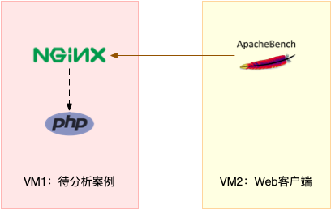
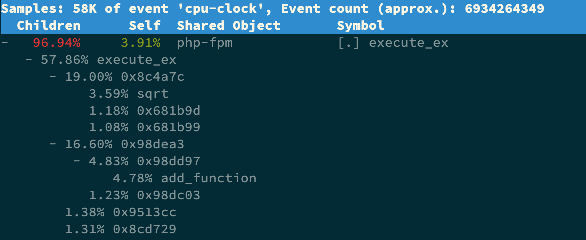
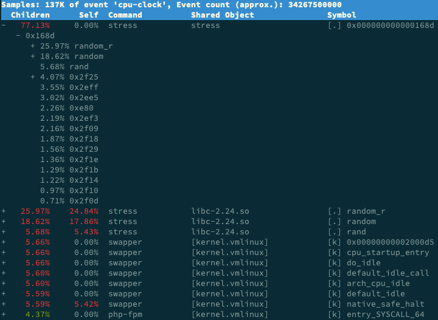

# CPU使用率高

## CPU使用率计算

为了维护 CPU 时间，Linux 通过事先定义的节拍率（内核中表示为 HZ），触发时间中断，并使用全局变量 Jiffies 记录了开机以来的节拍数。每发生一次时间中断，Jiffies 的值就加 1。

节拍率 HZ 是内核的可配选项，可以设置为 100、250、1000 等。不同的系统可能设置不同数值，你可以通过查询 /boot/config 内核选项来查看它的配置值。

```bash
$ grep 'CONFIG_HZ=' /boot/config-$(uname -r)
CONFIG_HZ=1000
```

同时，正因为节拍率 HZ 是内核选项，所以用户空间程序并不能直接访问。为了方便用户空间程序，内核还提供了一个用户空间节拍率 USER_HZ，它总是固定为 100，也就是 1/100 秒。这样，用户空间程序并不需要关心内核中 HZ 被设置成了多少，因为它看到的总是固定值 USER_HZ。

Linux 通过 /proc 虚拟文件系统，向用户空间提供了系统内部状态的信息，而 `/proc/stat` 提供的就是系统的 CPU 和任务统计信息。比方说，如果你只关注 CPU 的话，可以执行下面的命令：

```bash
$ cat /proc/stat | grep ^cpu
cpu  2312433 2098608 2066948 718638820 17264 0 16223 0 0 0
cpu0 1045913 1045837 1017014 359460725 7667 0 6056 0 0 0
cpu1 1266520 1052770 1049933 359178094 9596 0 10167 0 0 0
```

这里的输出结果是一个表格。其中，第一列表示的是 CPU 编号，如 cpu0、cpu1 ，而第一行没有编号的 cpu ，表示的是所有 CPU 的累加。其他列则表示不同场景下 CPU 的累加节拍数，它的单位是 USER_HZ，也就是 10 ms（1/100 秒），所以这其实就是不同场景下的 CPU 时间。

当然，这里每一列的顺序并不需要你背下来。你只要记住，有需要的时候，查询 man proc 就可以。不过，你要清楚 man proc 文档里每一列的涵义，它们都是 CPU 使用率相关的重要指标，你还会在很多其他的性能工具中看到它们。下面，我来依次解读一下。

| 字段                           | 解释                                                         |
| ------------------------------ | ------------------------------------------------------------ |
| user（通常缩写为 us）          | 代表用户态 CPU 时间。注意，它不包括下面的 nice 时间，但包括了 guest 时间。 |
| nice（通常缩写为 ni）          | 代表低优先级用户态 CPU 时间，也就是进程的 nice 值被调整为 1-19 之间时的 CPU 时间。这里注意，nice 可取值范围是 -20 到 19，数值越大，优先级反而越低。 |
| system（通常缩写为 sys）       | 代表内核态 CPU 时间。                                        |
| idle（通常缩写为 id）          | 代表空闲时间。注意，它不包括等待 I/O 的时间（iowait）。      |
| iowait（通常缩写为 wa）        | 代表等待 I/O 的 CPU 时                                       |
| irq（通常缩写为 hi）           | 代表处理硬中断的 CPU 时间。                                  |
| softirq（通常缩写为 si）       | 代表处理软中断的 CPU 时间。                                  |
| steal（通常缩写为 st）         | 代表当系统运行在虚拟机中的时候，被其他虚拟机占用的 CPU 时间。 |
| guest（通常缩写为 guest）      | 代表通过虚拟化运行其他操作系统的时间，也就是运行虚拟机的 CPU 时间。 |
| guest_nice（通常缩写为 gnice） | 代表以低优先级运行虚拟机的时间。                             |

而我们通常所说的 CPU 使用率，就是除了空闲时间外的其他时间占总 CPU 时间的百分比，用公式来表示就是：

```latex
CPU使用率 = 1 - 空闲时间/总CPU时间
```

根据这个公式，我们就可以从 /proc/stat 中的数据，很容易地计算出 CPU 使用率。当然，也可以用每一个场景的 CPU 时间，除以总的 CPU 时间，计算出每个场景的 CPU 使用率。

不过先不要着急计算，你能说出，直接用 /proc/stat 的数据，算的是什么时间段的 CPU 使用率吗？

看到这里，你应该想起来了，这是开机以来的节拍数累加值，所以直接算出来的，是开机以来的平均 CPU 使用率，一般没啥参考价值。

事实上，为了计算 CPU 使用率，性能工具一般都会取间隔一段时间（比如 3 秒）的两次值，作差后，再计算出这段时间内的平均 CPU 使用率，即

```latex
平均CPU使用率 = 1 - (空闲时间new - 空闲时间old) / (总CPU时间new - 总CPU时间old)
```

这个公式，就是我们用各种性能工具所看到的 CPU 使用率的实际计算方法。

现在，我们知道了系统 CPU 使用率的计算方法，那进程的呢？跟系统的指标类似，Linux 也给每个进程提供了运行情况的统计信息，也就是 /proc/[pid]/stat。不过，这个文件包含的数据就比较丰富了，总共有 52 列的数据。

当然，不用担心，因为你并不需要掌握每一列的含义。还是那句话，需要的时候，查 man proc 就行。

回过头来看，是不是说要查看 CPU 使用率，就必须先读取 /proc/stat 和 /proc/[pid]/stat 这两个文件，然后再按照上面的公式计算出来呢？

当然不是，各种各样的性能分析工具已经帮我们计算好了。不过要注意的是，性能分析工具给出的都是间隔一段时间的平均 CPU 使用率，所以要注意间隔时间的设置，特别是用多个工具对比分析时，你一定要保证它们用的是相同的间隔时间。

比如，对比一下 top 和 ps 这两个工具报告的 CPU 使用率，默认的结果很可能不一样，因为 top 默认使用 3 秒时间间隔，而 ps 使用的却是进程的整个生命周期。

## 怎么查看CPU使用率

使用top、ps、pidstat等性能分析工具

- top 显示了系统总体的 CPU 和内存使用情况，以及各个进程的CPU资源使用情况。
- ps 则只显示了每个进程的资源使用情况。

比如，top 的输出格式为：

```bash
# 默认每3秒刷新一次
$ top
top - 13:25:45 up 42 days,  2:19,  2 users,  load average: 0.00, 0.01, 0.05
Tasks: 121 total,   1 running, 120 sleeping,   0 stopped,   0 zombie
%Cpu(s):  0.0 us,  3.2 sy,  0.0 ni, 96.8 id,  0.0 wa,  0.0 hi,  0.0 si,  0.0 st
KiB Mem :  3881640 total,   190132 free,   460108 used,  3231400 buff/cache
KiB Swap:        0 total,        0 free,        0 used.  2998868 avail Mem

  PID USER      PR  NI    VIRT    RES    SHR S  %CPU %MEM     TIME+ COMMAND
    1 root      20   0  125604   3800   2252 S   0.0  0.1   8:15.65 systemd
    2 root      20   0       0      0      0 S   0.0  0.0   0:02.81 kthreadd
    3 root      20   0       0      0      0 S   0.0  0.0   0:14.25 ksoftirqd/0
    5 root       0 -20       0      0      0 S   0.0  0.0   0:00.00 kworker/0:0H

```

top 默认显示的是所有 CPU 的平均值，这个时候你只需要按下数字 1 ，就可以切换到每个 CPU 的使用率了。

空白行之后是进程的实时信息，每个进程都有一个 %CPU 列，表示进程的 CPU 使用率。它是用户态和内核态 CPU 使用率的总和，包括进程用户空间使用的 CPU、通过系统调用执行的内核空间 CPU 、以及在就绪队列等待运行的 CPU。在虚拟化环境中，它还包括了运行虚拟机占用的 CPU。

所以，到这里我们可以发现， top 并没有细分进程的用户态 CPU 和内核态 CPU。那要怎么查看每个进程的详细情况呢？你应该还记得上一节用到的 pidstat 吧，它正是一个专门分析每个进程 CPU 使用情况的工具。

比如，下面的 pidstat 命令，就间隔 1 秒展示了进程的 5 组 CPU 使用率，包括：

```bash
$ pidstat 1 5
Linux 3.10.0-693.el7.x86_64 (CentOS74)  02/02/2023      _x86_64_        (2 CPU)

01:27:40 PM   UID       PID    %usr %system  %guest    %CPU   CPU  Command
01:27:41 PM     0      1614    1.00    0.00    0.00    1.00     0  jdog-kunlunmirr
01:27:41 PM     0      8663    6.00    1.00    0.00    7.00     0  binlogd

01:27:41 PM   UID       PID    %usr %system  %guest    %CPU   CPU  Command
01:27:42 PM  1000      8650    1.00    0.00    0.00    1.00     1  pidstat

01:27:42 PM   UID       PID    %usr %system  %guest    %CPU   CPU  Command

01:27:43 PM   UID       PID    %usr %system  %guest    %CPU   CPU  Command

01:27:44 PM   UID       PID    %usr %system  %guest    %CPU   CPU  Command
01:27:45 PM     0      2666    0.00    1.00    0.00    1.00     0  MonitorPlugin
01:27:45 PM  1000      8650    0.00    1.00    0.00    1.00     1  pidstat
01:27:45 PM     0     23405    1.00    0.00    0.00    1.00     1  containerd

Average:      UID       PID    %usr %system  %guest    %CPU   CPU  Command
Average:        0      1614    0.20    0.00    0.00    0.20     -  jdog-kunlunmirr
Average:        0      2666    0.00    0.20    0.00    0.20     -  MonitorPlugin
Average:     1000      8650    0.20    0.20    0.00    0.40     -  pidstat
Average:        0     23405    0.20    0.00    0.00    0.20     -  containerd
```

| 字段    | 解释                  |
| ------- | --------------------- |
| %usr    | 用户态 CPU 使用率     |
| %system | 内核态 CPU 使用率     |
| %guest  | 运行虚拟机 CPU 使用率 |
| %CPU    | 以及总的 CPU 使用率   |

## CPU 使用率过高怎么办？

通过 top、ps、pidstat 等工具，你能够轻松找到 CPU 使用率较高（比如 100% ）的进程。接下来，你可能又想知道，占用 CPU 的到底是代码里的哪个函数呢？找到它，你才能更高效、更针对性地进行优化。

我猜你第一个想到的，应该是 GDB（The GNU Project Debugger）， 这个功能强大的程序调试利器。的确，GDB 在调试程序错误方面很强大。但是，我又要来“挑刺”了。请你记住，GDB 并不适合在性能分析的早期应用。

为什么呢？因为 GDB 调试程序的过程会中断程序运行，这在线上环境往往是不允许的。所以，GDB 只适合用在性能分析的后期，当你找到了出问题的大致函数后，线下再借助它来进一步调试函数内部的问题。

那么哪种工具适合在第一时间分析进程的 CPU 问题呢？我的推荐是 perf。perf 是 Linux 2.6.31 以后内置的性能分析工具。它以性能事件采样为基础，不仅可以分析系统的各种事件和内核性能，还可以用来分析指定应用程序的性能问题。

使用 perf 分析 CPU 性能问题，我来说两种最常见、也是我最喜欢的用法。

第一种常见用法是 perf top，类似于 top，它能够实时显示占用 CPU 时钟最多的函数或者指令，因此可以用来查找热点函数，使用界面如下所示：

```bash
$ perf top
Samples: 833  of event 'cpu-clock', Event count (approx.): 97742399
Overhead  Shared Object       Symbol
   7.28%  perf                [.] 0x00000000001f78a4
   4.72%  [kernel]            [k] vsnprintf
   4.32%  [kernel]            [k] module_get_kallsym
   3.65%  [kernel]            [k] _raw_spin_unlock_irqrestore
...
```

输出结果中，第一行包含三个数据，分别是采样数（Samples）、事件类型（event）和事件总数量（Event count）。比如这个例子中，perf 总共采集了 833 个 CPU 时钟事件，而总事件数则为 97742399。

另外，采样数需要我们特别注意。如果采样数过少（比如只有十几个），那下面的排序和百分比就没什么实际参考价值了。

再往下看是一个表格式样的数据，每一行包含四列，分别是：

| 字段     | 解释                                                         |
| -------- | ------------------------------------------------------------ |
| Overhead | 是该符号的性能事件在所有采样中的比例，用百分比来表示。       |
| Shared   | 是该函数或指令所在的动态共享对象（Dynamic Shared Object），如内核、进程名、动态链接库名、内核模块名等。 |
| Object   | 是动态共享对象的类型。比如 [.] 表示用户空间的可执行程序、或者动态链接库，而 [k] 则表示内核空间。 |
| Symbol   | 是符号名，也就是函数名。当函数名未知时，用十六进制的地址来表示。 |

还是以上面的输出为例，我们可以看到，占用 CPU 时钟最多的是 perf 工具自身，不过它的比例也只有 7.28%，说明系统并没有 CPU 性能问题。 perf top 的使用你应该很清楚了吧。

接着再来看第二种常见用法，也就是 `perf record` 和 `perf report`。 perf top 虽然实时展示了系统的性能信息，但它的缺点是并不保存数据，也就无法用于离线或者后续的分析。而 perf record 则提供了保存数据的功能，保存后的数据，需要你用 perf report 解析展示。

```bash
$ perf record # 按Ctrl+C终止采样
[ perf record: Woken up 1 times to write data ]
[ perf record: Captured and wrote 0.452 MB perf.data (6093 samples) ]

$ perf report # 展示类似于perf top的报告
```

在实际使用中，我们还经常为 perf top 和 perf record 加上 -g 参数，开启调用关系的采样，方便我们根据调用链来分析性能问题。

## 案例

### 环境准备

下面我们就以 Nginx + PHP 的 Web 服务为例，来看看当你发现 CPU 使用率过高的问题后，要怎么使用 top 等工具找出异常的进程，又要怎么利用 perf 找出引发性能问题的函数。

以下案例基于 Ubuntu 18.04，同样适用于其他的 Linux 系统。我使用的案例环境如下所示：

- 机器配置：2 CPU，8GB 内存
- 预先安装 docker、sysstat、perf、ab 等工具，如 `apt install docker.io sysstat linux-tools-common apache2-utils`

我先简单介绍一下这次新使用的工具 ab。ab（apache bench）是一个常用的 HTTP 服务性能测试工具，这里用来模拟 Ngnix 的客户端。由于 Nginx 和 PHP 的配置比较麻烦，我把它们打包成了两个 Docker 镜像，这样只需要运行两个容器，就可以得到模拟环境。

注意，这个案例要用到两台虚拟机，如下图所示：



你可以看到，其中一台用作 Web 服务器，来模拟性能问题；另一台用作 Web 服务器的客户端，来给 Web 服务增加压力请求。使用两台虚拟机是为了相互隔离，避免“交叉感染”。

接下来，我们打开两个终端，分别 SSH 登录到两台机器上，并安装上面提到的工具。

还是同样的“配方”。下面的所有命令，都默认假设以 root 用户运行，如果你是普通用户身份登陆系统，一定要先运行 `sudo su root` 命令切换到 root 用户。到这里，准备工作就完成了。

不过，操作之前，我还想再说一点。这次案例中 PHP 应用的核心逻辑比较简单，大部分人一眼就可以看出问题，但你要知道，实际生产环境中的源码就复杂多了。

所以，我希望你在按照步骤操作之前，先不要查看源码（避免先入为主），而是把它当成一个黑盒来分析。这样，你可以更好地理解整个解决思路，怎么从系统的资源使用问题出发，分析出瓶颈所在的应用、以及瓶颈在应用中的大概位置。

### 操作和分析

首先，在第一个终端执行下面的命令来运行 Nginx 和 PHP 应用：

```bash
$ docker run --name nginx -p 10000:80 -itd feisky/nginx
$ docker run --name phpfpm -itd --network container:nginx feisky/php-fpm
```

然后，在第二个终端使用 curl 访问 http://[VM1 的 IP]:10000，确认 Nginx 已正常启动。你应该可以看到 It works! 的响应。

```bash
# 192.168.0.10是第一台虚拟机的IP地址
$ curl http://192.168.0.10:10000/
It works!
```

接着，我们来测试一下这个 Nginx 服务的性能。在第二个终端运行下面的 ab 命令：

```bash
# 并发10个请求测试Nginx性能，总共测试100个请求
$ ab -c 10 -n 100 http://192.168.0.10:10000/
This is ApacheBench, Version 2.3 <$Revision: 1706008 $>
Copyright 1996 Adam Twiss, Zeus Technology Ltd, 
...
Requests per second:    11.63 [#/sec] (mean)
Time per request:       859.942 [ms] (mean)
...
```

从 ab 的输出结果我们可以看到，Nginx 能承受的每秒平均请求数只有 11.63。你一定在吐槽，这也太差了吧。那到底是哪里出了问题呢？我们用 top 和 pidstat 再来观察下。

这次，我们在第二个终端，将测试的请求总数增加到 10000。这样当你在第一个终端使用性能分析工具时， Nginx 的压力还是继续。

继续在第二个终端，运行 ab 命令：

```bash
$ ab -c 10 -n 10000 http://192.168.0.10:10000/
```

接着，回到第一个终端运行 top 命令，并按下数字 1 ，切换到每个 CPU 的使用率：

```bash
$ top
...
%Cpu0  : 98.7 us,  1.3 sy,  0.0 ni,  0.0 id,  0.0 wa,  0.0 hi,  0.0 si,  0.0 st
%Cpu1  : 99.3 us,  0.7 sy,  0.0 ni,  0.0 id,  0.0 wa,  0.0 hi,  0.0 si,  0.0 st
...
  PID USER      PR  NI    VIRT    RES    SHR S  %CPU %MEM     TIME+ COMMAND
21514 daemon    20   0  336696  16384   8712 R  41.9  0.2   0:06.00 php-fpm
21513 daemon    20   0  336696  13244   5572 R  40.2  0.2   0:06.08 php-fpm
21515 daemon    20   0  336696  16384   8712 R  40.2  0.2   0:05.67 php-fpm
21512 daemon    20   0  336696  13244   5572 R  39.9  0.2   0:05.87 php-fpm
21516 daemon    20   0  336696  16384   8712 R  35.9  0.2   0:05.61 php-fpm
```

这里可以看到，系统中有几个 php-fpm 进程的 CPU 使用率加起来接近 200%；而每个 CPU 的用户使用率（us）也已经超过了 98%，接近饱和。这样，我们就可以确认，正是用户空间的 php-fpm 进程，导致 CPU 使用率骤升。

那再往下走，怎么知道是 php-fpm 的哪个函数导致了 CPU 使用率升高呢？我们来用 perf 分析一下。在第一个终端运行下面的 perf 命令：

```bash
# -g开启调用关系分析，-p指定php-fpm的进程号21515
$ perf top -g -p 21515
```

按方向键切换到 php-fpm，再按下回车键展开 php-fpm 的调用关系，你会发现，调用关系最终到了 sqrt 和 add_function。看来，我们需要从这两个函数入手了。



我们拷贝出 Nginx 应用的源码，看看是不是调用了这两个函数：

```bash
# 从容器phpfpm中将PHP源码拷贝出来
$ docker cp phpfpm:/app .

# 使用grep查找函数调用
$ grep sqrt -r app/ #找到了sqrt调用
app/index.php:  $x += sqrt($x);
$ grep add_function -r app/ #没找到add_function调用，这其实是PHP内置函数
```

OK，原来只有 sqrt 函数在 app/index.php 文件中调用了。那最后一步，我们就该看看这个文件的源码了：

```bash
$ cat app/index.php
<?php
// test only.
$x = 0.0001;
for ($i = 0; $i <= 1000000; $i++) {
  $x += sqrt($x);
}

echo "It works!"
```

呀，有没有发现问题在哪里呢？我想你要笑话我了，居然犯了一个这么傻的错误，测试代码没删就直接发布应用了。为了方便你验证优化后的效果，我把修复后的应用也打包成了一个 Docker 镜像，你可以在第一个终端中执行下面的命令来运行它：

```bash
# 停止原来的应用
$ docker rm -f nginx phpfpm
# 运行优化后的应用
$ docker run --name nginx -p 10000:80 -itd feisky/nginx:cpu-fix
$ docker run --name phpfpm -itd --network container:nginx feisky/php-fpm:cpu-fix
```

接着，到第二个终端来验证一下修复后的效果。首先 Ctrl+C 停止之前的 ab 命令后，再运行下面的命令：

```bash
$ ab -c 10 -n 10000 http://10.240.0.5:10000/
...
Complete requests:      10000
Failed requests:        0
Total transferred:      1720000 bytes
HTML transferred:       90000 bytes
Requests per second:    2237.04 [#/sec] (mean)
Time per request:       4.470 [ms] (mean)
Time per request:       0.447 [ms] (mean, across all concurrent requests)
Transfer rate:          375.75 [Kbytes/sec] received
...
```

从这里你可以发现，现在每秒的平均请求数，已经从原来的 11 变成了 2237。

你看，就是这么很傻的一个小问题，却会极大的影响性能，并且查找起来也并不容易吧。当然，找到问题后，解决方法就简单多了，删除测试代码就可以了。

## CPU使用率高但是找不到占用CPU的进程

我们知道，系统的 CPU 使用率，不仅包括进程用户态和内核态的运行，还包括中断处理、等待 I/O 以及内核线程等。所以，当你发现系统的 CPU 使用率很高的时候，不一定能找到相对应的高 CPU 使用率的进程。

### 操作和分析

首先，我们在第一个终端，执行下面的命令运行 Nginx 和 PHP 应用：

```bash
$ docker run --name nginx -p 10000:80 -itd feisky/nginx:sp
$ docker run --name phpfpm -itd --network container:nginx feisky/php-fpm:sp
```

然后，在第二个终端，使用 curl 访问 http://[VM1 的 IP]:10000，确认 Nginx 已正常启动。你应该可以看到 It works! 的响应。

```bash
# 192.168.0.10是第一台虚拟机的IP地址
$ curl http://192.168.0.10:10000/
It works!
```

接着，我们来测试一下这个 Nginx 服务的性能。在第二个终端运行下面的 ab 命令。要注意，与上次操作不同的是，这次我们需要并发 100 个请求测试 Nginx 性能，总共测试 1000 个请求。

```bash
# 并发100个请求测试Nginx性能，总共测试1000个请求
$ ab -c 100 -n 1000 http://192.168.0.10:10000/
This is ApacheBench, Version 2.3 <$Revision: 1706008 $>
Copyright 1996 Adam Twiss, Zeus Technology Ltd, 
...
Requests per second:    87.86 [#/sec] (mean)
Time per request:       1138.229 [ms] (mean)
...
```

从 ab 的输出结果我们可以看到，Nginx 能承受的每秒平均请求数，只有 87 多一点，是不是感觉它的性能有点差呀。那么，到底是哪里出了问题呢？我们再用 top 和 pidstat 来观察一下。

这次，我们在第二个终端，将测试的并发请求数改成 5，同时把请求时长设置为 10 分钟（-t 600）。这样，当你在第一个终端使用性能分析工具时， Nginx 的压力还是继续的。

继续在第二个终端运行 ab 命令：

```bash
$ ab -c 5 -t 600 http://192.168.0.10:10000/
```

然后，我们在第一个终端运行 top 命令，观察系统的 CPU 使用情况：

```bash
$ top
...
%Cpu(s): 80.8 us, 15.1 sy,  0.0 ni,  2.8 id,  0.0 wa,  0.0 hi,  1.3 si,  0.0 st
...

  PID USER      PR  NI    VIRT    RES    SHR S  %CPU %MEM     TIME+ COMMAND
 6882 root      20   0    8456   5052   3884 S   2.7  0.1   0:04.78 docker-containe
 6947 systemd+  20   0   33104   3716   2340 S   2.7  0.0   0:04.92 nginx
 7494 daemon    20   0  336696  15012   7332 S   2.0  0.2   0:03.55 php-fpm
 7495 daemon    20   0  336696  15160   7480 S   2.0  0.2   0:03.55 php-fpm
10547 daemon    20   0  336696  16200   8520 S   2.0  0.2   0:03.13 php-fpm
10155 daemon    20   0  336696  16200   8520 S   1.7  0.2   0:03.12 php-fpm
10552 daemon    20   0  336696  16200   8520 S   1.7  0.2   0:03.12 php-fpm
15006 root      20   0 1168608  66264  37536 S   1.0  0.8   9:39.51 dockerd
 4323 root      20   0       0      0      0 I   0.3  0.0   0:00.87 kworker/u4:1
...
```

观察 top 输出的进程列表可以发现，CPU 使用率最高的进程也只不过才 2.7%，看起来并不高。

然而，再看系统 CPU 使用率（ %Cpu ）这一行，你会发现，系统的整体 CPU 使用率是比较高的：用户 CPU 使用率（us）已经到了 80%，系统 CPU 为 15.1%，而空闲 CPU （id）则只有 2.8%。

为什么用户 CPU 使用率这么高呢？我们再重新分析一下进程列表，看看有没有可疑进程：

- docker-containerd 进程是用来运行容器的，2.7% 的 CPU 使用率看起来正常；
- Nginx 和 php-fpm 是运行 Web 服务的，它们会占用一些 CPU 也不意外，并且 2% 的 CPU 使用率也不算高；
- 再往下看，后面的进程呢，只有 0.3% 的 CPU 使用率，看起来不太像会导致用户 CPU 使用率达到 80%。

那就奇怪了，明明用户 CPU 使用率都 80% 了，可我们挨个分析了一遍进程列表，还是找不到高 CPU 使用率的进程。看来 top 是不管用了，那还有其他工具可以查看进程 CPU 使用情况吗？不知道你记不记得我们的老朋友 pidstat，它可以用来分析进程的 CPU 使用情况。

接下来，我们还是在第一个终端，运行 pidstat 命令：

```bash
# 间隔1秒输出一组数据（按Ctrl+C结束）
$ pidstat 1
...
04:36:24      UID       PID    %usr %system  %guest   %wait    %CPU   CPU  Command
04:36:25        0      6882    1.00    3.00    0.00    0.00    4.00     0  docker-containe
04:36:25      101      6947    1.00    2.00    0.00    1.00    3.00     1  nginx
04:36:25        1     14834    1.00    1.00    0.00    1.00    2.00     0  php-fpm
04:36:25        1     14835    1.00    1.00    0.00    1.00    2.00     0  php-fpm
04:36:25        1     14845    0.00    2.00    0.00    2.00    2.00     1  php-fpm
04:36:25        1     14855    0.00    1.00    0.00    1.00    1.00     1  php-fpm
04:36:25        1     14857    1.00    2.00    0.00    1.00    3.00     0  php-fpm
04:36:25        0     15006    0.00    1.00    0.00    0.00    1.00     0  dockerd
04:36:25        0     15801    0.00    1.00    0.00    0.00    1.00     1  pidstat
04:36:25        1     17084    1.00    0.00    0.00    2.00    1.00     0  stress
04:36:25        0     31116    0.00    1.00    0.00    0.00    1.00     0  atopacctd
...
```

观察一会儿，你是不是发现，所有进程的 CPU 使用率也都不高啊，最高的 Docker 和 Nginx 也只有 4% 和 3%，即使所有进程的 CPU 使用率都加起来，也不过是 21%，离 80% 还差得远呢！

后来我发现，会出现这种情况，很可能是因为前面的分析漏了一些关键信息。你可以先暂停一下，自己往上翻，重新操作检查一遍。或者，我们一起返回去分析 top 的输出，看看能不能有新发现。

现在，我们回到第一个终端，重新运行 top 命令，并观察一会儿：

```bash
$ top
top - 04:58:24 up 14 days, 15:47,  1 user,  load average: 3.39, 3.82, 2.74
Tasks: 149 total,   6 running,  93 sleeping,   0 stopped,   0 zombie
%Cpu(s): 77.7 us, 19.3 sy,  0.0 ni,  2.0 id,  0.0 wa,  0.0 hi,  1.0 si,  0.0 st
KiB Mem :  8169348 total,  2543916 free,   457976 used,  5167456 buff/cache
KiB Swap:        0 total,        0 free,        0 used.  7363908 avail Mem

  PID USER      PR  NI    VIRT    RES    SHR S  %CPU %MEM     TIME+ COMMAND
 6947 systemd+  20   0   33104   3764   2340 S   4.0  0.0   0:32.69 nginx
 6882 root      20   0   12108   8360   3884 S   2.0  0.1   0:31.40 docker-containe
15465 daemon    20   0  336696  15256   7576 S   2.0  0.2   0:00.62 php-fpm
15466 daemon    20   0  336696  15196   7516 S   2.0  0.2   0:00.62 php-fpm
15489 daemon    20   0  336696  16200   8520 S   2.0  0.2   0:00.62 php-fpm
 6948 systemd+  20   0   33104   3764   2340 S   1.0  0.0   0:00.95 nginx
15006 root      20   0 1168608  65632  37536 S   1.0  0.8   9:51.09 dockerd
15476 daemon    20   0  336696  16200   8520 S   1.0  0.2   0:00.61 php-fpm
15477 daemon    20   0  336696  16200   8520 S   1.0  0.2   0:00.61 php-fpm
24340 daemon    20   0    8184   1616    536 R   1.0  0.0   0:00.01 stress
24342 daemon    20   0    8196   1580    492 R   1.0  0.0   0:00.01 stress
24344 daemon    20   0    8188   1056    492 R   1.0  0.0   0:00.01 stress
24347 daemon    20   0    8184   1356    540 R   1.0  0.0   0:00.01 stress
...
```

这次从头开始看 top 的每行输出，咦？Tasks 这一行看起来有点奇怪，就绪队列中居然有 6 个 Running 状态的进程（6 running），是不是有点多呢？

回想一下 ab 测试的参数，并发请求数是 5。再看进程列表里， php-fpm 的数量也是 5，再加上 Nginx，好像同时有 6 个进程也并不奇怪。但真的是这样吗？

再仔细看进程列表，这次主要看 Running（R） 状态的进程。你有没有发现， Nginx 和所有的 php-fpm 都处于 Sleep（S）状态，而真正处于 Running（R）状态的，却是几个 stress 进程。这几个 stress 进程就比较奇怪了，需要我们做进一步的分析。

我们还是使用 pidstat 来分析这几个进程，并且使用 -p 选项指定进程的 PID。首先，从上面 top 的结果中，找到这几个进程的 PID。比如，先随便找一个 24344，然后用 pidstat 命令看一下它的 CPU 使用情况：

```bash
$ pidstat -p 24344

16:14:55      UID       PID    %usr %system  %guest   %wait    %CPU   CPU  Command
```

奇怪，居然没有任何输出。难道是 pidstat 命令出问题了吗？之前我说过，在怀疑性能工具出问题前，最好还是先用其他工具交叉确认一下。那用什么工具呢？ ps 应该是最简单易用的。我们在终端里运行下面的命令，看看 24344 进程的状态：

```bash
# 从所有进程中查找PID是24344的进程
$ ps aux | grep 24344
root      9628  0.0  0.0  14856  1096 pts/0    S+   16:15   0:00 grep --color=auto 24344
```

还是没有输出。现在终于发现问题，原来这个进程已经不存在了，所以 pidstat 就没有任何输出。既然进程都没了，那性能问题应该也跟着没了吧。我们再用 top 命令确认一下：

```bash
$ top
...
%Cpu(s): 80.9 us, 14.9 sy,  0.0 ni,  2.8 id,  0.0 wa,  0.0 hi,  1.3 si,  0.0 st
...

  PID USER      PR  NI    VIRT    RES    SHR S  %CPU %MEM     TIME+ COMMAND
 6882 root      20   0   12108   8360   3884 S   2.7  0.1   0:45.63 docker-containe
 6947 systemd+  20   0   33104   3764   2340 R   2.7  0.0   0:47.79 nginx
 3865 daemon    20   0  336696  15056   7376 S   2.0  0.2   0:00.15 php-fpm
  6779 daemon    20   0    8184   1112    556 R   0.3  0.0   0:00.01 stress
...
```

好像又错了。结果还跟原来一样，用户 CPU 使用率还是高达 80.9%，系统 CPU 接近 15%，而空闲 CPU 只有 2.8%，Running 状态的进程有 Nginx、stress 等。

可是，刚刚我们看到 stress 进程不存在了，怎么现在还在运行呢？再细看一下 top 的输出，原来，这次 stress 进程的 PID 跟前面不一样了，原来的 PID 24344 不见了，现在的是 6779。

进程的 PID 在变，这说明什么呢？在我看来，要么是这些进程在不停地重启，要么就是全新的进程，这无非也就两个原因：

- 第一个原因，进程在不停地崩溃重启，比如因为段错误、配置错误等等，这时，进程在退出后可能又被监控系统自动重启了。
- 第二个原因，这些进程都是短时进程，也就是在其他应用内部通过 exec 调用的外面命令。这些命令一般都只运行很短的时间就会结束，你很难用 top 这种间隔时间比较长的工具发现（上面的案例，我们碰巧发现了）。

至于 stress，我们前面提到过，它是一个常用的压力测试工具。它的 PID 在不断变化中，看起来像是被其他进程调用的短时进程。要想继续分析下去，还得找到它们的父进程。

要怎么查找一个进程的父进程呢？没错，用 pstree 就可以用树状形式显示所有进程之间的关系：

```bash
$ pstree | grep stress
        |-docker-containe-+-php-fpm-+-php-fpm---sh---stress
        |         |-3*[php-fpm---sh---stress---stress]
```

从这里可以看到，stress 是被 php-fpm 调用的子进程，并且进程数量不止一个（这里是 3 个）。找到父进程后，我们能进入 app 的内部分析了。

首先，当然应该去看看它的源码。运行下面的命令，把案例应用的源码拷贝到 app 目录，然后再执行 grep 查找是不是有代码再调用 stress 命令：

```bash
# 拷贝源码到本地
$ docker cp phpfpm:/app .

# grep 查找看看是不是有代码在调用stress命令
$ grep stress -r app
app/index.php:// fake I/O with stress (via write()/unlink()).
app/index.php:$result = exec("/usr/local/bin/stress -t 1 -d 1 2>&1", $output, $status);
```

找到了，果然是 app/index.php 文件中直接调用了 stress 命令。

再来看看 app/index.php 的源代码：

```bash
$ cat app/index.php
<?php
// fake I/O with stress (via write()/unlink()).
$result = exec("/usr/local/bin/stress -t 1 -d 1 2>&1", $output, $status);
if (isset($_GET["verbose"]) && $_GET["verbose"]==1 && $status != 0) {
  echo "Server internal error: ";
  print_r($output);
} else {
  echo "It works!";
}
?>
```

可以看到，源码里对每个请求都会调用一个 stress 命令，模拟 I/O 压力。从注释上看，stress 会通过 write() 和 unlink() 对 I/O 进程进行压测，看来，这应该就是系统 CPU 使用率升高的根源了。

不过，stress 模拟的是 I/O 压力，而之前在 top 的输出中看到的，却一直是用户 CPU 和系统 CPU 升高，并没见到 iowait 升高。这又是怎么回事呢？stress 到底是不是 CPU 使用率升高的原因呢？

我们还得继续往下走。从代码中可以看到，给请求加入 verbose=1 参数后，就可以查看 stress 的输出。你先试试看，在第二个终端运行：

```bash
$ curl http://192.168.0.10:10000?verbose=1
Server internal error: Array
(
    [0] => stress: info: [19607] dispatching hogs: 0 cpu, 0 io, 0 vm, 1 hdd
    [1] => stress: FAIL: [19608] (563) mkstemp failed: Permission denied
    [2] => stress: FAIL: [19607] (394) <-- worker 19608 returned error 1
    [3] => stress: WARN: [19607] (396) now reaping child worker processes
    [4] => stress: FAIL: [19607] (400) kill error: No such process
    [5] => stress: FAIL: [19607] (451) failed run completed in 0s
)
```

看错误消息 **mkstemp failed: Permission denied** ，以及 **failed run completed in 0s**。原来 stress 命令并没有成功，它因为权限问题失败退出了。看来，我们发现了一个 PHP 调用外部 stress 命令的 bug：没有权限创建临时文件。

从这里我们可以猜测，正是由于权限错误，大量的 stress 进程在启动时初始化失败，进而导致用户 CPU 使用率的升高。

分析出问题来源，下一步是不是就要开始优化了呢？当然不是！既然只是猜测，那就需要再确认一下，这个猜测到底对不对，是不是真的有大量的 stress 进程。该用什么工具或指标呢？

我们前面已经用了 top、pidstat、pstree 等工具，没有发现大量的 stress 进程。那么，还有什么其他的工具可以用吗？

还记得上一期提到的 perf 吗？它可以用来分析 CPU 性能事件，用在这里就很合适。依旧在第一个终端中运行 perf record -g 命令 ，并等待一会儿（比如 15 秒）后按 Ctrl+C 退出。然后再运行 perf report 查看报告：

```bash
# 记录性能事件，等待大约15秒后按 Ctrl+C 退出
$ perf record -g

# 查看报告
$ perf report
```

这样，你就可以看到下图这个性能报告：



你看，stress 占了所有 CPU 时钟事件的 77%，而 stress 调用调用栈中比例最高的，是随机数生成函数 random()，看来它的确就是 CPU 使用率升高的元凶了。随后的优化就很简单了，只要修复权限问题，并减少或删除 stress 的调用，就可以减轻系统的 CPU 压力。

当然，实际生产环境中的问题一般都要比这个案例复杂，在你找到触发瓶颈的命令行后，却可能发现，这个外部命令的调用过程是应用核心逻辑的一部分，并不能轻易减少或者删除。

这时，你就得继续排查，为什么被调用的命令，会导致 CPU 使用率升高或 I/O 升高等问题。

最后，在案例结束时，不要忘了清理环境，执行下面的 Docker 命令，停止案例中用到的 Nginx 进程：

```bash
$ docker rm -f nginx phpfpm
```

### execsnoop

在这个案例中，我们使用了 top、pidstat、pstree 等工具分析了系统 CPU 使用率高的问题，并发现 CPU 升高是短时进程 stress 导致的，但是整个分析过程还是比较复杂的。对于这类问题，有没有更好的方法监控呢？

execsnoop 就是一个专为短时进程设计的工具。它通过 ftrace 实时监控进程的 exec() 行为，并输出短时进程的基本信息，包括进程 PID、父进程 PID、命令行参数以及执行的结果。

比如，用 execsnoop 监控上述案例，就可以直接得到 stress 进程的父进程 PID 以及它的命令行参数，并可以发现大量的 stress 进程在不停启动：

```bash
# 按 Ctrl+C 结束
$ execsnoop
PCOMM            PID    PPID   RET ARGS
sh               30394  30393    0
stress           30396  30394    0 /usr/local/bin/stress -t 1 -d 1
sh               30398  30393    0
stress           30399  30398    0 /usr/local/bin/stress -t 1 -d 1
sh               30402  30400    0
stress           30403  30402    0 /usr/local/bin/stress -t 1 -d 1
sh               30405  30393    0
stress           30407  30405    0 /usr/local/bin/stress -t 1 -d 1
...
```

execsnoop 所用的 ftrace 是一种常用的动态追踪技术，一般用于分析 Linux 内核的运行时行为。