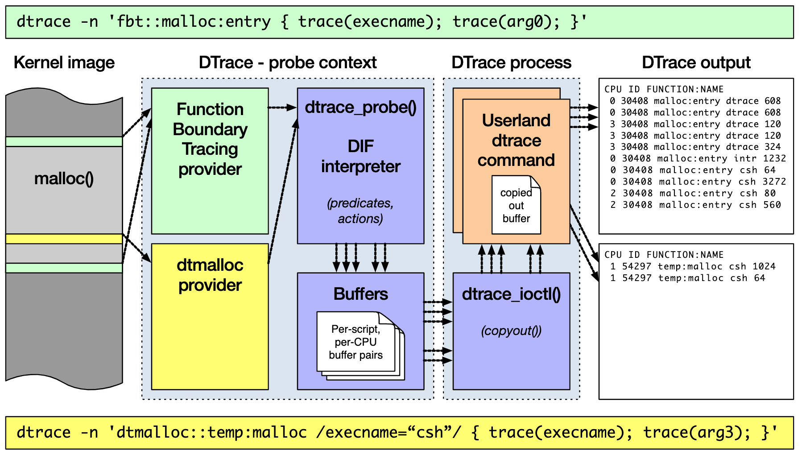
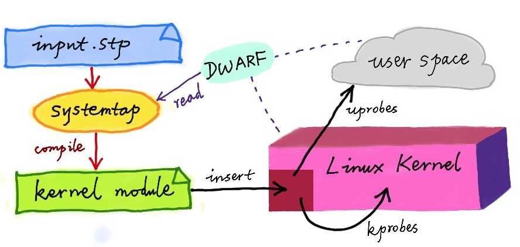
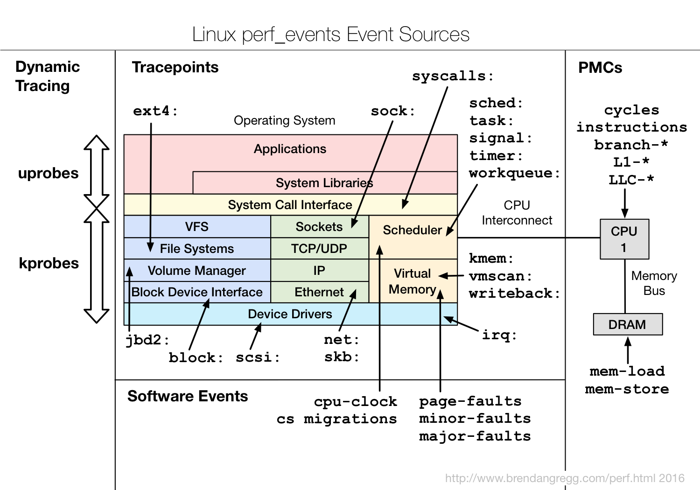
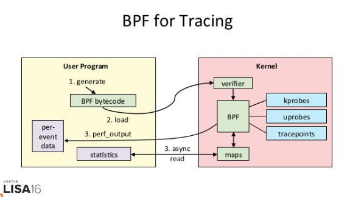
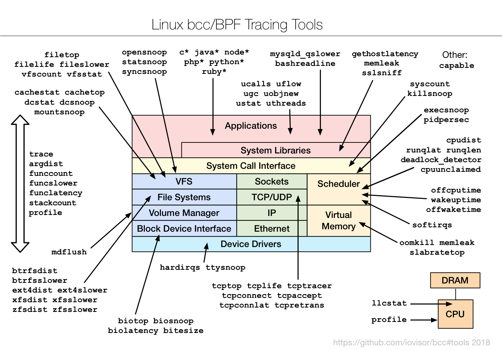
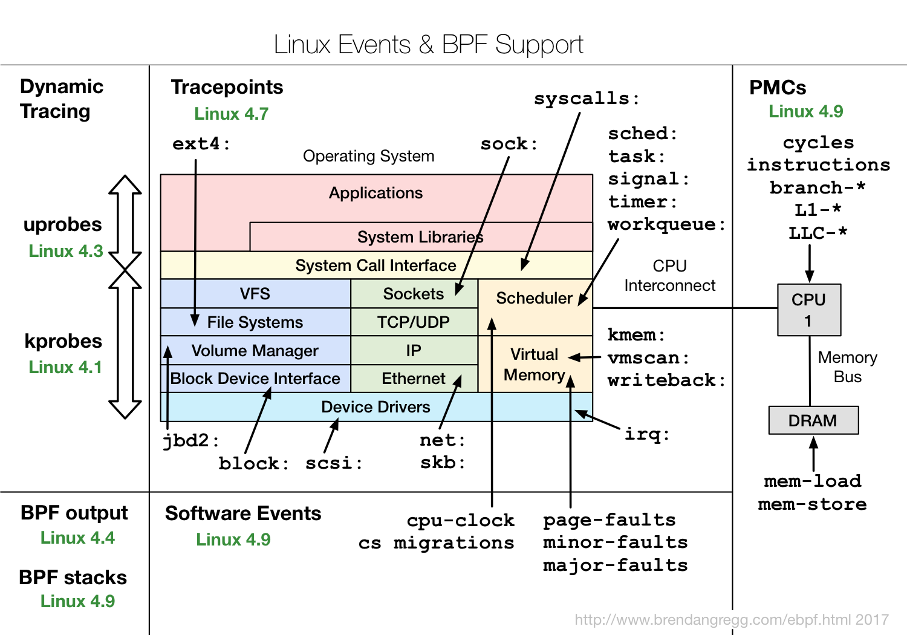
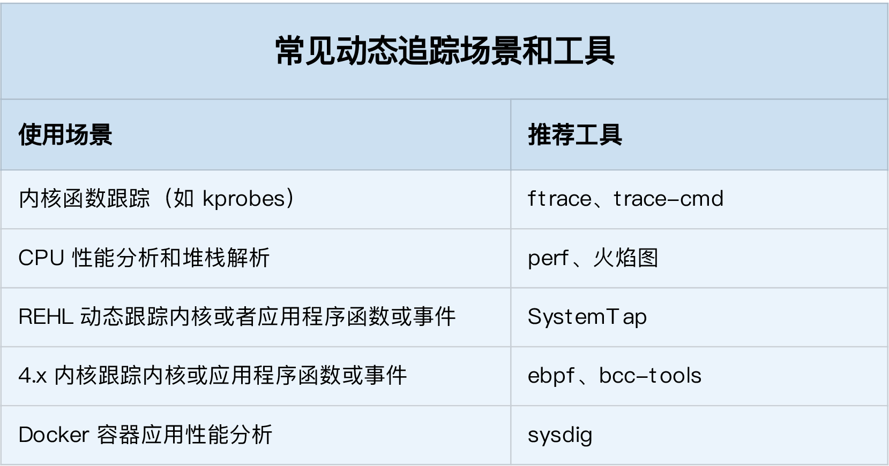

# 动态追踪怎么用

当碰到内核线程的资源使用异常时，很多常用的进程级性能工具，并不能直接用到内核线程上。这时，我们就可以使用内核自带的 perf 来观察它们的行为，找出热点函数，进一步定位性能瓶颈。不过，perf 产生的汇总报告并不直观，所以我通常也推荐用火焰图来协助排查。

其实，使用 perf 对系统内核线程进行分析时，内核线程依然还在正常运行中，所以这种方法也被称为动态追踪技术。

**动态追踪技术，通过探针机制，来采集内核或者应用程序的运行信息，从而可以不用修改内核和应用程序的代码，就获得丰富的信息，帮你分析、定位想要排查的问题。**

以往，在排查和调试性能问题时，我们往往需要先为应用程序设置一系列的断点（比如使用 GDB），然后以手动或者脚本（比如 GDB 的 Python 扩展）的方式，在这些断点处分析应用程序的状态。或者，增加一系列的日志，从日志中寻找线索。

不过，断点往往会中断应用的正常运行；而增加新的日志，往往需要重新编译和部署。这些方法虽然在今天依然广泛使用，但在排查复杂的性能问题时，往往耗时耗力，更会对应用的正常运行造成巨大影响。

此外，这类方式还有大量的性能问题。比如，出现的概率小，只有线上环境才能碰到。这种难以复现的问题，亦是一个巨大挑战。

而动态追踪技术的出现，就为这些问题提供了完美的方案：它既不需要停止服务，也不需要修改应用程序的代码；所有一切还按照原来的方式正常运行时，就可以帮你分析出问题的根源。

同时，相比以往的进程级跟踪方法（比如 ptrace），动态追踪往往只会带来很小的性能损耗（通常在 5% 或者更少）。

既然动态追踪有这么多好处，那么，都有哪些动态追踪的方法，又该如何使用这些动态追踪方法呢？今天，我就带你一起来看看这个问题。

## 动态追踪

说到动态追踪（Dynamic Tracing），就不得不提源于 Solaris 系统的 DTrace。DTrace 是动态追踪技术的鼻祖，它提供了一个通用的观测框架，并可以使用 D 语言进行自由扩展。

DTrace 的工作原理如下图所示。**它的运行常驻在内核中，用户可以通过 dtrace 命令，把 D 语言编写的追踪脚本，提交到内核中的运行时来执行**。DTrace 可以跟踪用户态和内核态的所有事件，并通过一些列的优化措施，保证最小的性能开销。



虽然直到今天，DTrace 本身依然无法在 Linux 中运行，但它同样对 Linux 动态追踪产生了巨大的影响。很多工程师都尝试过把 DTrace 移植到 Linux 中，这其中，最著名的就是 RedHat 主推的 SystemTap。

同 DTrace 一样，SystemTap 也定义了一种类似的脚本语言，方便用户根据需要自由扩展。不过，不同于 DTrace，SystemTap 并没有常驻内核的运行时，它需要先把脚本编译为内核模块，然后再插入到内核中执行。这也导致 SystemTap 启动比较缓慢，并且依赖于完整的调试符号表。



总的来说，为了追踪内核或用户空间的事件，Dtrace 和 SystemTap 都会把用户传入的追踪处理函数（一般称为 Action），关联到被称为探针的检测点上。这些探针，实际上也就是各种动态追踪技术所依赖的事件源。

## 动态追踪的事件源

根据事件类型的不同，动态追踪所使用的事件源，可以分为静态探针、动态探针以及硬件事件等三类。它们的关系如下图所示：



其中，**硬件事件通常由性能监控计数器 PMC（Performance Monitoring Counter）产生**，包括了各种硬件的性能情况，比如 CPU 的缓存、指令周期、分支预测等等。

**静态探针，是指事先在代码中定义好，并编译到应用程序或者内核中的探针**。这些探针只有在开启探测功能时，才会被执行到；未开启时并不会执行。常见的静态探针包括内核中的跟踪点（tracepoints）和 USDT（Userland Statically Defined Tracing）探针。

- 跟踪点（tracepoints），实际上就是在源码中插入的一些带有控制条件的探测点，这些探测点允许事后再添加处理函数。比如在内核中，最常见的静态跟踪方法就是 printk，即输出日志。Linux 内核定义了大量的跟踪点，可以通过内核编译选项，来开启或者关闭。
- USDT 探针，全称是用户级静态定义跟踪，需要在源码中插入 DTRACE_PROBE() 代码，并编译到应用程序中。不过，也有很多应用程序内置了 USDT 探针，比如 MySQL、PostgreSQL 等。

**动态探针，则是指没有事先在代码中定义，但却可以在运行时动态添加的探针**，比如函数的调用和返回等。动态探针支持按需在内核或者应用程序中添加探测点，具有更高的灵活性。常见的动态探针有两种，即用于内核态的 kprobes 和用于用户态的 uprobes。

- kprobes 用来跟踪内核态的函数，包括用于函数调用的 kprobe 和用于函数返回的 kretprobe。
- uprobes 用来跟踪用户态的函数，包括用于函数调用的 uprobe 和用于函数返回的 uretprobe。

> 注意，kprobes 需要内核编译时开启 CONFIG_KPROBE_EVENTS；而 uprobes 则需要内核编译时开启 CONFIG_UPROBE_EVENTS。

## 动态追踪机制

而在这些探针的基础上，Linux 也提供了一系列的动态追踪机制，比如 ftrace、perf、eBPF 等。

**ftrace** 最早用于函数跟踪，后来又扩展支持了各种事件跟踪功能。ftrace 的使用接口跟我们之前提到的 procfs 类似，它通过 debugfs（4.1 以后也支持 tracefs），以普通文件的形式，向用户空间提供访问接口。

这样，不需要额外的工具，你就可以通过挂载点（通常为 /sys/kernel/debug/tracing 目录）内的文件读写，来跟 ftrace 交互，跟踪内核或者应用程序的运行事件。

**perf** 是我们的老朋友了，这实际上只是一种最简单的静态跟踪机制。你也可以通过 perf ，来自定义动态事件（perf probe），只关注真正感兴趣的事件。

**eBPF** 则在 BPF（Berkeley Packet Filter）的基础上扩展而来，不仅支持事件跟踪机制，还可以通过自定义的 BPF 代码（使用 C 语言）来自由扩展。所以，eBPF 实际上就是常驻于内核的运行时，可以说就是 Linux 版的 DTrace。

除此之外，还有很多内核外的工具，也提供了丰富的动态追踪功能。最常见的就是前面提到的 **SystemTap**，我们之前多次使用过的 **BCC**（BPF Compiler Collection），以及常用于容器性能分析的 **sysdig** 等。

而在分析大量事件时，使用火焰图，可以将大量数据可视化展示，让你更直观发现潜在的问题。

接下来，我就通过几个例子，带你来看看，要怎么使用这些机制，来动态追踪内核和应用程序的执行情况。以下案例还是基于 Ubuntu 18.04 系统，同样适用于其他系统。

## ftrace

我们先来看 ftrace。刚刚提到过，ftrace 通过 debugfs（或者 tracefs），为用户空间提供接口。所以使用 ftrace，往往是从切换到 debugfs 的挂载点开始。

```bash
$ cd /sys/kernel/debug/tracing
$ ls
README                      instances            set_ftrace_notrace  trace_marker_raw
available_events            kprobe_events        set_ftrace_pid      trace_options
...
```

如果这个目录不存在，则说明你的系统还没有挂载 debugfs，你可以执行下面的命令来挂载它：

```bash
$ mount -t debugfs nodev /sys/kernel/debug
```

ftrace 提供了多个跟踪器，用于跟踪不同类型的信息，比如函数调用、中断关闭、进程调度等。具体支持的跟踪器取决于系统配置，你可以执行下面的命令，来查询所有支持的跟踪器：

```bash
$ cat available_tracers
hwlat blk mmiotrace function_graph wakeup_dl wakeup_rt wakeup function nop
```

这其中，function 表示跟踪函数的执行，function_graph 则是跟踪函数的调用关系，也就是生成直观的调用关系图。这便是最常用的两种跟踪器。

除了跟踪器外，使用 ftrace 前，还需要确认跟踪目标，包括内核函数和内核事件。其中，

- 函数就是内核中的函数名。
- 而事件，则是内核源码中预先定义的跟踪点。

同样地，你可以执行下面的命令，来查询支持的函数和事件：

```bash
$ cat available_filter_functions
$ cat available_events
```

明白了这些基本信息，接下来，我就以 ls 命令为例，带你一起看看 ftrace 的使用方法。

为了列出文件，ls 命令会通过 open 系统调用打开目录文件，而 open 在内核中对应的函数名为 do_sys_open。 所以，我们要做的第一步，就是把要跟踪的函数设置为 do_sys_open：

```bash
$ echo do_sys_open > set_graph_function
```

接下来，第二步，配置跟踪选项，开启函数调用跟踪，并跟踪调用进程：

```bash
$ echo function_graph > current_tracer
$ echo funcgraph-proc > trace_options
```

接着，第三步，也就是开启跟踪：

```bash
$ echo 1 > tracing_on
```

第四步，执行一个 ls 命令后，再关闭跟踪：

```bash
$ ls
$ echo 0 > tracing_on
```

第五步，也是最后一步，查看跟踪结果：

```bash

$ cat trace
# tracer: function_graph
#
# CPU  TASK/PID         DURATION                  FUNCTION CALLS
# |     |    |           |   |                     |   |   |   |
 0)    ls-12276    |               |  do_sys_open() {
 0)    ls-12276    |               |    getname() {
 0)    ls-12276    |               |      getname_flags() {
 0)    ls-12276    |               |        kmem_cache_alloc() {
 0)    ls-12276    |               |          _cond_resched() {
 0)    ls-12276    |   0.049 us    |            rcu_all_qs();
 0)    ls-12276    |   0.791 us    |          }
 0)    ls-12276    |   0.041 us    |          should_failslab();
 0)    ls-12276    |   0.040 us    |          prefetch_freepointer();
 0)    ls-12276    |   0.039 us    |          memcg_kmem_put_cache();
 0)    ls-12276    |   2.895 us    |        }
 0)    ls-12276    |               |        __check_object_size() {
 0)    ls-12276    |   0.067 us    |          __virt_addr_valid();
 0)    ls-12276    |   0.044 us    |          __check_heap_object();
 0)    ls-12276    |   0.039 us    |          check_stack_object();
 0)    ls-12276    |   1.570 us    |        }
 0)    ls-12276    |   5.790 us    |      }
 0)    ls-12276    |   6.325 us    |    }
...
```

在最后得到的输出中：

- 第一列表示运行的 CPU；
- 第二列是任务名称和进程 PID；
- 第三列是函数执行延迟；
- 最后一列，则是函数调用关系图。

你可以看到，函数调用图，通过不同级别的缩进，直观展示了各函数间的调用关系。

当然，我想你应该也发现了 ftrace 的使用缺点——五个步骤实在是麻烦，用起来并不方便。不过，不用担心，[trace-cmd](https://git.kernel.org/pub/scm/utils/trace-cmd/trace-cmd.git/) 已经帮你把这些步骤给包装了起来。这样，你就可以在同一个命令行工具里，完成上述所有过程。

你可以执行下面的命令，来安装 trace-cmd ：

```bash
# Ubuntu
$ apt-get install trace-cmd
# CentOS
$ yum install trace-cmd
```

安装好后，原本的五步跟踪过程，就可以简化为下面这两步：

```bash
$ trace-cmd record -p function_graph -g do_sys_open -O funcgraph-proc ls
$ trace-cmd report
...
              ls-12418 [000] 85558.075341: funcgraph_entry:                   |  do_sys_open() {
              ls-12418 [000] 85558.075363: funcgraph_entry:                   |    getname() {
              ls-12418 [000] 85558.075364: funcgraph_entry:                   |      getname_flags() {
              ls-12418 [000] 85558.075364: funcgraph_entry:                   |        kmem_cache_alloc() {
              ls-12418 [000] 85558.075365: funcgraph_entry:                   |          _cond_resched() {
              ls-12418 [000] 85558.075365: funcgraph_entry:        0.074 us   |            rcu_all_qs();
              ls-12418 [000] 85558.075366: funcgraph_exit:         1.143 us   |          }
              ls-12418 [000] 85558.075366: funcgraph_entry:        0.064 us   |          should_failslab();
              ls-12418 [000] 85558.075367: funcgraph_entry:        0.075 us   |          prefetch_freepointer();
              ls-12418 [000] 85558.075368: funcgraph_entry:        0.085 us   |          memcg_kmem_put_cache();
              ls-12418 [000] 85558.075369: funcgraph_exit:         4.447 us   |        }
              ls-12418 [000] 85558.075369: funcgraph_entry:                   |        __check_object_size() {
              ls-12418 [000] 85558.075370: funcgraph_entry:        0.132 us   |          __virt_addr_valid();
              ls-12418 [000] 85558.075370: funcgraph_entry:        0.093 us   |          __check_heap_object();
              ls-12418 [000] 85558.075371: funcgraph_entry:        0.059 us   |          check_stack_object();
              ls-12418 [000] 85558.075372: funcgraph_exit:         2.323 us   |        }
              ls-12418 [000] 85558.075372: funcgraph_exit:         8.411 us   |      }
              ls-12418 [000] 85558.075373: funcgraph_exit:         9.195 us   |    }
...
```

你会发现，trace-cmd 的输出，跟上述 cat trace 的输出是类似的。

通过这个例子我们知道，当你想要了解某个内核函数的调用过程时，使用 ftrace ，就可以跟踪到它的执行过程。

## perf

perf 已经是我们的老朋友了。在前面的案例中，我们多次用到它，来查找应用程序或者内核中的热点函数，从而定位性能瓶颈。而在内核线程 CPU 高的案例中，我们还使用火焰图动态展示 perf 的事件记录，从而更直观地发现了问题。

不过，我们前面使用 perf record/top 时，都是先对事件进行采样，然后再根据采样数，评估各个函数的调用频率。实际上，perf 的功能远不止于此。比如，

- perf 可以用来分析 CPU cache、CPU 迁移、分支预测、指令周期等各种硬件事件；
- perf 也可以只对感兴趣的事件进行动态追踪。

接下来，我们还是以内核函数 do_sys_open，以及用户空间函数 readline 为例，看一看 perf 动态追踪的使用方法。

同 ftrace 一样，你也可以通过 perf list ，查询所有支持的事件：

```bash
$ perf list
```

然后，在 perf 的各个子命令中添加 --event 选项，设置追踪感兴趣的事件。如果这些预定义的事件不满足实际需要，你还可以使用 perf probe 来动态添加。而且，除了追踪内核事件外，perf 还可以用来跟踪用户空间的函数。

**我们先来看第一个 perf 示例，内核函数 do_sys_open 的例子**。你可以执行 perf probe 命令，添加 do_sys_open 探针：

```bash
$ perf probe --add do_sys_open
Added new event:
  probe:do_sys_open    (on do_sys_open)
You can now use it in all perf tools, such as:
    perf record -e probe:do_sys_open -aR sleep 1
```

探针添加成功后，就可以在所有的 perf 子命令中使用。比如，上述输出就是一个 perf record 的示例，执行它就可以对 10s 内的 do_sys_open 进行采样：

```bash
$ perf record -e probe:do_sys_open -aR sleep 10
[ perf record: Woken up 1 times to write data ]
[ perf record: Captured and wrote 0.148 MB perf.data (19 samples) ]
```

而采样成功后，就可以执行 perf script ，来查看采样结果了：

输出中，同样也列出了调用 do_sys_open 的任务名称、进程 PID 以及运行的 CPU 等信息。不过，对于 open 系统调用来说，只知道它被调用了并不够，我们需要知道的是，进程到底在打开哪些文件。所以，实际应用中，我们还希望追踪时能显示这些函数的参数。

对于内核函数来说，你当然可以去查看内核源码，找出它的所有参数。不过还有更简单的方法，那就是直接从调试符号表中查询。执行下面的命令，你就可以知道 do_sys_open 的所有参数：

```bash
$ perf probe -V do_sys_open
Available variables at do_sys_open
        @<do_sys_open+0>
                char*   filename
                int     dfd
                int     flags
                struct open_flags       op
                umode_t mode
```

从这儿可以看出，我们关心的文件路径，就是第一个字符指针参数（也就是字符串），参数名称为 filename。如果这个命令执行失败，就说明调试符号表还没有安装。那么，你可以执行下面的命令，安装调试信息后重试：

```bash
# Ubuntu
$ apt-get install linux-image-`uname -r`-dbgsym
# CentOS
$ yum --enablerepo=base-debuginfo install -y kernel-debuginfo-$(uname -r)

```

找出参数名称和类型后，就可以把参数加到探针中了。不过由于我们已经添加过同名探针，所以在这次添加前，需要先把旧探针给删掉：

```bash
# 先删除旧的探针
perf probe --del probe:do_sys_open

# 添加带参数的探针
$ perf probe --add 'do_sys_open filename:string'
Added new event:
  probe:do_sys_open    (on do_sys_open with filename:string)
You can now use it in all perf tools, such as:
    perf record -e probe:do_sys_open -aR sleep 1
```

新的探针添加后，重新执行 record 和 script 子命令，采样并查看记录：

```bash
# 重新采样记录
$ perf record -e probe:do_sys_open -aR ls

# 查看结果
$ perf script
            perf 13593 [000] 91846.053622: probe:do_sys_open: (ffffffffa807b290) filename_string="/proc/13596/status"
              ls 13596 [000] 91846.053995: probe:do_sys_open: (ffffffffa807b290) filename_string="/etc/ld.so.cache"
              ls 13596 [000] 91846.054011: probe:do_sys_open: (ffffffffa807b290) filename_string="/lib/x86_64-linux-gnu/libselinux.so.1"
              ls 13596 [000] 91846.054066: probe:do_sys_open: (ffffffffa807b290) filename_string="/lib/x86_64-linux-gnu/libc.so.6”
              ...
# 使用完成后不要忘记删除探针
$ perf probe --del probe:do_sys_open
```

现在，你就可以看到每次调用 open 时打开的文件了。不过，这个结果是不是看着很熟悉呢？

其实，在我们使用 strace 跟踪进程的系统调用时，也经常会看到这些动态库的影子。比如，使用 strace 跟踪 ls 时，你可以得到下面的结果：

```bash
$ strace ls
...
access("/etc/ld.so.nohwcap", F_OK)      = -1 ENOENT (No such file or directory)
access("/etc/ld.so.preload", R_OK)      = -1 ENOENT (No such file or directory)
openat(AT_FDCWD, "/etc/ld.so.cache", O_RDONLY|O_CLOEXEC) = 3
...
access("/etc/ld.so.nohwcap", F_OK)      = -1 ENOENT (No such file or directory)
openat(AT_FDCWD, "/lib/x86_64-linux-gnu/libselinux.so.1", O_RDONLY|O_CLOEXEC) = 3
...
```

你估计在想，既然 strace 也能得到类似结果，本身又容易操作，为什么我们还要用 perf 呢？

实际上，很多人只看到了 strace 简单易用的好处，却忽略了它对进程性能带来的影响。从原理上来说，**strace 基于系统调用 ptrace 实现**，这就带来了两个问题。

- 由于 ptrace 是系统调用，就需要在内核态和用户态切换。当事件数量比较多时，繁忙的切换必然会影响原有服务的性能；
- ptrace 需要借助 SIGSTOP 信号挂起目标进程。这种信号控制和进程挂起，会影响目标进程的行为。

所以，在性能敏感的应用（比如数据库）中，我并不推荐你用 strace （或者其他基于 ptrace 的性能工具）去排查和调试。

在 strace 的启发下，结合内核中的 utrace 机制， perf 也提供了一个 trace 子命令，是取代 strace 的首选工具。相对于 ptrace 机制来说，perf trace 基于内核事件，自然要比进程跟踪的性能好很多。

perf trace 的使用方法如下所示，跟 strace 其实很像：

```bash
$ perf trace ls
         ? (         ): ls/14234  ... [continued]: execve()) = 0
     0.177 ( 0.013 ms): ls/14234 brk(                                                                  ) = 0x555d96be7000
     0.224 ( 0.014 ms): ls/14234 access(filename: 0xad98082                                            ) = -1 ENOENT No such file or directory
     0.248 ( 0.009 ms): ls/14234 access(filename: 0xad9add0, mode: R                                   ) = -1 ENOENT No such file or directory
     0.267 ( 0.012 ms): ls/14234 openat(dfd: CWD, filename: 0xad98428, flags: CLOEXEC                  ) = 3
     0.288 ( 0.009 ms): ls/14234 fstat(fd: 3</usr/lib/locale/C.UTF-8/LC_NAME>, statbuf: 0x7ffd2015f230 ) = 0
     0.305 ( 0.011 ms): ls/14234 mmap(len: 45560, prot: READ, flags: PRIVATE, fd: 3                    ) = 0x7efe0af92000
     0.324 Dockerfile  test.sh
( 0.008 ms): ls/14234 close(fd: 3</usr/lib/locale/C.UTF-8/LC_NAME>                          ) = 0
     ...
```

不过，perf trace 还可以进行系统级的系统调用跟踪（即跟踪所有进程），而 strace 只能跟踪特定的进程。

**第二个 perf 的例子是用户空间的库函数**。以 bash 调用的库函数 readline 为例，使用类似的方法，可以跟踪库函数的调用（基于 uprobes）。

readline 的作用，是从终端中读取用户输入，并把这些数据返回调用方。所以，跟 open 系统调用不同的是，我们更关注 readline 的调用结果。

我们执行下面的命令，通过 -x 指定 bash 二进制文件的路径，就可以动态跟踪库函数。这其实就是跟踪了所有用户在 bash 中执行的命令：

```bash
# 为/bin/bash添加readline探针
$ perf probe -x /bin/bash 'readline%return +0($retval):string’

# 采样记录
$ perf record -e probe_bash:readline__return -aR sleep 5

# 查看结果
$ perf script
    bash 13348 [000] 93939.142576: probe_bash:readline__return: (5626ffac1610 <- 5626ffa46739) arg1="ls"

# 跟踪完成后删除探针
$ perf probe --del probe_bash:readline__return
```

当然，如果你不确定探针格式，也可以通过下面的命令，查询所有支持的函数和函数参数：

```bash
# 查询所有的函数
$ perf probe -x /bin/bash —funcs

# 查询函数的参数
$ perf probe -x /bin/bash -V readline
Available variables at readline
        @<readline+0>
                char*   prompt
```

跟内核函数类似，如果你想要查看普通应用的函数名称和参数，那么在应用程序的二进制文件中，同样需要包含调试信息。

## eBPF和BCC

ftrace 和 perf 的功能已经比较丰富了，不过，它们有一个共同的缺陷，那就是不够灵活，没法像 DTrace 那样通过脚本自由扩展。

而 eBPF 就是 Linux 版的 DTrace，可以通过 C 语言自由扩展（这些扩展通过 LLVM 转换为 BPF 字节码后，加载到内核中执行）。下面这张图，就表示了 eBPF 追踪的工作原理：



从图中你可以看到，eBPF 的执行需要三步：

- 从用户跟踪程序生成 BPF 字节码；
- 加载到内核中运行；
- 向用户空间输出结果。

所以，从使用上来说，eBPF 要比我们前面看到的 ftrace 和 perf ，都更加繁杂。

实际上，在 eBPF 执行过程中，编译、加载还有 maps 等操作，对所有的跟踪程序来说都是通用的。把这些过程通过 Python 抽象起来，也就诞生了 BCC（BPF Compiler Collection）。

BCC 把 eBPF 中的各种事件源（比如 kprobe、uprobe、tracepoint 等）和数据操作（称为 Maps），也都转换成了 Python 接口（也支持 lua）。这样，使用 BCC 进行动态追踪时，编写简单的脚本就可以了。

不过要注意，因为需要跟内核中的数据结构交互，真正核心的事件处理逻辑，还是需要我们用 C 语言来编写。

至于 BCC 的安装方法，在内存模块的缓存案例中，我就已经介绍过了。如果你还没有安装过，可以执行下面的命令来安装（其他系统的安装请参考这里）：

```bash
# Ubuntu
sudo apt-key adv --keyserver keyserver.ubuntu.com --recv-keys 4052245BD4284CDD
echo "deb https://repo.iovisor.org/apt/$(lsb_release -cs) $(lsb_release -cs) main" | sudo tee /etc/apt/sources.list.d/iovisor.list
sudo apt-get update
sudo apt-get install bcc-tools libbcc-examples linux-headers-$(uname -r)

# REHL 7.6
yum install bcc-tools
```

安装后，BCC 会把所有示例（包括 Python 和 lua），放到 /usr/share/bcc/examples 目录中：

```bash
$ ls /usr/share/bcc/examples
hello_world.py  lua  networking  tracing
```

接下来，还是以 do_sys_open 为例，我们一起来看看，如何用 eBPF 和 BCC 实现同样的动态跟踪。

通常，我们可以把 BCC 应用，拆分为下面这四个步骤。

第一，跟所有的 Python 模块使用方法一样，在使用之前，先导入要用到的模块：

```python
from bcc import BPF
```

第二，需要定义事件以及处理事件的函数。这个函数需要用 C 语言来编写，作用是初始化刚才导入的 BPF 对象。这些用 C 语言编写的处理函数，要以字符串的形式送到 BPF 模块中处理：

```c

# define BPF program (""" is used for multi-line string).
# '#' indicates comments for python, while '//' indicates comments for C.
prog = """
#include <uapi/linux/ptrace.h>
#include <uapi/linux/limits.h>
#include <linux/sched.h>
// define output data structure in C
struct data_t {
    u32 pid;
    u64 ts;
    char comm[TASK_COMM_LEN];
    char fname[NAME_MAX];
};
BPF_PERF_OUTPUT(events);

// define the handler for do_sys_open.
// ctx is required, while other params depends on traced function.
int hello(struct pt_regs *ctx, int dfd, const char __user *filename, int flags){
    struct data_t data = {};
    data.pid = bpf_get_current_pid_tgid();
    data.ts = bpf_ktime_get_ns();
    if (bpf_get_current_comm(&data.comm, sizeof(data.comm)) == 0) {
        bpf_probe_read(&data.fname, sizeof(data.fname), (void *)filename);
    }
    events.perf_submit(ctx, &data, sizeof(data));
    return 0;
}
"""
# load BPF program
b = BPF(text=prog)
# attach the kprobe for do_sys_open, and set handler to hello
b.attach_kprobe(event="do_sys_open", fn_name="hello")
```

第三步，是定义一个输出函数，并把输出函数跟 BPF 事件绑定：

```python
# process event
start = 0
def print_event(cpu, data, size):
    global start
    # event’s type is data_t
    event = b["events"].event(data)
    if start == 0:
            start = event.ts
    time_s = (float(event.ts - start)) / 1000000000
    print("%-18.9f %-16s %-6d %-16s" % (time_s, event.comm, event.pid, event.fname))

# loop with callback to print_event
b["events"].open_perf_buffer(print_event)
```

最后一步，就是执行事件循环，开始追踪 do_sys_open 的调用：

```bash
# print header
print("%-18s %-16s %-6s %-16s" % ("TIME(s)", "COMM", "PID", "FILE”))
# start the event polling loop
while 1:
    try:
        b.perf_buffer_poll()
    except KeyboardInterrupt:
        exit()
```

我们把上面几个步骤的代码，保存到文件 trace-open.py 中，然后就可以用 Python 来运行了。如果一切正常，你可以看到如下输出：

```bash
$ python trace-open.py
TIME(s)            COMM             PID    FILE
0.000000000        irqbalance       1073   /proc/interrupts
0.000175401        irqbalance       1073   /proc/stat
0.000258802        irqbalance       1073   /proc/irq/9/smp_affinity
0.000290102        irqbalance       1073   /proc/irq/0/smp_affinity
```

从输出中，你可以看到 irqbalance 进程（你的环境中可能还会有其他进程）正在打开很多文件，而 irqbalance 依赖这些文件中读取的内容，来执行中断负载均衡。

通过这个简单的示例，你也可以发现，eBPF 和 BCC 的使用，其实比 ftrace 和 perf 有更高的门槛。想用 BCC 开发自己的动态跟踪程序，至少要熟悉 C 语言、Python 语言、被跟踪事件或函数的特征（比如内核函数的参数和返回格式）以及 eBPF 提供的各种数据操作方法。

不过，因为强大的灵活性，虽然 eBPF 在使用上有一定的门槛，却也无法阻止它成为目前最热门、最受关注的动态追踪技术。

当然，BCC 软件包也内置了很多已经开发好的实用工具，默认安装到 /usr/share/bcc/tools/ 目录中，它们的使用场景如下图所示：



这些工具，一般都可以直接拿来用。而在编写其他的动态追踪脚本时，它们也是最好的参考资料。不过，有一点需要你特别注意，很多 eBPF 的新特性，都需要比较新的内核版本（如下图所示）。如果某些工具无法运行，很可能就是因为使用了当前内核不支持的特性。



## SystemTap和sysdig

除了前面提到的 ftrace、perf、eBPF 和 BCC 外，SystemTap 和 sysdig 也是常用的动态追踪工具。

**SystemTap** 也是一种可以通过脚本进行自由扩展的动态追踪技术。在 eBPF 出现之前，SystemTap 是 Linux 系统中，功能最接近 DTrace 的动态追踪机制。不过要注意，SystemTap 在很长时间以来都游离于内核之外（而 eBPF 自诞生以来，一直根植在内核中）。

所以，从稳定性上来说，SystemTap 只在 RHEL 系统中好用，在其他系统中则容易出现各种异常问题。当然，反过来说，支持 3.x 等旧版本的内核，也是 SystemTap 相对于 eBPF 的一个巨大优势。

**sysdig** 则是随着容器技术的普及而诞生的，主要用于容器的动态追踪。sysdig 汇集了一些列性能工具的优势，可以说是集百家之所长。我习惯用这个公式来表示 sysdig 的特点： **sysdig = strace + tcpdump + htop + iftop + lsof + docker inspect**。

而在最新的版本中（内核版本 >= 4.14），sysdig 还可以通过 eBPF 来进行扩展，所以，也可以用来追踪内核中的各种函数和事件。

## 如何选择追踪工具

到这里，你可能又觉得头大了，这么多动态追踪工具，在实际场景中到底该怎么选择呢？还是那句话，具体性能工具的选择，就要从具体的工作原理来入手。

- 在不需要很高灵活性的场景中，使用 perf 对性能事件进行采样，然后再配合火焰图辅助分析，就是最常用的一种方法；
- 而需要对事件或函数调用进行统计分析（比如观察不同大小的 I/O 分布）时，就要用 SystemTap 或者 eBPF，通过一些自定义的脚本来进行数据处理。

在这里，我也总结了几个常见的动态追踪使用场景，并且分别推荐了适合的工具。你可以保存这个表格，方便自己查找并使用。

