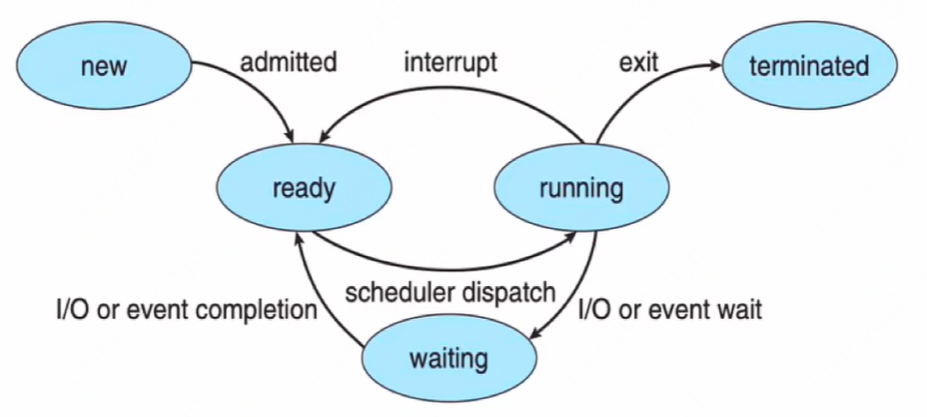

## 进程概念

| 概念         | 解释                                                         |
| ------------ | ------------------------------------------------------------ |
| 程序计数器PC | 是一个CPU中的寄存器看，里面存放下一条要执行指令的内存地址。在Intel x86和Itanium微处理器中，它叫做指令指针（Instruction Pointer，IP），有时又叫做指令地址寄存器。通常，CPU在取完一条指令之后，会将PC寄存器的值加1，以计算下一条要执行指令的地址 |
| 栈stack      | 用于存放局部变量、函数返回地址                               |
| 堆heap       | 用于程序运行时的动态内存分配                                 |
| 数据段data   | 存放全局和静态变量数据的内存区域                             |
| 代码段text   | 存放二进制代码的内存区域                                     |
| 进程切换     | 一个进程在执行过程中可能会被另一个进程替换占有CPU，这个过程叫做进程切换 |

## 进程的定义

- 进程是一个程序的一次执行过程
  - 能完成具体的功能
  - 是在某个数据集合上完成的
  - 执行过程是可并发的

- 进程是资源分配、保护和调度的基本单位

## 进程的状态

进程在执行期间自身的状态会发生变化，进程有三种基本状态，分别是：

- 运行态（Running）：此时进程的代码在CPU上运行
- 就绪态（Ready）：进程具备运行条件，等待分配CPU
- 等待态（Waiting）：进程在等待某些事件的发生（比如IO操作结束或是一个信号）

## 进程何时离开CPU

### 内部事件

进程主动放弃CPU，进入等待/终止状态。例如使用I/O设备、（非）正常结束

### 外部事件

进程被剥夺CPU使用权，进入就绪状态。这个动作叫抢占（preempt）。例如时间片到达，高优先级进程到达

## 进程状态转换

## 进程切换

### 并发进程的切换

一个进程在执行过程中可能会被另一个进程替换占有CPU，这个过程叫做进程切换

**是什么触发了进程切换？**

**进程切换时要做什么？**

## 中断技术

程序在执行过程中，当发生某个事件时，中止CPU上现行程序的运行，转而去执行该事件的处理程序。执行完毕后返回原程序中断点继续执行。

### 中断源

**外中断：**来自处理器之外的硬件中断信号，如时钟中断、键盘中断、外围设备中断，外部中断均是异步中断

**内中断（异常 Exception）：**来自于处理器内部，指令执行过程中发生的中断，属于同步中断。例如掉电、奇偶校验错误等硬件异常；非法操作、地址越界、断点、除数为0等程序异常；系统调用
