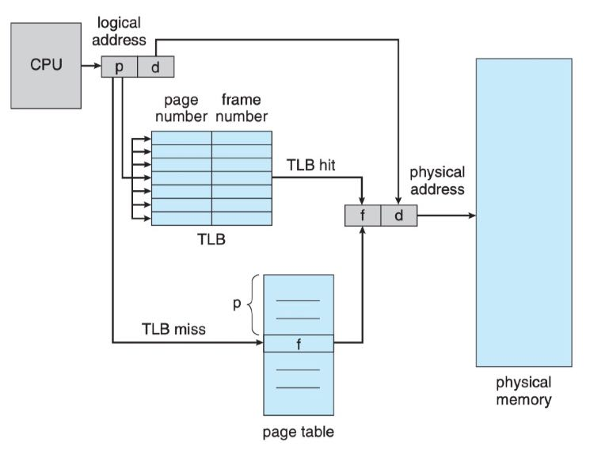
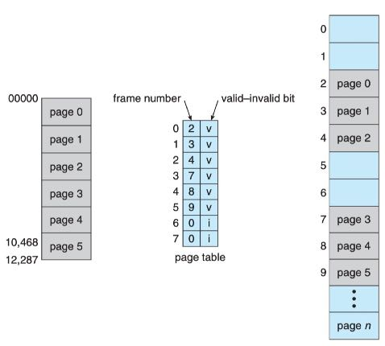
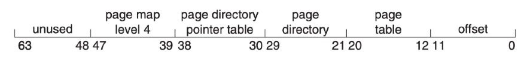

## maps

```bash
cat /proc/PID/maps
00400000-00401000 r-xp 00000000 fd:03 134244505                          /root/c/a.out
00600000-00601000 r--p 00000000 fd:03 134244505                          /root/c/a.out
00601000-00602000 rw-p 00001000 fd:03 134244505                          /root/c/a.out
7f63525f6000-7f63527ba000 r-xp 00000000 fd:03 102061354                  /usr/lib64/libc-2.17.so
7f63527ba000-7f63529b9000 ---p 001c4000 fd:03 102061354                  /usr/lib64/libc-2.17.so
7f63529b9000-7f63529bd000 r--p 001c3000 fd:03 102061354                  /usr/lib64/libc-2.17.so
7f63529bd000-7f63529bf000 rw-p 001c7000 fd:03 102061354                  /usr/lib64/libc-2.17.so
7f63529bf000-7f63529c4000 rw-p 00000000 00:00 0 
7f63529c4000-7f63529e6000 r-xp 00000000 fd:03 102061347                  /usr/lib64/ld-2.17.so
7f6352bd5000-7f6352bd8000 rw-p 00000000 00:00 0 
7f6352be4000-7f6352be5000 rw-p 00000000 00:00 0 
7f6352be5000-7f6352be6000 r--p 00021000 fd:03 102061347                  /usr/lib64/ld-2.17.so
7f6352be6000-7f6352be7000 rw-p 00022000 fd:03 102061347                  /usr/lib64/ld-2.17.so
7f6352be7000-7f6352be8000 rw-p 00000000 00:00 0 
7ffeac1dc000-7ffeac1fd000 rw-p 00000000 00:00 0                          [stack]
7ffeac1fe000-7ffeac200000 r-xp 00000000 00:00 0                          [vdso]
ffffffffff600000-ffffffffff601000 r-xp 00000000 00:00 0                  [vsyscall]
```

| 字段        | 解释                                             |      |
| ----------- | ------------------------------------------------ | ---- |
| Address     | 占用的起始和终止地址                             |      |
| Permissions | readable、writeable、executable、private、shared |      |
| Offset      | 指本段映射地址在文件中的偏移                     |      |
| Device      |                                                  |      |
| INode       | 对应的文件在磁盘上的inode号                      |      |
| Pathname    | 对应文件所在的路径                               |      |

## 地址空间和地址转换

| 概念         | 解释                                                         |
| ------------ | ------------------------------------------------------------ |
| 逻辑地址     | 面向程序的地址，总是从0开始编址，每一条指令的逻辑地址就是与第1条指令之间的相对偏移，因此逻辑地址也叫相对地址或虚拟地址 |
| 物理地址     | 内存单元看到的实际地址，也称为绝对地址                       |
| 逻辑地址空间 | 所有逻辑地址的集合                                           |
| 物理地址空间 | 逻辑地址对应的所有物理地址集合                               |
| 地址转换     | 将逻辑地址转换为物理地址                                     |
| MMU          | 内存管理单元，完成逻辑地址到物理地址运行时的转换             |
| 基址寄存器   | 存放进程起始物理地址，后续执行进程指令的时候，可以用逻辑地址 + 基址寄存器的值的方式，获取真实物理地址。保证进程地址的灵活性 |
| 内存碎片     |                                                              |

## 分段和分页

为什么要这些技术？

1. 为了解决碎片：允许进程的逻辑地址空间不连续
1. 内存视角的不同：逻辑上是可变大小的地址段，物理上是字节数组
1. 硬件需要提供逻辑内存到物理内存的映射

### 分段硬件

段基址、段限长、段表

段表中存储段号、段基址、段限长

### 分页

| 概念          | 解释                                            |
| ------------- | ----------------------------------------------- |
| 页page        |                                                 |
| 页框、帧frame |                                                 |
| 页号          |                                                 |
| 页内位移      |                                                 |
| 物理地址计算  | physical address = frame_no × pagesize + offset |

## 页表

- 操作系统为每个进程维护了一个页表的拷贝，用于将逻辑地址转换为物理地址。
- 当一个进程要被分配到CPU上运行的时候，CPU调度程序使用页表来定义hardware page table。
- 分页将造成上下文切换的一个开销，进程被分配CPU后，每次CPU都需要加载页表

## 快表

### hardware page table

- 页表存放在内存中，并且一个页表基址寄存器(page-table base register，PTBR)指向这个页表。
- 每次进程上下文切换时，不需要来回加载保存和加载页表信息，只需要更改页表基址寄存器的指针即可，极大的降低了上下文切换的时间。
- 用这种方案，每获取一个指令的需要访问两次内存，一次是获取页表，另一次是根据页表转换后的物理地址获取指令

### TLB（快表）

- TLB(Translation Look-aside Buffer)是一种很小、查询速度很快的专用硬件缓存，配合页表使用
- TLB只包含进程一部分页表内容
- 当CPU为程序生成一个逻辑地址时，CPU将首先检查TLB中是否有对应的页号
- 如果在TLB中找到了这个页号，则对应的页框号就可以立即获得，从而可以直接去访问内存中的数据，减少一次内存查询。
- 如果在TLB中没找到这个页号，则需要访问内存获取页框号，然后再访问内存中对应的指令(需要访问两次内存)

通过TLB计算物理地址的过程：



TLB命中率

- 从TLB中找到页号次数的百分比称为命中率
- `有效内存访问时间 = HIT_RATIO × ACCESS_TIME + (1 - HTI_RATIO) × 2 × ACCESS_TIME` 

## 基于页的保护与共享

## 保护

为了防止地址转换(CPU计算程序页号)时出现异常，可在页表的每个条目设置一个"valid-invalid"比特位，用于表示该页的有效性。这个方法可以扩展以提供更好的保护级别，如：”只读“、”读写“、”可执行“



## 共享

对于某些只读的代码，多个应用程序都会用到，则没必要在每个程序进程中为这些代码维护一份页表信息，只需要在内存中为这些代码维护一份页表信息即可，但这些页表项是只读的

## 多级页表

### 页表大小

- 假设CPU是32bits，采用的逻辑地址是32bits，那么进程的逻辑地址空间大小为`2^32Bytes`，即4G Bytes。
- 若页面大小是4K Bytes，则一个进程最多被分成1M个页面，也就是说进程的页表最多有1M个页表项；
- 若每个页表项占用4Bytes，则每个页表最多占用4MBytes空间（1K个连续页框）

如何解决“连续”的困扰？

### 页表页

因为我们需要把页表也放在内存的页框中，但又没有这么大的连续内存空间，只能把页表进行拆分后放入页框中，那么我们就需要记录哪些页表存放在了那个页框里面，如上面的假设，每个页框大小为4KBytes，而每个页表项又占用4Bytes，那么一个页框可以存放1K个页表项，于是，就将页表项以1000个为单位分成页表页，即每个页表页存放1000个页表项，页表页的序号从0开始

计算物理地址时，根据页表页号从页表页中找到对应的页框号，根据页框号，将页表从内存中取出，在根据页号从页表中找到对应的页框号，根据页框号和页内位移计算出物理地址

因为页表页也需要存放在页框中,如果页表页所需要的连续空间大小超过了页框大小,需要再对页表页进行拆分,形成三级页表

下面是x86-64架构CPU采用的四级页表方案：


