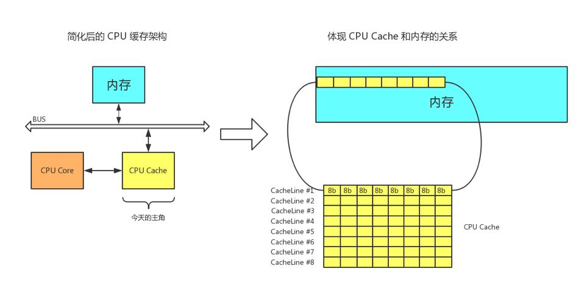
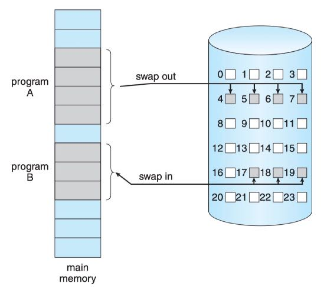
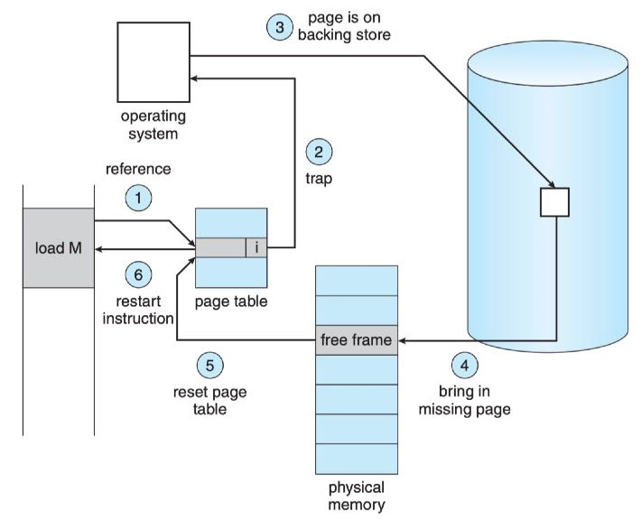
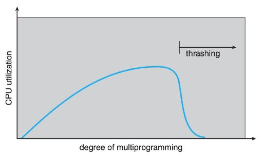
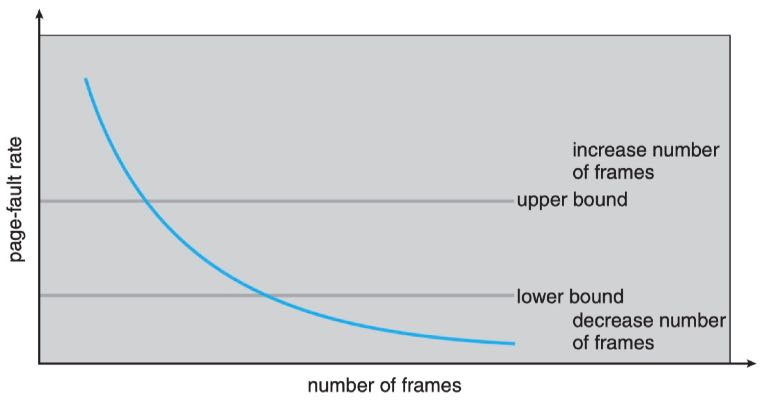

## 核心概念

| 概念          | 解释                                                         |
| ------------- | ------------------------------------------------------------ |
| CacheLine     | 计算机将数据从主存读入Cache时，是把要读取数据附近的一部分数据都读取进来。这样一次读取的一组数据就叫做CacheLine，每一级缓存中都能放很多的CacheLine |
| 局部性原理    |                                                              |
| Write through | 修改缓存数据的同时修改内存数据                               |
| Write Back    | 只修改缓存数据，直到该数据要被清除出缓存再修改内存中的数据   |
| 部分装入      | 进程运行时仅加载部分进入内存，而不必全部装入，其余部分暂时放在swap space |
| 部分对换      | 可以将进程部分对换出内存，用以腾出内存空间，对换出的部分暂时放在swap space |
| swap space    |                                                              |

## 缓存Cache



## 局部性原理

- 时间局部性(Temporal locality)
  - 如果某个信息这次被访问，那它有可能在不久的未来被多次访问。
- 空间局部性(Spatial locality) 
  - 如果某个位置的信息被访问，那和它相邻的信息也很有可能被访问到。 
- 内存局部性(Memory locality)
  - 访问内存时，大概率会访问连续的块，而不是单一的内存地址，其实就是空间局部性在内存上的体现。
- 分支局部性(Branch locality)
  - 计算机中大部分指令是顺序执行，顺序执行和非顺序执行的比例大致是5:1。 
- 等距局部性(Equidistant locality) 
  - 等距局部性是指如果某个位置被访问，那和它相邻等距离的连续地址极有可能会被访问到。

## 修改缓存数据

- Write through
- Write Back

## 缓存数据的淘汰

缓存的容量很小，当缓存满的时候，就需要将缓存中的部分数据淘汰，装入新的数据。

## 虚拟内存

- 部分装入
- 进程可以比物理内存大的多
- 虚拟内存将物理内存抽象为一个极大的，统一的字节为单位的存储器。将物理内存和逻辑内存分开
- 开发者不用再关心物理内存限制的问题了。

## swap space



## 请求调页



## 请求调页的性能

假设访问内存时间为ma，处理一次缺页中断的时间记作page fault time，令p为缺页中断的出现几率，则有效访问时间的计算公式为：

```
effective access time = (1 - p) * ma + p * page fault time
```

若`ma = 200ns`，`page fault time = 8ms`，`p = 0.001`，则`effective access time = 8200ns`

缺页中断率p对性能影响重大

## 页面置换算法

当进程在执行过程中发生了缺页，在请求调页的时候发现内存已经没有空闲页框可用，操作系统在此时会做出一个处理：页面置换

性能表现：OPT > LRU > FIFO

### FIFO

总是淘汰最先进入内存的页面，因为它在内存中待的时间最久。

### OPTIMAL

总是淘汰最长时间不会再使用的页面

最优 => 无法实现，因为无法预测未来

### LRU（LEAST Recent Unused）

总是淘汰最近最少使用的页面

## thrashing(抖动)

如果进程没有足够数量的页框来支持pages in active use，那么就会很快发生缺页。这时，必须要做页面置换。但是，因为所有的页面都是频繁被使用的，置换出去的页面会立刻置换回来。因此，导致一遍又一遍的不停的缺页，置换页面。

这种高频率的调页的动作就叫做抖动。如果一个进程出现了thrashing， 意味着进程将花费比运行时间多得多的时间在调页上。

### 抖动的原因



- 并发进程数量过多
- 进程页框分配不合理。进程需要10个页框，但是值分配到了6个

### PAGE FAULT FREQUENCY

PFF称为页面故障率。基于这个数据可以实施一个防止抖动的策略：动态调节分配给进程的页框数量。



## 总结

加内存
