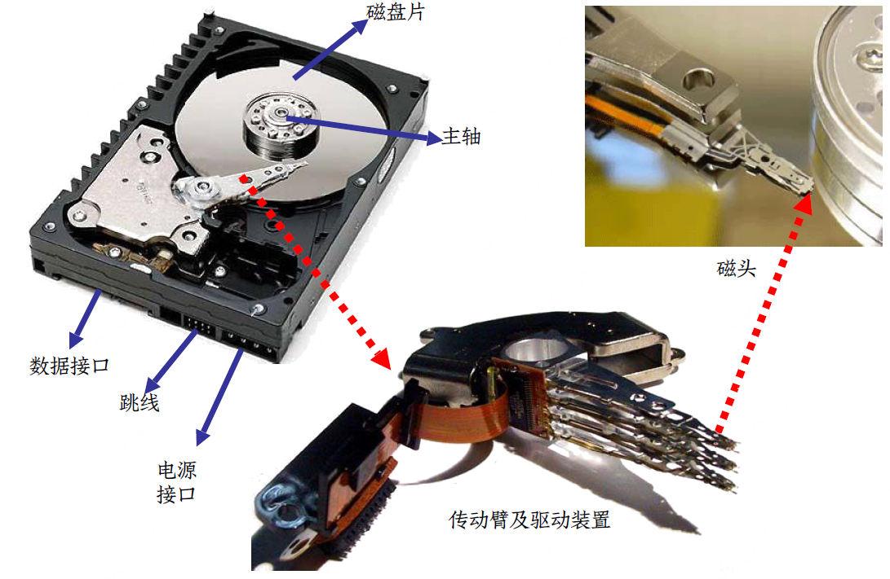
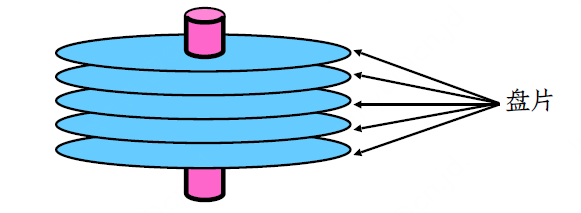
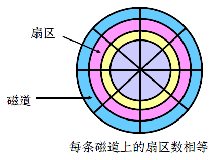
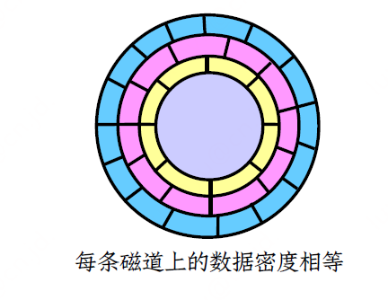
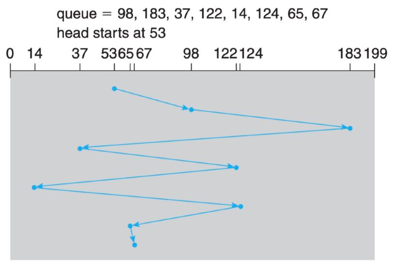
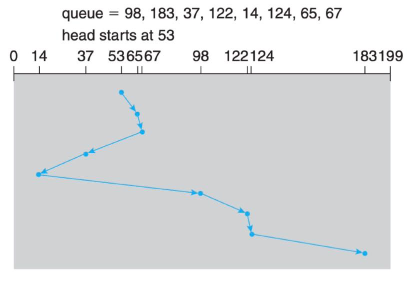
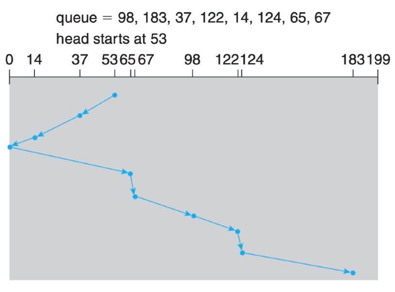
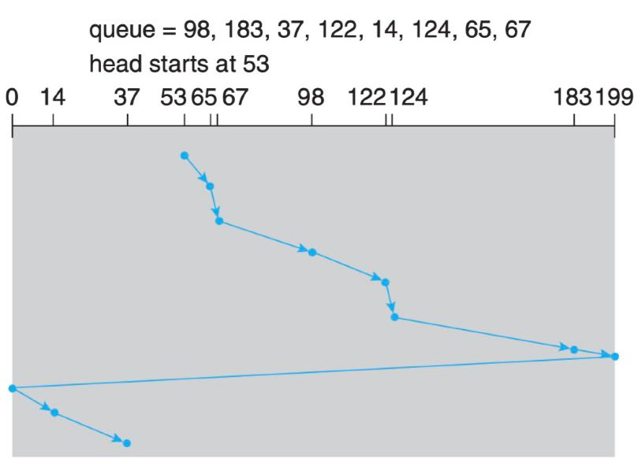

## 磁盘结构



- 磁道：能被磁头访问的一组同心圆
- 扇区：磁道上的区域，数据存放的基本单位
- 柱面：所有盘片同一磁头下的磁道集合
- 恒角速度CAV
  - 不同磁道密度不同，但转速恒定
- 恒线速度CLV
  - 磁道密度相同，但转速不断变化







## 磁盘格式化

低级格式化（Low-level formatting）

- Physical formatting
- 为每个扇区使用特殊的数据结构进行填充，包括一个头部、数据区域和一个尾部。
- 头部和尾部包含一些控制信息，如扇区号、ECC码等。

高级格式化（High-level formatting）

- Logical formatting
- 构建文件系统，在磁盘上初始化文件系统数据结构，如空闲和已分配空间表、一个空目录等。

## 磁盘性能

### 磁盘性能指标

查找一个物理块的顺序：柱面号、磁头号和扇区号

- 寻道时间Ts：将磁头定位到正确磁道(柱面)上所花的时间，与盘片直径和传动臂速度相关，平均20ms。
- 旋转延迟Tr：所查找的扇区转到磁头下所用的时间，与磁盘的旋转速度有关，一个10,000 r/m的磁盘平均旋转延迟为3ms
- 传送时间T：传送扇区内的数据的时间，同样取决于磁盘的旋转速度，T = b/(rN) (b为要传送的字节数，N为一个磁道中的字节数，r为转速)

总的平均存取时间 Ta = Ts + Tr + T

### 实例分析

- 条件假设
  - 平均寻道时间为 5 ms，平均旋转延迟为 4 ms
  - 传输速率为 4 MByte/s，扇区大小是 1 KByte
- 如果随机访问一个扇区
  - Ta = 5ms + 4ms + 0.25ms ≈ 10 ms
  - 总的存取速率为100 KByte/sec
- 如果要访问的扇区在同一个柱面
  - Ta = 4ms + 0.25ms ≈ 5 ms → 200 KByte/sec
- 如果下一个要访问的扇区正好和上次访问的扇区相邻
  - Ta = 0.25ms → 4 MByte/sec

## 磁盘调度

### 磁盘IO请求

进程给OS发出一个系统调用，请求指明几个信息

- 本次io操作是input还是output
- 磁盘地址是什么（柱面号、磁头号、扇区号）
- 内存地址是什么
- 扇区数量

### 磁盘调度

磁盘队列中会有几个pending请求，当一个请求完成后，os会挑选一个pending请求进行服务。

#### FCFS调度

queue中是柱面号



#### SSTF调度

SSTF（shortest-seek-time first）最短寻道时间优先



缺陷：磁臂粘连现象。导致饥饿。

#### SCAN调度



缺陷：方向切换往回走的时候，可能导致一部分路程白跑

#### C-SCAN调度

只有一个方向。磁头扫描到头的时候，会弹到0号柱面然后继续扫描



#### Look调度

每走一步都look一下，后面的柱面是否有请求，没有请求的话就直接掉头


#### C-Look调度

### Linux中的IO调度

查看调度策略的命令

```bash
cat /sys/block/vdb/queue/scheduler
```

- noop：FCFS的策略，在SSD上表现很好
- deadline：有两个队列，一个read队列，一个write队列。每一个IO请求都有一个截止时间，当一个IO请求到达截止时间时，将会给这个IO请求最高的优先级，让其立即执行。读的deadline要比写的deadline小的多
- cfq：Complete Fairness Queueing。完全公平队列。为每一个进程创建一个IO队列。用来给每一个进程提供一个公平的IO优先级。cfq给每个进程分配了时间片，用时间片轮转的方式处理每个进程的IO请求。同时对每个进程IO队列中的请求进行排序来降低磁盘寻址的时间
