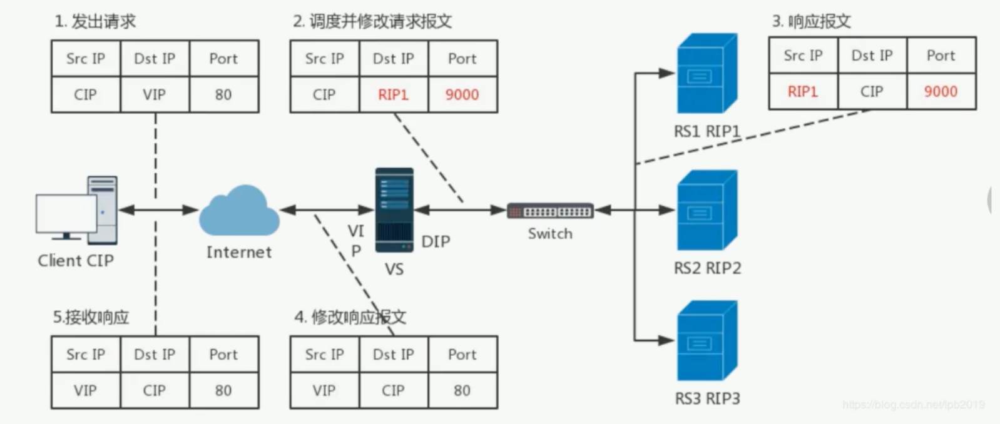
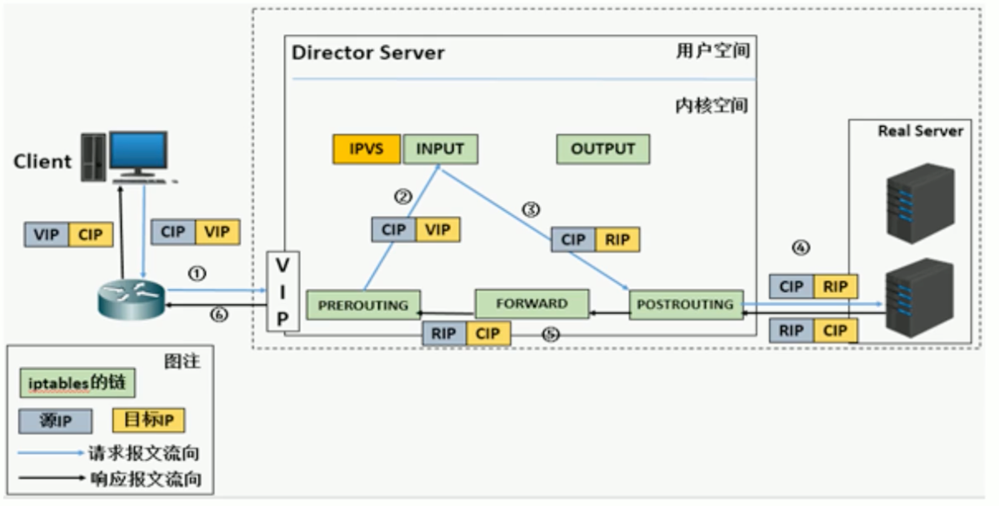
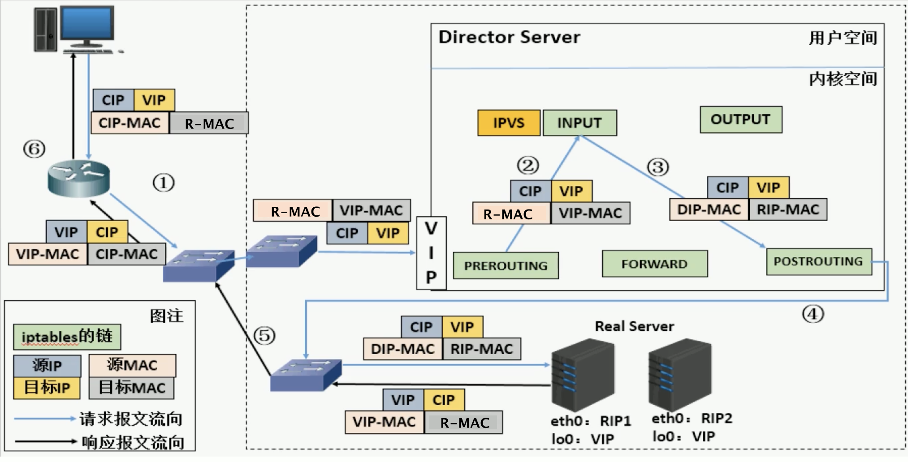
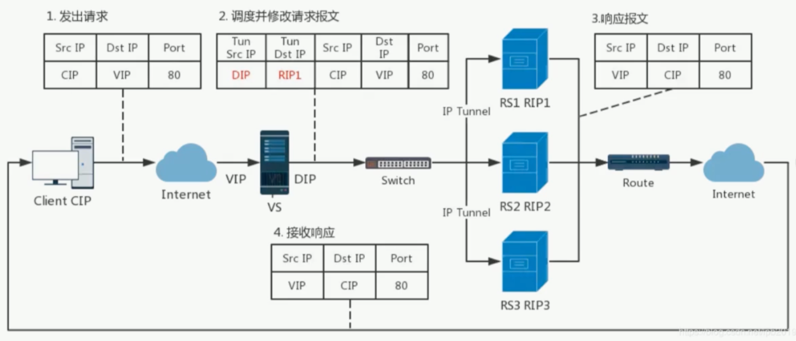
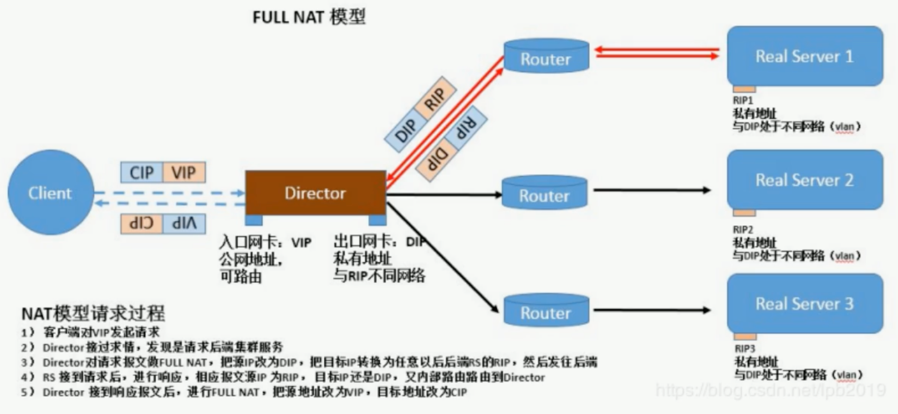

## 核心概念

| 名词     | 解释                                                         |
| -------- | ------------------------------------------------------------ |
| LVS      | Linux Virtual Server，内核集成，章文嵩开发。阿里的四层SLB是基于LVS + keepalived实现 |
| 官方文档 | http://www.linuxvirtualserver.org                            |
| VS       | Virtual Server，负责调度                                     |
| RS       | Real Server，负责真正提供服务                                |
| CIP      | Client IP                                                    |
| VIP      | Virtual Server IP，VS外网IP                                  |
| DIP      | Director IP，VS内网的IP                                      |
| RIP      | Real Server IP                                               |

## LVS简介

### LVS工作原理

VS根据请求报文的目标IP和目标协议及端口将其调度转发至某RS，根据调度算法来挑选RS，LVS是内核级功能，工作在INPUT链的位置，将发往INPUT的流量进行处理

**查看是否支持LVS**

```bash
[root@CentOS74 ~]# grep -i -C 10 ipvs /boot/config-3.10.0-693.el7.x86_64 
...
CONFIG_NETFILTER_XT_MATCH_IPVS=m
...
CONFIG_IP_VS=m
CONFIG_IP_VS_IPV6=y
# CONFIG_IP_VS_DEBUG is not set
CONFIG_IP_VS_TAB_BITS=12

#
# IPVS transport protocol load balancing support
#
CONFIG_IP_VS_PROTO_TCP=y
CONFIG_IP_VS_PROTO_UDP=y
CONFIG_IP_VS_PROTO_AH_ESP=y
CONFIG_IP_VS_PROTO_ESP=y
CONFIG_IP_VS_PROTO_AH=y
CONFIG_IP_VS_PROTO_SCTP=y

#
# IPVS scheduler
#
CONFIG_IP_VS_RR=m
CONFIG_IP_VS_WRR=m
CONFIG_IP_VS_LC=m
CONFIG_IP_VS_WLC=m
CONFIG_IP_VS_LBLC=m
CONFIG_IP_VS_LBLCR=m
CONFIG_IP_VS_DH=m
CONFIG_IP_VS_SH=m
CONFIG_IP_VS_SED=m
CONFIG_IP_VS_NQ=m

#
# IPVS SH scheduler
#
CONFIG_IP_VS_SH_TAB_BITS=8

#
# IPVS application helper
#
CONFIG_IP_VS_FTP=m
CONFIG_IP_VS_NFCT=y
CONFIG_IP_VS_PE_SIP=m

#
# IP: Netfilter Configuration
#
CONFIG_NF_DEFRAG_IPV4=m
CONFIG_NF_CONNTRACK_IPV4=m
```

> 注：在内核版本4.15之后新增了两种调度算法
> CONFIG_IP_VS_FO
> CONFIG_IP_VS_OVF

## LVS工作模式

### NAT模式

lvs-nat：本质是多目标IP的DNAT，通过将请求报文中的目标地址和目标端口修改为某挑出的RS的RIP和PORT实现转发

1. RIP和DIP应该在同一个网络下，且应使用私网地址，RS的网关要指向DIP
2. 请求报文和响应报文都必须经由Director转发，Director易成为系统瓶颈
3. 支持端口映射，可修改请求报文的目标端口
4. VS必须是Linux系统，RS可以是任意OS系统

**NAT模式工作流程**

1. cip发送数据到vs(src: cip，dst: vip)
2. vs根据调度算法，选择一个rs，将dip替换为选中的rs的rip(src: cip, dst: rip)
3. rs返回数据包给vs(src: rip, dst: cip)
4. vs替换sip为vip，将数据包发给cip(src: vip, dst: cip)



**底层原理图**

工作在`PREROUTING`之后，`INPUT`之前



### DR模式

DR(Direct Routing)，直接路由，是lvs默认的工作模式。通过将请求报文重新封装一个MAC首部进行转发，源MAC是DIP所在的接口的MAC，目标MAC是某挑选出的RS的RIP所在的接口的MAC地址；源IP/PORT以及目标IP/PORT均保持不变

**DR模式的工作流程**

1. 客户端发送请求到LVS前端路由器，此时目的ip是VIP
2. 前端路由器发现数据是发给VIP的，于是发ARP广播，询问该VIP的Mac地址。
3. 此时，VS(Director)响应这个ARP，其他RS都不会响应。
4. 路由器将请求转发给VS
5. 请求进入VS的PREROUTING链。此时报文的源ip是cip，目标ip依然为VIP。VS发现数据包是发给自己的，于是将数据包送至INPUT链。
6. 工作在INPUT链上的IPVS检查发现数据包请求的是lvs集群的服务，于是将报文中的源Mac地址修改为DIP的Mac地址，目的Mac地址修改为RIP的Mac地址，然后将数据包发给POSTROUTING链
7. 由于DIP和RIP在同一个网段中，所有可以通过二层通信。POSTROUTING链将数据包发给RS
8. RS收到数据包后，发现目的Mac是自己，且目的IP是自己身上配置的VIP地址，就会接收报文并处理。
9. RS将响应报文通过lo接口传送给eth0网卡然后向外发出。源IP为VIP，目的IP为CIP



**DR模式的特点**

1. Director和各RS都配置有VIP

2. 要确保前端路由器将目标IP为VIP的请求报文发往Director

   * 在前端网关做静态绑定VIP和Director的MAC地址

   * 在RS上使用arptables工具

     ```bash
     arptables -A IN -d $VIP -j DROP
     arptables -A OUT -s $VIP -j mangle --mangle-ip-s $RIP
     ```

     

   * 在RS上修改内核参数以限制arp通告以及应答级别

     ```bash
     /proc/sys/net/ipv4/conf/lo/arp_ignore
     /proc/sys/net/ipv4/conf/lo/arp_announce
     ```

     

3. RS的RIP可以使用私网地址，也可以是公网地址；RIP和DIP在同一个IP网络；RIP的网关不能指向DIP，以确保响应报文不会经由Director

4. RS和Director要在同一个物理网络

5. 请求报文要经由Director，但响应报文不经由Director，而由RS直接发往Client

6. 不支持端口映射（端口不能修改）

7. RS可使用大多数OS系统

### TUN模式

tunnel模型与DR模型的区别在于，在tunnel模型中，VS和RS是可以跨网络的。因为VS会将请求报文的ip头前再插入一个源ip是DIP，目的ip是RIP的ip头，然后路由到后端RS。



**TUN模式的特点**

1. DIP、VIP、RIP可以是公网地址
2. RS的网关一般不能指向DIP
3. 请求报文要经由VS，但是响应不经由Director
4. 不支持端口映射
5. RS的OS需要支持隧道功能

### FULL NAT模式

与NAT模型的区别在于full-nat模型将源IP地址也参与了转换，并没有什么特别之处。所以默认内核还不支持。一般用不到



**full nat模式的特点**

1. VIP是公网地址，RIP和DIP是私网地址，且通常不在一个IP网络，因此RIP的网关一般不会指向DIP
2. RS收到的请求报文源地址是DIP，因此，只需要响应给DIP，但Director还要将其发往client
3. 请求和响应报文都经由Director
4. 支持端口映射

> 注意：此类型kernel默认还不支持

## 调度算法

ipvs scheduler: 根据其调度时是否考虑各RS当前的负载状态，分为==静态方法==和==动态方法==

### 静态方法

| 算法 | 解释                                                         |
| ---- | ------------------------------------------------------------ |
| RR   | 轮询                                                         |
| WRR  | 加权轮询                                                     |
| SH   | Source Hashing，实现session sticky。源地址hash，将来自同一个ip地址的请求时钟发往第一次挑中的RS，从而实现会话绑定 |
| DH   | Destination Hashing，目标地址hash。第一次轮询调度至RS，后续发往同一个目标地址的请求始终转发至第一次挑中的RS。 |

### 动态方法

主要根据RS当前的负载状态以及调度算法进行调度Overhead=value，value较小的RS将被调度

| 算法  | 解释                                                         | Overhead计算公式                                             |
| ----- | ------------------------------------------------------------ | ------------------------------------------------------------ |
| LC    | least connections，适用于长链接应用                          | Overhead=activeconns * 256 + inactiveconns                   |
| WLC   | Weighted LC，默认调度算法                                    | Overhead=(activeconns * 256 + inactiveconns) / weight        |
| SED   | Shortest Expection Delay，初始连接高权重优先                 | Overhead=(activeconns + 1) * 256 / weight                    |
| NQ    | Never Queue                                                  | 第一轮均匀分配，后续SED                                      |
| LBLC  | Locality-Based LC，动态的DH算法，使用场景: 根据负载状态实现正向代理 |                                                              |
| LBLCR | LBLC with Replication                                        | 带复制功能的LBLC，解决LBLC负载不均衡问题，从负载重的复制到负载轻的RS |

在内核版本4.15之后新增调度算法FO和OVF

| 算法 | 解释                                                         |
| ---- | ------------------------------------------------------------ |
| FO   | Weight Fail Over，在此FO算法中，遍历虚拟服务所关联的真实服务器链表，找到还未过载(未设置IP_VS_DEST_F_OVERLOAD标记)的且权重最高的真实服务器进行调度。 |
| OVF  | Overflow-connection，基于真实服务器的活动连接数量和权重值实现。将新连接调度到权重值最高的真实服务器，直到其活动连接数量超过权重值，之后调度到下一个权重值最高的真实服务器，在此OVF算法中，遍历虚拟服务相关联的真实服务器链表，找到权重值最高的可用真实服务器。一个可用的真实服务器需要同时满足以下条件:未过载真实服务器当前活动连接数小于其权重值权重不为0 |

## LVS相关软件

### 程序包: ipvsadm

| 程序                          | 作用             |
| ----------------------------- | ---------------- |
| ipvsadm.service               | Unit File        |
| /usr/sbin/ipvsadm             | 主程序           |
| /usr/sbin/ipvsadm-save        | 规则保存程序     |
| /usr/sbin/ipvsadm-restore     | 规则重载程序     |
| /etc/sysconfig/ipvsadm-config | 配置文件         |
| /etc/sysconfig/ipvsadm        | ipvs调度规则文件 |


### ipvsadm命令

**ipvsadm核心功能**

* 集群服务管理：增、删、改
* 集群服务RS管理：增、删、改
* 查看

**ipvsadm工具的用法**

```bash
]# ipvsadm -h
ipvsadm v1.27 2008/5/15 (compiled with popt and IPVS v1.2.1)
Usage:
  ipvsadm -A|E -t|u|f service-address [-s scheduler] [-p [timeout]] [-M netmask] [--pe persistence_engine] [-b sched-flags]
  ipvsadm -D -t|u|f service-address # 删除集群
  ipvsadm -C # 清空所有规则
  ipvsadm -R # 重载，相当于ipvsadm-restore
  ipvsadm -S [-n] # 保存规则，相当于ipvsadm-save
  ipvsadm -a|e -t|u|f service-address -r server-address [options] # 添加rs
  ipvsadm -d -t|u|f service-address -r server-address # 删除rs
  ipvsadm -L|l [options] # 列出规则表
```

**管理集群服务：增、删、改**

```bash
# -A 增 -E 改
ipvsadm -A|-E -t|-u|-f service-address [-s scheduler] [-p [timeout]]

# -D 删
ipvsadm -D -t|-u|-f service-address
```

| 参数               | 解释                      |
| ------------------ | ------------------------- |
| -t service-address | TCP协议端口，VIP:TCP_PORT |
| -u service-address | UDP协议，VIP:UDP_PORT     |
| -f                 | firewall MARK，一个数字   |
| -s scheduler       | 指定集群调度算法，默认wlc |

范例：

```bash
ipvsadm -A -t 192.168.0.100:80 -s wrr
ipvsadm -A -u 192.168.0.100:80 -s wlc
ipvsadm -D -t 192.168.0.100:80
```


**管理集群上的RS：增、删、改**

```bash
# 增、改
ipvsadm -a|-e -t|-u|-f service-address -r server-address [-g|-i|-m] [-w weight]

# 删
ipvsadm -d -t|-u|-f service-address -r server-address
```

| 参数           | 解释                                   |
| -------------- | -------------------------------------- |
| server-address | RIP[:PORT]，如省略PORT，则不做端口映射 |
| -g             | gateway，DR模式，默认                  |
| -i             | ipip，tun模式                          |
| -m             | masquerade，nat模式                    |

范例：

```bash
ipvsadm -a -t 192.168.0.100:80 -r 192.168.0.8:8000 -m -w 3
```

**清空定义的所有内容**

```bash
ipvsadm -C
```

**清空计数器**

```bash
ipvsadm -Z [-t|-u|-f service-address]
```

**查看**

```bash
ipvsadm -Ln # 查看lvs规则
ipvsadm -Lnc # 查看lvs连接
```

