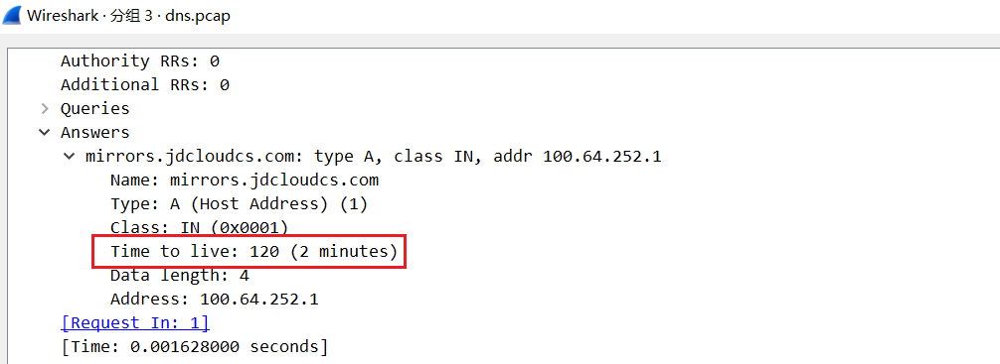

# nscd服务详解

在Linux中，如果想

`/etc/nscd.conf`配置文件配置项

| 配置项                              | 解释                                                         | 默认值   |
| ----------------------------------- | ------------------------------------------------------------ | -------- |
| logfile                             | 指定debug信息的日志文件                                      | 无       |
| debug-level                         | 指定日志级别                                                 | 0        |
| threads                             | 等待请求的线程数。至少5个                                    |          |
| max-threads                         | 指定最大线程数，默认32                                       | 32       |
| server-user                         | 如果这个选项被设置，nscd将用这个user运行，如果为每个用户使用单独的缓存(-S参数)，则忽略此选项。 |          |
| stat-user                           | Specifies the user who is allowed to request statistics.     |          |
| reload-count                        | 限制缓存条目在被删除之前重新加载而不使用的次数。默认值是5    | 5        |
| paranoia                            | 会导致nscd周期性地重新启动自身。默认为no                     | no       |
| restart-interval                    | 设置周期重启时间间隔，单位秒。默认为3600                     | 3600     |
| enable-cache service <yes \| no>    | 打开或关闭指定的service cache，默认为no                      | no       |
| positive-time-to-live service value | 为成功查询的条目设置TTL，单位秒                              |          |
| negative-time-to-live service value | 为查询失败的条目设置TTL，单位秒                              |          |
| suggested-size service value        | 内部哈希表的大小，值应该保持一个素数以获得最佳效率。默认211  | 211      |
| check-files service <yes \| no>     | 定期检查/etc/passwd、/etc/group或/etc/hosts的修改时间（分别用于passwd、group和host缓存），如果文件自上次检查以来已更改，则使缓存无效。 | yes      |
| persistent service <yes\|no>        | 持久化缓存内容，重启不会失效                                 | no       |
| shared service <yes\|no>            | 用于服务nscd数据库的内存映射与客户端共享，这样客户端就可以直接在其中搜索，而不必每次执行查找时都通过套接字询问守护进程。 | no       |
| max-db-size service bytes           | 用于配置 nscd 缓存数据库的最大大小，单位为Byte               | 33554432 |
| auto-propagate service <yes\|no>    | When  set  to  no  for  passwd  or group service, then the .byname requests are not added to passwd.byuid or group.bygid cache.  This can help with tables containing multiple records for the same ID.  The default is yes.  This option is valid only for services passwd and group | yes      |

对于成功的查询，会缓存多长时间？

nscd.conf配置文件中，`positive-time-to-live hosts 60`配置项没什么用，真正的失效时间是根据DNS返回的TTL值计算得出。TTL时间到达后，nscd不会立刻清理缓存，而是再等15秒才会清理缓存。也就是实际缓存有效期是TTL+15秒。如果reload-count配置不为0(默认是5)，nscd会在实际缓存到期后，发起DNS请求，来更新缓存，次数是reload-count。

