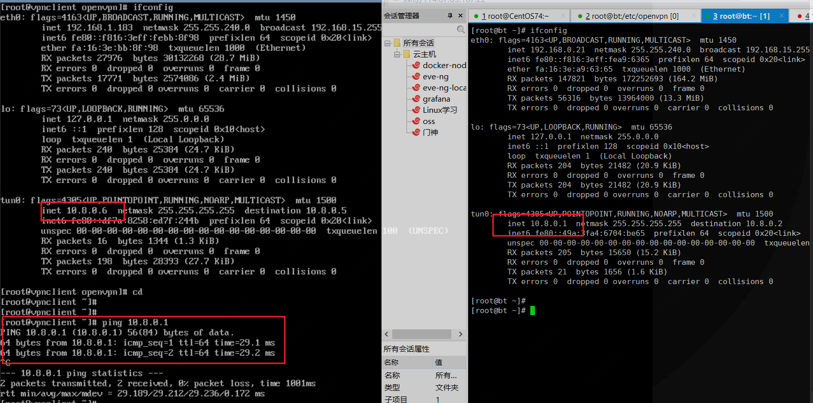

# 环境说明

## 服务端环境

```
系统：CentOS7.4
公网ip：114.67.69.167
内网ip：192.168.0.21
```


## 客户端环境

```bash
系统：CentOS7.4
公网ip：116.196.76.147
内网ip：192.168.1.183
```


# 服务端操作

## 软件安装

```bash
yum install openvpn easy-rsa
```


## 配置步骤

### 准备相关目录和配置文件

1. 拷贝文件到指定目录下

```
mkdir /etc/openvpn/easy-rsa
cp /usr/share/doc/easy-rsa-3.0.6/vars.example /etc/openvpn/easy-rsa/vars
cp -r /usr/share/easy-rsa/3.0.6/* /etc/openvpn/easy-rsa/
cp /usr/share/doc/openvpn-2.4.8/sample/sample-config-files/server.conf /etc/openvpn/
```

2. 编辑/etc/openvpn/easy-rsa/vars文件

```
set_var EASYRSA_REQ_COUNTRY "CN"
set_var EASYRSA_REQ_PROVINCE "Beijing"
set_var EASYRSA_REQ_CITY "Beijing"
set_var EASYRSA_REQ_ORG "OpenVPN CA"
set_var EASYRSA_REQ_EMAIL "xinyulu3344@163.com"
set_var EASYRSA_REQ_OU  "My VPN"
```

### 创建服务器端证书和key

1. 目录初始化

```bash
cd /etc/openvpn/easy-rsa/
./easyrsa init-pki
```


2. 创建根证书

```bash
./easyrsa build-ca
Enter PEM pass phrase: 输入2次pem密码，并记住（输入的pem密码是openvpn，后面会用到）；
........
Common Name (eg: your user, host, or server name) [Easy-RSA CA]: 输入名称；（输入的是opvpn-ca）


回车后显示：
CA creation complete and you may now import and sign cert requests.
Your new CA certificate file for publishing is at:
/etc/openvpn/easy-rsa/pki/ca.crt
```


3. 创建服务器端证书

```bash
./easyrsa gen-req server nopass
Common Name (eg: your user, host, or server name) [server]: （输入是node2）

# 输入回车后显示：
Keypair and certificate request completed. Your files are:
req: /etc/openvpn/easy-rsa/pki/reqs/server.req
key: /etc/openvpn/easy-rsa/pki/private/server.key
```


4. 签署服务器端证书

```bash
./easyrsa sign server server

# 回车后，Confirm request details: （输入yes）
Enter pass phrase for /etc/openvpn/easy-rsa/pki/private/ca.key: （输入之前CA根证书的pem密码是openvpn）

# 回车后显示：
Check that the request matches the signature
Signature ok
The Subject's Distinguished Name is as follows
commonName :ASN.1 12:'node2'
Certificate is to be certified until Apr 4 16:04:29 2028 GMT (3650 days)

Write out database with 1 new entries
Data Base Updated

Certificate created at: /etc/openvpn/easy-rsa/pki/issued/server.crt
```


5. 创建Diffie-Hellman，确保key穿越不安全网络的命令

```bash
./easyrsa gen-dh

# 最后显示:
DH parameters of size 2048 created at /etc/openvpn/easy-rsa/pki/dh.pem
```


6. 生成ta密钥文件

```bash
openvpn --genkey --secret /etc/openvpn/easy-rsa/ta.key
```

### 创建客户端证书及key

1. 拷贝文件，初始化目录，创建客户端证书

```bash
mkdir /root/client
cd /root/client
cp -r /usr/share/easy-rsa/3.0.6/* ./
./easyrsa init-pki
./easyrsa gen-req client

# 回车后显示：
Enter PEM pass phrase: 输入密码，密码是之后客户端连接服务器要用的（输入的是vpnclient）
Common Name (eg: your user, host, or server name) [client]: （输入的是client，后面会用到）

# 回车后显示：
Keypair and certificate request completed. Your files are:
req: /root/client/pki/reqs/client.req
key: /root/client/pki/private/client.key
```

2. 将得到的client.req导入

```bash
cd /etc/openvpn/easy-rsa/
./easyrsa import-req /root/client/pki/reqs/client.req client

# 回车后显示：
Note: using Easy-RSA configuration from: ./vars
The request has been successfully imported with a short name of: client
You may now use this name to perform signing operations on this request.
```

3. 签署证书

```bash
./easyrsa sign client client

# 回车后，输入yes
Enter pass phrase for /etc/openvpn/easy-rsa/pki/private/ca.key: （输入的是openvpn）

# 注意：
这里生成client，所以第一个client位置必须为client，第二个参数client要与之前导入名字一致，导入的时候会要求输入密码，这个密码是第一次设置的根证书的密码，不要输错；因为openvpn是一个客户端对应一组证书密钥文件的；

# 回车后显示：
Check that the request matches the signature
Signature ok
The Subject's Distinguished Name is as follows
commonName :ASN.1 12:'client'
Certificate is to be certified until Apr 4 16:38:37 2028 GMT (3650 days)

Write out database with 1 new entries
Data Base Updated

Certificate created at: /etc/openvpn/easy-rsa/pki/issued/client.crt
```

### 拷贝修改相关文件

1. 拷贝服务器端所需文件到各自位置

```bash
cp pki/ca.crt /etc/openvpn/ 
cp pki/private/server.key /etc/openvpn/ 
cp pki/issued/server.crt /etc/openvpn/ 
cp pki/dh.pem /etc/openvpn/ 
cp /etc/openvpn/easy-rsa/ta.key /etc/openvpn/
```

2. 拷贝客户端所需文件到各自位置

```bash
cp pki/ca.crt /root/client/ 
cp pki/issued/client.crt /root/client/ 
cp /root/client/pki/private/client.key /root/client/ 
cp /etc/openvpn/easy-rsa/ta.key /root/client/ 
```

3. 修改vpn配置文件server.conf

```bash
# egrep -v "^$|^#|^;" /etc/openvpn/server.conf
port 1194
proto udp
dev tun
ca /etc/openvpn/ca.crt
cert /etc/openvpn/server.crt
key /etc/openvpn/server.key
dh /etc/openvpn/dh.pem
server 10.8.0.0 255.255.255.0
ifconfig-pool-persist ipp.txt
push "redirect-gateway def1 bypass-dhcp"
push "dhcp-option DNS 103.224.222.222"
push "dhcp-option DNS 8.8.8.8"
keepalive 10 120
tls-auth ta.key 0 # This file is secret
cipher AES-256-CBC
comp-lzo
persist-key
persist-tun
status openvpn-status.log
verb 3
explicit-exit-notify 1
```


## 启动服务

```bash
openvpn /etc/openvpn/server.conf &
也可使用systemctl启动
```


# 客户端操作

## 软件安装

```bash
yum install openvpn
```


## 配置步骤

### 拷贝文件

```bash
cd /etc/openvpn/
scp 114.67.69.167:/root/client/client.crt .
scp 114.67.69.167:/root/client/client.key .
scp 114.67.69.167:/root/client/ta.key .
scp 114.67.69.167:/root/client/ca.crt .
```

### 编辑客户端文件

```bash
# vim client.ovpn
client
dev tun
proto udp
remote 114.67.69.167 1194
resolv-retry infinite
nobind
persist-key
persist-tun
ca /etc/openvpn/ca.crt
cert /etc/openvpn/client.crt
key /etc/openvpn/client.key
remote-cert-tls server
tls-auth ta.key 1
cipher AES-256-CBC
comp-lzo
verb 3
```


## 连接VPN

```bash
openvpn /etc/openvpn/client.ovpn &

# 注意：执行完该命令之后，如果是ssh远程连接的客户端，ssh会断开，因为客户端系统路由被修改。可以通过如下命令删除路由
route del -net 0.0.0.0 netmask 128.0.0.0 gw 10.8.0.5
route del -net 128.0.0.0 netmask 128.0.0.0 gw 10.8.0.5
```

### 连通性测试




