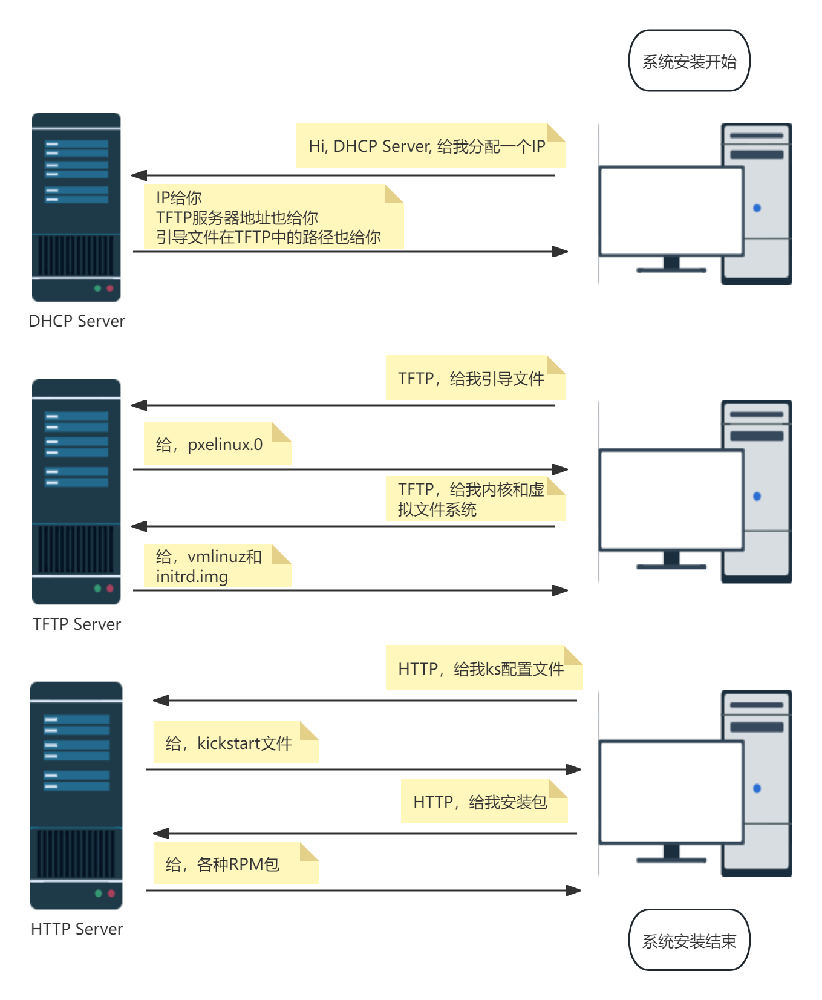
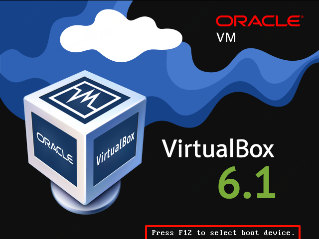
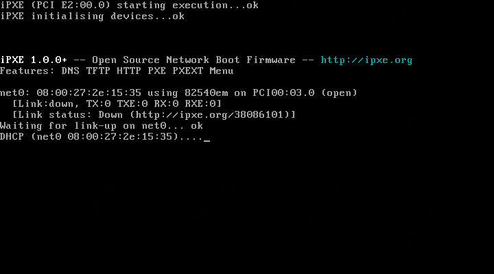
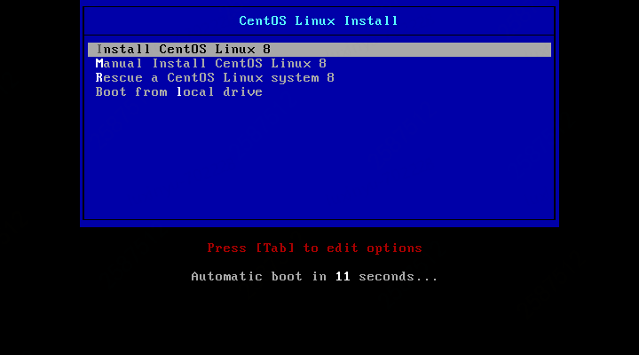
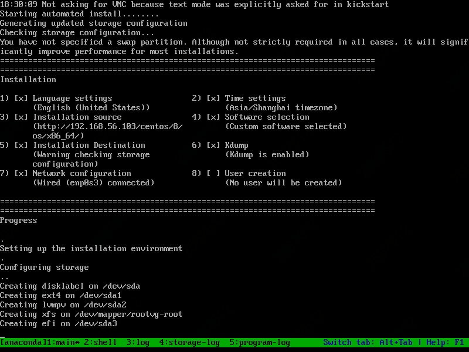
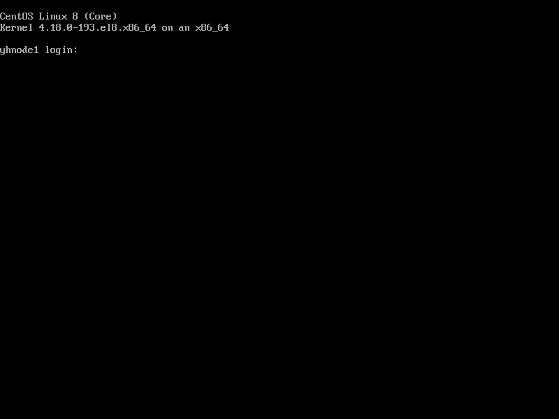

# pxe+kickstart实现批量装机

| PXE服务器环境       | 作用                                                         |
| ------------------- | ------------------------------------------------------------ |
| 操作系统：CentOS8.2 |                                                              |
| dhcp-server         | 分配IP地址，告知客户机TFTP服务器IP以及引导文件在TFTP中的路径 |
| tftp-server         | 存放引导文件、内核和虚拟文件系统，通过网络发送给客户机       |
| nginx               | http server，存放kickstart自动应答文件，挂载iso yum源        |
| IP                  | 192.168.56.103                                               |

## pxe装机流程



## 安装软件包

```bash
dnf -y install dhcp-server tftp-server nginx syslinux-nonlinux
systemctl enable --now nginx tftp
```

## 配置DHCP服务

编辑配置文件：`/etc/dhcp/dhcpd.conf`

```bash
# 对应于/etc/resolv.conf中的search配置
option domain-name "";
# 对应于/etc/resolv.conf中的nameserver配置
option domain-name-servers 114.114.114.114;
# 默认租期
default-lease-time 86400;
# 最大租期
max-lease-time 106400;
log-facility local7;

# 网段地址
subnet 192.168.56.0 netmask 255.255.255.0 {
  # 分配地址的范围
  range 192.168.56.150 192.168.56.200;
  # 网关地址
  option routers 192.168.56.1;
  # tftp服务器地址
  next-server 192.168.56.103;
  # bootloader启动文件的路径
  filename "pxelinux.0";
}

# ip地址和MAC绑定
host yhnode1 {
  hardware ethernet 08:00:27:2e:15:35;
  fixed-address 192.168.56.150;
}
```

启动DHCP服务

```bash
systemctl enable --now dhcpd
```

## 准备yum源和相关目录

```bash
mkdir -pv /export/os/
mkdir -pv /usr/share/nginx/html/centos/{6,7,8}/os/x86_64
wget "https://mirrors.aliyun.com/centos-vault/8.2.2004/isos/x86_64/CentOS-8.2.2004-x86_64-dvd1.iso?spm=a2c6h.25603864.0.0.6b3856c1J8gJLZ" -O /export/os/CentOS-8.2.2004-x86_64-dvd1.iso
mount -o loop -t iso9660 /export/os/CentOS-8.2.2004-x86_64-dvd1.iso /usr/share/nginx/html/centos/8/os/x86_64/
```

## 准备kickstart文件

装机的自动应答文件

```bash
mkdir /usr/share/nginx/html/ks/
vim /usr/share/nginx/html/ks/centos8.cfg
```

centos8.cfg

```bash
#version=RHEL8
ignoredisk --only-use=sda
# 清空mbr
zerombr
# 文本安装，非图形界面
text

# 安装完成后重启
reboot

# 清理所有分区信息
clearpart --all --initlabel

# 禁用selinux
selinux --disabled

# 禁用防火墙
firewall --disabled

# 通过HTTP从远程服务器上安装.
url --url="http://192.168.56.103/centos/8/os/x86_64/"

# Keyboard layouts
keyboard --vckeymap=us --xlayouts='us'
# System language
lang en_US.UTF-8

# Network information
network  --bootproto=dhcp --device=enp0s3 --onboot=yes --ipv6=auto --activate
# 主机名
network  --hostname=yhnode1

# 设置root密码为123456
rootpw --iscrypted $6$Fo292p/gdCLJFxv3$Dofb9xHv/nDFZCM22.sru2dIiUMmui6mU3pva5O7/Hm0MTdwLwwUsVBw2ryfe488J3S6Li931rmwzapw5BHVP.

# 安装后第一次启动默认会给出很多需要手动配置的界面，一般是禁用的
firstboot --disable

# System services
services --disabled="chronyd"

# 系统时区
timezone Asia/Shanghai --isUtc --nontp

# 分区信息
part /boot/efi --fstype="efi" --ondisk=sda --size=1024 --fsoptions="umask=0077,shortname=winnt"
part pv.461 --fstype="lvmpv" --ondisk=sda --size=38644
part /boot --fstype="ext4" --ondisk=sda --size=1024
volgroup rootvg --pesize=4096 pv.461
logvol / --fstype="xfs" --size=38640 --name=root --vgname=rootvg

# 软件包设置
%packages
# 最小化安装
@^minimal-environment
kexec-tools

%end

%addon com_redhat_kdump --enable --reserve-mb='auto'

%end

%anaconda
pwpolicy root --minlen=6 --minquality=1 --notstrict --nochanges --notempty
pwpolicy user --minlen=6 --minquality=1 --notstrict --nochanges --emptyok
pwpolicy luks --minlen=6 --minquality=1 --notstrict --nochanges --notempty
%end

# 装机完成后执行的脚本
%post
%end
```

## 准备PXE启动相关文件

```bash
mkdir /var/lib/tftpboot/centos{6,7,8}
cp /usr/share/nginx/html/centos/8/os/x86_64/isolinux/vmlinuz /var/lib/tftpboot/centos8/
cp /usr/share/nginx/html/centos/8/os/x86_64/isolinux/initrd.img /var/lib/tftpboot/centos8/
cp /usr/share/syslinux/pxelinux.0 /var/lib/tftpboot/
cp /usr/share/syslinux/menu.c32 /var/lib/tftpboot/

# centos8必须的文件
cp /usr/share/nginx/html/centos/8/os/x86_64/isolinux/ldlinux.c32 /var/lib/tftpboot/
cp /usr/share/nginx/html/centos/8/os/x86_64/isolinux/libcom32.c32 /var/lib/tftpboot/
cp /usr/share/nginx/html/centos/8/os/x86_64/isolinux/libutil.c32 /var/lib/tftpboot/
```

```bash
mkdir /var/lib/tftpboot/pxelinux.cfg/
cp /usr/share/nginx/html/centos/8/os/x86_64/isolinux/isolinux.cfg /var/lib/tftpboot/pxelinux.cfg/default
```

修改`default`文件

```bash
default menu.c32
timeout 200

menu title CentOS Linux Install

label linux8
  menu label ^Install CentOS Linux 8
  menu default
  kernel centos8/vmlinuz
  append initrd=centos8/initrd.img ks=http://192.168.56.103/ks/centos8.cfg

label manual
  menu label ^Manual Install CentOS Linux 8
  kernel centos8/vmlinuz
  append initrd=centos8/initrd.img inst.repo=http://192.168.56.103/centos/8/os/x86_64/

label rescue
  menu label ^Rescue a CentOS Linux system 8
  kernel centos8/vmlinuz
  append initrd=centos8/initrd.img inst.repo=http://192.168.56.103/centos/8/os/x86_64/

label local
  menu label Boot from ^local drive
  localboot 0xffff

```

## 启动待装机机器

按F12选择PXE引导





进入菜单界面。等待20s或者直接回车进入自动装机



等待装机完成



## 装机完成

