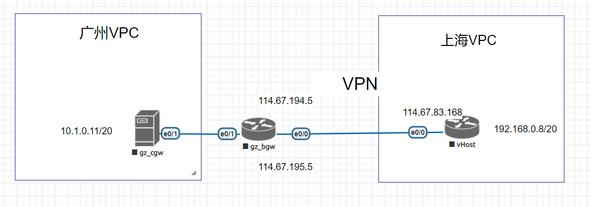
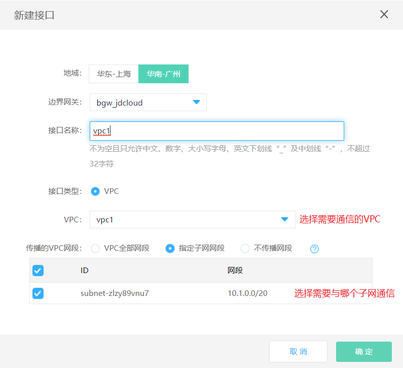
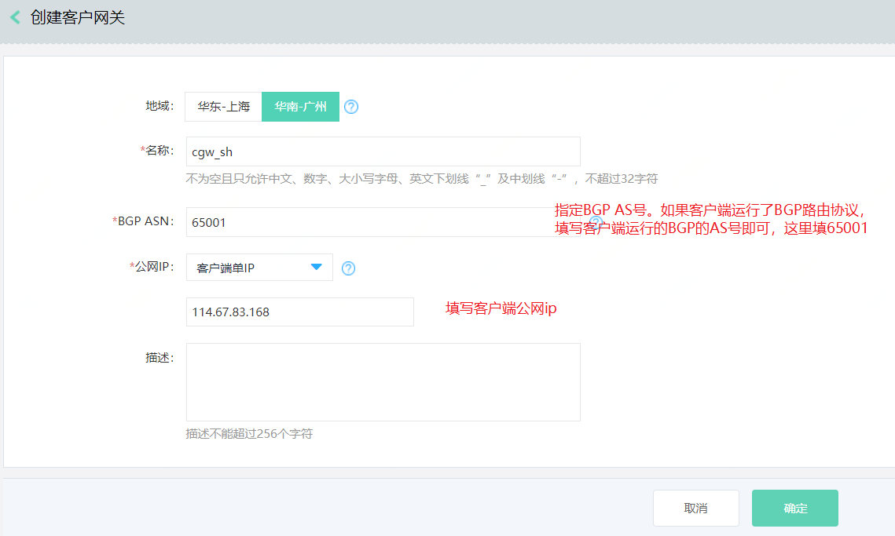
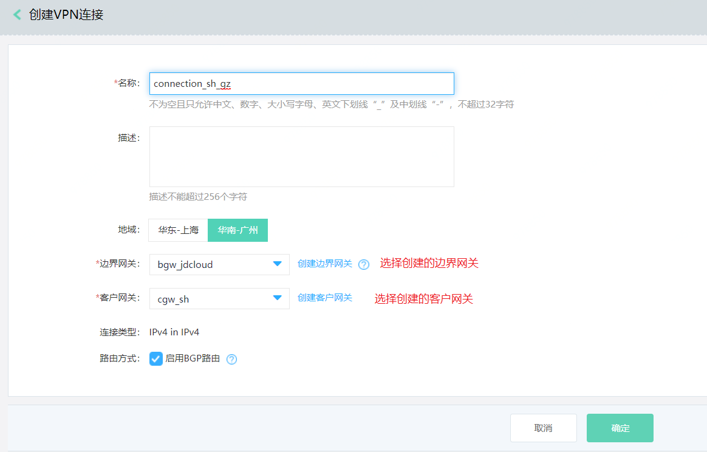
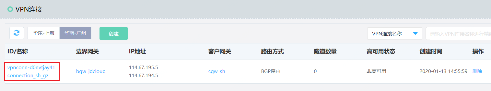
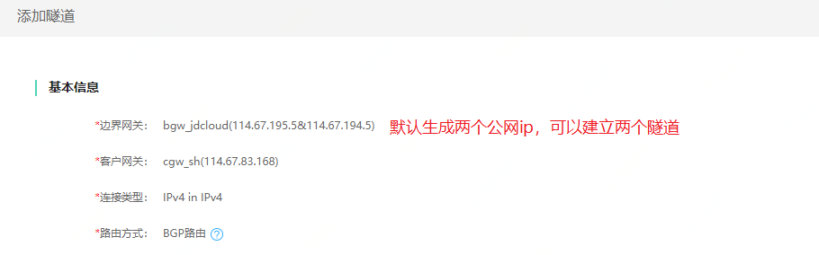
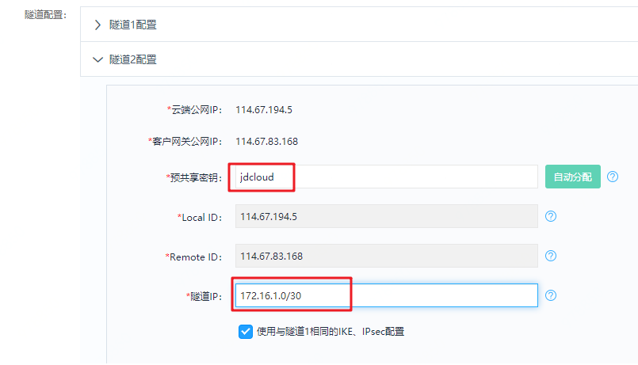
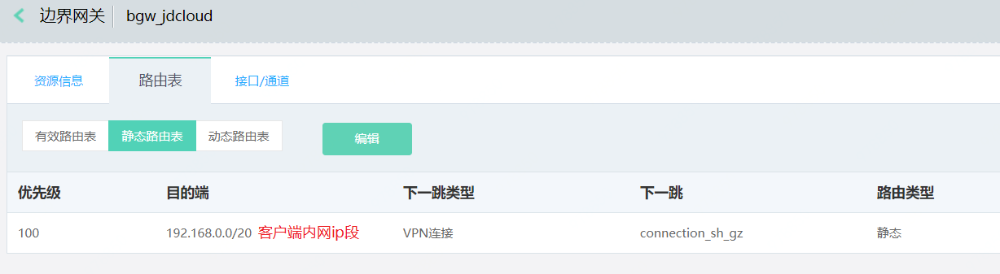
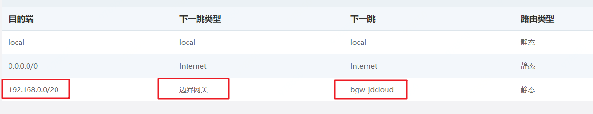
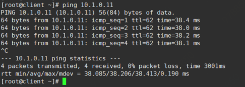

# 云主机通过strongswan与混合云vpn实现ipsecvpn互通

在京东云主机中部署strongswan，与混合云连接-VPN实现ipsec**vpn**互通。



## 一、控制台配置

1. 在广州创建边界网关

2. 创建VPC接口

   

   

3. 创建VPN-客户网关

   

4. 创建VPN-VPN连接

   

5. 点击VPN连接中，ID/名称的tab项

   

6. 添加隧道

   

7. 隧道1 ipsec协商参数配置，后续客户端配置需要与此一致

   

8. 隧道2 ipsec协商参数，点击确定保存

   

## 配置路由

1. 边界网关—路由表，添加去往客户端的静态路由，如果客户端运行的是BGP，则此处可以自动学习到路由

   

   

2. 配置广州VPC子网去往上海的路由，下一跳设置为边界网关

   

## 客户端云主机配置（华东上海CentOS7.4云主机)

1. 开启ip转发功能

   ```bash
   echo 1 > /proc/sys/net/ipv4/ip_forward
   ```

   

2. 安装strongswan

   ```bash
   yum install strongswan -y
   ```

   

3. 配置ipsec协商参数

   ```bash
   [root@windows2003 ~]# cat /etc/strongswan/ipsec.conf
   # ipsec.conf - strongSwan IPsec configuration file
   
   # basic configuration
   
   config setup
           # strictcrlpolicy=yes
           uniqueids = never
   
   conn jdcloud1
       authby=secret #认证方式
       ikelifetime=3600s  #IPSec SA协商间隔
       keylife=14400s  #ISAKMP SA协商间隔
       rekeymargin=3m  #密钥更新间隔
       keyingtries=1   #ISAKMP SA协商次数
       keyexchange=ikev1 #IKE版本，目前云上支持V1
       ike=aes256-sha256-modp1024 #ike的加密算法、认证算法、DH group，两边要保持一致
       esp=aes256-sha256-modp1024 #ipsec的加密算法、认证算法、PFS（完美向前密钥）
       auto=route #连接方式，可选"add，route，start，ignore"，"add"表示手动，"route"表示由连接触发，"start"表示自启，"ignore"表示忽略该策略
       type=tunnel #隧道模式
   
       right=114.67.195.5 #对端公网IP
       rightsubnet=10.1.0.0/20 #对端需要与本端通信的内网地址段
       rightauth=psk #采用预共享密钥
       rightid=114.67.195.5 #对端标示
   
       left=192.168.0.8 #本端IP，这里因云上CVM的公网IP是在TGW上用NAT映射过来的，所以只能填写服务器的内网IP，采用NAT穿透与对端建立VPN
       leftsubnet=192.168.0.0/20 #本端需要与对端通信的内网IP地址段
       leftauth=psk #采用预共享密钥
       leftid=114.67.83.168 #本端标示
   
   conn jdcloud2
       authby=secret #认证方式
       ikelifetime=3600s  #IPSec SA协商间隔
       keylife=14400s  #ISAKMP SA协商间隔
       rekeymargin=3m  #密钥更新间隔
       keyingtries=1   #ISAKMP SA协商次数
       keyexchange=ikev1 #IKE版本，目前云上支持V1
       ike=aes256-sha256-modp1024 #ike的加密算法、认证算法、DH group，两边要保持一致
       esp=aes256-sha256-modp1024 #ipsec的加密算法、认证算法、PFS（完美向前密钥）
       auto=route #连接方式，可选"add，route，start，ignore"，"add"表示手动，"route"表示由连接触发，"start"表示自启，"ignore"表示忽略该策略
       type=tunnel #隧道模式
   
       right=114.67.194.5 #对端公网IP
       rightsubnet=10.1.0.0/20 #对端需要与本端通信的内网地址段
       rightauth=psk #采用预共享密钥
       rightid=114.67.194.5 #对端标示
   
       left=192.168.0.8 #本端IP，这里因云上CVM的公网IP是在TGW上用NAT映射过来的，所以只能填写服务器的内网IP，采用NAT穿透与对端建立VPN
       leftsubnet=192.168.0.0/20 #本端需要与对端通信的内网IP地址段
       leftauth=psk #采用预共享密钥
       leftid=114.67.83.168 #本端标示
   ```

   

4. 设置预共享密钥

   ```bash
   [root@windows2003 strongswan]# cat ipsec.secrets
   # ipsec.secrets - strongSwan IPsec secrets file
   114.67.83.168 114.67.195.5 : PSK "jdcloud" #注意格式为本端公网ip 空格 对端公网ip 空格 冒号 空格 PSK 空格 双引号具体密钥
   114.67.83.168 114.67.194.5 : PSK "jdcloud" #注意格式为本端公网ip 空格 对端公网ip 空格 冒号 空格 PSK 空格 双引号具体密钥
   ```

   

5. 启动服务

   ```bash
   systemctl start strongswan #启动服务
   systemctl enable strongswan #设置开机启动
   systemctl status  strongswan #查看服务运行状态与部分最近日志
   ```

   

## 四、连通性测试

使用192.168.0.8 ping 10.1.0.11



