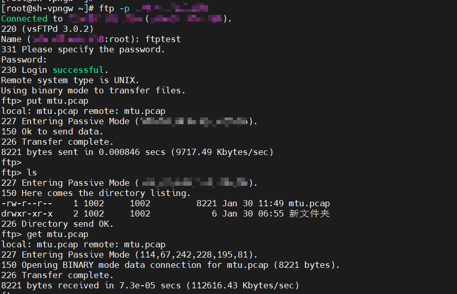

## vsftp安装部署

FTP支持两种工作模式：

- 主动模式：客户端向FTP服务器发送端口信息，由服务器主动连接该端口。
- 被动模式：FTP服务器开启并发送端口信息给客户端，由客户端连接该端口，服务器被动接受连接。

FTP支持以下三种认证模式：

- 匿名用户模式：任何人无需密码验证就可以直接登录到FTP服务器。
- 本地用户模式：通过Linux系统账号进行验证的模式，相较于匿名用户模式更安全。
- 虚拟用户模式：FTP服务器的专有用户。虚拟用户只能访问Linux系统为其提供的FTP服务，而不能访问Linux系统的其它资源。

因为大多数FTP客户端都在局域网中，没有独立的公网IP地址，主动模式下FTP服务器很难连接到客户端监听的端口，所以推荐将FTP服务配置为被动模式。本文主要介绍被动模式-本地用户模式的vsftpd服务安装部署配置。

### 环境

| 环境        | 版本                  |
| ----------- | --------------------- |
| Linux发行版 | CentOS7.4             |
| 内核版本    | 3.10.0-693.el7.x86_64 |
| vsftpd      | 3.0.2-29              |

### 安装

1. 安装vsftpd

   ```bash
   yum install -y vsftpd
   ```

2. 设置开机自启

   ```bash
   systemctl enable vsftpd.service
   ```

3. 查看端口监听，有21端口监听即正常

   ```bash
   netstat -tanlp | grep vsftpd
   ```

### 被动模式本地用户配置

> 注意：在云环境下，因为云主机出公网会经过一次NAT转换，被动模式下需要配置pasv_address为云主机绑定的公网ip地址。否则客户端收到vsftp服务端的ip是内网地址，如果客户端和服务端不在同一个内网，会导致网络不通无法正常传输数据。

1. 创建Linux用户ftptest

   ```bash
   useradd ftptest
   ```

2. 设置密码

   ```bash
   passwd ftptest
   ```

3. 创建供FTP服务使用的文件目录

   ```bash
   mkdir -p /data/ftp/pub
   ```

4. 设置文件目录属主属组

   ```bash
   chown -R ftptest:ftptest /data/ftp/pub
   ```

5. 配置`/etc/vsftpd/vsftpd.conf`

   ```bash
   # #禁止匿名登录FTP服务器。
   anonymous_enable=NO
   
   # 匿名用户可以上传文件
   anon_upload_enable=NO
   # 匿名用户可以建目录
   anon_mkdir_write_enable=NO
   # 匿名用户修改删除
   anon_other_write_enable=NO
   # 匿名上传文件所属用户名
   chown_username=ftp_anno
   
   # 允许本地用户登录FTP服务器
   local_enable=YES
   
   # 可以上传文件(全局控制)
   write_enable=YES
   
   # 本地用户上传的文件权限
   local_umask=022
   
   # 上传文件的权限配合umask使用
   file_open_mode=0666
   
   # 如果启动这个选项，那么使用者第一次进入一个目录时，会检查该目录下是否有.message这个文件，如果有，则会出现此文件的内容，通常这个文件会放置欢迎话语，或是对该目录的说明。默认值为开启。
   dirmessage_enable=YES
   
   # 设置目录消息文件，可将要显示的信息写入该文件。默认值为.message
   message_file=.message
   
   # 是否启用上传/下载日志记录。如果启用，则上传与下载的信息将被完整纪录在xferlog_file 所定义的文件中。预设为开启。
   xferlog_enable=YES
   # 设置日志文件名和路径
   xferlog_file=/var/log/vsftpd.log
   # 如果启用，则日志文件将会写成xferlog的标准格式
   xferlog_std_format=YES
   
   # 指定FTP使用20端口进行数据传输，默认值为YES
   connect_from_port_20=YES
   
   # 监听IPv4 sockets
   listen=YES
   
   # 关闭监听IPv6 sockets
   listen_ipv6=NO
   
   # 是否启用user_list文件。
   userlist_enable=YES
   
   # 控制用户访问FTP的文件，里面写着用户名称。一个用户名称一行
   userlist_file=/etc/vsftpd/user_list
   
   # 与/etc/pam.d/目录中的vsftpd文件名保持一致
   pam_service_name=vsftpd
   
   
   # 设置vsftpd是否与tcp wrapper相结合来进行主机的访问控制。默认值为YES。如果启用，则vsftpd服务器会检查/etc/hosts.allow 和/etc/hosts.deny 中的设置，来决定请求连接的主机，是否允许访问该FTP服务器。
   tcp_wrappers=YES
   
   # 当本地用户登入时，将被更换到定义的目录下。默认值为各用户的家目录。
   local_root=/data/ftp/pub
   
   # 用于指定用户列表文件中的用户是否允许切换到上级目录。默认值为NO。
   # 1. 当chroot_list_enable=YES，chroot_local_user=YES时，在/etc/vsftpd.chroot_list文件中列出的用户，可以切换到其他目录；未在文件中列出的用户，不能切换到其他目录
   # 2. 当chroot_list_enable=YES，chroot_local_user=NO时，在/etc/vsftpd.chroot_list文件中列出的用户，不能切换到其他目录；未在文件中列出的用户，可以切换到其他目录。
   # 3. 当chroot_list_enable=NO，chroot_local_user=YES时，所有的用户均不能切换到其他目录。
   # 4. 当chroot_list_enable=NO，chroot_local_user=NO时，所有的用户均可以切换到其他目录。
   chroot_local_user=YES
   # 设置是否启用chroot_list_file配置项指定的用户列表文件。默认值为NO。
   chroot_list_enable=YES
   # 用于指定用户列表文件，该文件用于控制哪些用户可以切换到用户家目录的上级目录。
   chroot_list_file=/etc/vsftpd/chroot_list
   
   # 表示被限制在主目录的用户对主目录具备写权限
   allow_writeable_chroot=YES
   
   # 若设置为YES，则使用被动模式；若设置为NO，则使用主动模式。
   pasv_enable=YES
   # FTP服务器公网IP地址
   pasv_address=114.67.242.228
   # 在被动模式下，数据连接可以使用的端口范围的最小端口，0 表示任意端口。默认值为0。
   pasv_min_port=50000
   # 在被动模式下，数据连接可以使用的端口范围的最大端口，0 表示任意端口。默认值为0。
   pasv_max_port=50010
   ```

6. 创建chroot_list文件

   ```bash
   touch /etc/vsftpd/chroot_list
   ```

7. 启动vsftpd服务

   ```bash
   systemctl start vsftpd.service
   ```

### 客户端验证

```
ftp -p FTP服务器公网IP
```

