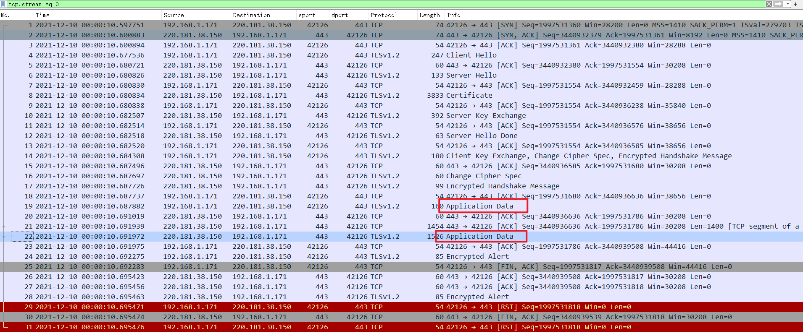
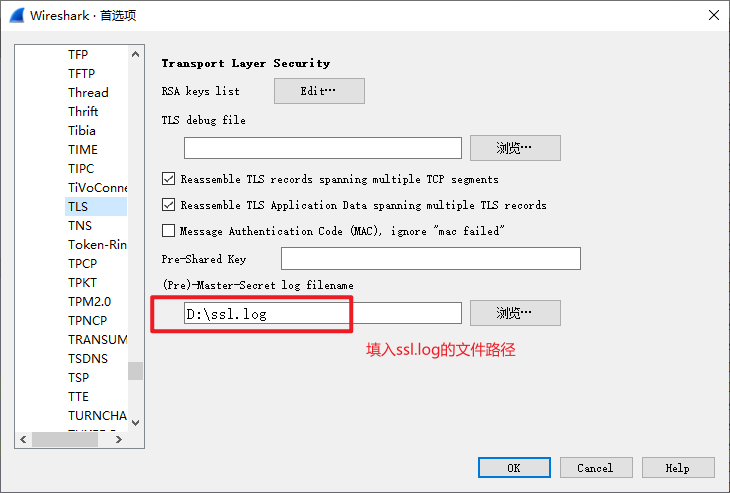
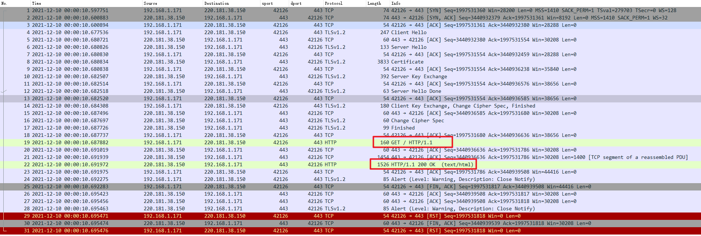
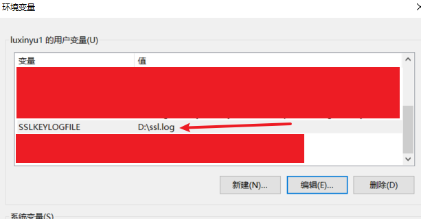

# wireshark解密https数据包

有时候排查问题需要抓包进行分析，但是https报文是加密的，这就给问题排查带来了困难。本教程教你如何通过wireshark解密https报文

## Linux

### 添加`SSLKEYLOGFILE`环境变量

1. 指定`SSLKEYLOGFILE`变量的值为一个目录文件

   ```bash
   export SSLKEYLOGFILE=~/key/ssl.log
   ```

2. 创建`~/key/ssl.log`文件

   ```bash
   mkdir ~/key/
   touch ~/key/ssl.log
   ```

### 发送请求抓取https报文

1. 使用`curl` 发送https请求，使用`tcpdump`抓包。
2. 将抓到的报文和`~/key/ssl.log`文件一起拷贝到装有wireshark的本地机器。

### 配置wireshark

使用wireshark打开报文，此时报文都是https加密的。



按照如下步骤配置`ssl.log`路径：编辑 - 首选项 - Protocols - TLS(SSL) ，填入ssl.log的文件路径，保存



此时wireshark中，https密文变成明文了。



## windows

windows的做法和Linux差不多。

1. 添加`SSLKEYLOGFILE`环境变量。

   

2. 用Chrome浏览器或者`curl`访问一个https服务，同时用wireshark抓包。

3. 参考上面Linux部分的做法，配置wireshark。


