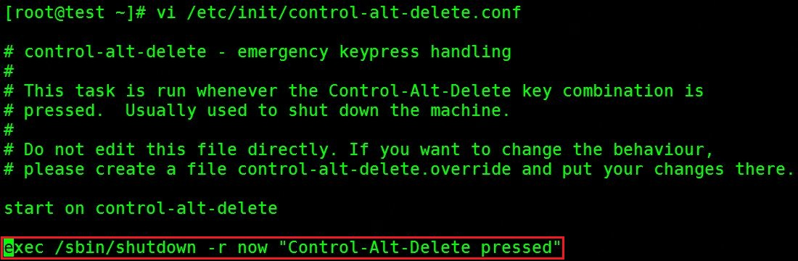

通过控制台网页远程连接CentOS系统时，点击VNC窗口右上角的Send CtrlAltDel按钮就会重启操作系统。在生产环境该按钮被误点击会造成较大影响，因此应该被禁用。该按钮调用的是CentOS系统内同时按下ctrl、alt、delete组合键重启系统的设置，因此可以修改系统相关配置文件禁用该功能。
不同版本的CentOS的修改方法也不同，下面分别介绍。

## CentOS 6.X系统

1、控制重启功能是否生效的是`/etc/init/control-alt-delete.conf`文件，编辑该文件，将如图中红框处条目注释掉，保存文件。

点击VNC窗口组合键按钮后系统不再重启
2、如需恢复组合键功能，将上述文件注释掉的条目取消注释，保存文件后重启系统，组合键可恢复功能。

## CentOS 7.X系统

1、控制重启功能是否生效的是`/usr/lib/systemd/system/ctrl-alt-del.target`文件，该文件是``/usr/lib/systemd/system/reboot.target`文件的软链接，如图

如果修改文件内容，会同步修改原文件，影响reboot命令正常运行，因此我们将该文件重命名为`/usr/lib/systemd/system/ctrl-alt-del.target.bak`，然后执行`init q`命令重新加载配置，即可使组合键功能失效，点击VNC窗口组合键按钮后系统不再重启

2、如需恢复组合键功能，将/usr/lib/systemd/system/ctrl-alt-del.target.bak文件重命名为/usr/lib/systemd/system/ctrl-alt-del.target，然后执行init q命令重新加载配置，即可使组合键可恢复功能。

