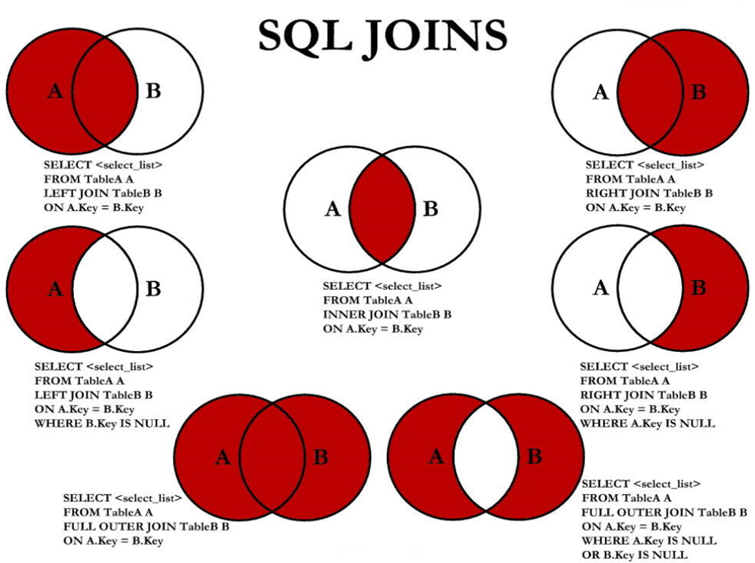

## 基本的SELECT语句

### SQL分类

SQL语言在功能上主要分为如下3大类：

* **DDL**（**Data Definition Languages、数据定义语言）**，这些语句定义了不同的数据库、表、视图、索引等数据库对象，还可以用来创建、删除、修改数据库和数据表的结构。
  * 主要的语句关键字包括`CREATE 、 DROP 、 ALTER`等。
* **DML**（**Data Manipulation Language、数据操作语言）**，用于添加、删除、更新和查询数据库记录，并检查数据完整性。
  * 主要的语句关键字包括`INSERT 、 DELETE 、 UPDATE 、 SELECT`等。
  * SELECT**是**SQL语言的基础，最为重要。
* **DCL**（**Data Control Language、数据控制语言）**，用于定义数据库、表、字段、用户的访问权限和安全级别。
  * 主要的语句关键字包括`GRANT 、 REVOKE 、 COMMIT 、 ROLLBACK 、 SAVEPOINT `等。

>因为查询语句使用的非常的频繁，所以很多人把查询语句单拎出来一类：DQL（数据查询语言）。
>
>还有单独将 COMMIT 、 ROLLBACK 取出来称为TCL （Transaction Control Language，事务控制语言）。

### SQL语言的规则与规范

#### 基本规则

* SQL 可以写在一行或者多行。为了提高可读性，各子句分行写，必要时使用缩进
* 每条命令以 ; 或 \g 或 \G 结束
* 关键字不能被缩写也不能分行
* 关于标点符号
  * 必须保证所有的()、单引号、双引号是成对结束的
  * 必须使用英文状态下的半角输入方式
  * 字符串型和日期时间类型的数据可以使用单引号（' '）表示
  * 列的别名，尽量使用双引号（" "），而且不建议省略as 

#### SQL大小写规范（建议遵守）

* MySQL **在** Windows **环境下是大小写不敏感的**
* MySQL **在** Linux **环境下是大小写敏感的**
  * 数据库名、表名、表的别名、变量名是严格区分大小写的
  * 关键字、函数名、列名(或字段名)、列的别名(字段的别名) 是忽略大小写的。
* **推荐采用统一的书写规范：**
  * 数据库名、表名、表别名、字段名、字段别名等都小写
  * SQL 关键字、函数名、绑定变量等都大写

#### 注释

可以使用如下格式的注释结构

```sql
单行注释：#注释文字(MySQL特有的方式)
单行注释：-- 注释文字(--后面必须包含一个空格。)
多行注释：/* 注释文字 */
```

#### 命名规则

* 数据库、表名不得超过30个字符，变量名限制为29个
* 必须只能包含 A–Z, a–z, 0–9, _共63个字符
* 数据库名、表名、字段名等对象名中间不要包含空格
* 同一个MySQL软件中，数据库不能同名；同一个库中，表不能重名；同一个表中，字段不能重名
* 必须保证你的字段没有和保留字、数据库系统或常用方法冲突。如果坚持使用，请在SQL语句中使用`（着重号）引起来
* 保持字段名和类型的一致性，在命名字段并为其指定数据类型的时候一定要保证一致性。假如数据类型在一个表里是整数，那在另一个表里可就别变成字符型了

举例：

```sql
#以下两句是一样的，不区分大小写
show databases;
SHOW DATABASES;

#创建表格
#create table student info(...); #表名错误，因为表名有空格
create table student_info(...);

#其中order使用``飘号，因为order和系统关键字或系统函数名等预定义标识符重名了
CREATE TABLE `order` (id INT, lname VARCHAR(20));

select id as "编号", `name` as "姓名" from t_stu; # 起别名时，as都可以省略
select id as 编号, `name` as 姓名 from t_stu; # 如果字段别名中没有空格，那么可以省略"
select id as 编 号, `name` as 姓 名 from t_stu; # 错误，如果字段别名中有空格，那么不能省略""
```

#### 数据导入指令

在命令行客户端登录mysql，使用source指令导入

```sql
mysql> source d:\mysqldb.sql
```

```sql
desc employees;
+----------------+-------------+------+-----+---------+-------+
| Field          | Type        | Null | Key | Default | Extra |
+----------------+-------------+------+-----+---------+-------+
| employee_id    | int(6)      | NO   | PRI | 0       |       |
| first_name     | varchar(20) | YES  |     | NULL    |       |
| last_name      | varchar(25) | NO   |     | NULL    |       |
| email          | varchar(25) | NO   | UNI | NULL    |       |
| phone_number   | varchar(20) | YES  |     | NULL    |       |
| hire_date      | date        | NO   |     | NULL    |       |
| job_id         | varchar(10) | NO   | MUL | NULL    |       |
| salary         | double(8,2) | YES  |     | NULL    |       |
| commission_pct | double(2,2) | YES  |     | NULL    |       |
| manager_id     | int(6)      | YES  | MUL | NULL    |       |
| department_id  | int(4)      | YES  | MUL | NULL    |       |
+----------------+-------------+------+-----+---------+-------+
11 rows in set (0.01 sec)
```

### 基本的SELECT语句

#### SELECT...

```sql
SELECT 1; #没有任何子句
SELECT 9/2; #没有任何子句
```


#### SELECT ... FROM

* 语法

  ```sql
  SELECT 标识选择哪些列
  FROM 标识从哪个表中选择
  ```

  

* 选择全部列

  ```sql
  SELECT * FROM departments;
  ```

  > 一般情况下，除非需要使用表中所有的字段数据，最好不要使用通配符*。使用通配符虽然可以节省输入查询语句的时间，但是获取不需要的列数据通常会降低查询和所使用的应用程序的效率。通配符的优势是，当不知道所需要的列的名称时，可以通过它获取它们。
  >
  > 在生产环境下，不推荐你直接使用 SELECT * 进行查询。

* 选择特定的列

  ```sql
  SELECT department_id, location_id FROM departments;
  ```

  >MySQL中的SQL语句是不区分大小写的，因此SELECT和select的作用是相同的，但是，许多开发人员习惯将关键字大写、数据列和表名小写，读者也应该养成一个良好的编程习惯，这样写出来的代码更容易阅读和维护。

#### 列的别名

* 重命名一个列

* 便于计算

* 紧跟列名，也可以**在列名和别名之间加入关键字**AS**，别名使用双引号**，以便在别名中包含空格或特殊的字符并区分大小写。

* AS可以省略

* 建议别名简短，见名知意

* 举例

  ```sql
  SELECT last_name AS name, commission_pct comm FROM employees;
  
  SELECT last_name "Name", salary*12 "Annual Salary" FROM employees;
  ```

  

#### 去除重复行

在SELECT语句中使用关键字DISTINCT去除重复行

```sql
SELECT DISTINCT department_id FROM employees;
SELECT DISTINCT department_id,salary FROM employees;
```

这里有两点需要注意：

1. DISTINCT 需要放到所有列名的前面，如果写成`SELECT salary, DISTINCT department_id FROM employees`会报错。
2. DISTINCT 其实是对后面所有列名的组合进行去重，你能看到最后的结果是 74 条，因为这 74 个部门id不同，都有 salary 这个属性值。如果你想要看都有哪些不同的部门（department_id），只需要写`DISTINCT department_id`即可，后面不需要再加其他的列名了。

#### 空值参与运算

所有运算符或列值遇到null值，运算的结果都为null

```sql
SELECT employee_id,salary,commission_pct, 12 * salary * (1 + commission_pct) "annual_sal" FROM employees;


```

这里你一定要注意，在 MySQL 里面， 空值不等于空字符串。一个空字符串的长度是 0，而一个空值的长度是空。而且，在 MySQL 里面，空值是占用空间的。

#### 着重号

我们需要保证表中的字段、表名等没有和保留字、数据库系统或常用方法冲突。如果真的相同，请在SQL语句中使用一对``（着重号）引起来。

```sql
> SELECT * FROM `order`;
+----------+------------+
| order_id | order_name |
+----------+------------+
|        1 | shkstart   |
|        2 | tomcat     |
|        3 | dubbo      |
+----------+------------+
3 rows in set (0.00 sec)
```


#### 查询常数

SELECT 查询还可以对常数进行查询。对的，就是在 SELECT 查询结果中增加一列固定的常数列。这列的取值是我们指定的，而不是从数据表中动态取出的。

你可能会问为什么我们还要对常数进行查询呢？

SQL 中的 SELECT 语法的确提供了这个功能，一般来说我们只从一个表中查询数据，通常不需要增加一个固定的常数列，但如果我们想整合不同的数据源，用常数列作为这个表的标记，就需要查询常数。

比如说，我们想对 employees 数据表中的员工姓名进行查询，同时增加一列字段 corporation ，这个字段固定值为“尚硅谷”，可以这样写：

```sql
SELECT '尚硅谷' as corporation, last_name FROM employees;
```


### 显示表结构

使用`DESCRIBE`或`DESC`命令，表示表结构。

```sql
DESCRIBE employees;
或
DESC employees;
```

```sql
> desc employees;
+----------------+-------------+------+-----+---------+-------+
| Field          | Type        | Null | Key | Default | Extra |
+----------------+-------------+------+-----+---------+-------+
| employee_id    | int(6)      | NO   | PRI | 0       |       |
| first_name     | varchar(20) | YES  |     | NULL    |       |
| last_name      | varchar(25) | NO   |     | NULL    |       |
| email          | varchar(25) | NO   | UNI | NULL    |       |
| phone_number   | varchar(20) | YES  |     | NULL    |       |
| hire_date      | date        | NO   |     | NULL    |       |
| job_id         | varchar(10) | NO   | MUL | NULL    |       |
| salary         | double(8,2) | YES  |     | NULL    |       |
| commission_pct | double(2,2) | YES  |     | NULL    |       |
| manager_id     | int(6)      | YES  | MUL | NULL    |       |
| department_id  | int(4)      | YES  | MUL | NULL    |       |
+----------------+-------------+------+-----+---------+-------+
11 rows in set (0.01 sec)
```

其中，各个字段的含义分别解释如下：

| 字段    | 解释                                                         |
| ------- | ------------------------------------------------------------ |
| Field   | 字段名称。                                                   |
| Type    | 表示字段类型。                                               |
| Null    | 表示该列是否可以存储NULL值。                                 |
| Key     | 表示该列是否已编制索引。PRI表示该列是表主键的一部分；UNI表示该列是UNIQUE索引的一部分；MUL表示在列中某个给定值允许出现多次。 |
| Default | 表示该列 是否有默认值，如果有，那么值是多少。                |
| Extra   | 表示可以获取的与给定列有关的附加信息，例如AUTO_INCREMENT等。 |

### 过滤数据

* 语法

  ```sql
  SELECT 字段1,字段2
  FROM 表名
  WHERE 过滤条件
  ```

  * 使用WHERE 子句，将不满足条件的行过滤掉
  * WHERE子句紧随 FROM子句

* 举例

  ```sql
  SELECT employee_id, last_name, job_id, department_id
  FROM employees
  WHERE department_id = 90;
  ```

### 练习

* 计算12个月的基本工资和奖金总和

  ```sql
  SELECT employee_id,last_name,salary*12*(1+IFNULL (commission_pct,0)) AS "annual salary"
  FROM employees;
  ```

  

* 查询employees表中去除重复的job_id以后的数据

  ```sql
  SELECT DISTINCT job_id
  FROM employees
  ```

  

* 查询工资大于12000的员工姓名和工资

  ```sql
  SELECT last_name,first_name,salary
  FROM employees
  WHERE salary > 12000;
  ```

  

* 查询员工号为176的员工的姓名和部门号

  ```sql
  SELECT last_name,first_name,department_id
  FROM employees
  WHERE employee_id=176
  ```

  

* 显示表 departments 的结构，并查询其中的全部数据

  ```sql
  DESC departments
  SELECT * FROM departments
  ```

  

## 排序与分页

### 排序数据

#### 排序规则

* 使用`ORDER BY`子句排序
  * ASC(ascend)：升序
  * DESC(descend)：降序
* `ORDER BY`子句在`SELECT`语句的结尾

#### 单列排序

```sql
# 默认使用ASC升序排序
SELECT last_name, job_id, department_id, hire_date
FROM employees
ORDER BY hire_date;
```

```sql
SELECT last_name, job_id, department_id, hire_date
FROM employees
ORDER BY hire_date DESC;
```

```sql
# 可以根据别名排序
# 注意别名不能用于WHERE子句过滤数据，因为SQL先执行FROM和WHERE，然后执行SELECT，最后执行ORDER BY
SELECT employee_id, last_name, salary*12 annsal
FROM employees
ORDER BY annsal;
```


#### 多列排序

* 可以使用不在SELECT列表中的列排序。
* 在对多列进行排序的时候，首先排序的第一列必须有相同的列值，才会对第二列进行排序。如果第一列数据中所有值都是唯一的，将不再对第二列进行排序。

```sql
SELECT last_name, department_id, salary
FROM employees
ORDER BY department_id, salary DESC;
```

### 分页

#### 背景

* 背景1：查询返回的记录太多了，查看起来很不方便，怎么样能够实现分页查询呢？
* 背景2：表里有 4 条数据，我们只想要显示第 2、3 条数据怎么办呢？

#### 实现规则

* 分页原理

  所谓分页显示，就是将数据库中的结果集，一段一段显示出来需要的条件。

* **MySQL中使用LIMIT实现分页**

* 格式：

  ```sql
  LIMIT [位置偏移量,] 行数
  ```

  第一个“位置偏移量”参数指示MySQL从哪一行开始显示，是一个可选参数，如果不指定“位置偏移量”，将会从表中的第一条记录开始（第一条记录的位置偏移量是0，第二条记录的位置偏移量是1，以此类推）；第二个参数“行数”指示返回的记录条数。

* 举例

  ```sql
  -- 前10条记录： 
  SELECT * FROM 表名 LIMIT 0,10;
  -- 或者
  SELECT * FROM 表名 LIMIT 10;
  
  -- 第11至20条记录：
  SELECT * FROM 表名 LIMIT 10,10;
  
  -- 第21至30条记录：
  SELECT * FROM 表名 LIMIT 20,10;
  ```

  > MySQL 8.0中可以使用“LIMIT 3 OFFSET 4”，意思是获取从第5条记录开始后面的3条记录，和“LIMIT 4,3;”返回的结果相同。

* 分页显示公式：**（当前页数-1）* 每页条数，每页条数**

  ```sql
  SELECT * FROM table
  LIMIT(PageNo - 1)*PageSize,PageSize;
  ```

  

* 注意：LIMIT子句必须放在整个SELECT语句的最后！

* 使用LIMIT的好处

  约束返回结果的数量可以`减少数据表的网络传输量`，也可以`提升查询效率`。如果我们知道返回结果只有1 条，就可以使用`LIMIT 1`，告诉 SELECT 语句只需要返回一条记录即可。这样的好处就是 SELECT 不需要扫描完整的表，只需要检索到一条符合条件的记录即可返回。

#### 拓展

在不同的 DBMS 中使用的关键字可能不同。在 MySQL、PostgreSQL、MariaDB 和 SQLite 中使用 LIMIT 关键字，而且需要放到 SELECT 语句的最后面。

* 如果是 SQL Server 和 Access，需要使用 TOP 关键字，比如:

  ```sql
  SELECT TOP 5 name, hp_max FROM heros ORDER BY hp_max DESC
  ```

  

* 如果是 DB2，使用 FETCH FIRST 5 ROWS ONLY 这样的关键字:

  ```sql
  SELECT name, hp_max FROM heros ORDER BY hp_max DESC FETCH FIRST 5 ROWS ONLY
  ```

  

* 如果是 Oracle，你需要基于 ROWNUM 来统计行数：

  ```sql
  SELECT rownum,last_name,salary FROM employees WHERE rownum < 5 ORDER BY salary DESC;
  ```

  需要说明的是，这条语句是先取出来前 5 条数据行，然后再按照 hp_max 从高到低的顺序进行排序。但这样产生的结果和上述方法的并不一样。我会在后面讲到子查询，你可以使用

  ```sql
  SELECT rownum, last_name,salary FROM (
      SELECT last_name,salary
      FROM employees
      ORDER BY salary DESC)
  WHERE rownum < 10;
  ```

  得到与上述方法一致的结果。


## 多表查询



```sql
#中图：内连接 A∩B
SELECT employee_id,last_name,department_name
FROM employees e INNER JOIN departments d
ON e.`department_id` = d.`department_id`;
```

```sql
#左上图：左外连接
SELECT employee_id,last_name,department_name
FROM employees e LEFT JOIN departments d
ON e.`department_id` = d.`department_id`;
```

```sql
#右上图：右外连接
SELECT employee_id,last_name,department_name
FROM employees e RIGHT JOIN departments d
ON e.`department_id` = d.`department_id`;
```

```sql
#左中图：A - A∩B
SELECT employee_id,last_name,department_name
FROM employees e LEFT JOIN departments d
ON e.`department_id` = d.`department_id`
WHERE d.`department_id` IS NULL
```

```sql
#右中图：B-A∩B
SELECT employee_id,last_name,department_name
FROM employees e RIGHT JOIN departments d
ON e.`department_id` = d.`department_id`
WHERE e.`department_id` IS NULL
```

```sql
#左下图：满外连接
# 左中图 + 右上图 A∪B
SELECT employee_id,last_name,department_name
FROM employees e LEFT JOIN departments d
ON e.`department_id` = d.`department_id`
WHERE d.`department_id` IS NULL
UNION ALL #没有去重操作，效率高
SELECT employee_id,last_name,department_name
FROM employees e RIGHT JOIN departments d
ON e.`department_id` = d.`department_id`;
```

```sql
#右下图
#左中图 + 右中图 A ∪ B - A∩B 或者 (A - A∩B) ∪ (B - A∩B)
SELECT employee_id,last_name,department_name
FROM employees e LEFT JOIN departments d
ON e.`department_id` = d.`department_id`
WHERE d.`department_id` IS NULL
UNION ALL
SELECT employee_id,last_name,department_name
FROM employees e RIGHT JOIN departments d
ON e.`department_id` = d.`department_id`
WHERE e.`department_id` IS NULL
```


## 子查询

