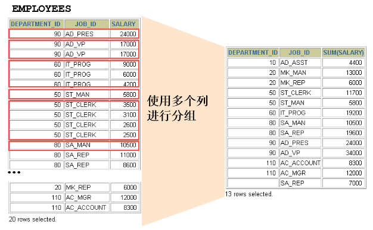
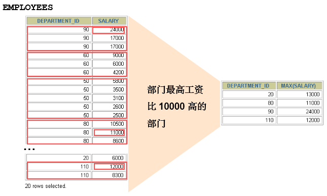
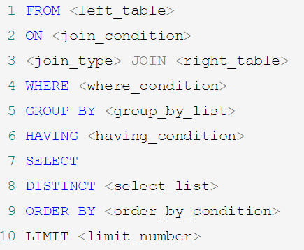

## 单行函数

### 数值函数

#### 基本函数

| 函数                | 用法                                                         |
| ------------------- | ------------------------------------------------------------ |
| ABS(x)              | 返回x的绝对值                                                |
| SIGN(X)             | 返回X的符号。正数返回1，负数返回-1，0返回0                   |
| PI()                | 返回圆周率的值                                               |
| CEIL(x)，CEILING(x) | 返回大于或等于某个值的最小整数                               |
| FLOOR(x)            | 返回小于或等于某个值的最大整数                               |
| LEAST(e1,e2,e3…)    | 返回列表中的最小值                                           |
| GREATEST(e1,e2,e3…) | 返回列表中的最大值                                           |
| MOD(x,y)            | 返回X除以Y后的余数                                           |
| RAND()              | 返回0~1的随机值                                              |
| RAND(x)             | 返回0~1的随机值，其中x的值用作种子值，相同的X值会产生相同的随机数 |
| ROUND(x)            | 返回一个对x的值进行四舍五入后，最接近于X的整数               |
| ROUND(x,y)          | 返回一个对x的值进行四舍五入后最接近X的值，并保留到小数点后面Y位 |
| TRUNCATE(x,y)       | 返回数字x截断为y位小数的结果                                 |
| SQRT(x)             | 返回x的平方根。当X的值为负数时，返回NULL                     |

举例：

```sql
SELECT 
ABS(-123),ABS(32),SIGN(-23),SIGN(43),PI(),CEIL(32.32),CEILING(-43.23),FLOOR(32.32), FLOOR(-43.23),MOD(12,5) 
FROM DUAL\G
*************************** 1. row ***************************
      ABS(-123): 123
        ABS(32): 32
      SIGN(-23): -1
       SIGN(43): 1
           PI(): 3.141593
    CEIL(32.32): 33
CEILING(-43.23): -43
   FLOOR(32.32): 32
  FLOOR(-43.23): -44
      MOD(12,5): 2
1 row in set (0.00 sec)
```

```sql
SELECT 
RAND(),RAND(),RAND(10),RAND(10),RAND(-1),RAND(-1)
FROM DUAL\G
*************************** 1. row ***************************
  RAND(): 0.05304182977698914
  RAND(): 0.6308747628991257
RAND(10): 0.6570515219653505
RAND(10): 0.6570515219653505
RAND(-1): 0.9050373219931845
RAND(-1): 0.9050373219931845
1 row in set (0.00 sec)
```

```sql
SELECT
ROUND(12.33),ROUND(12.343,2),ROUND(12.324,-1),TRUNCATE(12.66,1),TRUNCATE(12.66,-1)
FROM DUAL\G
*************************** 1. row ***************************
      ROUND(12.33): 12
   ROUND(12.343,2): 12.34
  ROUND(12.324,-1): 10
 TRUNCATE(12.66,1): 12.6
TRUNCATE(12.66,-1): 10
1 row in set (0.00 sec)
```

#### 角度与弧度互换函数

| 函数       | 用法                                  |
| ---------- | ------------------------------------- |
| RADIANS(x) | 将角度转化为弧度，其中，参数x为角度值 |
| DEGREES(x) | 将弧度转化为角度，其中，参数x为弧度值 |

示例：

```sql
SELECT
RADIANS(30),RADIANS(60),RADIANS(90),DEGREES(2*PI()),DEGREES(RADIANS(90))
FROM DUAL\G
*************************** 1. row ***************************
         RADIANS(30): 0.5235987755982988
         RADIANS(60): 1.0471975511965976
         RADIANS(90): 1.5707963267948966
     DEGREES(2*PI()): 360
DEGREES(RADIANS(90)): 90
1 row in set (0.00 sec)

```

#### 三角函数

| 函数       | 用法                                                         |
| ---------- | ------------------------------------------------------------ |
| SIN(x)     | 返回x的正弦值，其中，参数x为弧度值                           |
| ASIN(x)    | 返回x的反正弦值，即获取正弦为x的值。如果x的值不在-1到1之间，则返回NULL |
| COS(x)     | 返回x的余弦值，其中，参数x为弧度值                           |
| ACOS(x)    | 返回x的反余弦值，即获取余弦为x的值。如果x的值不在-1到1之间，则返回NULL |
| TAN(x)     | 返回x的正切值，其中，参数x为弧度值                           |
| ATAN(x)    | 返回x的反正切值，即返回正切值为x的值                         |
| ATAN2(m,n) | 返回两个参数的反正切值                                       |
| COT(x)     | 返回x的余切值，其中，X为弧度值                               |

示例：

```sql
SELECT
SIN(RADIANS(30)),DEGREES(ASIN(1)),TAN(RADIANS(45)),DEGREES(ATAN(1)),DEGREES(ATAN2(1,1))
FROM DUAL\G
*************************** 1. row ***************************
   SIN(RADIANS(30)): 0.49999999999999994
   DEGREES(ASIN(1)): 90
   TAN(RADIANS(45)): 0.9999999999999999
   DEGREES(ATAN(1)): 45
DEGREES(ATAN2(1,1)): 45
1 row in set (0.00 sec)
```

#### 指数与对数

| 函数                 | 用法                                                 |
| -------------------- | ---------------------------------------------------- |
| POW(x,y)，POWER(X,Y) | 返回x的y次方                                         |
| EXP(X)               | 返回e的X次方，其中e是一个常数，2.718281828459045     |
| LN(X)，LOG(X)        | 返回以e为底的X的对数，当X <= 0 时，返回的结果为NULL  |
| LOG10(X)             | 返回以10为底的X的对数，当X <= 0 时，返回的结果为NULL |
| LOG2(X)              | 返回以2为底的X的对数，当X <= 0 时，返回NULL          |

示例：

```sql
SELECT
POW(2,5),POWER(2,4),EXP(2),LN(10),LOG10(10),LOG2(4)
FROM DUAL\G
*************************** 1. row ***************************
  POW(2,5): 32
POWER(2,4): 16
    EXP(2): 7.38905609893065
    LN(10): 2.302585092994046
 LOG10(10): 1
   LOG2(4): 2
1 row in set (0.00 sec)
```

#### 进制间的转换

| 函数          | 用法                     |
| ------------- | ------------------------ |
| BIN(x)        | 返回x的二进制编码        |
| HEX(x)        | 返回x的十六进制编码      |
| OCT(x)        | 返回x的八进制编码        |
| CONV(x,f1,f2) | 返回f1进制数变成f2进制数 |

示例：

```sql
SELECT BIN(10),HEX(10),OCT(10),CONV(10,2,8) FROM DUAL\G
*************************** 1. row ***************************
     BIN(10): 1010
     HEX(10): A
     OCT(10): 12
CONV(10,2,8): 2
1 row in set (0.01 sec)
```

### 字符串函数

| 函数                              | 用法                                                         |
| --------------------------------- | ------------------------------------------------------------ |
| ASCII(S)                          | 返回字符串S中的第一个字符的ASCII码值                         |
| CHAR_LENGTH(s)                    | 返回字符串s的字符数。作用与CHARACTER_LENGTH(s)相同           |
| LENGTH(s)                         | 返回字符串s的字节数，和字符集有关                            |
| CONCAT(s1, s2, ..., sn)           | 连接s1,s2,......,sn为一个字符串                              |
| CONCAT_WS(x, s1,s2, ..., sn)      | 同CONCAT(s1,s2,...)函数，但是每个字符串之间要加上x           |
| INSERT(str, idx, len, replacestr) | 将字符串str从第idx位置开始，len个字符长的子串替换为字符串replacestr |
| REPLACE(str, a, b)                | 用字符串b替换字符串str中所有出现的字符串a                    |
| REPLACE(str, a, b)                | 用字符串b替换字符串str中所有出现的字符串a                    |
| UPPER(s) 或 UCASE(s)              | 将字符串s的所有字母转成大写字母                              |
| LOWER(s) 或LCASE(s)               | 将字符串s的所有字母转成小写字母                              |
| LEFT(str,n)                       | 返回字符串str最左边的n个字符                                 |
| RIGHT(str,n)                      | 返回字符串str最右边的n个字符                                 |
| LPAD(str, len, pad)               | 用字符串pad对str最左边进行填充，直到str的长度为len个字符     |
| RPAD(str ,len, pad)               | 用字符串pad对str最右边进行填充，直到str的长度为len个字符     |
| LTRIM(s)                          | 去掉字符串s左侧的空格                                        |
| RTRIM(s)                          | 去掉字符串s右侧的空格                                        |
| TRIM(s)                           | 去掉字符串s开始与结尾的空格                                  |
| TRIM(s1 FROM s)                   | 去掉字符串s开始与结尾的s1                                    |
| TRIM(LEADING s1 FROM s)           | 去掉字符串s开始处的s1                                        |
| TRIM(TRAILING s1 FROM s)          | 去掉字符串s结尾处的s1                                        |
| REPEAT(str, n)                    | 返回str重复n次的结果                                         |
| SPACE(n)                          | 返回n个空格                                                  |
| STRCMP(s1,s2)                     | 比较字符串s1,s2的ASCII码值的大小                             |
| SUBSTR(s,index,len)               | 返回从字符串s的index位置len个字符，作用与SUBSTRING(s,n,len)、MID(s,n,len)相同 |
| LOCATE(substr,str)                | 返回字符串substr在字符串str中首次出现的位置，作用于POSITION(substr IN str)、INSTR(str,substr)相同。未找到，返回0 |
| ELT(m,s1,s2,…,sn)                 | 返回指定位置的字符串，如果m=1，则返回s1，如果m=2，则返回s2，如果m=n，则返回sn |
| FIELD(s,s1,s2,…,sn)               | 返回字符串s在字符串列表中第一次出现的位置                    |
| FIND_IN_SET(s1,s2)                | 返回字符串s1在字符串s2中出现的位置。其中，字符串s2是一个以逗号分隔的字符串 |
| REVERSE(s)                        | 返回s反转后的字符串                                          |
| NULLIF(value1,value2)             | 比较两个字符串，如果value1与value2相等，则返回NULL，否则返回value1 |

> 注意：MySQL中，字符串的位置是从1开始的。

### 日期和时间函数

#### 获取日期、时间

| 函数                                                         | 用法                           |
| ------------------------------------------------------------ | ------------------------------ |
| CURDATE() ，CURRENT_DATE()                                   | 返回当前日期，只包含年、月、日 |
| CURTIME() ， CURRENT_TIME()                                  | 返回当前时间，只包含时、分、秒 |
| NOW() / SYSDATE() / CURRENT_TIMESTAMP() / LOCALTIME() / LOCALTIMESTAMP() | 返回当前系统日期和时间         |
| UTC_DATE()                                                   | 返回UTC（世界标准时间）日期    |
| UTC_TIME()                                                   | 返回UTC（世界标准时间）时间    |

举例：

```sql
SELECT
CURDATE(),CURTIME(),NOW(),SYSDATE()+0,UTC_DATE(),UTC_DATE()+0,UTC_TIME(),UTC_TIME()+0
FROM DUAL\G
*************************** 1. row ***************************
   CURDATE(): 2022-04-15
   CURTIME(): 16:15:18
       NOW(): 2022-04-15 16:15:18
 SYSDATE()+0: 20220415161518
  UTC_DATE(): 2022-04-15
UTC_DATE()+0: 20220415
  UTC_TIME(): 08:15:18
UTC_TIME()+0: 81518
1 row in set (0.00 sec)
```

#### 日期与时间戳的转换

| 函数                     | 用法                                   |
| ------------------------ | -------------------------------------- |
| UNIX_TIMESTAMP()         | 以UNIX时间戳的形式返回当前时间。       |
| UNIX_TIMESTAMP(date)     | 将时间date以UNIX时间戳的形式返回。     |
| FROM_UNIXTIME(timestamp) | 将UNIX时间戳的时间转换为普通格式的时间 |

举例：

```sql
SELECT
UNIX_TIMESTAMP(now()),
UNIX_TIMESTAMP(CURDATE()),
UNIX_TIMESTAMP(CURTIME()),
UNIX_TIMESTAMP('2011-11-11 11:11:11'),
FROM_UNIXTIME(1650010916)\G
*************************** 1. row ***************************
                UNIX_TIMESTAMP(now()): 1650010885
            UNIX_TIMESTAMP(CURDATE()): 1649952000
            UNIX_TIMESTAMP(CURTIME()): 1650010885
UNIX_TIMESTAMP('2011-11-11 11:11:11'): 1320981071
            FROM_UNIXTIME(1576380910): 2019-12-15 11:35:10
```

#### 获取月份、星期、星期数、天数等函数

| 函数                                     | 用法                                            |
| ---------------------------------------- | ----------------------------------------------- |
| YEAR(date) / MONTH(date) / DAY(date)     | 返回具体的日期值                                |
| HOUR(time) / MINUTE(time) / SECOND(time) | 返回具体的时间值                                |
| MONTHNAME(date)                          | 返回月份：January，...                          |
| DAYNAME(date)                            | 返回星期几：MONDAY，TUESDAY.....SUNDAY          |
| WEEKDAY(date)                            | 返回周几，注意，周1是0，周2是1，。。。周日是6   |
| QUARTER(date)                            | 返回日期对应的季度，范围为1～4                  |
| WEEK(date) ,  WEEKOFYEAR(date)           | 返回一年中的第几周                              |
| DAYOFYEAR(date)                          | 返回日期是一年中的第几天                        |
| DAYOFMONTH(date)                         | 返回日期位于所在月份的第几天                    |
| DAYOFWEEK(date)                          | 返回周几，注意：周日是1，周一是2，。。。周六是7 |

举例：

```sql
SELECT
YEAR(CURDATE()),
MONTH(CURDATE()),
DAY(CURDATE()),
HOUR(CURTIME()),
MINUTE(NOW()),
SECOND(SYSDATE())
FROM DUAL\G
*************************** 1. row ***************************
  YEAR(CURDATE()): 2022
 MONTH(CURDATE()): 4
   DAY(CURDATE()): 15
  HOUR(CURTIME()): 16
    MINUTE(NOW()): 25
SECOND(SYSDATE()): 39
1 row in set (0.00 sec)

```

```sql
SELECT
MONTHNAME('2021-10-26'),
DAYNAME('2021-10-26'),
WEEKDAY('2021-10-26'),
QUARTER(CURDATE()),
WEEK(CURDATE()),
DAYOFYEAR(NOW()),
DAYOFMONTH(NOW()),
DAYOFWEEK(NOW())
FROM DUAL\G
*************************** 1. row ***************************
MONTHNAME('2021-10-26'): October
  DAYNAME('2021-10-26'): Tuesday
  WEEKDAY('2021-10-26'): 1
     QUARTER(CURDATE()): 2
        WEEK(CURDATE()): 15
       DAYOFYEAR(NOW()): 105
      DAYOFMONTH(NOW()): 15
       DAYOFWEEK(NOW()): 6
1 row in set (0.00 sec)
```

#### 日期的操作函数

| 函数                    | 用法                                       |
| ----------------------- | ------------------------------------------ |
| EXTRACT(type FROM date) | 返回指定日期中特定的部分，type指定返回的值 |

EXTRACT(type FROM date)函数中type的取值与含义：

| type取值           | 含义                         |
| ------------------ | ---------------------------- |
| MICROSECOND        | 返回毫秒数                   |
| SECOND             | 返回秒数                     |
| MINUTE             | 返回分钟数                   |
| HOUR               | 返回小时数                   |
| DAY                | 返回天数                     |
| WEEK               | 返回日期在一年中的第几个星期 |
| MONTH              | 返回日期在一年中的第几个月   |
| QUARTER            | 返回日期在一年中的第几个季度 |
| YEAR               | 返回日期的年份               |
| SECOND_MICROSECOND | 返回秒和毫秒值               |
| MINUTE_MICROSECOND | 返回分钟和毫秒值             |
| MINUTE_SECOND      | 返回分钟和秒值               |
| HOUR_MICROSECOND   | 返回小时和毫秒值             |
| HOUR_SECOND        | 返回小时和秒值               |
| HOUR_MINUTE        | 返回小时和分钟值             |
| DAY_MICROSECOND    | 返回天和毫秒值               |
| DAY_SECOND         | 返回天和秒值                 |
| DAY_MINUTE         | 返回天和分钟值               |
| DAY_HOUR           | 返回天和小时                 |
| DAY_MONTH          | 返回年和月                   |

```sql
SELECT
EXTRACT(MINUTE FROM NOW()),
EXTRACT( WEEK FROM NOW()),
EXTRACT( QUARTER FROM NOW()),
EXTRACT( MINUTE_SECOND FROM NOW())
FROM DUAL\G
*************************** 1. row ***************************
        EXTRACT(MINUTE FROM NOW()): 39
         EXTRACT( WEEK FROM NOW()): 15
      EXTRACT( QUARTER FROM NOW()): 2
EXTRACT( MINUTE_SECOND FROM NOW()): 3903
1 row in set (0.00 sec)
```

#### 时间和秒钟转换函数

| 函数                 | 用法                                                         |
| -------------------- | ------------------------------------------------------------ |
| TIME_TO_SEC(time)    | 将 time 转化为秒并返回结果值。转化的公式为： 小时*3600+分钟\*60+秒 |
| SEC_TO_TIME(seconds) | 将 seconds 描述转化为包含小时、分钟和秒的时间                |

举例：

```sql
SELECT TIME_TO_SEC(NOW());
+--------------------+
| TIME_TO_SEC(NOW()) |
+--------------------+
|              60499 |
+--------------------+
1 row in set (0.00 sec)
```

```sql
SELECT SEC_TO_TIME(78774);
+--------------------+
| SEC_TO_TIME(78774) |
+--------------------+
| 21:52:54           |
+--------------------+
1 row in set (0.00 sec)
```

#### 计算日期和时间的函数

**第一组：**

| 函数                                                         | 用法                                           |
| ------------------------------------------------------------ | ---------------------------------------------- |
| DATE_ADD(datetime, INTERVAL expr type)<br />ADDDATE(date,INTERVAL expr type) | 返回与给定日期时间相差INTERVAL时间段的日期时间 |
| DATE_SUB(date,INTERVAL expr type)<br />SUBDATE(date,INTERVAL expr type) | 返回与date相差INTERVAL时间间隔的日期           |

| 间隔类型      | 含义     |
| ------------- | -------- |
| HOUR          | 小时     |
| MINUTE        | 分钟     |
| SECOND        | 秒       |
| YEAR          | 年       |
| MONTH         | 月       |
| DAY           | 日       |
| YEAR_MONTH    | 年月     |
| DAY_HOUR      | 日和小时 |
| DAY_MINUTE    | 日和分钟 |
| DAY_SECOND    | 日和秒   |
| HOUR_MINUTE   | 时分     |
| HOUR_SECOND   | 时秒     |
| MINUTE_SECOND | 分秒     |

举例：

```sql
 SELECT
 DATE_ADD(NOW(),INTERVAL 1 DAY) AS col1,
 DATE_ADD('2021-10-21 23:32:12',INTERVAL 1 SECOND) AS col2,
 ADDDATE('2021-10-21 23:32:12',INTERVAL 1 SECOND) AS col3,
 DATE_ADD('2021-10-21 23:32:12',INTERVAL '1_1' MINUTE_SECOND) AS col4,
 DATE_ADD(NOW(), INTERVAL -1 YEAR) AS col5,
 DATE_ADD(NOW(), INTERVAL '1_1' YEAR_MONTH) AS col6 
 FROM DUAL\G
*************************** 1. row ***************************
col1: 2022-04-16 16:55:43
col2: 2021-10-21 23:32:13
col3: 2021-10-21 23:32:13
col4: 2021-10-21 23:33:13
col5: 2021-04-15 16:55:43
col6: 2023-05-15 16:55:43
1 row in set (0.00 sec)
```

```sql
SELECT DATE_SUB('2021-01-21',INTERVAL 31 DAY) AS col1,
SUBDATE('2021-01-21',INTERVAL 31 DAY) AS col2,
DATE_SUB('2021-01-21 02:01:01',INTERVAL '1 1' DAY_HOUR) AS col3
FROM DUAL\G
*************************** 1. row ***************************
col1: 2020-12-21
col2: 2020-12-21
col3: 2021-01-20 01:01:01
1 row in set (0.00 sec)
```

**第二组：**

| 函数                         | 用法                                                         |
| ---------------------------- | ------------------------------------------------------------ |
| ADDTIME(time1,time2)         | 返回time1加上time2的时间。当time2为一个数字时，代表的是秒，可以为负数 |
| SUBTIME(time1,time2)         | 返回time1减去time2后的时间。当time2为一个数字时，代表的是秒，可以为负数 |
| DATEDIFF(date1,date2)        | 返回date1 - date2的日期间隔天数                              |
| TIMEDIFF(time1, time2)       | 返回time1 - time2的时间间隔                                  |
| FROM_DAYS(N)                 | 返回从0000年1月1日起，N天以后的日期                          |
| TO_DAYS(date)                | 返回日期date距离0000年1月1日的天数                           |
| LAST_DAY(date)               | 返回date所在月份的最后一天的日期                             |
| MAKEDATE(year,n)             | 针对给定年份与所在年份中的天数返回一个日期                   |
| MAKETIME(hour,minute,second) | 将给定的小时、分钟和秒组合成时间并返回                       |
| PERIOD_ADD(time,n)           | 返回time加上n后的时间                                        |

举例：

```sql
SELECT
ADDTIME(NOW(),20),
SUBTIME(NOW(),30),
SUBTIME(NOW(),'1:1:3'),
DATEDIFF(NOW(),'2021-10-01'),
TIMEDIFF(NOW(),'2021-10-25 22:10:10'),
FROM_DAYS(366),
TO_DAYS('0000-12-25'),
LAST_DAY(NOW()),
MAKEDATE(YEAR(NOW()),12),
MAKETIME(10,21,23),
PERIOD_ADD(20200101010101, 10)
FROM DUAL\G
*************************** 1. row ***************************
                    ADDTIME(NOW(),20): 2022-04-18 12:23:48
                    SUBTIME(NOW(),30): 2022-04-18 12:22:58
               SUBTIME(NOW(),'1:1:3'): 2022-04-18 11:22:25
         DATEDIFF(NOW(),'2021-10-01'): 199
TIMEDIFF(NOW(),'2021-10-25 22:10:10'): 838:59:59
                       FROM_DAYS(366): 0001-01-01
                TO_DAYS('0000-12-25'): 359
                      LAST_DAY(NOW()): 2022-04-30
             MAKEDATE(YEAR(NOW()),12): 2022-01-12
                   MAKETIME(10,21,23): 10:21:23
       PERIOD_ADD(20200101010101, 10): 13754718911
1 row in set, 1 warning (0.00 sec)
```

举例：查询 7 天内的新增用户数有多少？

```sql
SELECT COUNT(*) as num FROM new_user WHERE TO_DAYS(NOW())-TO_DAYS(regist_time)<=7;
```

#### 日期的格式化与解析

| 函数                              | 用法                                       |
| --------------------------------- | ------------------------------------------ |
| DATE_FORMAT(date,fmt)             | 按照字符串fmt格式化日期date值              |
| TIME_FORMAT(time,fmt)             | 按照字符串fmt格式化时间time值              |
| GET_FORMAT(date_type,format_type) | 返回日期字符串的显示格式                   |
| STR_TO_DATE(str, fmt)             | 按照字符串fmt对str进行解析，解析为一个日期 |

上述非`GET_FORMAT` 函数中fmt参数常用的格式符：

| 格式符 | 说明                                                        | 格式符 | 说明                                                        |
| ------ | ----------------------------------------------------------- | ------ | ----------------------------------------------------------- |
| %Y     | 4位数字表示年份                                             | %y     | 两位数字表示年份                                            |
| %M     | 月名表示月份（January,....）                                | %m     | 两位数字表示月份（01,02,03。。。）                          |
| %b     | 缩写的月名（Jan.，Feb.，....）                              | %c     | 数字表示月份（1,2,3,...）                                   |
| %D     | 英文后缀表示月中的天数（1st,2nd,3rd,...）                   | %d     | 两位数字表示月中的天数(01,02...)                            |
| %e     | 数字形式表示月中的天数（1,2,3,4,5.....）                    |        |                                                             |
| %H     | 两位数字表示小数，24小时制（01,02..）                       | %h和%I | 两位数字表示小时，12小时制（01,02..）                       |
| %k     | 数字形式的小时，24小时制(1,2,3)                             | %l     | 数字形式表示小时，12小时制（1,2,3,4....）                   |
| %i     | 两位数字表示分钟（00,01,02）                                | %S和%s | 两位数字表示秒(00,01,02...)                                 |
| %W     | 一周中的星期名称（Sunday...）                               | %a     | 一周中的星期缩写（Sun.，Mon.,Tues.，..）                    |
| %w     | 以数字表示周中的天数(0=Sunday,1=Monday....)                 |        |                                                             |
| %j     | 以3位数字表示年中的天数(001,002...)                         | %U     | 以数字表示年中的第几周，（1,2,3。。）其中Sunday为周中第一天 |
| %u     | 以数字表示年中的第几周，（1,2,3。。）其中Monday为周中第一天 |        |                                                             |
| %T     | 24小时制                                                    | %r     | 12小时制                                                    |
| %p     | AM或PM                                                      | %%     | 表示%                                                       |

`GET_FORMAT`函数中date_type和format_type参数取值如下：

| 日期类型 | 格式化类型 | 返回的格式化字符串 |
| -------- | ---------- | ------------------ |
| DATE     | USA        | %m.%d.%Y           |
| DATE     | JIS        | %Y-%m-%d           |
| DATE     | ISO        | %Y-%m-%d           |
| DATE     | EUR        | %d.%m.%Y           |
| DATE     | INTERNAL   | %Y%m%d             |
| TIME     | USA        | %h:%i:%s%p         |
| DATE     | JIS        | %H:%i:%s           |
| TIME     | ISO        | %H:%i:%s           |
| TIME     | EUR        | %H.%i.%s           |
| TIME     | INTERNAL   | %H%i%s             |
| DATETIME | USA        | %Y-%m-%d %H.%i.%s  |
| DATETIME | JIS        | %Y-%m-%d %H:%i:%s  |
| DATETIME | ISO        | %Y-%m-%d %H:%i:%s  |
| DATETIME | EUR        | %Y-%m-%d %H.%i.%s  |
| DATETIME | INTERNAL   | %Y%m%d%H%i%s       |

举例：

```sql
SELECT
DATE_FORMAT(NOW(), '%H:%i:%s'),
STR_TO_DATE('09/01/2009','%m/%d/%Y'),
STR_TO_DATE('20140422154706','%Y%m%d%H%i%s'),
STR_TO_DATE('2014-04-22 15:47:06','%Y-%m-%d %H:%i:%s'),
GET_FORMAT(DATE, 'USA'),
DATE_FORMAT(NOW(),GET_FORMAT(DATE,'USA')),
STR_TO_DATE('2020-01-01 00:00:00','%Y-%m-%d')\G
*************************** 1. row ***************************
                        DATE_FORMAT(NOW(), '%H:%i:%s'): 13:34:41
                  STR_TO_DATE('09/01/2009','%m/%d/%Y'): 2009-09-01
          STR_TO_DATE('20140422154706','%Y%m%d%H%i%s'): 2014-04-22 15:47:06
STR_TO_DATE('2014-04-22 15:47:06','%Y-%m-%d %H:%i:%s'): 2014-04-22 15:47:06
                               GET_FORMAT(DATE, 'USA'): %m.%d.%Y
             DATE_FORMAT(NOW(),GET_FORMAT(DATE,'USA')): 04.18.2022
         STR_TO_DATE('2020-01-01 00:00:00','%Y-%m-%d'): 2020-01-01
1 row in set, 1 warning (0.00 sec)
```


### 流程控制函数

流程处理函数可以根据不同的条件，执行不同的处理流程，可以在SQL语句中实现不同的条件选择。

MySQL中的流程处理函数主要包括`IF()`、`IFNULL()`和`CASE()`函数。

| 函数                                                         | 用法                                            |
| ------------------------------------------------------------ | ----------------------------------------------- |
| IF(value,value1,value2)                                      | 如果value的值为TRUE，返回value1，否则返回value2 |
| IFNULL(value1, value2)                                       | 如果value1不为NULL，返回value1，否则返回value2  |
| CASE WHEN 条件1 THEN 结果1 WHEN 条件2 THEN 结果2.... [ELSE resultn] END | 相当于Java的if...else if...else...              |
| CASE expr WHEN 常量值1 THEN 值1 WHEN 常量值1 THEN 值1 .... [ELSE 值n] END | 相当于Java的switch...case...                    |

示例：

```sql
SELECT IF(1 > 0,'正确','错误');
+-----------------------------+
| IF(1 > 0,'正确','错误')     |
+-----------------------------+
| 正确                        |
+-----------------------------+
1 row in set (0.00 sec)
```

```sql
SELECT IFNULL(null,'Hello Word');
+---------------------------+
| IFNULL(null,'Hello Word') |
+---------------------------+
| Hello Word                |
+---------------------------+
```

```sql
SELECT 
employee_id,
salary, 
CASE WHEN salary>=15000 THEN '高薪'
  WHEN salary>=10000 THEN '潜力股'
  WHEN salary>=8000 THEN '屌丝'
  ELSE '草根' END "描述"
FROM employees;
+-------------+----------+-----------+
| employee_id | salary   | 描述      |
+-------------+----------+-----------+
|         100 | 24000.00 | 高薪      |
|         101 | 17000.00 | 高薪      |
|         102 | 17000.00 | 高薪      |
|         103 |  9000.00 | 屌丝      |
|         104 |  6000.00 | 草根      |
```

```sql
SELECT
last_name,
job_id,
salary,
CASE job_id
  WHEN 'IT_PROG' THEN 1.10*salary
  WHEN 'ST_CLERK' THEN 1.15*salary
  WHEN 'SA_REP' THEN 1.20*salary
  ELSE salary END "REVISED_SALARY"
FROM employees;
+-------------+------------+----------+----------------+
| last_name   | job_id     | salary   | REVISED_SALARY |
+-------------+------------+----------+----------------+
| King        | AD_PRES    | 24000.00 |       24000.00 |
| Kochhar     | AD_VP      | 17000.00 |       17000.00 |
| De Haan     | AD_VP      | 17000.00 |       17000.00 |
| Hunold      | IT_PROG    |  9000.00 |        9900.00 |
```


### 加密与解密函数

加密与解密函数主要用于对数据库中的数据进行加密和解密处理，以防止数据被他人窃取。这些函数在
保证数据库安全时非常有用。

| 函数                        | 用法                                                         |
| --------------------------- | ------------------------------------------------------------ |
| PASSWORD(str)               | 返回字符串str的加密版本，41位长的字符串。加密结果不可逆，常用于用户的密码加密 |
| MD5(str)                    | 返回字符串str的md5加密后的值，也是一种加密方式。若参数为NULL，则会返回NULL |
| SHA(str)                    | 从原明文密码str计算并返回加密后的密码字符串，当参数为NULL时，返回NULL。SHA加密算法比MD5更加安全。 |
| ENCODE(value,password_seed) | 返回使用password_seed作为加密密码加密value                   |
| DECODE(value,password_seed) | 返回使用password_seed作为加密密码解密value                   |

返回使用password_seed作为加密密码解密value

举例：

```sql
SELECT
PASSWORD('mysql'),
PASSWORD(NULL),
md5('123'),
SHA('Tom123'),
ENCODE('mysql', 'mysql'),
DECODE(ENCODE('mysql','mysql'),'mysql')\G
*************************** 1. row ***************************
                      PASSWORD('mysql'): *E74858DB86EBA20BC33D0AECAE8A8108C56B17FA
                         PASSWORD(NULL):
                             md5('123'): 202cb962ac59075b964b07152d234b70
                          SHA('Tom123'): c7c506980abc31cc390a2438c90861d0f1216d50
               ENCODE('mysql', 'mysql'): ▒g▒▒▒
DECODE(ENCODE('mysql','mysql'),'mysql'): mysql
1 row in set, 4 warnings (0.00 sec)
```

### MySQL信息函数

MySQL中内置了一些可以查询MySQL信息的函数，这些函数主要用于帮助数据库开发或运维人员更好地
对数据库进行维护工作。

| 函数                                                  | 用法                                                     |
| ----------------------------------------------------- | -------------------------------------------------------- |
| VERSION()                                             | 返回当前MySQL的版本号                                    |
| CONNECTION_ID()                                       | 返回当前MySQL服务器的连接数                              |
| DATABASE()，SCHEMA()                                  | 返回MySQL命令行当前所在的数据库                          |
| USER()，CURRENT_USER()、SYSTEM_USER()，SESSION_USER() | 返回当前连接MySQL的用户名，返回结果格式为"主机名@用户名" |
| CHARSET(value)                                        | 返回字符串value自变量的字符集                            |
| COLLATION(value)                                      | 返回字符串value的比较规则                                |

举例：

```sql
SELECT
VERSION(),
DATABASE(),
CONNECTION_ID(),
DATABASE(),
SCHEMA(),
USER(),
CURRENT_USER(),
SYSTEM_USER(),
SESSION_USER(),
CHARSET('ABC'),
COLLATION('ABC')\G
*************************** 1. row ***************************
       VERSION(): 5.7.21-log
      DATABASE(): atguigudb
 CONNECTION_ID(): 10012730
      DATABASE(): atguigudb
        SCHEMA(): atguigudb
          USER(): xinyulu@192.168.1.171
  CURRENT_USER(): xinyulu@%
   SYSTEM_USER(): xinyulu@192.168.1.171
  SESSION_USER(): xinyulu@192.168.1.171
  CHARSET('ABC'): utf8
COLLATION('ABC'): utf8_general_ci
1 row in set (0.00 sec)
```


### 其它函数

MySQL中有些函数无法对其进行具体的分类，但是这些函数在MySQL的开发和运维过程中也是不容忽视
的。


| 函数                           | 用法                                                         |
| ------------------------------ | ------------------------------------------------------------ |
| FORMAT(value,n)                | 返回对数字value进行格式化后的结果数据。n表示四舍五入后保留到小数点后n位 |
| CONV(value,from,to)            | 将value的值进行不同进制之间的转换                            |
| INET_ATON(ipvalue)             | 将以点分隔的IP地址转化为一个数字                             |
| INET_NTOA(value)               | 将数字形式的IP地址转化为以点分隔的IP地址                     |
| BENCHMARK(n,expr)              | 将表达式expr重复执行n次。用于测试MySQL处理expr表达式所耗费的时间 |
| CONVERT(value USING char_code) | 将value所使用的字符编码修改为char_code                       |

举例：

```sql
SELECT
FORMAT(123.123, 2),
FORMAT(123.523, 0),
FORMAT(123.123, -2),
CONV(16, 10, 2),
CONV(8888,10,16),
CONV(NULL, 10, 2),
INET_ATON('192.168.1.100'),
INET_NTOA(3232235876),
BENCHMARK(1, MD5('mysql')),
BENCHMARK(1000000, MD5('mysql')),
CHARSET('mysql'),
CHARSET(CONVERT('mysql' USING 'utf8'))\G
*************************** 1. row ***************************
                    FORMAT(123.123, 2): 123.12
                    FORMAT(123.523, 0): 124
                   FORMAT(123.123, -2): 123
                       CONV(16, 10, 2): 10000
                      CONV(8888,10,16): 22B8
                     CONV(NULL, 10, 2): NULL
            INET_ATON('192.168.1.100'): 3232235876
                 INET_NTOA(3232235876): 192.168.1.100
            BENCHMARK(1, MD5('mysql')): 0
      BENCHMARK(1000000, MD5('mysql')): 0
                      CHARSET('mysql'): utf8
CHARSET(CONVERT('mysql' USING 'utf8')): utf8
1 row in set (0.27 sec)
```

> INET_ATON以“192.168.1.100”为例，计算方式为192乘以256的3次方，加上168乘以256的2次方，加上1乘以256，再加上100。

## 聚合函数

### 聚合函数介绍

聚合函数作用于一组数据，并对一组数据返回一个值。

* 聚合函数类型

  * AVG()

  * SUM()

  * MAX()

  * MIN()

  * COUNT()

* 聚合函数语法

  ```sql
  SELECT [COLUMN,] group function(column), ...
  FROM table
  [WHERE condition]
  [GROUP BY column]
  [ORDER BY column];
  ```

  

* 聚合函数不能嵌套调用。比如不能出现类似“AVG(SUM(字段名称))”形式的调用。

#### AVG和SUM函数

可以对**数值型数据**使用AVG 和 SUM 函数。

```sql
SELECT 
AVG(salary),
MAX(salary),
MIN(salary),
SUM(salary)
FROM employees
WHERE job_id LIKE '%REP%'\G
*************************** 1. row ***************************
AVG(salary): 8272.727273
MAX(salary): 11500.00
MIN(salary): 6000.00
SUM(salary): 273000.00
1 row in set (0.00 sec)
```

#### MIN和MAX函数

可以对**任意数据类型**的数据使用 MIN 和 MAX 函数。

```sql
SELECT
MIN(hire_date),
MAX(hire_date)
FROM employees\G
*************************** 1. row ***************************
MIN(hire_date): 1987-06-17
MAX(hire_date): 2000-04-21
```

#### COUNT函数

* COUNT(*)返回表中记录总数，适用于任意数据类型。
* COUNT(expr) 返回expr不为空的记录总数。

1. 问题：用count(\*)，count(1)，count(列名)谁好呢?

   其实，对于MyISAM引擎的表是没有区别的。这种引擎内部有一计数器在维护着行数。
   Innodb引擎的表用count(\*),count(1)直接读行数，复杂度是O(n)，因为innodb真的要去数一遍。但好
   于具体的count(列名)。

2. 问题：能不能使用count(列名)替换count(\*)?

   不要使用 count(列名)来替代 count(\*) ， count(*) 是 SQL92 定义的标准统计行数的语法，跟数据库无关，跟 NULL 和非 NULL 无关。
   说明：count(\*)会统计值为 NULL 的行，而 count(列名)不会统计此列为 NULL 值的行。

### GROUP BY

#### 基本使用


可以使用GROUP BY子句将表中的数据分成若干组

```sql
SELECT column, group_function(column)
FROM table
[WHERE condition]
[GROUP BY group_by_expression]
[ORDER BY column];
```

> 明确：WHERE一定放在FROM后面

在SELECT列表中所有未包含在组函数中的列都应该包含在 GROUP BY子句中

```sql
SELECT department_id, AVG(salary)
FROM employees
GROUP BY department_id;
+---------------+--------------+
| department_id | AVG(salary)  |
+---------------+--------------+
|          NULL |  7000.000000 |
|            10 |  4400.000000 |
|            20 |  9500.000000 |
|            30 |  4150.000000 |
|            40 |  6500.000000 |
|            50 |  3475.555556 |
|            60 |  5760.000000 |
|            70 | 10000.000000 |
|            80 |  8955.882353 |
|            90 | 19333.333333 |
|           100 |  8600.000000 |
|           110 | 10150.000000 |
+---------------+--------------+
12 rows in set (0.00 sec)
```


#### 使用多个列分组



```sql
SELECT department_id dept_id, job_id, SUM(salary)
FROM employees
GROUP BY department_id, job_id;
+---------+------------+-------------+
| dept_id | job_id     | SUM(salary) |
+---------+------------+-------------+
|    NULL | SA_REP     |     7000.00 |
|      10 | AD_ASST    |     4400.00 |
|      20 | MK_MAN     |    13000.00 |
|      20 | MK_REP     |     6000.00 |
|      30 | PU_CLERK   |    13900.00 |
|      30 | PU_MAN     |    11000.00 |
|      40 | HR_REP     |     6500.00 |
|      50 | SH_CLERK   |    64300.00 |
|      50 | ST_CLERK   |    55700.00 |
|      50 | ST_MAN     |    36400.00 |
|      60 | IT_PROG    |    28800.00 |
|      70 | PR_REP     |    10000.00 |
|      80 | SA_MAN     |    61000.00 |
|      80 | SA_REP     |   243500.00 |
|      90 | AD_PRES    |    24000.00 |
|      90 | AD_VP      |    34000.00 |
|     100 | FI_ACCOUNT |    39600.00 |
|     100 | FI_MGR     |    12000.00 |
|     110 | AC_ACCOUNT |     8300.00 |
|     110 | AC_MGR     |    12000.00 |
+---------+------------+-------------+
20 rows in set (0.00 sec)
```

#### 使用WITH ROLLUP

使用`WITH ROLLUP` 关键字之后，在所有查询出的分组记录之后增加一条记录，该记录计算查询出的所
有记录的总和，即统计记录数量。

```sql
SELECT department_id,AVG(salary)
FROM employees
WHERE department_id > 80
GROUP BY department_id WITH ROLLUP;
+---------------+--------------+
| department_id | AVG(salary)  |
+---------------+--------------+
|            90 | 19333.333333 |
|           100 |  8600.000000 |
|           110 | 10150.000000 |
|          NULL | 11809.090909 |
+---------------+--------------+
4 rows in set (0.00 sec)
```

> 注意：
> 当使用ROLL UP时，不能同时使用ORDER BY子句进行结果排序，即ROLLUP和ORDER BY是互相排斥的。

### HAVING

#### 基本使用



过滤分组：HAVING子句

1. 行已经被分组。
2. 使用了聚合函数。
3. 满足HAVING 子句中条件的分组将被显示。
4. HAVING 不能单独使用，必须要跟 GROUP BY 一起使用。

```sql
SELECT department_id, MAX(salary)
FROM employees
GROUP BY department_id
HAVING MAX(salary)>10000;
+---------------+-------------+
| department_id | MAX(salary) |
+---------------+-------------+
|            20 |    13000.00 |
|            30 |    11000.00 |
|            80 |    14000.00 |
|            90 |    24000.00 |
|           100 |    12000.00 |
|           110 |    12000.00 |
+---------------+-------------+
6 rows in set (0.00 sec)
```

#### WHERE和HAVING对比

**区别1：WHERE 可以直接使用表中的字段作为筛选条件，但不能使用分组中的计算函数作为筛选条件；**

**HAVING 必须要与 GROUP BY 配合使用，可以把分组计算的函数和分组字段作为筛选条件。**

这决定了，在需要对数据进行分组统计的时候，HAVING 可以完成 WHERE 不能完成的任务。这是因为，在查询语法结构中，WHERE 在 GROUP BY 之前，所以无法对分组结果进行筛选。HAVING 在 GROUP BY 之后，可以使用分组字段和分组中的计算函数，对分组的结果集进行筛选，这个功能是 WHERE 无法完成的。另外，WHERE排除的记录不再包括在分组中。

**区别2：如果需要通过连接从关联表中获取需要的数据，WHERE 是先筛选后连接，而 HAVING 是先连接后筛选。**这一点，就决定了在关联查询中，WHERE 比 HAVING 更高效。因为 WHERE 可以先筛选，用一个筛选后的较小数据集和关联表进行连接，这样占用的资源比较少，执行效率也比较高。HAVING 则需要先把结果集准备好，也就是用未被筛选的数据集进行关联，然后对这个大的数据集进行筛选，这样占用的资源就比较多，执行效率也较低。

**小结如下：**

|        | 优点                         | 缺点                                   |
| ------ | ---------------------------- | -------------------------------------- |
| WHERE  | 先筛选数据再关联，执行效率高 | 不能使用分组中的计算函数进行筛选       |
| HAVING | 可以使用分组中的计算函数     | 在最后的结果集中进行筛选，执行效率较低 |

**开发中的选择：**

WHERE 和 HAVING 也不是互相排斥的，我们可以在一个查询里面同时使用 WHERE 和 HAVING。包含分组统计函数的条件用 HAVING，普通条件用 WHERE。这样，我们就既利用了 WHERE 条件的高效快速，又发挥了 HAVING 可以使用包含分组统计函数的查询条件的优点。当数据量特别大的时候，运行效率会有很大的差别。

### SELECT的执行流程

#### 查询的结构

```sql
#方式1：
SELECT ...,....,...
FROM ...,...,....
WHERE 多表的连接条件
AND 不包含组函数的过滤条件
GROUP BY ...,...
HAVING 包含组函数的过滤条件
ORDER BY ... ASC/DESC
LIMIT ...,...

#方式2：
SELECT ...,....,...
FROM ... JOIN ...
ON 多表的连接条件
JOIN ...
ON ...
WHERE 不包含组函数的过滤条件
AND/OR 不包含组函数的过滤条件
GROUP BY ...,...
HAVING 包含组函数的过滤条件
ORDER BY ... ASC/DESC
LIMIT ...,...

#其中：
#（1）from：从哪些表中筛选
#（2）on：关联多表查询时，去除笛卡尔积
#（3）where：从表中筛选的条件
#（4）group by：分组依据
#（5）having：在统计结果中再次筛选
#（6）order by：排序
#（7）limit：分页
```

#### SELECT执行顺序

你需要记住 SELECT 查询时的两个顺序：

1. 关键字的顺序是不能颠倒的：

   ```sql
   SELECT ... FROM ... WHERE ... GROUP BY ... HAVING ... ORDER BY ... LIMIT...
   ```

2. SELECT 语句的执行顺序（在 MySQL 和 Oracle 中，SELECT 执行顺序基本相同）：

   ```sql
   FROM -> WHERE -> GROUP BY -> HAVING -> SELECT 的字段 -> DISTINCT -> ORDER BY -> LIMIT
   ```

   

   比如你写了一个 SQL 语句，那么它的关键字顺序和执行顺序是下面这样的：

   ```sql
   SELECT DISTINCT player_id, player_name, count(*) as num # 顺序 5
   FROM player JOIN team ON player.team_id = team.team_id # 顺序 1
   WHERE height > 1.80 # 顺序 2
   GROUP BY player.team_id # 顺序 3
   HAVING num > 2 # 顺序 4
   ORDER BY num DESC # 顺序 6
   LIMIT 2 # 顺序 7
   ```

   在 SELECT 语句执行这些步骤的时候，每个步骤都会产生一个`虚拟表`，然后将这个虚拟表传入下一个步
   骤中作为输入。需要注意的是，这些步骤隐含在 SQL 的执行过程中，对于我们来说是不可见的。

#### sql的执行原理

SELECT 是先执行 FROM 这一步的。在这个阶段，如果是多张表联查，还会经历下面的几个步骤：

1. 首先先通过 CROSS JOIN 求笛卡尔积，相当于得到虚拟表 vt（virtual table）1-1；
2. 通过 ON 进行筛选，在虚拟表 vt1-1 的基础上进行筛选，得到虚拟表 vt1-2；
3. 添加外部行。如果我们使用的是左连接、右链接或者全连接，就会涉及到外部行，也就是在虚拟表 vt1-2 的基础上增加外部行，得到虚拟表 vt1-3。

当然如果我们操作的是两张以上的表，还会重复上面的步骤，直到所有表都被处理完为止。这个过程得到是我们的原始数据。

当我们拿到了查询数据表的原始数据，也就是最终的虚拟表 vt1 ，就可以在此基础上再进行 WHERE 阶段。在这个阶段中，会根据 vt1 表的结果进行筛选过滤，得到虚拟表 vt2 。

然后进入第三步和第四步，也就是 GROUP 和 HAVING 阶段。在这个阶段中，实际上是在虚拟表 vt2 的基础上进行分组和分组过滤，得到中间的虚拟表 vt3 和 vt4 。

当我们完成了条件筛选部分之后，就可以筛选表中提取的字段，也就是进入到 SELECT 和 DISTINCT阶段。

首先在 SELECT 阶段会提取想要的字段，然后在 DISTINCT 阶段过滤掉重复的行，分别得到中间的虚拟表vt5-1 和 vt5-2 。

当我们提取了想要的字段数据之后，就可以按照指定的字段进行排序，也就是 ORDER BY 阶段，得到虚拟表 vt6 。

最后在 vt6 的基础上，取出指定行的记录，也就是 LIMIT 阶段，得到最终的结果，对应的是虚拟表vt7 。

当然我们在写 SELECT 语句的时候，不一定存在所有的关键字，相应的阶段就会省略。

同时因为 SQL 是一门类似英语的结构化查询语言，所以我们在写 SELECT 语句的时候，还要注意相应的关键字顺序，所谓底层运行的原理，就是我们刚才讲到的执行顺序。
