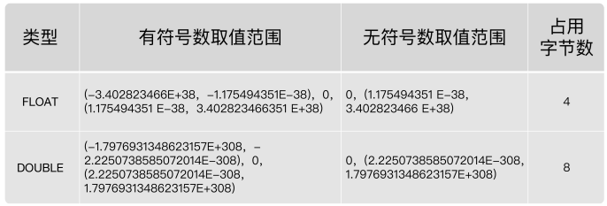

## 数据类型

### MySQL中的数据类型

| 类型             | 类型举例                                                     |
| ---------------- | ------------------------------------------------------------ |
| 整数类型         | TINYINT、SMALLINT、MEDIUMINT、INT(或INTEGER)、BIGINT         |
| 浮点类型         | FLOAT、DOUBLE                                                |
| 定点数类型       | DECIMAL                                                      |
| 位类型           | BIT                                                          |
| 日期时间类型     | YEAR、TIME、DATE、DATETIME、TIMESTAMP                        |
| 文本字符串类型   | CHAR、VARCHAR、TINYTEXT、TEXT、MEDIUMTEXT、LONGTEXT          |
| 枚举类型         | ENUM                                                         |
| 集合类型         | SET                                                          |
| 二进制字符串类型 | BINARY、VARBINARY、TINYBLOB、BLOB、MEDIUMBLOB、LONGBLOB      |
| JSON类型         | JSON对象、JSON数组                                           |
| 空间数据类型     | 单值类型：GEOMETRY、POINT、LINESTRING、POLYGON；<br/>集合类型：MULTIPOINT、MULTILINESTRING、MULTIPOLYGON、GEOMETRYCOLLECTION |

常见数据类型的属性，如下：

| MySQL关键字        | 含义                     |
| ------------------ | ------------------------ |
| NULL               | 数据列可包含NULL值       |
| NOT NULL           | 数据列不允许包含NULL值   |
| DEFAULT            | 默认值                   |
| PRIMARY KEY        | 主键                     |
| AUTO_INCREMENT     | 自动递增、适用于整数类型 |
| UNSIGNED           | 无符号                   |
| CHARACTER SET name | 指定一个字符集           |

### 整数类型

#### 类型介绍

整数类型一共有 5 种，包括 TINYINT、SMALLINT、MEDIUMINT、INT（INTEGER）和 BIGINT。

它们的区别如下表所示：

| 整数类型     | 字节 | 有符号数取值范围                         | 无符号数取值范围       |
| ------------ | ---- | ---------------------------------------- | ---------------------- |
| TINYINT      | 1    | -128 ~ 127                               | 0 ~ 255                |
| SMALLINT     | 2    | -32768~32767                             | 0~65535                |
| MEDIUMINT    | 3    | -8388608~8388607                         | 0~16777215             |
| INT、INTEGER | 4    | -2147483648~2147483647                   | 0~4294967295           |
| BIGINT       | 8    | -9223372036854775808~9223372036854775807 | 0~18446744073709551615 |

#### 可选属性

整数类型的可选属性有三个：M、UNSIGNED、ZEROFILL

##### M

**M** : 表示显示宽度，M的取值范围是(0, 255)。例如，int(5)：当数据宽度小于5位的时候在数字前面需要用字符填满宽度。该项功能需要配合“ `ZEROFILL` ”使用，表示用“0”填满宽度，否则指定显示宽度无效。

如果设置了显示宽度，那么插入的数据宽度超过显示宽度限制，会不会截断或插入失败？

答案：不会对插入的数据有任何影响，还是按照类型的实际宽度进行保存，即`显示宽度与类型可以存储的值范围无关`。从MySQL 8.0.17开始，整数数据类型不推荐使用显示宽度属性。

整型数据类型可以在定义表结构时指定所需要的显示宽度，如果不指定，则系统为每一种类型指定默认的宽度值。
举例：

```sql
CREATE TABLE test_int1 ( x TINYINT,　y SMALLINT,　z MEDIUMINT,　m INT,　n BIGINT );
```

查看表结构 （MySQL5.7中显式如下，MySQL8中不再显式范围）

```sql
desc test_int1;
+-------+--------------+------+-----+---------+-------+
| Field | Type         | Null | Key | Default | Extra |
+-------+--------------+------+-----+---------+-------+
| x     | tinyint(4)   | YES  |     | NULL    |       |
| 　y   | smallint(6)  | YES  |     | NULL    |       |
| 　z   | mediumint(9) | YES  |     | NULL    |       |
| 　m   | int(11)      | YES  |     | NULL    |       |
| 　n   | bigint(20)   | YES  |     | NULL    |       |
+-------+--------------+------+-----+---------+-------+
5 rows in set (0.00 sec)
```

TINYINT有符号数和无符号数的取值范围分别为-128-127和0-255，由于负号占了一个数字位，因此TINYINT默认的显示宽度为4。同理，其他整数类型的默认显示宽度与其有符号数的最小值的宽度相同。

举例：

```sql
CREATE TABLE `test_int2` (
  `f1` int(11) DEFAULT NULL,
  `f2` int(5) DEFAULT NULL,
  `f3` int(5) unsigned zerofill DEFAULT NULL
) ENGINE=InnoDB DEFAULT CHARSET=utf8mb4;

INSERT INTO test_int2(f1,f2,f3)
VALUES(1,123,123);

INSERT INTO test_int2(f1,f2)
VALUES(123456,123456);

INSERT INTO test_int2(f1,f2,f3)
VALUES(123456,123456,123456);
```

```sql
SELECT * FROM test_int2;
+--------+--------+--------+
| f1     | f2     | f3     |
+--------+--------+--------+
|      1 |    123 |  00123 |
| 123456 | 123456 |   NULL |
| 123456 | 123456 | 123456 |
+--------+--------+--------+
3 rows in set (0.00 sec)
```

##### UNSIGNED

UNSIGNED : 无符号类型（非负），所有的整数类型都有一个可选的属性UNSIGNED（无符号属性），无符号整数类型的最小取值为0。所以，如果需要在MySQL数据库中保存非负整数值时，可以将整数类型设置为无符号类型。

int类型默认显示宽度为int(11)，无符号int类型默认显示宽度为int(10)。

```sql
CREATE TABLE `test_int3` (
  `f1` int unsigned DEFAULT NULL
) ENGINE=InnoDB DEFAULT CHARSET=utf8mb4
```

```sql
desc test_int3;
+-------+------------------+------+-----+---------+-------+
| Field | Type             | Null | Key | Default | Extra |
+-------+------------------+------+-----+---------+-------+
| f1    | int(10) unsigned | YES  |     | NULL    |       |
+-------+------------------+------+-----+---------+-------+
1 row in set (0.00 sec)
```

##### ZEROFILL

**ZEROFILL** : 0填充,（如果某列是ZEROFILL，那么MySQL会自动为当前列添加UNSIGNED属性），如果指定了ZEROFILL只是表示不够M位时，用0在左边填充，如果超过M位，只要不超过数据存储范围即可。

原来，在 int(M) 中，M 的值跟 int(M) 所占多少存储空间并无任何关系。 int(3)、int(4)、int(8) 在磁盘上都是占用 4 bytes 的存储空间。也就是说，int(M)，必须和UNSIGNED ZEROFILL一起使用才有意义。如果整数值超过M位，就按照实际位数存储。只是无须再用字符 0 进行填充。

#### 适用场景

**TINYINT**：一般用于枚举数据，比如系统设定取值范围很小且固定的场景。

**SMALLINT** ：可以用于较小范围的统计数据，比如统计工厂的固定资产库存数量等。

**MEDIUMINT** ：用于较大整数的计算，比如车站每日的客流量等。

**INT、INTEGER** ：取值范围足够大，一般情况下不用考虑超限问题，用得最多。比如商品编号。

**BIGINT** ：只有当你处理特别巨大的整数时才会用到。比如双十一的交易量、大型门户网站点击量、证券公司衍生产品持仓等。

#### 如何选择

在评估用哪种整数类型的时候，你需要考虑存储空间和可靠性的平衡问题：一方 面，用占用字节数少的整数类型可以节省存储空间；另一方面，要是为了节省存储空间， 使用的整数类型取值范围太小，一旦遇到超出取值范围的情况，就可能引起系统错误，影响可靠性。

举个例子，商品编号采用的数据类型是 INT。原因就在于，客户门店中流通的商品种类较多，而且，每天都有旧商品下架，新商品上架，这样不断迭代，日积月累。

如果使用 SMALLINT 类型，虽然占用字节数比 INT 类型的整数少，但是却不能保证数据不会超出范围65535。相反，使用 INT，就能确保有足够大的取值范围，不用担心数据超出范围影响可靠性的问题。

你要注意的是，在实际工作中，**系统故障产生的成本远远超过增加几个字段存储空间所产生的成本**。因此，我建议你首先确保数据不会超过取值范围，在这个前提之下，再去考虑如何节省存储空间。

### 浮点类型

#### 类型介绍

浮点数和定点数类型的特点是可以处理小数，你可以把整数看成小数的一个特例。因此，浮点数和定点数的使用场景，比整数大多了。 MySQL支持的浮点数类型，分别是 FLOAT、DOUBLE、REAL。

* FLOAT 表示单精度浮点数；

* DOUBLE 表示双精度浮点数；

* REAL默认就是 DOUBLE。如果你把 SQL 模式设定为启用“ REAL_AS_FLOAT ”，那 么，MySQL 就认为REAL 是 FLOAT。如果要启用“REAL_AS_FLOAT”，可以通过以下 SQL 语句实现：

  ```sql
  SET sql_mode = “REAL_AS_FLOAT”;
  ```



**问题1**：FLOAT 和 DOUBLE 这两种数据类型的区别是啥呢？

FLOAT 占用字节数少，取值范围小；DOUBLE 占用字节数多，取值范围也大。

**问题2**：为什么浮点数类型的无符号数取值范围，只相当于有符号数取值范围的一半，也就是只相当于有符号数取值范围大于等于零的部分呢？

MySQL 存储浮点数的格式为： 符号(S) 、尾数(M) 和 阶码(E) 。因此，无论有没有符号，MySQL 的浮点数都会存储表示符号的部分。因此， 所谓的无符号数取值范围，其实就是有符号数取值范围大于等于零的部分。

#### 数据精度说明

对于浮点类型，在MySQL中单精度值使用4 个字节，双精度值使用8 个字节。

* MySQL允许使用非标准语法（其他数据库未必支持，因此如果涉及到数据迁移，则最好不要这么用）：FLOAT(M,D) 或DOUBLE(M,D) 。这里，M称为精度，D称为标度。(M,D)中 M=整数位+小数位，D=小数位。D<=M<=255，0<=D<=30。例如，定义为FLOAT(5,2)的一个列可以显示为-999.99-999.99。如果超过这个范围会报错。
* FLOAT和DOUBLE类型在不指定(M,D)时，默认会按照实际的精度（由实际的硬件和操作系统决定）来显示。
* 说明：浮点类型，也可以加UNSIGNED ，但是不会改变数据范围，例如：FLOAT(3,2) UNSIGNED仍然只能表示0-9.99的范围。
* 不管是否显式设置了精度(M,D)，这里MySQL的处理方案如下：
  * 如果存储时，整数部分超出了范围，MySQL就会报错，不允许存这样的值
  * 如果存储时，小数点部分若超出范围，就分以下情况：
    * 若四舍五入后，整数部分没有超出范围，则只警告，但能成功操作并四舍五入删除多余的小数位后保存。例如在FLOAT(5,2)列内插入999.009，近似结果是999.01。
    * 若四舍五入后，整数部分超出范围，则MySQL报错，并拒绝处理。如FLOAT(5,2)列内插入999.995和-999.995都会报错。
* 从MySQL 8.0.17开始，FLOAT(M,D) 和DOUBLE(M,D)用法在官方文档中已经明确不推荐使用，将来可能被移除。另外，关于浮点型FLOAT和DOUBLE的UNSIGNED也不推荐使用了，将来也可能被移除。

举例:

```sql
CREATE TABLE `test_double1` (
  `f1` float DEFAULT NULL,
  `f2` float(5,2) DEFAULT NULL,
  `f3` double DEFAULT NULL,
  `f4` double(5,2) DEFAULT NULL
) ENGINE=InnoDB DEFAULT CHARSET=utf8mb4
```

```sql
DESC test_double1;
+-------+-------------+------+-----+---------+-------+
| Field | Type        | Null | Key | Default | Extra |
+-------+-------------+------+-----+---------+-------+
| f1    | float       | YES  |     | NULL    |       |
| f2    | float(5,2)  | YES  |     | NULL    |       |
| f3    | double      | YES  |     | NULL    |       |
| f4    | double(5,2) | YES  |     | NULL    |       |
+-------+-------------+------+-----+---------+-------+
4 rows in set (0.00 sec)
```

```sql
INSERT INTO test_double1
VALUES(123.456,123.456,123.4567,123.45);

#Out of range value for column 'f2' at row 1
INSERT INTO test_double1
VALUES(123.456,1234.456,123.4567,123.45);
```

```sql
SELECT * FROM test_double1;
+---------+--------+----------+--------+
| f1      | f2     | f3       | f4     |
+---------+--------+----------+--------+
| 123.456 | 123.46 | 123.4567 | 123.45 |
| 123.456 | 999.99 | 123.4567 | 123.45 |
+---------+--------+----------+--------+
2 rows in set (0.01 sec)
```

#### 精度误差说明

浮点数类型有个缺陷，就是不精准。下面我来重点解释一下为什么 MySQL 的浮点数不够精准。比如，我们设计一个表，有f1这个字段，插入值分别为0.47,0.44,0.19，我们期待的运行结果是：0.47 + 0.44 + 0.19 =1.1。而使用sum之后查询：

```sql
CREATE TABLE `test_double2` (
  `f1` double DEFAULT NULL
) ENGINE=InnoDB DEFAULT CHARSET=utf8mb4

INSERT INTO test_double2
VALUES(0.47),(0.44),(0.19);
```

```sql
select sum(f1) from test_double2;
+--------------------+
| sum(f1)            |
+--------------------+
| 1.0999999999999999 |
+--------------------+
1 row in set (0.00 sec)
```

```sql
SELECT SUM(f1) = 1.1,1.1 = 1.1 FROM test_double2;
+---------------+-----------+
| SUM(f1) = 1.1 | 1.1 = 1.1 |
+---------------+-----------+
|             0 |         1 |
+---------------+-----------+
1 row in set (0.01 sec)
```

查询结果是 1.0999999999999999。看到了吗？虽然误差很小，但确实有误差。 你也可以尝试把数据类型改成 FLOAT，然后运行求和查询，得到的是， 1.0999999940395355。显然，误差更大了。

那么，为什么会存在这样的误差呢？问题还是出在 MySQL 对浮点类型数据的存储方式上。

MySQL 用 4 个字节存储 FLOAT 类型数据，用 8 个字节来存储 DOUBLE 类型数据。无论哪个，都是采用二进制的方式来进行存储的。比如 9.625，用二进制来表达，就是 1001.101，或者表达成 1.001101×2^3。如果尾数不是 0 或 5（比如 9.624），你就无法用一个二进制数来精确表达。进而，就只好在取值允许的范围内进行四舍五入。

在编程中，如果用到浮点数，要特别注意误差问题，**因为浮点数是不准确的，所以我们要避免使用“=”来判断两个数是否相等**。同时，在一些对精确度要求较高的项目中，千万不要使用浮点数，不然会导致结果错误，甚至是造成不可挽回的损失。那么，MySQL 有没有精准的数据类型呢？当然有，这就是定点数类型： **DECIMAL** 。

### 定点数类型

#### 类型介绍

* MySQL中的定点数类型只有 DECIMAL 一种类型。

  | 数据类型                 | 字节数  | 含义               |
  | ------------------------ | ------- | ------------------ |
  | DECIMAL(M,D),DEC,NUMERIC | M+2字节 | 有效范围由M和D决定 |

  

* DECIMAL(M,D)的最大取值范围与DOUBLE类型一样，但是有效的数据范围是由M和D决定的。DECIMAL 的存储空间并不是固定的，由精度值M决定，总共占用的存储空间为M+2个字节。也就是说，在一些对精度要求不高的场景下，比起占用同样字节长度的定点数，浮点数表达的数值范围可以更大一些。

* 定点数在MySQL内部是以字符串的形式进行存储，这就决定了它一定是精准的。

* 当DECIMAL类型不指定精度和标度时，其默认为DECIMAL(10,0)。当数据的精度超出了定点数类型的精度范围时，则MySQL同样会进行四舍五入处理。

* 浮点数 vs 定点数

  * 浮点数相对于定点数的优点是在长度一定的情况下，浮点类型取值范围大，但是不精准，适用于需要取值范围大，又可以容忍微小误差的科学计算场景（比如计算化学、分子建模、流体动力学等）
  * 定点数类型取值范围相对小，但是精准，没有误差，适合于对精度要求极高的场景 （比如涉及金额计算的场景）

举例：

```sql
CREATE TABLE `test_decimal1` (
  `f1` decimal(10,0) DEFAULT NULL,
  `f2` decimal(5,2) DEFAULT NULL
) ENGINE=InnoDB DEFAULT CHARSET=utf8mb4
```

```sql
DESC test_decimal1;
+-------+---------------+------+-----+---------+-------+
| Field | Type          | Null | Key | Default | Extra |
+-------+---------------+------+-----+---------+-------+
| f1    | decimal(10,0) | YES  |     | NULL    |       |
| f2    | decimal(5,2)  | YES  |     | NULL    |       |
+-------+---------------+------+-----+---------+-------+
2 rows in set (0.00 sec)
```

```sql
INSERT INTO test_decimal1(f1,f2)
VALUES(123.123,123.456);

#Out of range value for column 'f2' at row 1
INSERT INTO test_decimal1(f2)
VALUES(1234.34);
```

```sql
select * from test_decimal1;
+------+--------+
| f1   | f2     |
+------+--------+
|  123 | 123.46 |
| NULL | 999.99 |
+------+--------+
2 rows in set (0.00 sec)
```

举例:

我们运行下面的语句，把test_double2表中字段“f1”的数据类型修改为 DECIMAL(5,2)：

```sql
ALTER TABLE test_double2
MODIFY f1 DECIMAL(5,2);
```


## 位类型

### 日期与时间类型

### 文本字符串类型

### ENUM类型

### SET类型

### JSON类型

### 空间类型

### 小结及选择建议

在定义数据类型时，如果确定是`整数`，就用`INT` ； 如果是`小数`，一定用定点数类型`DECIMAL(M,D)` ； 如果是日期与时间，就用`DATETIME`。

这样做的好处是，首先确保你的系统不会因为数据类型定义出错。不过，凡事都是有两面的，可靠性好，并不意味着高效。比如，TEXT虽然使用方便，但是效率不如 CHAR(M) 和 VARCHAR(M)。关于字符串的选择，建议参考如下阿里巴巴的《Java开发手册》规范：

* 任何字段如果为非负数，必须是 UNSIGNED
* 【强制】小数类型为 DECIMAL，禁止使用 FLOAT 和 DOUBLE。
  * 说明：在存储的时候，FLOAT 和 DOUBLE 都存在精度损失的问题，很可能在比较值的时候，得到不正确的结果。如果存储的数据范围超过 DECIMAL 的范围，建议将数据拆成整数和小数并分开存储。
* 【强制】如果存储的字符串长度几乎相等，使用 CHAR 定长字符串类型。
* 【强制】VARCHAR 是可变长字符串，不预先分配存储空间，长度不要超过 5000。如果存储长度大于此值，定义字段类型为 TEXT，独立出来一张表，用主键来对应，避免影响其它字段索引效率。