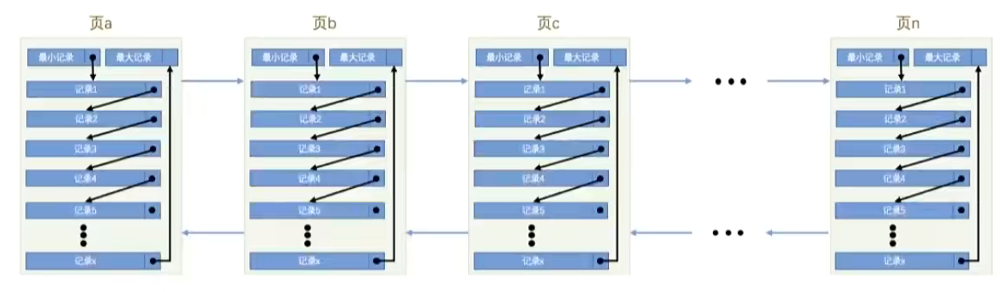
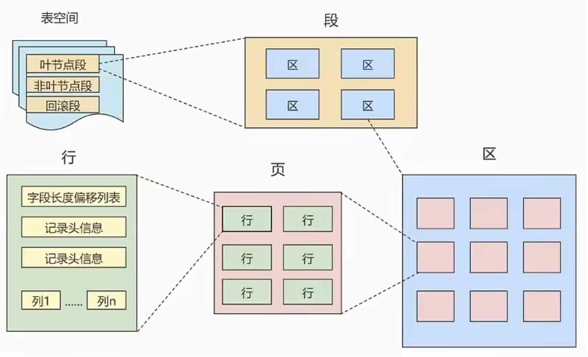
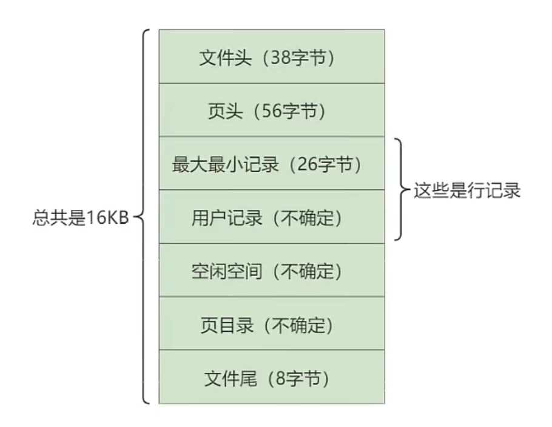
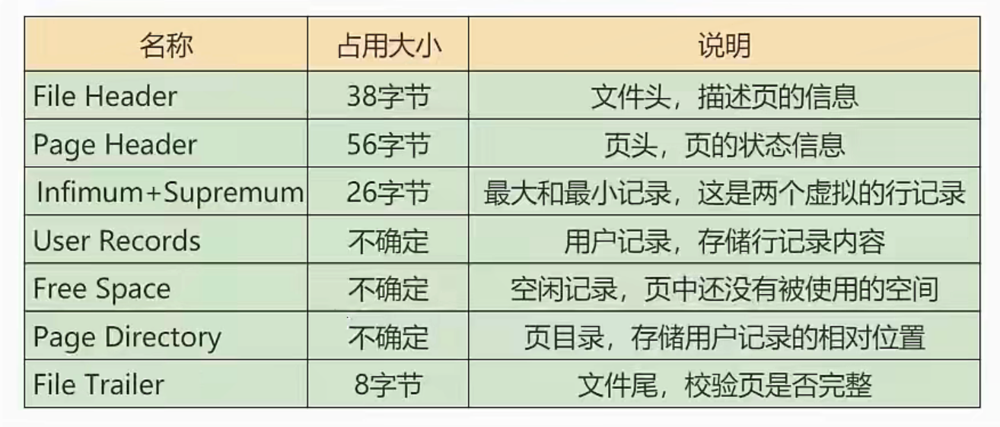

## InnoDB数据存储结构

### 1. 数据库的存储结构：页

索引信息以及数据记录都是保存在文件上的，确切说是存储在页结构中。另一方面，索引是在存储引擎中实现的，MySQL的存储引擎负责读取写入表中数据。不同存储引擎中存放的格式一般不一样

####  1.1 磁盘与内存交互的基本单位：页

InnoDB将数据划分为多个页，每个页大小**16KB**。

一次最少从磁盘读取16KB到内存，最少把内存中16KB内容刷新到磁盘。也就是说数据库管理存储空间的基本单位是页（Page），数据库I/O操作的最小单位是页。一个页中可以存储多个行记录。



#### 1.2 页结构概述

页a、页b、页c …页n这些页可以`不在物理结构上相连`，只要通过`双向链表`相关联即可。每个数据页中的记录会按照主键值`从小到大`的顺序组成一个`单向链表`，每个数据页都会为存储在它里边的记录生成一个`页目录`，在通过主键查找某条记录的时候可以在页目录中`使用二分法` 快速定位到对应的槽，然后再遍历该槽对应分组中的记录即可快速找到指定的记录。

#### 1.3 页大小

可以通过如下命令查看：

```sql
show variables like '%innodb_page_size%';
+------------------+-------+
| Variable_name    | Value |
+------------------+-------+
| innodb_page_size | 16384 |
+------------------+-------+
1 row in set (0.00 sec)
```

SQLServer 中页大小为8KB，Oracle中用术语“块”（block）来代表页，Oracle支持的块大小为2KB, 4KB, 8KB, 16KB, 32KB, 64KB

#### 1.4 页的上层结构

另外在数据库中，还存在着区（Extent）、段（Segment）和表空间（Tablespace）的概念。行、页、区、段、表空间的关系如下图所示∶



区（Extent）是比页大一级的存储结构，在 InnoDB存储引擎中，一个区会分配 `64 个连续的页`。因为InnoDB中的页大小默认是16KB，所以一个区的大小是 `64*16KB= 1MB`。

段（Segment）由一个或多个区组成，区在文件系统是一个连续分配的空间（在 InnoDB中是连续的 64个页），不过在段中不要求区与区之间是相邻的。`段是数据库中的分配单位`，不同类型的数据库对象以不同的段形式存在。当我们创建数据表、索引的时候，就会相应创建对应的段，比如创建一张表时会创建一个表段，创建一个索引时会创建一个索引段。

表空间（Tablespace）是一个逻辑容器，表空间存储的对象是段，在一个表空间中可以有一个或多个段，但是一个段只能属于一个表空间。数据库由一个或多个表空间组成，表空间从管理上可以划分为 系统表空间、用户表空间、撤销表空间、临时表空间等。

### 2. 页的内部结构

页如果按类型划分的话，常见的有`数据页（保存 B+ 树节点）`、 `系统页`、`Undo 页`和`事务数据页`等。数据页是我们最常使用的页。

数据页的`16KB`大小的存储空间被划分为七个部分，分别是文件头（File Header）、页头（Page Header）、最大最小记录（Infimum+supremum）、用户记录（User Records）、空闲空间（Free Space）、页目录（Page Directory）和文件尾（File Tailer）。

页结构的示意图如下所示∶



这7个部分作用分别如下，我们简单梳理如下表所示：



我们可以把这7个结构分成3个部分

#### 第1部分：File Header和File Trailer

首先是`文件通用部分`，也就是`文件头`和`文件尾`

① 文件头部信息（38字节）

不同类型的页都会以FiLe Header 作为第一个组成部分，它描述了一些针对各种页都通用的一些信息，比方说这个页的编号是多少，它的上一个页、下一个页是谁等，所有的数据页会组成一个双链表。这个部分占用固定的38个字节，是由下边这些内容组成的：

② 文件尾部信息（8字节）

#### 第2部分：

Free Space（空闲空间）

User Records（用户记录）

Infimum + Supermum（最小最大记录）

#### 第3部分

Page Directory（页目录）

页目录分组的个数如何确定

页目录结构下如何快速查找记录


Page Header（页面头部）

PAGE_DIRECTION

PAGE_N_DIRECTION