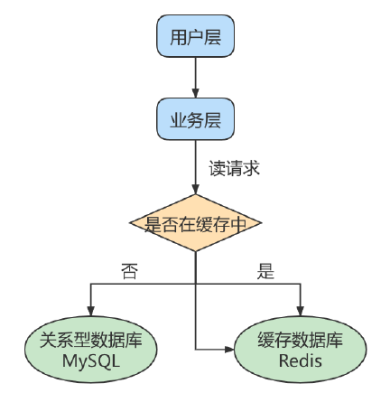
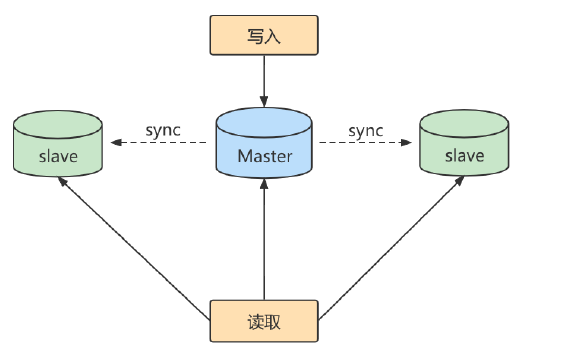
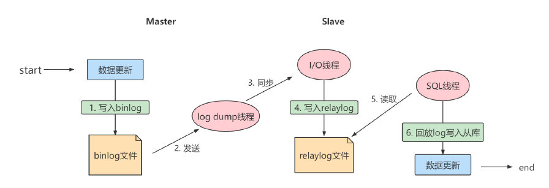
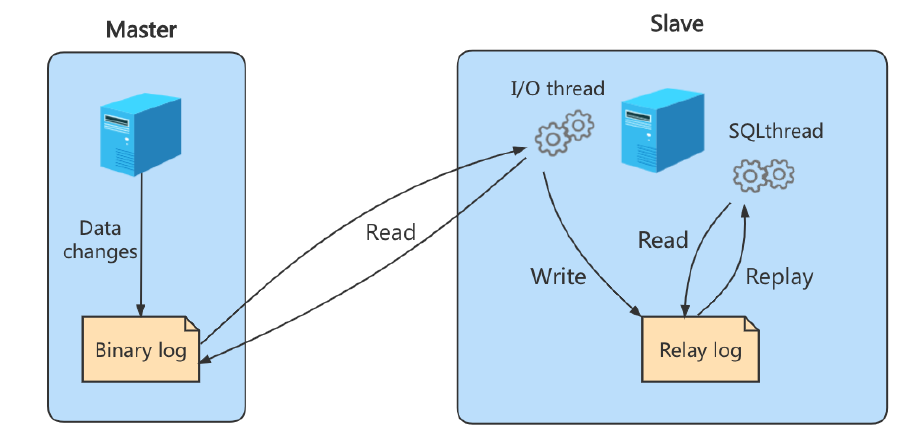

## 主从复制

### 主从复制概述

#### 如何提升数据库并发能力

此外，一般应用对数据库而言都是“ **读多写少**”，也就说对数据库读取数据的压力比较大，有一个思路就是采用数据库集群的方案，做**主从架构**、进行**读写分离**，这样同样可以提升数据库的并发处理能力。但并不是所有的应用都需要对数据库进行主从架构的设置，毕竟设置架构本身是有成本的。

如果我们的目的在于提升数据库高并发访问的效率，那么首先考虑的是如何**优化SQL和索引**，这种方式简单有效；其次才是采用**缓存的策略**，比如使用 Redis将热点数据保存在内存数据库中，提升读取的效率；最后才是对数据库采用**主从架构**，进行读写分离。

#### 主从复制的作用

主从同步设计不仅可以提高数据库的吞吐量，还有以下 3 个方面的作用。

**第1个作用：读写分离。**

**第2个作用就是数据备份。**

**第3个作用是具有高可用性。**

### 主从复制的原理

Slave 会从Master 读取binlog 来进行数据同步。

#### 原理剖析

**三个线程**

实际上主从同步的原理就是基于 binlog 进行数据同步的。在主从复制过程中，会基于 3 个线程来操作，一个主库线程，两个从库线程。

**二进制日志转储线程**（Binlog dump thread）是一个主库线程。当从库线程连接的时候， 主库可以将二进制日志发送给从库，当主库读取事件（Event）的时候，会在 Binlog 上加锁，读取完成之后，再将锁释放掉。

**从库 I/O 线程**会连接到主库，向主库发送请求更新 Binlog。这时从库的 I/O 线程就可以读取到主库的二进制日志转储线程发送的 Binlog 更新部分，并且拷贝到本地的中继日志 （Relay log）。

**从库 SQL 线程**会读取从库中的中继日志，并且执行日志中的事件，将从库中的数据与主库保持同步。

**复制三步骤**

步骤1： Master 将写操作记录到二进制日志（ binlog ）。

步骤2： Slave 将Master 的binary log events拷贝到它的中继日志（ relay log ）；

步骤3： Slave 重做中继日志中的事件，将改变应用到自己的数据库中。 MySQL复制是异步的且串行化的，而且重启后从接入点开始复制。

#### 复制的基本原则

### 一主一从架构搭建

#### 准备工作

#### 主机配置文件

#### 从机配置文件

#### 主机建立账户并授权

#### 从机配置需要复制的主机

#### 测试

#### 停止主从同步

#### 后续

### 同步数据一致性问题

#### 理解主从延迟问题

#### 主从延迟问题原因

#### 如何减少主从延迟

#### 如何解决一致性问题

##### 方法一：异步复制

##### 方法二：半同步复制

##### 方法三：组复制

### 知识延伸