## 事务基础知识

### 1. 数据库事务概述

#### 1.1 存储引擎支持情况

```sql
show engines;
+--------------------+---------+----------------------------------------------------------------+--------------+------+------------+
| Engine             | Support | Comment                                                        | Transactions | XA   | Savepoints |
+--------------------+---------+----------------------------------------------------------------+--------------+------+------------+
| InnoDB             | DEFAULT | Supports transactions, row-level locking, and foreign keys     | YES          | YES  | YES        |
| MRG_MYISAM         | YES     | Collection of identical MyISAM tables                          | NO           | NO   | NO         |
| MEMORY             | YES     | Hash based, stored in memory, useful for temporary tables      | NO           | NO   | NO         |
| BLACKHOLE          | YES     | /dev/null storage engine (anything you write to it disappears) | NO           | NO   | NO         |
| MyISAM             | YES     | MyISAM storage engine                                          | NO           | NO   | NO         |
| CSV                | YES     | CSV storage engine                                             | NO           | NO   | NO         |
| ARCHIVE            | YES     | Archive storage engine                                         | NO           | NO   | NO         |
| PERFORMANCE_SCHEMA | YES     | Performance Schema                                             | NO           | NO   | NO         |
| FEDERATED          | NO      | Federated MySQL storage engine                                 | NULL         | NULL | NULL       |
+--------------------+---------+----------------------------------------------------------------+--------------+------+------------+
9 rows in set (0.00 sec)
```


#### 1.2 基本概念

**事务：**一组逻辑操作单元，使数据从一种状态变换到另一种状态。

**事务处理的原则：**保证所有事务都作为 一个工作单元 来执行，即使出现了故障，都不能改变这种执行方式。当在一个事务中执行多个操作时，要么所有的事务都被提交( commit )，那么这些修改就 永久 地保存下来；要么数据库管理系统将 放弃 所作的所有 修改 ，整个事务回滚( rollback )到最初状态。

#### 1.3 事务的ACID特性

* 原子性（atomicity）

  原子性是指事务是一个不可分割的工作单位，要么全部提交，要么全部失败回滚。

* 一致性（consistency）

  根据定义，一致性是指事务执行前后，数据从一个 合法性状态 变换到另外一个 合法性状态 。这种状态是 语义上 的而不是语法上的，跟具体的业务有关。

  那什么是合法的数据状态呢？满足 预定的约束 的状态就叫做合法的状态。通俗一点，这状态是由你自己来定义的（比如满足现实世界中的约束）。满足这个状态，数据就是一致的，不满足这个状态，数据就是不一致的！如果事务中的某个操作失败了，系统就会自动撤销当前正在执行的事务，返回到事务操作之前的状态。

* 隔离性（isolation）

  事务的隔离性是指一个事务的执行 不能被其他事务干扰 ，即一个事务内部的操作及使用的数据对 并发 的其他事务是隔离的，并发执行的各个事务之间不能互相干扰。

* 持久性（durability）

  持久性是指一个事务一旦被提交，它对数据库中数据的改变就是 永久性的 ，接下来的其他操作和数据库故障不应该对其有任何影响。

  持久性是通过 事务日志 来保证的。日志包括了 重做日志 和 回滚日志 。当我们通过事务对数据进行修改的时候，首先会将数据库的变化信息记录到重做日志中，然后再对数据库中对应的行进行修改。这样做的好处是，即使数据库系统崩溃，数据库重启后也能找到没有更新到数据库系统中的重做日志，重新执行，从而使事务具有持久性。

#### 1.4 事务的状态

* 活动的（active）

  事务对应的数据库操作正在执行过程中时，我们就说该事务处在 活动的 状态。

* 部分提交的（partially committed）

  当事务中的最后一个操作执行完成，但由于操作都在内存中执行，所造成的影响并 没有刷新到磁盘时，我们就说该事务处在 部分提交的 状态。

* 失败的（failed）

  当事务处在 活动的 或者 部分提交的 状态时，可能遇到了某些错误（数据库自身的错误、操作系统错误或者直接断电等）而无法继续执行，或者人为的停止当前事务的执行，我们就说该事务处在 失 败的 状态。

* 中止的（aborted）

  如果事务执行了一部分而变为 失败的 状态，那么就需要把已经修改的事务中的操作还原到事务执行前的状态。换句话说，就是要撤销失败事务对当前数据库造成的影响。我们把这个撤销的过程称之为 回滚 。当 回滚 操作执行完毕时，也就是数据库恢复到了执行事务之前的状态，我们就说该事务处在了 中止的 状态。

* 提交的（committed）

  当一个处在 部分提交的 状态的事务将修改过的数据都 同步到磁盘 上之后，我们就可以说该事务处在了 提交的 状态。

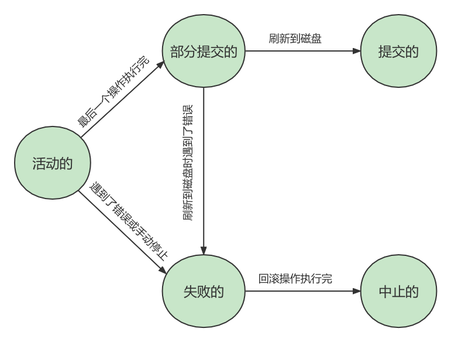

### 2. 如何使用事务

使用事务有两种方式，分别为 **显式事务** 和 **隐式事务** 。

#### 2.1 显式事务

**步骤1：**`START TRANSACTION` 或者 `BEGIN` ，作用是显式开启一个事务。

```sql
mysql> BEGIN;
#或者
mysql> START TRANSACTION;
```

`START TRANSACTION` 语句相较于 `BEGIN` 特别之处在于，后边能跟随几个 `修饰符`，默认是`READ ONLY`：

① `READ ONLY`：标识当前事务是一个 `只读事务` ，也就是属于该事务的数据库操作只能读取数据，而不能修改数据。

② `READ WRITE` ：标识当前事务是一个 `读写事务` ，也就是属于该事务的数据库操作既可以读取数据，也可以修改数据。

③ `WITH CONSISTENT SNAPSHOT`：启动一致性读。

**步骤2：**一系列事务中的操作（主要是DML，不含DDL）

**步骤3：**提交事务 或 中止事务（即回滚事务）

```sql
# 提交事务。当提交事务后，对数据库的修改是永久性的。
mysql> COMMIT;
```

```sql
# 回滚事务。即撤销正在进行的所有没有提交的修改
mysql> ROLLBACK;

# 将事务回滚到某个保存点。
mysql> ROLLBACK TO [SAVEPOINT]
```

#### 2.2 隐式事务

MySQL中有一个系统变量 `autocommit` ： 

```sql
SHOW VARIABLES LIKE 'autocommit';
+---------------+-------+
| Variable_name | Value |
+---------------+-------+
| autocommit    | ON    |
+---------------+-------+
```

当然，如果我们想关闭这种 自动提交 的功能，可以使用下边两种方法之一：

* 显式的的使用 `START TRANSACTION` 或者 `BEGIN` 语句开启一个事务。这样在本次事务提交或者回滚前会暂时关闭掉自动提交的功能。

* 把系统变量 `autocommit` 的值设置为 OFF ，就像这样：

  ```sql
  SET autocommit = OFF;
  #或
  SET autocommit = 0;
  ```

#### 2.3 隐式提交数据的情况

* 数据定义语言（Data definition language，缩写为：DDL）

  数据库对象，指的就是数据库、表、视图、存储过程等结构。当我们使用CREATE、 ALTER、DROP 等语句去修改数据库对象时，就会隐式的提交前边语句所属于的事务。即：

  ```sql
  BEGIN;
  
  SELECT ...
  UPDATE ...
  ...
  
  CREATE TABLE ... # 此语句将隐式提交前面语句所属于的事务
  ```

  

* 隐式使用或修改mysql数据库中的表

  当我们使用`ALTER USER` 、`CREATE USER`、`DROP USER`、`GRANT`、`RENAME USER`、`REVOKE`、`SET PASSWORD`

* 事务控制或关于锁定的语句
  ① 当我们在一个事务还没提交或者回滚时就又使用 START TRANSACTION 或者 BEGIN语句开启了另一个事务时，会 隐式的提交 上一个事务。即：

  ```sql
  BEGIN;
  SELECT ...;
  UPDATE ...;
  ...
  BEGIN; # 此语句将隐式提交前面语句所属于的事务
  ```

  

  ② 当前的 autocommit 系统变量的值为 OFF ，我们手动把它调为 ON 时，也会 隐式的提交 前边语句所属的事务。

  ③ 使用 `LOCK TABLES` 、 `UNLOCK TABLES` 等关于锁定的语句也会 隐式的提交 前边语句所属的事务。

* 加载数据的语句

  使用`LOAD DATA`语句来批量往数据库中导入数据时，也会`隐式`的提交前面语句所属的事务

* 关于MySQL复制的一些语句

  使用`START SLAVE`、`STOP SLAVE`、`RESET SLAVE`、`CHANGE MASTER TO`等语句

* 其它的一些语句

  使用`ANALYZE TABLE`、`CACHE INDEX`、`CHECK TABLE`、`FLUSH`、`LOAD INDEX INTO CACHE`、` 0PTIMIZE TABLE`、`REPAIR TABLE`、 `RESET`等语句也会隐式的提交前边语句所属的事务。

#### 2.4 提交与回滚

> 当我们设置 autocommit=0 时，不论是否采用 START TRANSACTION 或者 BEGIN 的方式来开启事务，都需要用 COMMIT 进行提交，让事务生效，使用 ROLLBACK 对事务进行回滚。
>
> 当我们设置 autocommit=1 时，每条 SQL 语句都会自动进行提交。 不过这时，如果你采用 START TRANSACTION 或者 BEGIN 的方式来显式地开启事务，那么这个事务只有在 COMMIT 时才会生效，
>
> 在 ROLLBACK 时才会回滚。

### 3. 事务隔离级别

MySQL是一个 客户端／服务器 架构的软件，对于同一个服务器来说，可以有若干个客户端与之连接，每个客户端与服务器连接上之后，就可以称为一个会话（ Session ）。每个客户端都可以在自己的会话中向服务器发出请求语句，一个请求语句可能是某个事务的一部分，也就是对于服务器来说可能同时处理多个事务。事务有 隔离性 的特性，理论上在某个事务 对某个数据进行访问 时，其他事务应该进行 排 队 ，当该事务提交之后，其他事务才可以继续访问这个数据。但是这样对 性能影响太大 ，我们既想保持事务的隔离性，又想让服务器在处理访问同一数据的多个事务时 性能尽量高些 ，那就看二者如何权衡取舍了。

#### 3.1 数据准备

```sql
CREATE TABLE student ( 
studentno INT, 
name VARCHAR(20), 
class varchar(20), 
PRIMARY KEY (studentno) 
) Engine=InnoDB CHARSET=utf8;

INSERT INTO student VALUES(1, '小谷', '1班');
```

#### 3.2 数据并发问题

针对事务的隔离性和并发性，我们怎么做取舍呢？先看一下访问相同数据的事务在 不保证串行执行 （也就是执行完一个再执行另一个）的情况下可能会出现哪些问题：

**脏写（Dirty Write）**

对于两个事务 Session A、Session B，如果事务Session A 修改了 另一个 未提交 事务Session B 修改过 的数据，那就意味着发生了 脏写

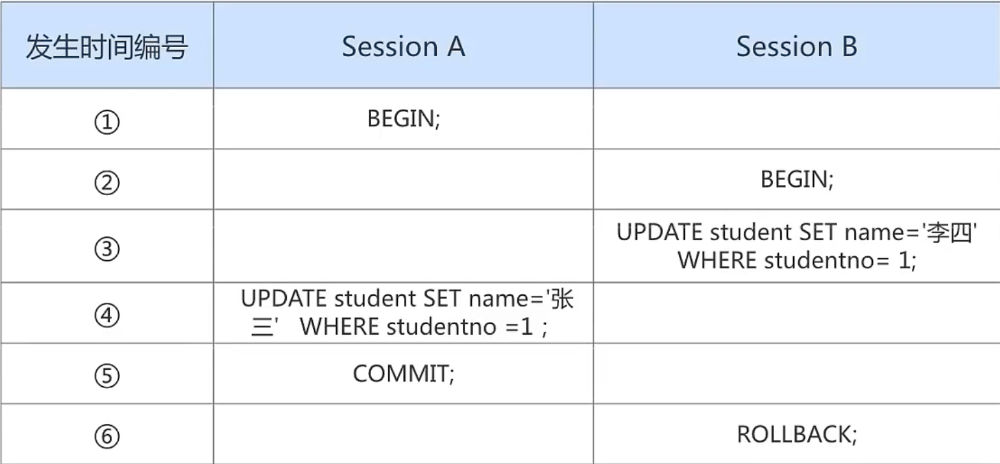

**脏读（Dirty Read）**

对于两个事务 Session A、Session B，Session A 读取 了已经被 Session B 更新 但还 没有被提交 的字段。之后若 Session B 回滚 ，Session A 读取 的内容就是 临时且无效 的。

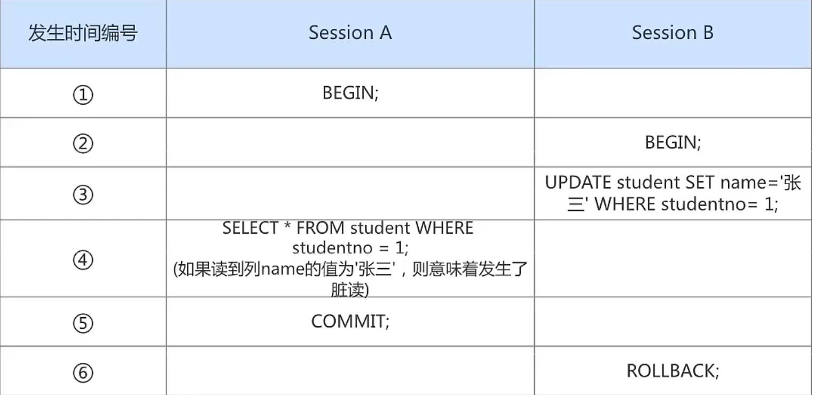

**不可重复读（Non-Repeatable Read）**

对于两个事务Session A、Session B，Session A 读取 了一个字段，然后 Session B 更新 了该字段。 之后Session A 再次读取 同一个字段， 值就不同 了。那就意味着发生了不可重复读。

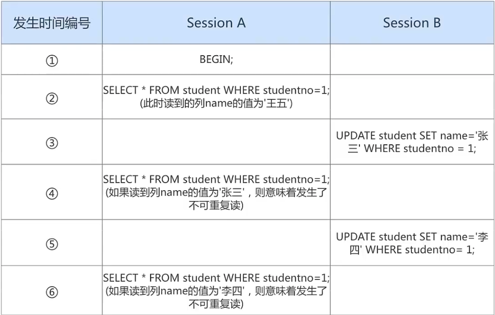

**幻读（Phantom）**

对于两个事务Session A、Session B, Session A 从一个表中 读取 了一个字段, 然后 Session B 在该表中 插 入 了一些新的行。 之后, 如果 Session A 再次读取 同一个表, 就会多出几行。那就意味着发生了幻读。

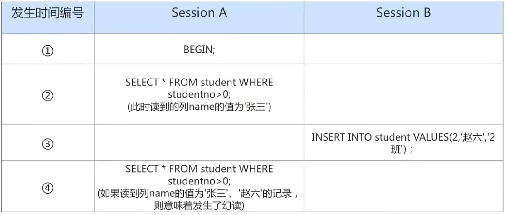

#### 3.3 SQL中的四种隔离级别

上面介绍了几种并发事务执行过程中可能遇到的一些问题，这些问题有轻重缓急之分，我们给这些问题按照严重性来排一下序：

```
脏写 > 脏读 > 不可重复读 > 幻读
```

我们愿意舍弃一部分隔离性来换取一部分性能，在这里就体现在：设立一些隔离级别，隔离级别越低，并发问题发生的就越多。 SQL标准 中设立了4个 隔离级别 ：

* `READ UNCOMMITTED` ：读未提交，在该隔离级别，所有事务都可以看到其他未提交事务的执行结果。不能避免脏读、不可重复读、幻读。
* `READ COMMITTED` ：读已提交，它满足了隔离的简单定义：一个事务只能看见已经提交事务所做的改变。这是大多数数据库系统的默认隔离级别（但不是MySQL默认的）。可以避免脏读，但不可重复读、幻读问题仍然存在。
* `REPEATABLE READ ` ：可重复读，事务A在读到一条数据之后，此时事务B对该数据进行了修改并提交，那么事务A再读该数据，读到的还是原来的内容。可以避免脏读、不可重复读，但幻读问题仍然存在。这是MySQL的默认隔离级别。
* `SERIALIZABLE` ：可串行化，确保事务可以从一个表中读取相同的行。在这个事务持续期间，禁止其他事务对该表执行插入、更新和删除操作。所有的并发问题都可以避免，但性能十分低下。能避免脏读、不可重复读和幻读。

SQL标准 中规定，针对不同的隔离级别，并发事务可以发生不同严重程度的问题，具体情况如下：

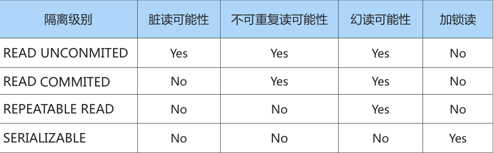

**脏写** 怎么没涉及到？因为脏写这个问题太严重了，不论是哪种隔离级别，都不允许脏写的情况发生。

不同的隔离级别有不同的现象，并有不同的锁和并发机制，隔离级别越高，数据库的并发性能就越差，4种事务隔离级别与并发性能的关系如下：

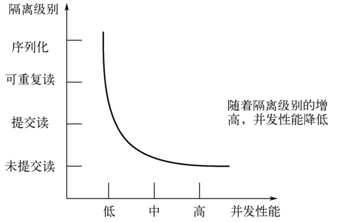

#### 3.4 MySQL支持的四种隔离级别

MySQL的默认隔离级别为`REPEATABLE READ`，我们可以手动修改一下事务的隔离级别。

```sql
# 查看隔离级别，MySQL 5.7.20的版本之前：
SHOW VARIABLES LIKE 'tx_isolation';
+---------------+-----------------+
| Variable_name | Value           |
+---------------+-----------------+
| tx_isolation  | REPEATABLE-READ |
+---------------+-----------------+
1 row in set (0.00 sec)

# MySQL 5.7.20版本之后，引入transaction_isolation来替换tx_isolation
# 查看隔离级别，MySQL 5.7.20的版本及之后：
SHOW VARIABLES LIKE 'transaction_isolation';
+-----------------------+-----------------+
| Variable_name         | Value           |
+-----------------------+-----------------+
| transaction_isolation | REPEATABLE-READ |
+-----------------------+-----------------+
1 row in set (0.00 sec)
```

#### 3.5 如何设置事务的隔离级别

**通过下面的语句修改事务的隔离级别：**

```sql
SET [GLOBAL|SESSION] TRANSACTION ISOLATION LEVEL 隔离级别;
#其中，隔离级别格式：
> READ UNCOMMITTED 
> READ COMMITTED 
> REPEATABLE READ 
> SERIALIZABLE
```

或者：

```sql
SET [GLOBAL|SESSION] TRANSACTION_ISOLATION = '隔离级别';
#其中，隔离级别格式：
> READ-UNCOMMITTED 
> READ-COMMITTED 
> REPEATABLE READ 
> SERIALIZABLE
```

**关于设置时使用GLOBAL或SESSION的影响：**

* 使用 GLOBAL 关键字（在全局范围影响）：
  * 当前已经存在的会话无效
  * 只对执行完该语句之后产生的会话起作用
* 使用 SESSION 关键字（在会话范围影响）：
  * 对当前会话的所有后续的事务有效
  * 如果在事务之间执行，则对后续的事务有效
  * 该语句可以在已经开启的事务中间执行，但不会影响当前正在执行的事务

> 小结：
>
> 数据库规定了多种事务隔离级别，不同隔离级别对应不同的干扰程度，隔离级别越高，数据一致性就越好，但并发性越弱。

#### 3.6 不同隔离级别举例

**演示1. 读未提交之脏读**
设置隔离级别为未提交读：

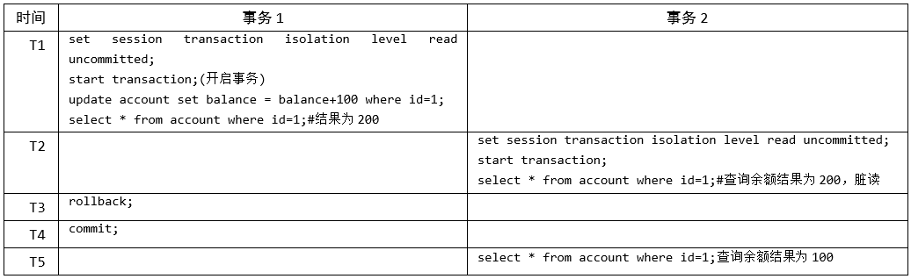

事务1和事务2的执行流程如下：

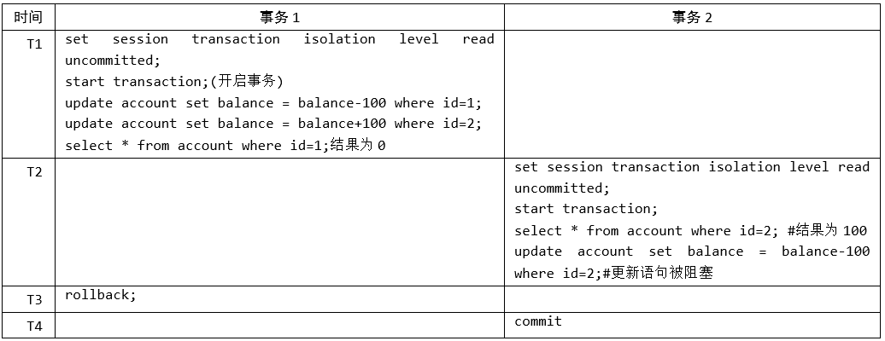

**演示2：读已提交**

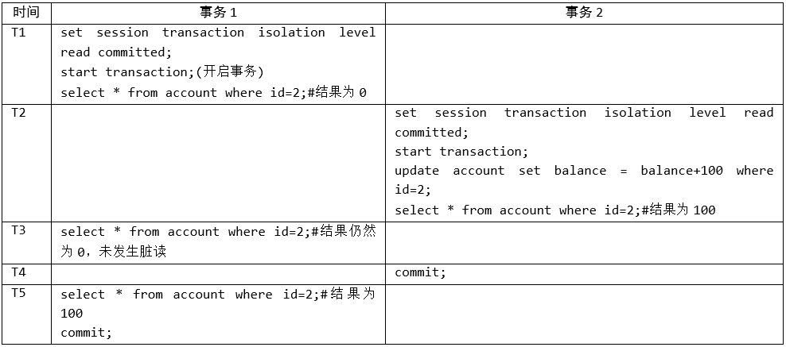

设置隔离级别为可重复读，事务的执行流程如下：

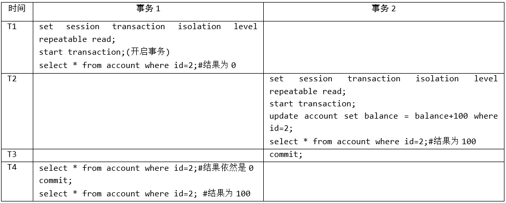

**演示4：幻读**

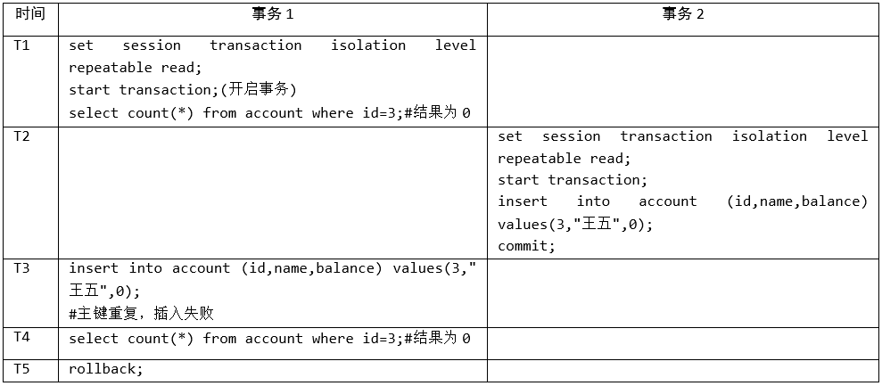

### 4. 事务的常见分类

从事务理论的角度来看，可以把事务分为以下几种类型：

* 扁平事务（Flat Transactions）
* 带有保存点的扁平事务（Flat Transactions with Savepoints）
* 链事务（Chained Transactions）
* 嵌套事务（Nested Transactions）
* 分布式事务（Distributed Transactions）

