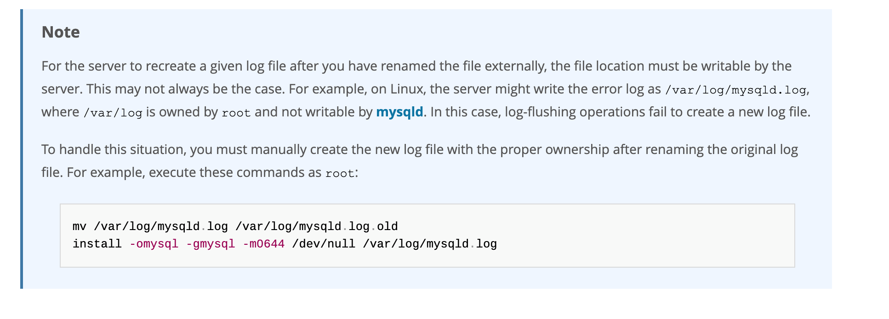

## 其他数据库日志

我们在讲解数据库事务时，讲过两种日志：重做日志、回滚日志。

对于线上数据库应用系统，突然遭遇数据库宕机怎么办？在这种情况下，定位宕机的原因就非常关键。我们可以查看数据库的错误日志。因为日志中记录了数据库运行中的诊断信息，包括了错误、警告和注释等信息。比如：从日志中发现某个连接中的 SQL操作发生了死循环，导致内存不足，被系统强行终止了。明确了原因，处理起来也就轻松了，系统很快就恢复了运行。

除了发现错误，日志在数据复制、数据恢复、操作审计，以及确保数据的永久性和一致性等方面，都有着不可替代的作用。

干万不要小看日志。很多看似奇怪的问题，答案往往就藏在日志里。很多情况下，只有通过查看日志才能发现问题的原因，真正的解决问题。所以，一定要学会查看日志，养成检查日志的习惯，对提升你的数据库应用开发能力至关重要。

MySQL8.0 官网日志地址：“ https://dev.mysql.com/doc/refman/8.0/en/server-logs.html ”

### MySQL支持的日志

#### 日志类型

MySQL有不同类型的日志文件，用来存储不同类型的日志，分为 **二进制日志** 、 **错误日志** 、 **通用查询日志** 和 **慢查询日志** ，这也是常用的4种。MySQL 8又新增两种支持的日志： **中继日志** 和 **数据定义语句日志** 。使用这些日志文件，可以查看MySQL内部发生的事情。

这6类日志分别为：

* **慢查询日志**：记录所有执行时间超过long_query_time的所有查询，方便我们对查询进行优化。
* **通用查询日志**：记录所有连接的起始时间和终止时间，以及连接发送给数据库服务器的所有指令，对我们复原操作的实际场景、发现问题，甚至是对数据库操作的审计都有很大的帮助。
* **错误日志**：记录MySQL服务的启动、运行或停止MySQL服务时出现的问题，方便我们了解服务器的状态，从而对服务器进行维护。
* **二进制日志**：记录所有更改数据的语句，可以用于主从服务器之间的数据同步，以及服务器遇到故障时数据的无损失恢复。
* **中继日志**：用于主从服务器架构中，从服务器用来存放主服务器二进制日志内容的一个中间文件。从服务器通过读取中继日志的内容，来同步主服务器上的操作。
* **数据定义语句日志**：记录数据定义语句执行的元数据操作。

除二进制日志外，其他日志都是文本文件 。默认情况下，所有日志创建于 MySQL数据目录 中。

#### 日志的弊端

* 日志功能会降低MySQL数据库的性能。
* 日志会占用大量的磁盘空间。 

### 慢查询日志

见性能分析工具的使用

### 通用查询日志

通用查询日志用来 **记录用户的所有操作** ，包括启动和关闭MySQL服务、所有用户的连接开始时间和截止时间、发给 MySQL 数据库服务器的所有 SQL 指令等。当我们的数据发生异常时，查看通用查询日志，**还原操作时的具体场景**，可以帮助我们准确定位问题。

#### 问题场景

在电商系统中，购买商品并且使用微信支付完成以后，却发现支付中心的记录并没有新增，此时用户再次使用支付宝支付，就会出现重复支付 的问题。但是当去数据库中查询数据的时候，会发现只有一条记录存在。那么此时给到的现象就是只有一条支付记录，但是用户却支付了两次。

我们对系统进行了仔细检查，没有发现数据问题，因为用户编号和订单编号以及第三方流水号都是对的。可是用户确实支付了两次，这个时候，我们想到了检查通用查询日志，看看当天到底发生了什么。

查看之后，发现：1月1日下午2点，用户使用微信支付完以后，但是由于网络故障，支付中心没有及时收到微信支付的回调通知，导致当时没有写入数据。1 月1 日下午2点30，用户又使用支付宝支付，此时记录更新到支付中心。1月1日晚上9点，微信的回调通知过来了，但是支付中心已经存在了支付宝的记录，所以只能覆盖记录了。

由于网络的原因导致了重复支付。至于解决问题的方案就很多了，这里省略。

可以看到通用查询日志可以帮助我们了解操作发生的具体时间和操作的细节，对找出异常发生的原因极其关键。

#### 查看当前状态

```sql
SHOW VARIABLES LIKE '%general%';
+------------------+----------------------------------+
| Variable_name    | Value                            |
+------------------+----------------------------------+
| general_log      | OFF                              |
| general_log_file | /export/data/mysql/log/mysql.log |
+------------------+----------------------------------+
2 rows in set (0.00 sec)
```

#### 启动日志

**方式1：永久性方式**

修改my.cnf或者my.ini配置文件来设置。在[mysqld]组下加入log选项，并重启MySQL服务。格式如下：

```ini
[mysqld]
general_log=ON
general_log_file=[path[filename]] #日志文件所在目录路径，filename为日志文件名
```

如果不指定目录和文件名，通用查询日志将默认存储在MySQL数据目录中的hostname.log文件中，hostname表示主机名。

**方式2：临时性方式**

```sql
SET GLOBAL general_log=on; # 开启通用查询日志
SET GLOBAL general_log_file=’path/filename’; # 设置日志文件保存位置
```

查看设置后情况：

```sql
SHOW VARIABLES LIKE 'general_log%';
```

#### 查看日志

通用查询日志是以文本文件的形式存储在文件系统中的，可以使用文本编辑器直接打开日志文件。每台MySQL服务器的通用查询日志内容是不同的。

从`SHOW VARIABLES LIKE 'general_log%';` 结果中可以看到通用查询日志的位置。

```
/usr/sbin/mysqld, Version: 8.0.26 (MySQL Community Server - GPL). started with:
Tcp port: 3306 Unix socket: /var/lib/mysql/mysql.sock
Time Id Command Argument
2022-01-04T07:44:58.052890Z 10 Query SHOW VARIABLES LIKE '%general%'
2022-01-04T07:45:15.666672Z 10 Query SHOW VARIABLES LIKE 'general_log%'
2022-01-04T07:45:28.970765Z 10 Query select * from student
2022-01-04T07:47:38.706804Z 11 Connect root@localhost on using Socket
2022-01-04T07:47:38.707435Z 11 Query select @@version_comment limit 1
2022-01-04T07:48:21.384886Z 12 Connect root@172.16.210.1 on using TCP/IP
2022-01-04T07:48:21.385253Z 12 Query SET NAMES utf8
2022-01-04T07:48:21.385640Z 12 Query USE `atguigu12`
2022-01-04T07:48:21.386179Z 12 Query SHOW FULL TABLES WHERE Table_Type !=
'VIEW'
2022-01-04T07:48:23.901778Z 13 Connect root@172.16.210.1 on using TCP/IP
2022-01-04T07:48:23.902128Z 13 Query SET NAMES utf8
2022-01-04T07:48:23.905179Z 13 Query USE `atguigu`
2022-01-04T07:48:23.905825Z 13 Query SHOW FULL TABLES WHERE Table_Type !=
'VIEW'
2022-01-04T07:48:32.163833Z 14 Connect root@172.16.210.1 on using TCP/IP
2022-01-04T07:48:32.164451Z 14 Query SET NAMES utf8
2022-01-04T07:48:32.164840Z 14 Query USE `atguigu`
2022-01-04T07:48:40.006687Z 14 Query select * from account
```

在通用查询日志里面，我们可以清楚地看到，什么时候开启了新的客户端登陆数据库，登录之后做了什么 SQL 操作，针对的是哪个数据表等信息。

#### 停止日志

**方式1：永久性方式**

修改`my.cnf` 或者`my.ini` 文件，把`[mysqld]`组下的`general_log` 值设置为`OFF` 或者把`general_log`一项注释掉。修改保存后，再重启MySQL服务，即可生效。 

举例1：

```ini
[mysqld]
general_log=OFF
```

举例2：

```ini
[mysqld]
#general_log=ON
```

**方式2：临时性方式**

使用SET语句停止MySQL通用查询日志功能：

```sql
SET GLOBAL general_log=off;
```

查询通用日志功能：

```sql
SHOW VARIABLES LIKE 'general_log%';
```

#### 删除/刷新日志

如果数据的使用非常频繁，那么通用查询日志会占用服务器非常大的磁盘空间。数据管理员可以删除很长时间之前的查询日志，以保证MySQL服务器上的硬盘空间。

**手动删除文件**

```sql
SHOW VARIABLES LIKE 'general_log%';
```

可以看出，通用查询日志的目录默认为MySQL数据目录。在该目录下手动删除通用查询日志atguigu01.log。

使用如下命令重新生成查询日志文件，具体命令如下。刷新MySQL数据目录，发现创建了新的日志文件。前提一定要开启通用日志。

```bash
mysqladmin -uroot -p flush-logs
```

### 错误日志(error log)

#### 启动日志

在MySQL数据库中，错误日志功能是默认开启的。而且，错误日志无法被禁止。

默认情况下，错误日志存储在MySQL数据库的数据文件夹下，名称默认为mysqld.log （Linux系统）或hostname.err （mac系统）。如果需要制定文件名，则需要在my.cnf或者my.ini中做如下配置：

```ini
[mysqld]
log-error=[path/[filename]] #path为日志文件所在的目录路径，filename为日志文件名
```

修改配置项后，需要重启MySQL服务以生效。

#### 查看日志

MySQL错误日志是以文本文件形式存储的，可以使用文本编辑器直接查看。

查询错误日志的存储路径：

```sql
SHOW VARIABLES LIKE 'log_err%';
+---------------------+----------------------------------+
| Variable_name       | Value                            |
+---------------------+----------------------------------+
| log_error           | /export/data/mysql/log/error.log |
| log_error_verbosity | 3                                |
+---------------------+----------------------------------+
2 rows in set (0.00 sec)
```

#### 删除/刷新日志

对于很久以前的错误日志，数据库管理员查看这些错误日志的可能性不大，可以将这些错误日志删除，以保证MySQL服务器上的硬盘空间。MySQL的错误日志是以文本文件的形式存储在文件系统中的，可以直接删除。

```bash
# mysqladmin -uroot -p flush-logs
Enter password:
mysqladmin: refresh failed; error: 'Could not open file '/var/log/mysqld.log' for
error logging.'
```

官网提示：



补充操作：

```bash
install -omysql -gmysql -m0644 /dev/null /var/log/mysqld.log
```

### 二进制日志

binlog可以说是MySQL中比较重要的日志了，在日常开发及运维过程中，经常会遇到。

binlog即binary log，二进制日志文件，也叫作变更日志（update log）。它记录了数据库所有执行的DDL 和DML 等数据库更新事件的语句，但是不包含没有修改任何数据的语句（如数据查询语句select、show等）。

binlog主要应用场景：

* 一是用于数据恢复
* 二是用于数据复制


#### 查看默认情况

查看记录二进制日志是否开启：在MySQL8中默认情况下，二进制文件是开启的。

```sql
show variables like '%log_bin%';
+---------------------------------+-----------------------------------------+
| Variable_name                   | Value                                   |
+---------------------------------+-----------------------------------------+
| log_bin                         | ON                                      |
| log_bin_basename                | /export/data/mysql/data/mysql-bin       |
| log_bin_index                   | /export/data/mysql/data/mysql-bin.index |
| log_bin_trust_function_creators | ON                                      |
| log_bin_use_v1_row_events       | OFF                                     |
| sql_log_bin                     | ON                                      |
+---------------------------------+-----------------------------------------+
6 rows in set (0.01 sec)
```

#### 日志参数设置

**方式1：永久性方式**

修改MySQL的my.cnf 或my.ini 文件可以设置二进制日志的相关参数：

```ini
[mysqld]
#启用二进制日志
log-bin=atguigu-bin
binlog_expire_logs_seconds=600
max_binlog_size=100M
```

重新启动MySQL服务，查询二进制日志的信息，执行结果：

```sql
show variables like '%log_bin%';
+---------------------------------+-----------------------------------------+
| Variable_name                   | Value                                   |
+---------------------------------+-----------------------------------------+
| log_bin                         | ON                                      |
| log_bin_basename                | /var/lib/mysql/atguigu-bin              |
| log_bin_index                   | /var/lib/mysql/atguigu-bin.index        |
| log_bin_trust_function_creators | OFF                                     |
| log_bin_use_v1_row_events       | OFF                                     |
| sql_log_bin                     | ON                                      |
+---------------------------------+-----------------------------------------+
6 rows in set (0.00 sec)
```

**设置带文件夹的bin-log日志存放目录**

如果想改变日志文件的目录和名称，可以对my.cnf或my.ini中的log_bin参数修改如下：

```ini
[mysqld]
log-bin="/var/lib/mysql/binlog/atguigu-bin"
```

注意：新建的文件夹需要使用mysql用户，使用下面的命令即可。

```bash
chown -R -v mysql:mysql binlog
```

**方式2：临时性方式**

如果不希望通过修改配置文件并重启的方式设置二进制日志的话，还可以使用如下指令，需要注意的是在mysql8中只有**会话级别**的设置，没有了global级别的设置。

```sql
# global 级别
mysql> set global sql_log_bin=0;
ERROR 1228 (HY000): Variable 'sql_log_bin' is a SESSION variable and can`t be used with SET GLOBAL

# session级别
mysql> SET sql_log_bin=0;
Query OK, 0 rows affected (0.01 秒)
```


#### 查看日志

#### 使用日志恢复数据

#### 删除二进制日志

#### 其它场景

### 再谈二进制日志

#### 写入日志

#### binlog与redolog对比

#### 两阶段提交

### 中继日志

#### 介绍

#### 查看中继日志

#### 恢复的典型错误