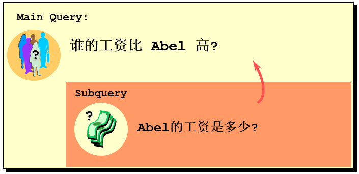
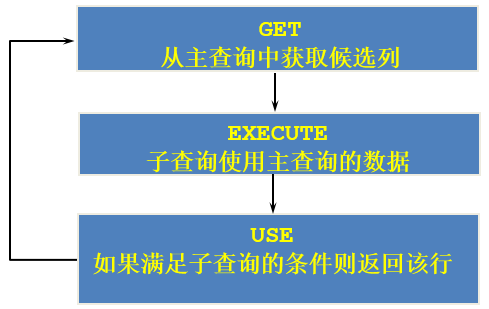
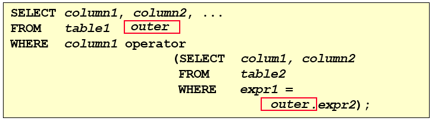

## 子查询

子查询指一个查询语句嵌套在另一个查询语句内部的查询，这个特性从MySQL 4.1开始引入。

SQL 中子查询的使用大大增强了 SELECT 查询的能力，因为很多时候查询需要从结果集中获取数据，或者需要从同一个表中先计算得出一个数据结果，然后与这个数据结果（可能是某个标量，也可能是某个集合）进行比较。

### 需求分析与问题解决

#### 实际问题



现有解决方式：

```sql
# 方式一：
SELECT salary
FROM employees
WHERE last_name = 'Abel';

SELECT last_name,salary
FROM employees
WHERE salary > 11000;

# 方式二：自连接
SELECT e2.last_name,e2.salary
FROM employees e1,employees e2
WHERE e1.last_name = 'Abel'
AND e1.`salary` < e2.`salary`

# 方式三：子查询
SELECT last_name,salary
FROM employees
WHERE salary > (
    SELECT salary
    FROM employees
    WHERE last_name = 'Abel'
    );
+-----------+----------+
| last_name | salary   |
+-----------+----------+
| King      | 24000.00 |
| Kochhar   | 17000.00 |
| De Haan   | 17000.00 |
| Greenberg | 12000.00 |
| Russell   | 14000.00 |
| Partners  | 13500.00 |
| Errazuriz | 12000.00 |
| Ozer      | 11500.00 |
| Hartstein | 13000.00 |
| Higgins   | 12000.00 |
+-----------+----------+
10 rows in set (0.01 sec)
```

#### 子查询的基本使用

* 子查询的基本语法结构：

  ```sql
  SELECT select_list
  FROM table
  WHERE expr operator (SELECT select_list FROM table);
  ```

  

* 子查询（内查询）在主查询之前一次执行完成。

* 子查询的结果被主查询（外查询）使用 。

* 注意事项：

  * 子查询要包含在括号内
  * 将子查询放在比较条件的右侧
  * 单行操作符对应单行子查询，多行操作符对应多行子查询


#### 子查询的分类

**分类方式1：**

我们按内查询的结果返回一条还是多条记录，将子查询分为 `单行子查询` 、 `多行子查询` 。

**分类方式2：**

我们按内查询是否被执行多次，将子查询划分为 `相关(或关联)子查询` 和 `不相关(或非关联)子查询` 。

子查询从数据表中查询了数据结果，如果这个数据结果只执行一次，然后这个数据结果作为主查询的条件进行执行，那么这样的子查询叫做不相关子查询。

同样，如果子查询需要执行多次，即采用循环的方式，先从外部查询开始，每次都传入子查询进行查询，然后再将结果反馈给外部，这种嵌套的执行方式就称为相关子查询。

### 单行子查询

#### 单行比较操作符

| 操作符 | 含义                     |
| ------ | ------------------------ |
| =      | equal to                 |
| >      | greater than             |
| >=     | greater than or equal to |
| <      | less than                |
| <=     | less than or equal to    |
| <>     | not equal to             |

#### 代码示例

**题目：查询工资大于149号员工工资的员工的信息**

```sql
select last_name 
from employees 
where salary > (
    select salary
    from employees
    where employee_id = 149);
+-----------+
| last_name |
+-----------+
| King      |
| Kochhar   |
| De Haan   |
| Greenberg |
| Raphaely  |
| Russell   |
| Partners  |
| Errazuriz |
| Cambrault |
| Ozer      |
| Abel      |
| Hartstein |
| Higgins   |
+-----------+
13 rows in set (0.00 sec)
```


**题目：返回job_id与141号员工相同，salary比143号员工多的员工姓名，job_id和工资**

```sql
select last_name,job_id,salary
from employees
where job_id = (
    select job_id
    from employees
    where employee_id = 141) 
and salary > (
    select salary
    from employees
    where employee_id = 143);
+-------------+----------+---------+
| last_name   | job_id   | salary  |
+-------------+----------+---------+
| Nayer       | ST_CLERK | 3200.00 |
| Mikkilineni | ST_CLERK | 2700.00 |
| Bissot      | ST_CLERK | 3300.00 |
| Atkinson    | ST_CLERK | 2800.00 |
| Mallin      | ST_CLERK | 3300.00 |
| Rogers      | ST_CLERK | 2900.00 |
| Ladwig      | ST_CLERK | 3600.00 |
| Stiles      | ST_CLERK | 3200.00 |
| Seo         | ST_CLERK | 2700.00 |
| Rajs        | ST_CLERK | 3500.00 |
| Davies      | ST_CLERK | 3100.00 |
+-------------+----------+---------+
11 rows in set (0.00 sec)
```


**题目：返回公司工资最少的员工的last_name,job_id和salary**

```sql
select last_name, job_id, salary
from employees
where salary = (
    select MIN(salary)
    from employees);
+-----------+----------+---------+
| last_name | job_id   | salary  |
+-----------+----------+---------+
| Olson     | ST_CLERK | 2100.00 |
+-----------+----------+---------+
1 row in set (0.00 sec)
```


**题目：查询与141号或174号员工的manager_id和department_id相同的其他员工的employee_id， manager_id，department_id**

实现方式一：不成对比较

```sql
select employee_id, manager_id, department_id
from employees
where manager_id in (
    select manager_id
    from employees
    where employee_id = 141 or employee_id = 174) 
and department_id in (
    select department_id
    from employees
    where employee_id in (141, 174))
and employee_id not in (141, 174);
```

实现方式二：成对比较

```sql
select employee_id, manager_id, department_id
from employees
where (manager_id,department_id) in (
    select manager_id, department_id
    from employees
    where employee_id in (141, 174))
and employee_id not in (141, 174);
```


#### HAVING中的子查询

* 首先执行子查询。
* 向主查询中的HAVING 子句返回结果。

**题目：查询最低工资大于50号部门最低工资的部门id和其最低工资**

```sql
select department_id, MIN(salary)
from employees
group by department_id
having MIN(salary) > (
    select MIN(salary)
    from employees
    where department_id = 50);
+---------------+-------------+
| department_id | MIN(salary) |
+---------------+-------------+
|          NULL |     7000.00 |
|            10 |     4400.00 |
|            20 |     6000.00 |
|            30 |     2500.00 |
|            40 |     6500.00 |
|            60 |     4200.00 |
|            70 |    10000.00 |
|            80 |     6100.00 |
|            90 |    17000.00 |
|           100 |     6900.00 |
|           110 |     8300.00 |
+---------------+-------------+
11 rows in set (0.01 sec)
```

#### CASE中的子查询

在CASE表达式中使用单列子查询：

**题目：显式员工的employee_id,last_name和location。其中，若员工department_id与location_id为1800 的department_id相同，则location为’Canada’，其余则为’USA’。**

```sql
select employee_id, last_name, 
   (case department_id
    when (
        select department_id
        from departments
        where location_id = 1800)
    then 'Canada' else 'USA' END) location
from employees;
```


#### 子查询中的空值问题

```sql
SELECT last_name, job_id
FROM employees
WHERE job_id = (
    SELECT job_id
    FROM employees
    WHERE last_name = 'Haas');
Empty set (0.00 sec)
```

> 子查询不返回任何行

#### 非法使用子查询

```sql
SELECT employee_id, last_name
FROM employees
WHERE salary = (
    SELECT MIN(salary)
    FROM employees
    GROUP BY department_id);
ERROR 1242 (21000): Subquery returns more than 1 row
```

> 多行子查询使用单行比较符

### 多行子查询

* 也称为集合比较子查询
* 内查询返回多行
* 使用多行比较操作符

#### 多行比较操作符

| 操作符 | 含义                                                         |
| ------ | ------------------------------------------------------------ |
| IN     | 等于列表中任意一个                                           |
| ANY    | 需要和单行比较操作符一起使用，和子查询返回的**某一个**值比较 |
| ALL    | 需要和单行比较操作符一起使用，和子查询返回的**所有**值比较   |
| SOME   | 实际上是ANY的别名，作用相同，一般常使用ANY                   |

#### 代码示例

**题目：返回其它job_id中比job_id为‘IT_PROG’部门任一工资低的员工的员工号、姓名、job_id 以及salary**

```sql
select employee_id, last_name, job_id, salary
from employees
where salary < any (
    select salary
    from employees
    where job_id = 'IT_PROG')
and job_id != 'IT_PROG';
```


**题目：返回其它job_id中比job_id为‘IT_PROG’部门所有工资都低的员工的员工号、姓名、job_id以及salary**

```sql
select employee_id, last_name, job_id, salary
from employees
where salary < all (
    select salary
    from employees
    where job_id = 'IT_PROG')
and job_id != 'IT_PROG';
```


**题目：查询平均工资最低的部门id**

```sql
#方式1：
SELECT department_id
FROM employees
GROUP BY department_id
HAVING AVG(salary) = (
    SELECT MIN(avg_sal)
    FROM (
        SELECT AVG(salary)avg_sal
        FROM employees
        GROUP BY department_id ) dept_avg_sal);
```

```sql
#方式2：
SELECT department_id
FROM employees
GROUP BY department_id
HAVING AVG(salary) <= ALL (
    SELECT AVG(salary) avg_sal
    FROM employees
    GROUP BY department_id);
```


#### 空值问题

```sql
SELECT last_name
FROM employees
WHERE employee_id NOT IN (
    SELECT manager_id
    FROM employees);
Empty set (0.01 sec)
```


### 相关子查询

#### 相关子查询的执行流程

如果子查询的执行依赖于外部查询，通常情况下都是因为子查询中的表用到了外部的表，并进行了条件关联，因此每执行一次外部查询，子查询都要重新计算一次，这样的子查询就称之为 `关联子查询` 。

相关子查询按照一行接一行的顺序执行，主查询的每一行都执行一次子查询。





**说明：子查询中使用主查询中的列**

#### 代码示例

**题目：查询员工中工资大于本部门平均工资的员工的last_name,salary和其department_id**

方式一：相关子查询

```sql
select last_name, salary, department_id
from employees e1
where salary > (
    select avg(salary)
    from employees e2
    where department_id = e1.department_id);
```

方式二：在 FROM 中使用子查询

```sql
SELECT last_name,salary,e1.department_id 
FROM employees e1,(
    SELECT department_id,AVG(salary) dept_avg_sal
    FROM employees
    GROUP BY department_id) e2
WHERE e1.`department_id` = e2.department_id
AND e2.dept_avg_sal < e1.`salary`;
```

> from型的子查询：子查询是作为from的一部分，子查询要用()引起来，并且要给这个子查询取别名， 把它当成一张“临时的虚拟的表”来使用。

**题目：查询员工的id,salary,按照department_name 排序**

```sql
SELECT employee_id,salary
FROM employees e
ORDER BY (
    SELECT department_name
    FROM departments d
    WHERE e.`department_id` = d.`department_id`);
```


**题目：若employees表中employee_id与job_history表中employee_id相同的数目不小于2，输出这些相同id的员工的employee_id,last_name和其job_id**

```sql
SELECT e.employee_id, last_name,e.job_id
FROM employees e
WHERE 2 <= (
    SELECT COUNT(*)
    FROM job_history
    WHERE employee_id = e.employee_id);
```


#### EXISTS与NOT EXISTS关键字

* 关联子查询通常也会和 EXISTS操作符一起来使用，用来检查在子查询中是否存在满足条的行。
* 如果在子查询中不存在满足条件的行：
  * 条件返回 FALSE
  * 继续在子查询中查找
* 如果在子查询中存在满足条件的行：
  * 不在子查询中继续查找
  * 条件返回 TRUE
* NOT EXISTS关键字表示如果不存在某种条件，则返回TRUE，否则返回FALSE。

**题目：查询公司管理者的employee_id，last_name，job_id，department_id信息**

方式一：

```sql
SELECT employee_id, last_name, job_id, department_id
FROM employees e1
WHERE EXISTS (
    SELECT *
    FROM employees e2
    WHERE e2.manager_id = e1.employee_id);
```


方式二：自连接

```sql
SELECT DISTINCT e1.employee_id, e1.last_name, e1.job_id, e1.department_id
FROM employees e1
JOIN employees e2
WHERE e1.employee_id = e2.manager_id;
```


方式三：

```sql
SELECT employee_id,last_name,job_id,department_id
FROM employees
WHERE employee_id IN (
    SELECT DISTINCT manager_id
    FROM employees );
```

**题目：查询departments表中，不存在于employees表中的部门的department_id和department_name**

```sql
SELECT department_id, department_name
FROM departments d
WHERE NOT EXISTS (
    SELECT 'X'
    FROM employees
    WHERE department_id = d.department_id);
```


#### 相关更新

```sql
UPDATE table1 alias1
SET column = (
    SELECT expression
    FROM table2 alias2
    WHERE alias1.column = alias2.column);
```

使用相关子查询依据一个表中的数据更新另一个表的数据。

**题目：在employees中增加一个department_name字段，数据为员工对应的部门名称**

```sql
# 1）
ALTER TABLE employees
ADD(department_name VARCHAR2(14));

# 2）
UPDATE employees e
SET department_name = (
    SELECT department_name
    FROM departments d
    WHERE e.department_id = d.department_id);
```

#### 相关删除

```sql
DELETE FROM table1 alias1
WHERE column operator (
    SELECT expression
    FROM table2 alias2
    WHERE alias1.column = alias2.column);
```

使用相关子查询依据一个表中的数据删除另一个表的数据。

**题目：删除表employees中，其与emp_history表皆有的数据**

```sql
DELETE FROM employees e
WHERE employee_id in (
    SELECT employee_id
    FROM emp_history
    WHERE employee_id = e.employee_id);
```

### 抛一个思考题

**问题：**谁的工资比Abel的高？

**解答：**

```sql
# 方式一：
SELECT salary
FROM employees
WHERE last_name = 'Abel';

SELECT last_name,salary
FROM employees
WHERE salary > 11000;

# 方式二：自连接
SELECT e2.last_name,e2.salary
FROM employees e1,employees e2
WHERE e1.last_name = 'Abel'
AND e1.`salary` < e2.`salary`

# 方式三：子查询
SELECT last_name,salary
FROM employees
WHERE salary > (
    SELECT salary
    FROM employees
    WHERE last_name = 'Abel'
    );
```

**问题：**以上两种方式有好坏之分吗？

**解答：**自连接方式好！

题目中可以使用子查询，也可以使用自连接。一般情况建议你使用自连接，因为在许多 DBMS 的处理过程中，对于自连接的处理速度要比子查询快得多。

可以这样理解：子查询实际上是通过未知表进行查询后的条件判断，而自连接是通过已知的自身数据表进行条件判断，因此在大部分 DBMS 中都对自连接处理进行了优化。