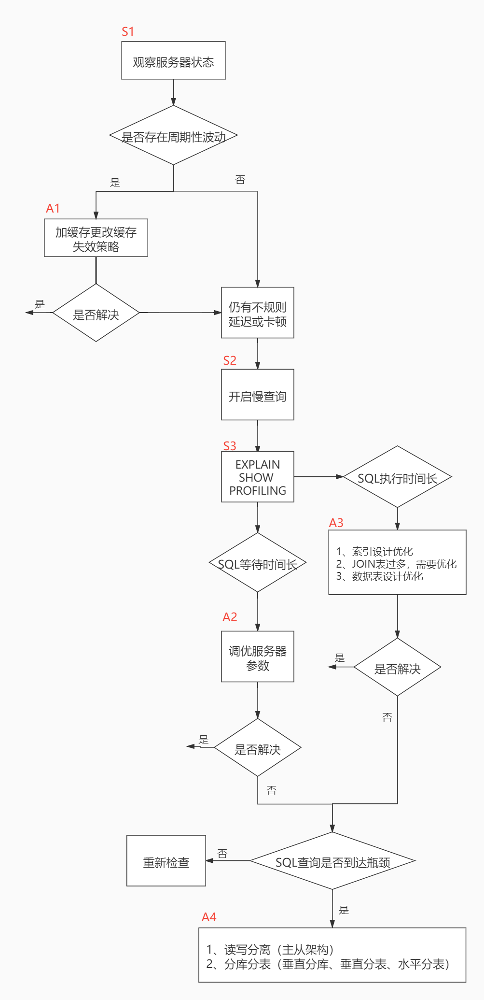
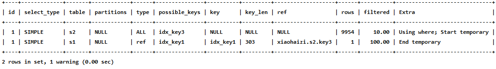
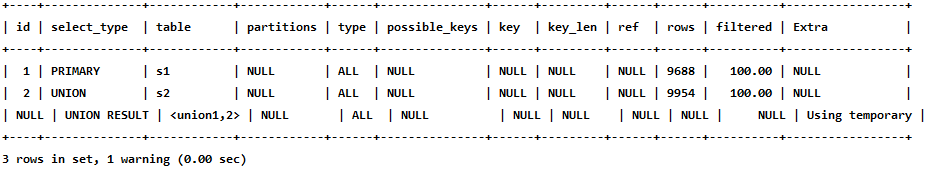
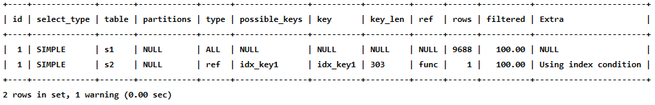

## 性能分析工具的使用

### 1. 数据库服务器的优化步骤

当我们遇到数据库调优问题的时候，该如何思考呢？这里把思考的流程整理成下面这张图。整个流程划分成了**观察（Show status）** 和**行动（Action）** 两个部分。字母 S 的部分代表观察（会使用相应的分析工具），字母 A 代表的部分是行动（对应分析可以采取的行动）。




### 2. 查看系统性能参数

在MySQL中，可以使用`SHOW STATUS` 语句查询一些MySQL数据库服务器的**性能参数**、**执行频率**。
SHOW STATUS语句语法如下：

```sql
SHOW [GLOBAL|SESSION] STATUS LIKE '参数';
```

一些常用的性能参数如下：

| 参数                 | 解释                                                   |
| -------------------- | ------------------------------------------------------ |
| Connections          | 连接MySQL服务器的次数                                  |
| Uptime               | MySQL服务器的上线时间                                  |
| Slow_queries         | 慢查询的次数。                                         |
| Innodb_rows_read     | Select查询返回的行数                                   |
| Innodb_rows_inserted | Innodb_rows_inserted                                   |
| Innodb_rows_updated  | 执行UPDATE操作更新的行数                               |
| Innodb_rows_deleted  | 执行DELETE操作删除的行数                               |
| Com_select           | 查询操作的次数                                         |
| Com_insert           | 插入操作的次数。对于批量插入的 INSERT 操作，只累加一次 |
| Com_update           | 更新操作的次数。                                       |
| Com_delete           | 删除操作的次数                                         |


### 3. 统计SQL的查询成本：last_query_cost

**使用场景：**它对于比较开销是非常有用的，特别是我们有好几种查询方式可选的时候。

```sql
select count(*) from student_info;
+----------+
| count(*) |
+----------+
|  1000000 |
+----------+
1 row in set (0.26 sec)

MySQL [atguigudb1]>
MySQL [atguigudb1]> show status like 'last_query_cost';
+-----------------+---------------+
| Variable_name   | Value         |
+-----------------+---------------+
| Last_query_cost | 202439.799000 |
+-----------------+---------------+
1 row in set (0.01 sec)

```


### 4. 定位执行慢的 SQL：慢查询日志

#### 4.1 开启慢查询日志参数

1. 开启slow_query_log

   ```sql
   set global slow_query_log='ON';
   ```

   查看慢查询日志是否开启，以及慢查询日志文件的位置：

   ```sql
   show variables like '%slow_query_log%';
   +---------------------+---------------------------------+
   | Variable_name       | Value                           |
   +---------------------+---------------------------------+
   | slow_query_log      | ON                              |
   | slow_query_log_file | /export/data/mysql/log/slow.log |
   +---------------------+---------------------------------+
   2 rows in set (0.00 sec)
   ```

   

2. 修改long_query_time阈值

   查看慢查询的时间阈值设置，使用如下命令：

   ```sql
   show variables like '%long_query_time%';
   +-----------------+----------+
   | Variable_name   | Value    |
   +-----------------+----------+
   | long_query_time | 1.000000 |
   +-----------------+----------+
   1 row in set (0.00 sec)
   ```

   设置慢查询的时间阈值

   ```sql
   set global long_query_time = 1;
   set long_query_time=1;
   ```

   

#### 4.2 查看慢查询数目

查询当前系统中有多少条慢查询记录

```sql
SHOW GLOBAL STATUS LIKE '%Slow_queries%';
+---------------+-------+
| Variable_name | Value |
+---------------+-------+
| Slow_queries  | 3     |
+---------------+-------+
1 row in set (0.00 sec)
```


#### 4.3 案例演示

#### 4.4 测试及分析

#### 4.5 慢查询日志分析工具：mysqldumpslow

在生产环境中，如果要手工分析日志，查找、分析SQL，显然是个体力活，MySQL提供了日志分析工具mysqldumpslow 。

查看mysqldumpslow的帮助信息

```bash
$ mysqldumpslow --help
Usage: mysqldumpslow [ OPTS... ] [ LOGS... ]

Parse and summarize the MySQL slow query log. Options are

  --verbose    verbose
  --debug      debug
  --help       write this text to standard output

  -v           verbose
  -d           debug
  -s ORDER     what to sort by (al, at, ar, ae, c, l, r, e, t), 'at' is default
                al: average lock time
                ar: average rows sent
                at: average query time
                 c: count
                 l: lock time
                 r: rows sent
                 t: query time
  -r           reverse the sort order (largest last instead of first)
  -t NUM       just show the top n queries
  -a           don't abstract all numbers to N and strings to 'S'
  -n NUM       abstract numbers with at least n digits within names
  -g PATTERN   grep: only consider stmts that include this string
  -h HOSTNAME  hostname of db server for *-slow.log filename (can be wildcard),
               default is '*', i.e. match all
  -i NAME      name of server instance (if using mysql.server startup script)
  -l           don't subtract lock time from total time
```

| 参数 | 解释                                                         |
| ---- | ------------------------------------------------------------ |
| -a   | 不将数字抽象成N，字符串抽象成S                               |
| -s   | 是表示按照何种方式排序<br />c: 访问次数<br/>l: 锁定时间<br/>r: 返回记录<br/>t: 查询时间<br/>al:平均锁定时间<br/>ar:平均返回记录数<br/>at:平均查询时间 （默认方式）<br/>ac:平均查询次数 |
| -t   | 仅返回前面多少条的数据；                                     |
| -g   | 后边搭配一个正则匹配模式，大小写不敏感的                     |

工作常用参考：

```bash
#得到返回记录集最多的10个SQL
mysqldumpslow -s r -t 10 /var/lib/mysql/atguigu-slow.log

#得到访问次数最多的10个SQL
mysqldumpslow -s c -t 10 /var/lib/mysql/atguigu-slow.log

#得到按照时间排序的前10条里面含有左连接的查询语句
mysqldumpslow -s t -t 10 -g "left join" /var/lib/mysql/atguigu-slow.log

#另外建议在使用这些命令时结合 | 和more 使用 ，否则有可能出现爆屏情况
mysqldumpslow -s r -t 10 /var/lib/mysql/atguigu-slow.log | more
```


#### 4.6 关闭慢查询日志

MySQL服务器停止慢查询日志功能有两种方法：

**方式1：永久性方式**

```ini
[mysqld]
slow_query_log=OFF
```

或者，把slow_query_log一项注释掉 或 删除

```ini
[mysqld]
#slow_query_log =OFF
```

重启MySQL服务

**方式2：临时性方式**

使用SET语句来设置。 

停止MySQL慢查询日志功能，具体SQL语句如下。

```sql
SET GLOBAL slow_query_log=off;
```


#### 4.7 删除慢查询日志

### 5. 查看 SQL 执行成本：SHOW PROFILE

```sql
show variables like 'profiling';
+---------------+-------+
| Variable_name | Value |
+---------------+-------+
| profiling     | OFF   |
+---------------+-------+
1 row in set (0.00 sec)
```

通过设置 `profiling='ON'` 来开启 show profile：

```sql
set profiling = 'ON';
```

然后执行相关的查询语句。接着看下当前会话都有哪些 profiles，使用下面这条命令：

```sql
show profiles;
+----------+------------+-----------------------------------+
| Query_ID | Duration   | Query                             |
+----------+------------+-----------------------------------+
|        1 | 0.00080175 | show variables like 'profiling'   |
|        2 | 0.19544825 | select count(*) from student_info |
+----------+------------+-----------------------------------+
2 rows in set, 1 warning (0.00 sec)
```

进一步查看第2个查询的所有开销

```sql
show profile all for query 2;
+----------------------+----------+----------+------------+-------------------+---------------------+--------------+---------------+---------------+-------------------+-------------------+-------------------+-------+-----------------------+----------------------+-------------+
| Status               | Duration | CPU_user | CPU_system | Context_voluntary | Context_involuntary | Block_ops_in | Block_ops_out | Messages_sent | Messages_received | Page_faults_major | Page_faults_minor | Swaps | Source_function       | Source_file          | Source_line |
+----------------------+----------+----------+------------+-------------------+---------------------+--------------+---------------+---------------+-------------------+-------------------+-------------------+-------+-----------------------+----------------------+-------------+
| starting             | 0.000076 | 0.000049 |   0.000019 |                 0 |                   0 |            0 |             0 |             0 |                 0 |                 0 |                 0 |     0 | NULL                  | NULL                 |        NULL |
| checking permissions | 0.000009 | 0.000004 |   0.000005 |                 0 |                   0 |            0 |             0 |             0 |                 0 |                 0 |                 0 |     0 | check_access          | sql_authorization.cc |         810 |
| Opening tables       | 0.000019 | 0.000014 |   0.000005 |                 0 |                   0 |            0 |             0 |             0 |                 0 |                 0 |                 0 |     0 | open_tables           | sql_base.cc          |        5650 |
| init                 | 0.000015 | 0.000010 |   0.000005 |                 0 |                   0 |            0 |             0 |             0 |                 0 |                 0 |                 0 |     0 | handle_query          | sql_select.cc        |         121 |
| System lock          | 0.000012 | 0.000007 |   0.000005 |                 0 |                   0 |            0 |             0 |             0 |                 0 |                 0 |                 0 |     0 | mysql_lock_tables     | lock.cc              |         323 |
| optimizing           | 0.000007 | 0.000007 |   0.000000 |                 0 |                   0 |            0 |             0 |             0 |                 0 |                 0 |                 0 |     0 | optimize              | sql_optimizer.cc     |         151 |
| statistics           | 0.000016 | 0.000011 |   0.000005 |                 0 |                   0 |            0 |             0 |             0 |                 0 |                 0 |                 0 |     0 | optimize              | sql_optimizer.cc     |         367 |
| preparing            | 0.000014 | 0.000009 |   0.000005 |                 0 |                   0 |            0 |             0 |             0 |                 0 |                 0 |                 0 |     0 | optimize              | sql_optimizer.cc     |         475 |
| executing            | 0.000005 | 0.000005 |   0.000000 |                 0 |                   0 |            0 |             0 |             0 |                 0 |                 0 |                 0 |     0 | exec                  | sql_executor.cc      |         119 |
| Sending data         | 0.193856 | 0.180429 |   0.000000 |                 3 |                  70 |            0 |             0 |             0 |                 0 |                 0 |                 0 |     0 | exec                  | sql_executor.cc      |         195 |
| end                  | 0.000026 | 0.000019 |   0.000000 |                 0 |                   0 |            0 |             0 |             0 |                 0 |                 0 |                 0 |     0 | handle_query          | sql_select.cc        |         199 |
| query end            | 0.000016 | 0.000015 |   0.000000 |                 0 |                   0 |            0 |             0 |             0 |                 0 |                 0 |                 0 |     0 | mysql_execute_command | sql_parse.cc         |        4965 |
| closing tables       | 0.000011 | 0.000011 |   0.000000 |                 0 |                   0 |            0 |             0 |             0 |                 0 |                 0 |                 0 |     0 | mysql_execute_command | sql_parse.cc         |        5017 |
| freeing items        | 0.001349 | 0.000107 |   0.000000 |                 0 |                   1 |            0 |             0 |             0 |                 0 |                 0 |                 0 |     0 | mysql_parse           | sql_parse.cc         |        5622 |
| cleaning up          | 0.000019 | 0.000017 |   0.000000 |                 0 |                   0 |            0 |             0 |             0 |                 0 |                 0 |                 0 |     0 | dispatch_command      | sql_parse.cc         |        1898 |
+----------------------+----------+----------+------------+-------------------+---------------------+--------------+---------------+---------------+-------------------+-------------------+-------------------+-------+-----------------------+----------------------+-------------+
15 rows in set, 1 warning (0.00 sec)
```

查看第2个查询的CPU、磁盘io开销

```sql
show profile cpu,block io for query 2;
+----------------------+----------+----------+------------+--------------+---------------+
| Status               | Duration | CPU_user | CPU_system | Block_ops_in | Block_ops_out |
+----------------------+----------+----------+------------+--------------+---------------+
| starting             | 0.000076 | 0.000049 |   0.000019 |            0 |             0 |
| checking permissions | 0.000009 | 0.000004 |   0.000005 |            0 |             0 |
| Opening tables       | 0.000019 | 0.000014 |   0.000005 |            0 |             0 |
| init                 | 0.000015 | 0.000010 |   0.000005 |            0 |             0 |
| System lock          | 0.000012 | 0.000007 |   0.000005 |            0 |             0 |
| optimizing           | 0.000007 | 0.000007 |   0.000000 |            0 |             0 |
| statistics           | 0.000016 | 0.000011 |   0.000005 |            0 |             0 |
| preparing            | 0.000014 | 0.000009 |   0.000005 |            0 |             0 |
| executing            | 0.000005 | 0.000005 |   0.000000 |            0 |             0 |
| Sending data         | 0.193856 | 0.180429 |   0.000000 |            0 |             0 |
| end                  | 0.000026 | 0.000019 |   0.000000 |            0 |             0 |
| query end            | 0.000016 | 0.000015 |   0.000000 |            0 |             0 |
| closing tables       | 0.000011 | 0.000011 |   0.000000 |            0 |             0 |
| freeing items        | 0.001349 | 0.000107 |   0.000000 |            0 |             0 |
| cleaning up          | 0.000019 | 0.000017 |   0.000000 |            0 |             0 |
+----------------------+----------+----------+------------+--------------+---------------+
15 rows in set, 1 warning (0.00 sec)
```

**show profile的常用查询参数：**

| 参数             | 解释                                                         |
| ---------------- | ------------------------------------------------------------ |
| ALL              | 显示所有的开销信息                                           |
| BLOCK IO         | 显示块IO开销                                                 |
| CONTEXT SWITCHES | 上下文切换开销                                               |
| CPU              | 显示CPU开销信息                                              |
| IPC              | 显示发送和接收开销信息                                       |
| MEMORY           | 显示内存开销信息                                             |
| PAGE FAULTS      | 显示页面错误开销信息                                         |
| SOURCE           | 显示和Source_function，Source_file，Source_line相关的开销信息 |
| SWAPS            | 显示交换次数开销信息                                         |

### 6. 分析查询语句：EXPLAIN

#### 6.1 概述

官网介绍
https://dev.mysql.com/doc/refman/5.7/en/explain-output.html
https://dev.mysql.com/doc/refman/8.0/en/explain-output.html

版本情况

* MySQL 5.6.3以前只能`EXPLAIN SELECT` ；MYSQL 5.6.3以后就可以`EXPLAIN SELECT，UPDATE，`
  `DELETE`
* 在5.7以前的版本中，想要显示`partitions` 需要使用`explain partitions` 命令；想要显示 `filtered` 需要使用`explain extended` 命令。在5.7版本后，默认explain直接显示partitions和filtered中的信息。

#### 6.2 基本语法

EXPLAIN 或 DESCRIBE语句的语法形式如下：

```sql
EXPLAIN SELECT select_options
或者
DESCRIBE SELECT select_options
```

如果我们想看看某个查询的执行计划的话，可以在具体的查询语句前边加一个EXPLAIN ，就像这样：

```sql
EXPLAIN SELECT 1;
```

EXPLAIN 语句输出的各个列的作用如下：

| 列名          | 描述                                                   |
| ------------- | ------------------------------------------------------ |
| id            | 在一个大的查询语句中每个SELECT关键字都对应一个唯一的id |
| select_type   | SELECT关键字对应的那个查询的类型                       |
| table         | 表名                                                   |
| partitions    | 匹配的分区信息                                         |
| type          | 针对单表的访问方法                                     |
| possible_keys | 可能用到的索引                                         |
| key           | 实际上使用的索引                                       |
| key_len       | 实际使用到的索引长度                                   |
| ref           | 当使用索引列等值查询时，与索引列进行等值匹配的对象信息 |
| rows          | 预估的需要读取的记录条数                               |
| filtered      | 某个表经过搜索条件过滤后剩余记录条数的百分比           |
| Extra         | 一些额外的信息                                         |


#### 6.3 数据准备

#### 6.4 EXPLAIN各列的作用

##### 1. table

不论我们的查询语句有多复杂，里边儿包含了多少个表，到最后也是需要对每个表进行**单表访问**的，所以MySQL规定**EXPLAIN语句输出的每条记录都对应着某个单表的访问方法**，该条记录的table列代表着该表的表名（有时不是真实的表名字，可能是简称）。

##### 2. id

我们写的查询语句一般都以`SELECT` 关键字开头，比较简单的查询语句里只有一个SELECT 关键字，比如：

```sql
SELECT * FROM s1 WHERE key1 = 'a';
```

稍微复杂一点的连接查询中也只有一个SELECT 关键字，比如：

```sql
SELECT * FROM s1 INNER JOIN s2
ON s1.key1 = s2.key1
WHERE s1.common_field = 'a';
```

```sql
EXPLAIN SELECT * FROM s1 WHERE key1 = 'a';
```


```sql
EXPLAIN SELECT * FROM s1 INNER JOIN s2;
```


```sql
EXPLAIN SELECT * FROM s1 WHERE key1 IN (SELECT key1 FROM s2) OR key3 = 'a';
```


```sql
EXPLAIN SELECT * FROM s1 WHERE key1 IN (SELECT key2 FROM s2 WHERE common_field = 'a');
```



```sql
EXPLAIN SELECT * FROM s1 UNION SELECT * FROM s2;
```



```sql
EXPLAIN SELECT * FROM s1 UNION ALL SELECT * FROM s2;
```


小结:

* id如果相同，可以认为是一组，从上往下顺序执行
* 在所有组中，id值越大，优先级越高，越先执行
* 关注点：id号每个号码，表示一趟独立的查询, 一个sql的查询趟数越少越好

##### 3. select_type

| 名称                 | 描述                                                         |
| -------------------- | ------------------------------------------------------------ |
| SIMPLE               | Simple SELECT (not using UNION or subqueries)                |
| PRIMARY              | Outermost SELECT                                             |
| UNION                | Second or later SELECT statement in a UNION                  |
| UNION RESULT         | Result of a UNION                                            |
| SUBQUERY             | First SELECT in subquery                                     |
| DEPENDENT SUBQUERY   | First SELECT in subquery, dependent on outer query           |
| DEPENDENT UNION      | Second or later SELECT statement in a UNION, dependent on outer query |
| DERIVED              | Derived table                                                |
| MATERIALIZED         | Materialized subquery                                        |
| UNCACHEABLE SUBQUERY | A subquery for which the result cannot be cached and must be re-evaluated for each row of the outer query |

具体分析如下：

```sql
EXPLAIN SELECT * FROM s1;
```


当然，连接查询也算是SIMPLE 类型，比如：

```sql
EXPLAIN SELECT * FROM s1 INNER JOIN s2;
```


* PRIMARY

  ```sql
  EXPLAIN SELECT * FROM s1 UNION SELECT * FROM s2;
  ```

  

* UNION

* UNION RESULT

* SUBQUERY

  ```sql
  EXPLAIN SELECT * FROM s1 WHERE key1 IN (SELECT key1 FROM s2) OR key3 = 'a';
  ```

  

* DEPENDENT SUBQUERY

  ```sql
  EXPLAIN SELECT * FROM s1 WHERE key1 IN (SELECT key1 FROM s2 WHERE s1.key2 = s2.key2) OR key3 = 'a';
  ```

  

* DEPENDENT UNION

  ```sql
  EXPLAIN SELECT * FROM s1 WHERE key1 IN (SELECT key1 FROM s2 WHERE key1 = 'a' UNION SELECT key1 FROM s1 WHERE key1 = 'b');
  ```

  

* DERIVED

  ```sql
  EXPLAIN SELECT * FROM (SELECT key1, count(*) as c FROM s1 GROUP BY key1) AS derived_s1 where c > 1;
  ```

  

* MATERIALIZED

  ```sql
  EXPLAIN SELECT * FROM s1 WHERE key1 IN (SELECT key1 FROM s2);
  ```

  

* UNCACHEABLE SUBQUERY

  不常用，就不多说了。

* UNCACHEABLE UNION

  不常用，就不多说了。

##### 4. partitions（可略）

如果想详细了解，可以如下方式测试。创建分区表：

```sql
-- 创建分区表，
-- 按照id分区，id<100 p0分区，其他p1分区
CREATE TABLE user_partitions (id INT auto_increment,
  NAME VARCHAR(12),PRIMARY KEY(id))
  PARTITION BY RANGE(id)(
  PARTITION p0 VALUES less than(100),
  PARTITION p1 VALUES less than MAXVALUE
);
```

```sql
DESC SELECT * FROM user_partitions WHERE id>200;
```

查询id大于200（200>100，p1分区）的记录，查看执行计划，partitions是p1，符合我们的分区规则


##### 5. type

完整的访问方法如下： `system` ， `const` ， `eq_ref` ， `ref` ， `fulltext` ， `ref_or_nul`l ，
`index_merge` ， `unique_subquery` ， `index_subquery` ， `range` ， `index` ， `ALL` 。

我们详细解释一下：

* system

  ```sql
  CREATE TABLE t(i int) Engine=MyISAM;
  INSERT INTO t VALUES(1);
  ```

  ```sql
  EXPLAIN SELECT * FROM t;
  ```

  

* const

  ```sql
  EXPLAIN SELECT * FROM s1 WHERE id = 10005;
  ```

  

* eq_ref

  ```sql
  EXPLAIN SELECT * FROM s1 INNER JOIN s2 ON s1.id = s2.id;
  ```

  

* ref

  ```sql
  EXPLAIN SELECT * FROM s1 WHERE key1 = 'a';
  ```

  

* fulltext

  全文索引

* ref_or_null

  ```sql
  EXPLAIN SELECT * FROM s1 WHERE key1 = 'a' OR key1 IS NULL;
  ```

  

* index_merge

  ```sql
  EXPLAIN SELECT * FROM s1 WHERE key1 = 'a' OR key3 = 'a';
  ```

  

  从执行计划的type 列的值是index_merge 就可以看出，MySQL 打算使用索引合并的方式来执行对s1 表的查询。

* unique_subquery

  ```sql
  EXPLAIN SELECT * FROM s1 WHERE key2 IN (SELECT id FROM s2 where s1.key1 = s2.key1) OR key3 = 'a';
  ```

  

* index_subquery

  ```sql
  EXPLAIN SELECT * FROM s1 WHERE common_field IN (SELECT key3 FROM s2 where s1.key1 = s2.key1) OR key3 = 'a';
  ```

  

* range

  ```sql
  EXPLAIN SELECT * FROM s1 WHERE key1 IN ('a', 'b', 'c');
  ```

  

  或者：

  ```sql
  EXPLAIN SELECT * FROM s1 WHERE key1 > 'a' AND key1 < 'b';
  ```

  

  

* index

  ```sql
  EXPLAIN SELECT key_part2 FROM s1 WHERE key_part3 = 'a';
  ```

  

* ALL

  ```sql
  EXPLAIN SELECT * FROM s1;
  ```

  

  小结：

  结果值从最好到最坏依次是： **system > const > eq_ref > ref > fulltext > ref_or_null > index_merge > unique_subquery > index_subquery > range > index > ALL** 其中比较重要的几个提取出来。SQL 性能优化的目标：至少要达到 range 级别，要求是 ref 级别，最好是 consts级别。（阿里巴巴开发手册要求）

##### 6. possible_keys和key

```sql
EXPLAIN SELECT * FROM s1 WHERE key1 > 'z' AND key3 = 'a';
```


##### 7. key_len

```sql
EXPLAIN SELECT * FROM s1 WHERE id = 10005;
```


```sql
EXPLAIN SELECT * FROM s1 WHERE key2 = 10126;
```


```sql
EXPLAIN SELECT * FROM s1 WHERE key1 = 'a';
```


```sql
EXPLAIN SELECT * FROM s1 WHERE key_part1 = 'a';
```


```sql
EXPLAIN SELECT * FROM s1 WHERE key_part1 = 'a' AND key_part2 = 'b';
```


**key_len的长度计算公式：**

```sql
varchar(10)变长字段且允许NULL = 10 * ( character set：
utf8=3,gbk=2,latin1=1)+1(NULL)+2(变长字段)

varchar(10)变长字段且不允许NULL = 10 * ( character set：utf8=3,gbk=2,latin1=1)+2(变长字段)
char(10)固定字段且允许NULL = 10 * ( character set：utf8=3,gbk=2,latin1=1)+1(NULL)
char(10)固定字段且不允许NULL = 10 * ( character set：utf8=3,gbk=2,latin1=1)
```


##### 8. ref

```sql
EXPLAIN SELECT * FROM s1 WHERE key1 = 'a';
```


```sql
EXPLAIN SELECT * FROM s1 INNER JOIN s2 ON s1.id = s2.id;
```


```sql
EXPLAIN SELECT * FROM s1 INNER JOIN s2 ON s2.key1 = UPPER(s1.key1);
```




##### 9. rows

```sql
EXPLAIN SELECT * FROM s1 WHERE key1 > 'z';
```


##### 10. filtered

```sql
EXPLAIN SELECT * FROM s1 WHERE key1 > 'z' AND common_field = 'a';
```


```sql
EXPLAIN SELECT * FROM s1 INNER JOIN s2 ON s1.key1 = s2.key1 WHERE s1.common_field = 'a';
```


##### 11. Extra

```sql
EXPLAIN SELECT 1;
```


* Impossible WHERE

  ```sql
  EXPLAIN SELECT * FROM s1 WHERE 1 != 1;
  ```

  

* Using where

  ```sql
  EXPLAIN SELECT * FROM s1 WHERE common_field = 'a';
  ```

  

  ```sql
  EXPLAIN SELECT * FROM s1 WHERE key1 = 'a' AND common_field = 'a';
  ```

  

  

* No matching min/max row

  ```sql
  EXPLAIN SELECT MIN(key1) FROM s1 WHERE key1 = 'abcdefg';
  ```

  

* Using index

  ```sql
  EXPLAIN SELECT key1 FROM s1 WHERE key1 = 'a';
  ```

  

* Using index condition

  ```sql
  SELECT * FROM s1 WHERE key1 > 'z' AND key1 LIKE '%a';
  ```

  ```sql
  EXPLAIN SELECT * FROM s1 WHERE key1 > 'z' AND key1 LIKE '%b';
  ```

  

* Using join buffer (Block Nested Loop)

  ```sql
  EXPLAIN SELECT * FROM s1 INNER JOIN s2 ON s1.common_field = s2.common_field;
  ```

  

* Not exists

  ```sql
  EXPLAIN SELECT * FROM s1 LEFT JOIN s2 ON s1.key1 = s2.key1 WHERE s2.id IS NULL;
  ```

  

* Using intersect(...) 、Using union(...) 和Using sort_union(...)

  ```sql
  EXPLAIN SELECT * FROM s1 WHERE key1 = 'a' OR key3 = 'a';
  ```

  

* Zero limit

  ```sql
  EXPLAIN SELECT * FROM s1 LIMIT 0;
  ```

  

* Using filesort

  ```sql
  EXPLAIN SELECT * FROM s1 ORDER BY key1 LIMIT 10;
  ```

  

  ```sql
  EXPLAIN SELECT * FROM s1 ORDER BY common_field LIMIT 10;
  ```

  

  

* Using temporary

  ```sql
  EXPLAIN SELECT DISTINCT common_field FROM s1;
  ```

  

  ```sql
  EXPLAIN SELECT common_field, COUNT(*) AS amount FROM s1 GROUP BY common_field;
  ```

  

  ```sql
  EXPLAIN SELECT key1, COUNT(*) AS amount FROM s1 GROUP BY key1;
  ```

  

  从Extra 的Using index 的提示里我们可以看出，上述查询只需要扫描idx_key1 索引就可以搞定了，不再需要临时表了。

* 其它

  

##### 12. 小结

* EXPLAIN不考虑各种Cache
* EXPLAIN不能显示MySQL在执行查询时所作的优化工作
* EXPLAIN不会告诉你关于触发器、存储过程的信息或用户自定义函数对查询的影响情况
* 部分统计信息是估算的，并非精确值

### 7. EXPLAIN的进一步使用

#### 7.1 EXPLAIN四种输出格式

这里谈谈EXPLAIN的输出格式。EXPLAIN可以输出四种格式： **传统格式**， JSON格式， **TREE格式**以及**可视化输出**。用户可以根据需要选择适用于自己的格式。

##### 1. 传统格式

传统格式简单明了，输出是一个表格形式，概要说明查询计划。

```sql
EXPLAIN SELECT s1.key1, s2.key1 FROM s1 LEFT JOIN s2 ON s1.key1 = s2.key1 WHERE s2.common_field IS NOT NULL;
```


##### 2. JSON格式

JSON格式：在EXPLAIN单词和真正的查询语句中间加上FORMAT=JSON 。

```sql
EXPLAIN FORMAT=JSON SELECT ....
```

先看s1 表的"cost_info" 部分：

```json
prefix_cost 就是单独查询s1 表的成本，也就是："cost_info": {
    "read_cost": "1840.84",
    "eval_cost": "193.76",
    "prefix_cost": "2034.60",
    "data_read_per_join": "1M"
}
```

* `read_cost` 是由下边这两部分组成的：

  * IO成本
  * 检测`rows × (1 - filter)` 条记录的CPU 成本

  > 小贴士： rows和filter都是我们前边介绍执行计划的输出列，在JSON格式的执行计划中，rows 相当于rows_examined_per_scan，filtered名称不变。

* `eval_cost` 是这样计算的：

  检测 `rows × filter` 条记录的成本。

* `prefix_cost` 就是单独查询s1 表的成本，也就是：

  `read_cost + eval_cost`

* `data_read_per_join` 表示在此次查询中需要读取的数据量。

对于`s2` 表的"cost_info" 部分是这样的：

```json
"cost_info": {
    "read_cost": "968.80",
    "eval_cost": "193.76",
    "prefix_cost": "3197.16",
    "data_read_per_join": "1M"
}
```

由于s2 表是被驱动表，所以可能被读取多次，这里的read_cost 和eval_cost 是访问多次s2 表后累加起来的值，大家主要关注里边儿的prefix_cost 的值代表的是整个连接查询预计的成本，也就是单次查询s1 表和多次查询s2 表后的成本的和，也就是：

```
968.80 + 193.76 + 2034.60 = 3197.16
```


##### 3. TREE格式

TREE格式是8.0.16版本之后引入的新格式，主要根据查询的各个部分之间的关系和各部分的执行顺序来描述如何查询

```sql
EXPLAIN FORMAT=tree SELECT * FROM s1 INNER JOIN s2 ON s1.key1 = s2.key2 WHERE
s1.common_field = 'a'\G
*************************** 1. row ***************************
EXPLAIN: -> Nested loop inner join (cost=1360.08 rows=990)
    -> Filter: ((s1.common_field = 'a') and (s1.key1 is not null)) (cost=1013.75 rows=990)
    -> Table scan on s1 (cost=1013.75 rows=9895)
    -> Single-row index lookup on s2 using idx_key2 (key2=s1.key1), with index
condition: (cast(s1.key1 as double) = cast(s2.key2 as double)) (cost=0.25 rows=1)
1 row in set, 1 warning (0.00 sec)
```


##### 4. 可视化输出

可视化输出，可以通过`MySQL Workbench`可视化查看MySQL的执行计划。通过点击Workbench的放大镜图标，即可生成可视化的查询计划。上图按从左到右的连接顺序显示表。红色框表示全表扫描，而绿色框表示使用索引查找。对于每个表，显示使用的索引。还要注意的是，每个表格的框上方是每个表访问所发现的行数的估计值以及访问该表的成本。

#### 7.2 SHOW WARNINGS的使用

```sql
EXPLAIN SELECT s1.key1, s2.key1 FROM s1 LEFT JOIN s2 ON s1.key1 = s2.key1 WHERE s2.common_field IS NOT NULL;
```


```sql
SHOW WARNINGS\G
*************************** 1. row ***************************
  Level: Note
   Code: 1003
Message: /* select#1 */ select `atguigu`.`s1`.`key1` AS `key1`,`atguigu`.`s2`.`key1` AS `key1` from `atguigu`.`s1` join `atguigu`.`s2` where ((`atguigu`.`s1`.`key1` = `atguigu`.`s2`.`key1`) and (`atguigu`.`s2`.`common_field` is not null))
1 row in set (0.00 sec)
```


### 8. 分析优化器执行计划：trace

```sql
SET optimizer_trace="enabled=on",end_markers_in_json=on;
set optimizer_trace_max_mem_size=1000000;
```

开启后，可分析如下语句

* SELECT
* INSERT
* REPLACE
* UPDATE
* DELETE
* EXPLAIN
* SET
* DECLARE
* CASE
* IF
* RETURN
* CALL

测试：执行如下SQL语句

```sql
select * from student where id < 10;
```

最后， 查询 information_schema.optimizer_trace 就可以知道MySQL是如何执行SQL的 ：

```sql
select * from information_schema.optimizer_trace\G
```

```sql
select * from information_schema.optimizer_trace\G
*************************** 1. row ***************************
                            QUERY: select * from student_info where id < 10
                            TRACE: {
  "steps": [
    {
      "join_preparation": {
        "select#": 1,
        "steps": [
          {
            "expanded_query": "/* select#1 */ select `student_info`.`id` AS `id`,`student_info`.`student_id` AS `student_id`,`student_info`.`name` AS `name`,`student_info`.`course_id` AS `course_id`,`student_info`.`class_id` AS `class_id`,`student_info`.`create_time` AS `create_time` from `student_info` where (`student_info`.`id` < 10)"
          }
        ] /* steps */
      } /* join_preparation */
    },
    {
      "join_optimization": {
        "select#": 1,
        "steps": [
          {
            "condition_processing": {
              "condition": "WHERE",
              "original_condition": "(`student_info`.`id` < 10)",
              "steps": [
                {
                  "transformation": "equality_propagation",
                  "resulting_condition": "(`student_info`.`id` < 10)"
                },
                {
                  "transformation": "constant_propagation",
                  "resulting_condition": "(`student_info`.`id` < 10)"
                },
                {
                  "transformation": "trivial_condition_removal",
                  "resulting_condition": "(`student_info`.`id` < 10)"
                }
              ] /* steps */
            } /* condition_processing */
          },
          {
            "substitute_generated_columns": {
            } /* substitute_generated_columns */
          },
          {
            "table_dependencies": [
              {
                "table": "`student_info`",
                "row_may_be_null": false,
                "map_bit": 0,
                "depends_on_map_bits": [
                ] /* depends_on_map_bits */
              }
            ] /* table_dependencies */
          },
          {
            "ref_optimizer_key_uses": [
            ] /* ref_optimizer_key_uses */
          },
          {
            "rows_estimation": [
              {
                "table": "`student_info`",
                "range_analysis": {
                  "table_scan": {
                    "rows": 997294,
                    "cost": 202442
                  } /* table_scan */,
                  "potential_range_indexes": [
                    {
                      "index": "PRIMARY",
                      "usable": true,
                      "key_parts": [
                        "id"
                      ] /* key_parts */
                    }
                  ] /* potential_range_indexes */,
                  "setup_range_conditions": [
                  ] /* setup_range_conditions */,
                  "group_index_range": {
                    "chosen": false,
                    "cause": "not_group_by_or_distinct"
                  } /* group_index_range */,
                  "analyzing_range_alternatives": {
                    "range_scan_alternatives": [
                      {
                        "index": "PRIMARY",
                        "ranges": [
                          "id < 10"
                        ] /* ranges */,
                        "index_dives_for_eq_ranges": true,
                        "rowid_ordered": true,
                        "using_mrr": false,
                        "index_only": false,
                        "rows": 9,
                        "cost": 2.8213,
                        "chosen": true
                      }
                    ] /* range_scan_alternatives */,
                    "analyzing_roworder_intersect": {
                      "usable": false,
                      "cause": "too_few_roworder_scans"
                    } /* analyzing_roworder_intersect */
                  } /* analyzing_range_alternatives */,
                  "chosen_range_access_summary": {
                    "range_access_plan": {
                      "type": "range_scan",
                      "index": "PRIMARY",
                      "rows": 9,
                      "ranges": [
                        "id < 10"
                      ] /* ranges */
                    } /* range_access_plan */,
                    "rows_for_plan": 9,
                    "cost_for_plan": 2.8213,
                    "chosen": true
                  } /* chosen_range_access_summary */
                } /* range_analysis */
              }
            ] /* rows_estimation */
          },
          {
            "considered_execution_plans": [
              {
                "plan_prefix": [
                ] /* plan_prefix */,
                "table": "`student_info`",
                "best_access_path": {
                  "considered_access_paths": [
                    {
                      "rows_to_scan": 9,
                      "access_type": "range",
                      "range_details": {
                        "used_index": "PRIMARY"
                      } /* range_details */,
                      "resulting_rows": 9,
                      "cost": 4.6213,
                      "chosen": true
                    }
                  ] /* considered_access_paths */
                } /* best_access_path */,
                "condition_filtering_pct": 100,
                "rows_for_plan": 9,
                "cost_for_plan": 4.6213,
                "chosen": true
              }
            ] /* considered_execution_plans */
          },
          {
            "attaching_conditions_to_tables": {
              "original_condition": "(`student_info`.`id` < 10)",
              "attached_conditions_computation": [
              ] /* attached_conditions_computation */,
              "attached_conditions_summary": [
                {
                  "table": "`student_info`",
                  "attached": "(`student_info`.`id` < 10)"
                }
              ] /* attached_conditions_summary */
            } /* attaching_conditions_to_tables */
          },
          {
            "refine_plan": [
              {
                "table": "`student_info`"
              }
            ] /* refine_plan */
          }
        ] /* steps */
      } /* join_optimization */
    },
    {
      "join_execution": {
        "select#": 1,
        "steps": [
        ] /* steps */
      } /* join_execution */
    }
  ] /* steps */
}
MISSING_BYTES_BEYOND_MAX_MEM_SIZE: 0
          INSUFFICIENT_PRIVILEGES: 0
1 row in set (0.00 sec)

```


### 9. MySQL监控分析视图-sys schema

#### 9.1 Sys schema视图摘要

1. **主机相关：**以host_summary开头，主要汇总了IO延迟的信息。
2. **Innodb相关：**以innodb开头，汇总了innodb buffer信息和事务等待innodb锁的信息。
3. **I/o相关：**以io开头，汇总了等待I/O、I/O使用量情况。
4. **内存使用情况：**以memory开头，从主机、线程、事件等角度展示内存的使用情况
5. **连接与会话信息：**processlist和session相关视图，总结了会话相关信息。
6. **表相关：**以schema_table开头的视图，展示了表的统计信息。
7. **索引信息：**统计了索引的使用情况，包含冗余索引和未使用的索引情况。
8. **语句相关：**以statement开头，包含执行全表扫描、使用临时表、排序等的语句信息。
9. **用户相关：**以user开头的视图，统计了用户使用的文件I/O、执行语句统计信息。
10. **等待事件相关信息：**以wait开头，展示等待事件的延迟情况。


#### 9.2 Sys schema视图使用场景

**索引情况**

```sql
#1. 查询冗余索引
select * from sys.schema_redundant_indexes;
#2. 查询未使用过的索引
select * from sys.schema_unused_indexes;
#3. 查询索引的使用情况
select index_name,rows_selected,rows_inserted,rows_updated,rows_deleted
from sys.schema_index_statistics where table_schema='dbname' ;
```

**表相关**

```sql
# 1. 查询表的访问量
select table_schema,table_name,sum(io_read_requests+io_write_requests) as io from
sys.schema_table_statistics group by table_schema,table_name order by io desc;
# 2. 查询占用buffer pool较多的表
select object_schema,object_name,allocated,data
from sys.innodb_buffer_stats_by_table order by allocated limit 10;
# 3. 查看表的全表扫描情况
select * from sys.statements_with_full_table_scans where db='dbname';
```

**语句相关**

```sql
#1. 监控SQL执行的频率
select db,exec_count,query from sys.statement_analysis

order by exec_count desc;
#2. 监控使用了排序的SQL
select db,exec_count,first_seen,last_seen,query
from sys.statements_with_sorting limit 1;

#3. 监控使用了临时表或者磁盘临时表的SQL
select db,exec_count,tmp_tables,tmp_disk_tables,query
from sys.statement_analysis where tmp_tables>0 or tmp_disk_tables >0
order by (tmp_tables+tmp_disk_tables) desc;
```

**IO相关**

```sql
#1. 查看消耗磁盘IO的文件
select file,avg_read,avg_write,avg_read+avg_write as avg_io
from sys.io_global_by_file_by_bytes order by avg_read limit 10;
```

Innodb 相关

```sql
#1. 行锁阻塞情况
select * from sys.innodb_lock_waits;
```

