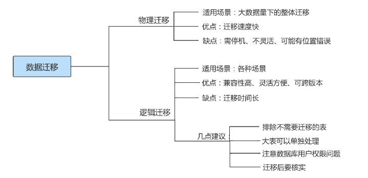

## 数据库备份与恢复

### 物理备份与逻辑备份

**物理备份**：备份数据文件，转储数据库物理文件到某一目录。物理备份恢复速度比较快，但占用空间比较大，MySQL中可以用 `xtrabackup` 工具来进行物理备份。

**逻辑备份**：对数据库对象利用工具进行导出工作，汇总入备份文件内。逻辑备份恢复速度慢，但占用空间小，更灵活。MySQL 中常用的逻辑备份工具为 `mysqldump` 。逻辑备份就是备份sql语句，在恢复的时候执行备份的sql语句实现数据库数据的重现。

### mysqldump实现逻辑备份

#### 备份一个数据库

```bash
mysqldump –u 用户名称 –h 主机名称 –p密码 待备份的数据库名称[tbname, [tbname...]] > 备份文件名称.sql
```

> 说明： 备份的文件并非一定要求后缀名为.sql，例如后缀名为.txt的文件也是可以的。

举例：使用root用户备份atguigu数据库：

```bash
mysqldump -uroot -p atguigu > atguigu.sql #备份文件存储在当前目录下
```

#### 备份全部数据库

若想用mysqldump备份整个实例，可以使用 --all-databases 或 -A 参数：

```bash
mysqldump -uroot -p'PASSWORD' -h x.x.x.x --all-databases > all_database.sql
mysqldump -uroot -p'PASSWORD' -h x.x.x.x -A > all_database.sql
```

#### 备份部分数据库

使用 --databases 或 -B 参数了，该参数后面跟数据库名称，多个数据库间用空格隔开。如果指定databases参数，备份文件中会存在创建数据库的语句，如果不指定参数，则不存在。语法如下：

```bash
mysqldump –u user –h host –p --databases [数据库的名称1 [数据库的名称2...]] > 备份文件名称.sql
```

#### 备份部分表

比如，在表变更前做个备份。语法如下：

```bash
mysqldump –u user –h host –p 数据库的名称 [表名1 [表名2...]] > 备份文件名称.sql
```

举例：备份atguigu数据库下的book表

```bash
mysqldump -uroot -p -h x.x.x.x blog article > article.sql
```

#### 备份单表的部分数据

有些时候一张表的数据量很大，我们只需要部分数据。这时就可以使用 --where 选项了。where后面附带需要满足的条件。

举例：备份student表中id小于10的数据：

```bash
mysqldump -uroot -p atguigu student --where="id < 10 " > student_part_id10_low_bak.sql
```

#### 排除某些表的备份

如果我们想备份某个库，但是某些表数据量很大或者与业务关联不大，这个时候可以考虑排除掉这些表，同样的，选项 `--ignore-table` 可以完成这个功能。如果要排除多张表，就多加几个 `--ignore-table` 选项

```bash
mysqldump -uroot -p atguigu --ignore-table=atguigu.student > no_stu_bak.sql
```

#### 只备份结构或只备份数据

只备份结构的话可以使用 `--no-data` 简写为 `-d` 选项；只备份数据可以使用 `--no-create-info` 简写为-t 选项。

* 只备份结构

  ```bash
  mysqldump -uroot -p atguigu --no-data > atguigu_no_data_bak.sql
  ```

* 只备份数据

  ```bash
  mysqldump -uroot -p atguigu --no-create-info > atguigu_no_create_info_bak.sql
  ```

#### 备份中包含存储过程、函数、事件

mysqldump备份默认是不包含存储过程，自定义函数及事件的。可以使用 --routines 或 -R 选项来备份存储过程及函数，使用 `--events` 或 `-E` 参数来备份事件。

举例：备份整个atguigu库，包含存储过程及事件：

使用下面的SQL可以查看当前库有哪些存储过程或者函数

```sql
SELECT SPECIFIC_NAME,ROUTINE_TYPE ,ROUTINE_SCHEMA 
FROM information_schema.Routines 
WHERE ROUTINE_SCHEMA="atguigu";
```

下面备份atguigu库的数据，函数以及存储过程。

```bash
mysqldump -uroot -p -R -E --databases atguigu > fun_atguigu_bak.sql
```

#### mysqldump常用选项

```bash
--add-drop-database：在每个CREATE DATABASE语句前添加DROP DATABASE语句。
--add-drop-tables：在每个CREATE TABLE语句前添加DROP TABLE语句。
--add-locking：用LOCK TABLES和UNLOCK TABLES语句引用每个表转储。重载转储文件时插入得更快。
--all-database, -A：转储所有数据库中的所有表。与使用--database选项相同，在命令行中命名所有数据库。
--comment[=0|1]：如果设置为0，禁止转储文件中的其他信息，例如程序版本、服务器版本和主机。--skipcomments与--comments=0的结果相同。默认值为1，即包括额外信息。
--compact：产生少量输出。该选项禁用注释并启用--skip-add-drop-tables、--no-set-names、--skipdisable-keys和--skip-add-locking选项。
--compatible=name：产生与其他数据库系统或旧的MySQL服务器更兼容的输出，值可以为ansi、MySQL323、MySQL40、postgresql、oracle、mssql、db2、maxdb、no_key_options、no_table_options或者no_field_options。
--complete_insert, -c：使用包括列名的完整的INSERT语句。
--debug[=debug_options], -#[debug_options]：写调试日志。
--delete，-D：导入文本文件前清空表。
--default-character-set=charset：使用charsets默认字符集。如果没有指定，就使用utf8。
--delete--master-logs：在主复制服务器上，完成转储操作后删除二进制日志。该选项自动启用-masterdata。
--extended-insert，-e：使用包括几个VALUES列表的多行INSERT语法。这样使得转储文件更小，重载文件时可以加速插入。
--flush-logs，-F：开始转储前刷新MySQL服务器日志文件。该选项要求RELOAD权限。
--force，-f：在表转储过程中，即使出现SQL错误也继续。
--lock-all-tables，-x：对所有数据库中的所有表加锁。在整体转储过程中通过全局锁定来实现。该选项自动关闭--single-transaction和--lock-tables。
--lock-tables，-l：开始转储前锁定所有表。用READ LOCAL锁定表以允许并行插入MyISAM表。对于事务表（例如InnoDB和BDB），--single-transaction是一个更好的选项，因为它根本不需要锁定表。
--no-create-db，-n：该选项禁用CREATE DATABASE /*!32312 IF NOT EXIST*/db_name语句，如果给出-
-database或--all-database选项，就包含到输出中。
--no-create-info，-t：只导出数据，而不添加CREATE TABLE语句。
--no-data，-d：不写表的任何行信息，只转储表的结构。
--opt：该选项是速记，它可以快速进行转储操作并产生一个能很快装入MySQL服务器的转储文件。该选项默认开启，但可以用--skip-opt禁用。
--password[=password]，-p[password]：当连接服务器时使用的密码。
-port=port_num，-P port_num：用于连接的TCP/IP端口号。
--protocol={TCP|SOCKET|PIPE|MEMORY}：使用的连接协议。
--replace，-r –replace和--ignore：控制替换或复制唯一键值已有记录的输入记录的处理。如果指定--replace，新行替换有相同的唯一键值的已有行；如果指定--ignore，复制已有的唯一键值的输入行被跳过。如果不
指定这两个选项，当发现一个复制键值时会出现一个错误，并且忽视文本文件的剩余部分。
--silent，-s：沉默模式。只有出现错误时才输出。
--socket=path，-S path：当连接localhost时使用的套接字文件（为默认主机）。
--user=user_name，-u user_name：当连接服务器时MySQL使用的用户名。
--verbose，-v：冗长模式，打印出程序操作的详细信息。
--xml，-X：产生XML输出。
```

> 提示 如果运行mysqldump没有--quick或--opt选项，mysqldump在转储结果前将整个结果集装入内存。如果转储大数据库可能会出现问题，该选项默认启用，但可以用--skip-opt禁用。如果使用最新版本的mysqldump程序备份数据，并用于恢复到比较旧版本的MySQL服务器中，则不要使用--opt或-e选项。


### mysql命令恢复数据

基本语法：

```bash
mysql –u root –p [dbname] < backup.sql
```

#### 单库备份中恢复单库

如果备份文件中包含了创建数据库的语句，则恢复的时候不需要指定数据库名称，如下所示

```bash
mysql -uroot -p < atguigu.sql
```

否则需要指定数据库名称，如下所示

```bash
mysql -uroot -p atguigu4< atguigu.sql
```

#### 全量备份恢复

如果我们现在有昨天的全量备份，现在想整个恢复，则可以这样操作：

```bash
mysql –u root –p < all.sql
```

执行完后，MySQL数据库中就已经恢复了all.sql文件中的所有数据库。

#### 从全量备份中恢复单库

可能有这样的需求，比如说我们只想恢复某一个库，但是我们有的是整个实例的备份，这个时候我们可以从全量备份中分离出单个库的备份。

```bash
sed -n '/^-- Current Database: `atguigu`/,/^-- Current Database: `/p' all_database.sql > atguigu.sql
```

分离完成后我们再导入atguigu.sql即可恢复单个库

#### 从单库备份中恢复单表

这个需求还是比较常见的。比如说我们知道哪个表误操作了，那么就可以用单表恢复的方式来恢复。

举例：我们有atguigu整库的备份，但是由于class表误操作，需要单独恢复出这张表。

```bash
#用shell语法分离出创建表的语句及插入数据的语句后 再依次导出即可完成恢复
cat atguigu.sql | sed -e '/./{H;$!d;}' -e 'x;/CREATE TABLE `class`/!d;q' > class_structure.sql
cat atguigu.sql | grep --ignore-case 'insert into `class`' > class_data.sql
```

```sql
use atguigu;
mysql> source class_structure.sql;
Query OK, 0 rows affected, 1 warning (0.00 sec)

mysql> source class_data.sql;
Query OK, 1 row affected (0.01 sec)
```


### 物理备份：直接复制整个数据库

直接将MySQL中的数据库文件复制出来。这种方法最简单，速度也最快。MySQL的数据库目录位置不一定相同

为了保证备份的一致性。需要保证：

* 方式1：备份前，将服务器停止。
* 方式2：备份前，对相关表执行`FLUSH TABLES WITH READ LOCK` 操作。这样当复制数据库目录中的文件时，允许其他客户继续查询表。同时，`FLUSH TABLES`语句来确保开始备份前将所有激活的索引页写入硬盘。

这种方式方便、快速，但不是最好的备份方法，因为实际情况可能不允许停止MySQL服务器或者锁住表，而且这种方法对InnoDB存储引擎的表不适用。对于MyISAM存储引擎的表，这样备份和还原很方便，但是还原时最好是相同版本的MySQL数据库，否则可能会存在文件类型不同的情况。

注意，物理备份完毕后，执行`UNLOCK TABLES` 来结算其他客户对表的修改行为。

> 说明： 在MySQL版本号中，第一个数字表示主版本号，主版本号相同的MySQL数据库文件格式相同。

此外，还可以考虑使用相关工具实现备份。比如， `MySQLhotcopy` 工具。`MySQLhotcopy`是一个Perl脚本，它使用`LOCK TABLES、FLUSH TABLES`和`cp`或`scp`来快速备份数据库。它是备份数据库或单个表最快的途径，但它只能运行在数据库目录所在的机器上，并且只能备份MyISAM类型的表。多用于mysql5.5之前。

### 物理恢复：直接复制到数据库目录

**步骤：**

1）演示删除备份的数据库中指定表的数据

2）将备份的数据库数据拷贝到数据目录下，并重启MySQL服务器

3）查询相关表的数据是否恢复。需要使用下面的chown 操作。

**要求：**

* 必须确保备份数据的数据库和待恢复的数据库服务器的主版本号相同。
  * 因为只有MySQL数据库主版本号相同时，才能保证这两个MySQL数据库文件类型是相同的。
* 这种方式对MyISAM类型的表比较有效，对于InnoDB类型的表则不可用。
  * 因为InnoDB表的表空间不能直接复制。
* 在Linux操作系统下，复制到数据库目录后，一定要将数据库的用户和组变成mysql，命令如下：

```bash
chown -R mysql.mysql /var/lib/mysql/dbname
```

> 提示 Linux操作系统下的权限设置非常严格。通常情况下，MySQL数据库只有root用户和mysql用户组下的mysql用户才可以访问，因此将数据库目录复制到指定文件夹后，一定要使用chown命令将文件夹的用户组变为mysql，将用户变为mysql。

### 表的导出与导入

#### 表的导出

**1. 使用SELECT…INTO OUTFILE导出文本文件**

在MySQL中，可以使用`SELECT…INTO OUTFILE`语句将表的内容导出成一个文本文件。

**举例：**使用`SELECT…INTO OUTFILE`将atguigu数据库中account表中的记录导出到文本文件。 

（1）选择数据库atguigu，并查询account表，执行结果如下所示。

```sql
use atguigu;
select * from account;
mysql> select * from account;
+----+--------+---------+
| id | name   | balance |
+----+--------+---------+
|  1 | 张三    |      90 |
|  2 | 李四    |     100 |
|  3 | 王五    |       0 |
+----+--------+---------+
3 rows in set (0.01 sec)
```


（2）mysql默认对导出的目录有权限限制，也就是说使用命令行进行导出的时候，需要指定目录进行操作。

查询secure_file_priv值：

```sql
 SHOW GLOBAL VARIABLES LIKE '%secure%';
+--------------------------+------------------------+
| Variable_name            | Value                  |
+--------------------------+------------------------+
| require_secure_transport | OFF                    |
| secure_auth              | ON                     |
| secure_file_priv         | /var/lib/mysql-files/  |
+--------------------------+------------------------+
3 rows in set (0.01 sec)
```

（3）上面结果中显示，`secure_file_priv`变量的值为`/var/lib/mysql-files/`，导出目录设置为该目录，SQL语句如下。

```sql
SELECT * FROM account INTO OUTFILE "/var/lib/mysql-files/account.txt";
```

（4）查看` /var/lib/mysql-files/account.txt`文件。

```
1 张三 90
2 李四 100
3 王五 0
```


**2. 使用mysqldump命令导出文本文件**

**举例1：**使用mysqldump命令将将atguigu数据库中account表中的记录导出到文本文件：

```bash
mysqldump -uroot -p -T "/var/lib/mysql-files/" atguigu account
```

mysqldump命令执行完毕后，在指定的目录`/var/lib/mysql-files/`下生成了account.sql和account.txt文件。

打开account.sql文件，其内容包含创建account表的CREATE语句。

打开account.txt文件，其内容只包含account表中的数据。

**举例2：**使用mysqldump将atguigu数据库中的account表导出到文本文件，使用FIELDS选项，要求字段之
间使用逗号“，”间隔，所有字符类型字段值用双引号括起来：

```bash
mysqldump -uroot -p -T "/var/lib/mysql-files/" atguigu account --fields-terminatedby=',' --fields-optionally-enclosed-by='\"'
```

语句mysqldump语句执行成功之后，指定目录下会出现两个文件account.sql和account.txt。

**3. 使用mysql命令导出文本文件**

使用mysql语句导出atguigu数据中account表中的记录到文本文件：

```bash
mysql -uroot -p --execute="SELECT * FROM account;" atguigu> "/var/lib/mysqlfiles/account.txt"
```

```bash
--vertical  类似于\G显示的结果
--xml       按xml格式展示
--html      按html格式导出，可以通过浏览器查看
```

#### 表的导入

**1. 使用LOAD DATA INFILE方式导入文本文件**

**举例1：**

使用`SELECT...INTO OUTFILE`将atguigu数据库中account表的记录导出到文本文件

```sql
SELECT * FROM atguigu.account INTO OUTFILE '/var/lib/mysql-files/account_0.txt';
```

删除account表中的数据：

```sql
DELETE FROM atguigu.account;
```

从文本文件account.txt中恢复数据：

```sql
LOAD DATA INFILE '/var/lib/mysql-files/account_0.txt'
INTO TABLE atguigu.account;
```

**举例2：** 

选择数据库atguigu，使用`SELECT…INTO OUTFILE`将atguigu数据库account表中的记录导出到文本文件，使用FIELDS选项和LINES选项，要求字段之间使用逗号"，"间隔，所有字段值用双引号括起来：

```sql
SELECT * 
FROM atguigu.account 
INTO OUTFILE '/var/lib/mysql-files/account_1.txt' 
FIELDS TERMINATED BY ',' 
ENCLOSED BY '\"';
```

删除account表中的数据：

```sql
DELETE FROM atguigu.account;
```

从`/var/lib/mysql-files/account.txt`中导入数据到account表中：

```sql
LOAD DATA INFILE '/var/lib/mysql-files/account_1.txt' 
INTO TABLE atguigu.account
FIELDS TERMINATED BY ',' 
ENCLOSED BY '\"';
```

**2. 使用mysqlimport方式导入文本文件**

**举例：**

导出文件account.txt，字段之间使用逗号"，"间隔，字段值用双引号括起来：

```sql
SELECT * 
FROM atguigu.account 
INTO OUTFILE '/var/lib/mysql-files/account.txt' 
FIELDS TERMINATED BY ',' 
ENCLOSED BY '\"';
```

删除account表中的数据：

```sql
DELETE FROM atguigu.account;
```

使用mysqlimport命令将account.txt文件内容导入到数据库atguigu的account表中：

```bash
mysqlimport -uroot -p atguigu '/var/lib/mysql-files/account.txt' --fields-terminatedby=',' --fields-optionally-enclosed-by='\"'
```


### 数据库迁移

#### 概述

数据迁移（data migration）是指选择、准备、提取和转换数据，并**将数据从一个计算机存储系统永久地传输到另一个计算机存储系统的过程**。此外， **验证迁移数据的完整性**和**退役原来旧的数据存储**，也被认为是整个数据迁移过程的一部分。

数据库迁移的原因是多样的，包括服务器或存储设备更换、维护或升级，应用程序迁移，网站集成，灾难恢复和数据中心迁移。

根据不同的需求可能要采取不同的迁移方案，但总体来讲，MySQL 数据迁移方案大致可以分为物理迁移和逻辑迁移两类。通常以尽可能自动化的方式执行，从而将人力资源从繁琐的任务中解放出来。

#### 迁移方案

* 物理迁移

  物理迁移适用于大数据量下的整体迁移。使用物理迁移方案的优点是比较快速，但需要停机迁移并且要求 MySQL 版本及配置必须和原服务器相同，也可能引起未知问题。

  物理迁移包括拷贝数据文件和使用 XtraBackup 备份工具两种。

  不同服务器之间可以采用物理迁移，我们可以在新的服务器上安装好同版本的数据库软件，创建好相同目录，建议配置文件也要和原数据库相同，然后从原数据库方拷贝来数据文件及日志文件，配置好文件组权限，之后在新服务器这边使用 mysqld 命令启动数据库。

* 逻辑迁移

  逻辑迁移适用范围更广，无论是部分迁移还是全量迁移，都可以使用逻辑迁移。逻辑迁移中使用最多的就是通过 mysqldump 等备份工具。

#### 迁移注意点

**1. 相同版本的数据库之间迁移注意点**

指的是在主版本号相同的MySQL数据库之间进行数据库移动。

**方式1：** 因为迁移前后MySQL数据库的**主版本号相同**，所以可以通过复制数据库目录来实现数据库迁移，但是物理迁移方式只适用于MyISAM引擎的表。对于InnoDB表，不能用直接复制文件的方式备份数据库。

**方式2：** 最常见和最安全的方式是使用mysqldump命令导出数据，然后在目标数据库服务器中使用
MySQL命令导入。

举例：

```bash
#host1的机器中备份所有数据库,并将数据库迁移到名为host2的机器上
mysqldump –h host1 –uroot –p –-all-databases | mysql –h host2 –uroot –p
```

在上述语句中，“|”符号表示管道，其作用是将mysqldump备份的文件给mysql命令；“--all-databases”表示要迁移所有的数据库。通过这种方式可以直接实现迁移。

**2. 不同版本的数据库之间迁移注意点**

例如，原来很多服务器使用5.7版本的MySQL数据库，在8.0版本推出来以后，改进了5.7版本的很多缺陷，因此需要把数据库升级到8.0版本

旧版本与新版本的MySQL可能使用不同的默认字符集，例如有的旧版本中使用latin1作为默认字符集，而最新版本的MySQL默认字符集为utf8mb4。如果数据库中有中文数据，那么迁移过程中需要对默认字符集进行修改，不然可能无法正常显示数据。

高版本的MySQL数据库通常都会兼容低版本，因此可以从低版本的MySQL数据库迁移到高版本的MySQL数据库。

**3. 不同数据库之间迁移注意点**

不同数据库之间迁移是指从其他类型的数据库迁移到MySQL数据库，或者从MySQL数据库迁移到其他类型的数据库。这种迁移没有普适的解决方法。

迁移之前，需要了解不同数据库的架构， 比较它们之间的差异。不同数据库中定义相同类型的数据的关键字可能会不同。例如，MySQL中日期字段分为DATE和TIME两种，而ORACLE日期字段只有DATE；SQL Server数据库中有ntext、Image等数据类型，MySQL数据库没有这些数据类型；MySQL支持的ENUM和SET类型，这些SQL Server数据库不支持。

另外，数据库厂商并没有完全按照SQL标准来设计数据库系统，导致不同的数据库系统的SQL语句有差别。例如，微软的SQL Server软件使用的是T-SQL语句，T-SQL中包含了非标准的SQL语句，不能和MySQL的SQL语句兼容。

不同类型数据库之间的差异造成了互相迁移的困难，这些差异其实是商业公司故意造成的技术壁垒。但是不同类型的数据库之间的迁移并不是完全不可能。例如，可以使用MyODBC 实现MySQL和SQL Server之间的迁移。MySQL官方提供的工具MySQL Migration Toolkit 也可以在不同数据之间进行数据迁移。MySQL迁移到Oracle时，需要使用mysqldump命令导出sql文件，然后， 手动更改sql文件中的CREATE语句。

#### 迁移小结



### 删库了不敢跑，能干点啥

#### delete：误删行

**经验之谈：**

* 恢复数据比较安全的做法，是恢复出一个备份，或者找一个从库作为临时库，在这个临时库上执行这些操作，然后再将确认过的临时库的数据，恢复回主库。如果直接修改主库，可能导致对数据的二次破坏。

* 当然，针对预防误删数据的问题，建议如下：

  * 把`sql_safe_updates` 参数设置为on 。这样一来，如果我们忘记在delete或者update语句中写where条件，或者where条件里面没有包含索引字段的话，这条语句的执行就会报错。

    > 如果确定要把一个小表的数据全部删掉，在设置了sql_safe_updates=on情况下，可以在delete语句中加上where条件，比如where id>=0。

  * 代码上线前，必须经过**SQL审计**

#### truncate/drop ：误删库/表

**方案：**

这种情况下，要想恢复数据，就需要使用全量备份，加增量日志的方式了。这个方案要求线上有定期的全量备份，并且实时备份binlog。

在这两个条件都具备的情况下，假如有人中午12点误删了一个库，恢复数据的流程如下：

1. 取最近一次全量备份，假设这个库是一天一备，上次备份是当天凌晨2点；
2. 用备份恢复出一个临时库；
3. 从日志备份里面，取出凌晨2点之后的日志；
4. 把这些日志，除了误删除数据的语句外，全部应用到临时库。

#### 延迟复制备库

如果有**非常核心**的业务，不允许太长的恢复时间，可以考虑搭建延迟复制的备库。一般的主备复制结构存在的问题是，如果主库上有个表被误删了，这个命令很快也会被发给所有从库，进而导致所有从库的数据表也都一起被误删了。

延迟复制的备库是一种特殊的备库，通过 `CHANGE MASTER TO MASTER_DELAY = N` 命令，可以指定这个备库持续保持跟主库有N秒的延迟。比如你把N设置为3600，这就代表了如果主库上有数据被误删了，并且在1小时内发现了这个误操作命令，这个命令就还没有在这个延迟复制的备库执行。这时候到这个备库上执行stop slave，再通过之前介绍的方法，跳过误操作命令，就可以恢复出需要的数据。


#### 预防误删库/表的方法

1. 账号分离。这样做的目的是，避免写错命令。比如：
  * 只给业务开发同学DML权限，而不给truncate/drop权限。而如果业务开发人员有DDL需求的话，可以通过开发管理系统得到支持。
  * 即使是DBA团队成员，日常也都规定只使用只读账号，必要的时候才使用有更新权限的账号。
2. 制定操作规范。比如：
  * 在删除数据表之前，必须先对表做改名操作。然后，观察一段时间，确保对业务无影响以后再删除这张表。
  * 改表名的时候，要求给表名加固定的后缀（比如加_to_be_deleted )，然后删除表的动作必须通过管理系统执行。并且，管理系统删除表的时候，只能删除固定后缀的表。

#### rm：误删MySQL实例

对于一个有高可用机制的MySQL集群来说，不用担心rm删除数据了。只是删掉了其中某一个节点的数据的话，HA系统就会开始工作，选出一个新的主库，从而保证整个集群的正常工作。我们要做的就是在这个节点上把数据恢复回来，再接入整个集群。

### 附录：MySQL常用命令

