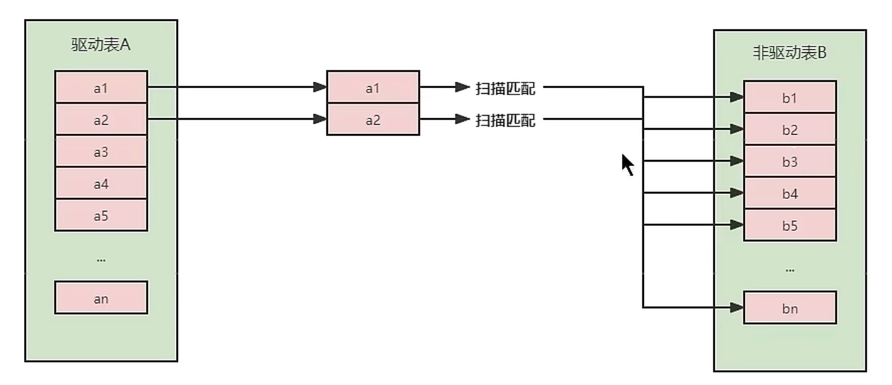
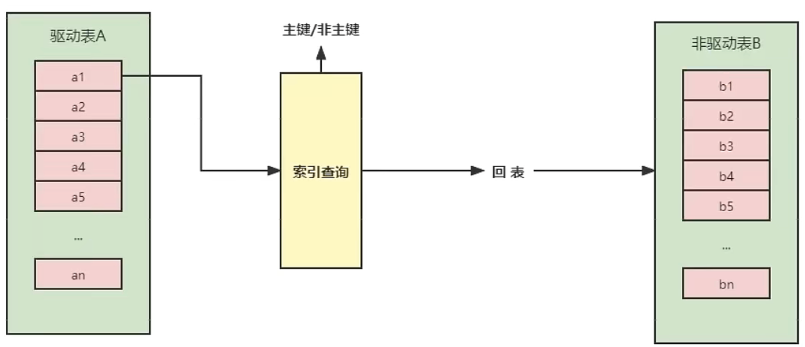
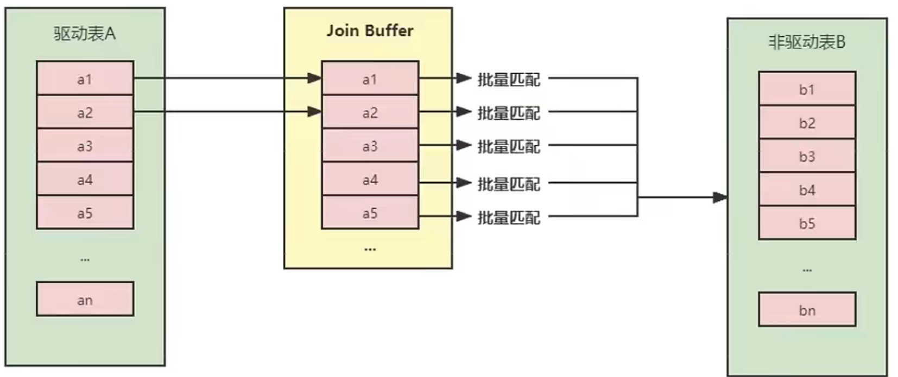

## 索引优化与查询优化

都有哪些维度可以进行数据库调优？简言之∶

* 索引失效、没有充分利用到索引--索引建立
* 关联查询太多JOIN（设计缺陷或不得已的需求）--SQL优化
* 服务器调优及各个参数设置（缓冲、线程数等）--调整my.cnf 
* 数据过多--分库分表

关于数据库调优的知识点非常分散。不同的 DBMS，不同的公司，不同的职位，不同的项目遇到的问题都不尽相同。这里我们分为三个章节进行细致讲解。

虽然 SQL 查询优化的技术有很多，但是大方向上完全可以分成 **物理查询优化** 和**逻辑查询优化** 两大块。

* 物理查询优化是通过 索引 和 表连接方式 等技术来进行优化，这里重点需要掌握索引的使用。
* 逻辑查询优化就是通过 SQL 等价变换提升查询效率，直白一点就是说，换一种查询写法执行效率可能更高。

### 1. 数据准备

学员表 插 50万 条， 班级表 插 1万 条。

**步骤1：建表**

```sql
CREATE TABLE `class` ( 
  `id` INT(11) NOT NULL AUTO_INCREMENT, 
  `className` VARCHAR(30) DEFAULT NULL, 
  `address` VARCHAR(40) DEFAULT NULL, 
  `monitor` INT NULL , 
  PRIMARY KEY (`id`) 
) ENGINE=INNODB AUTO_INCREMENT=1 DEFAULT CHARSET=utf8; 

CREATE TABLE `student` ( 
  `id` INT(11) NOT NULL AUTO_INCREMENT, 
  `stuno` INT NOT NULL , 
  `name` VARCHAR(20) DEFAULT NULL, 
  `age` INT(3) DEFAULT NULL, 
  `classId` INT(11) DEFAULT NULL, 
  PRIMARY KEY (`id`) 
  #CONSTRAINT `fk_class_id` FOREIGN KEY (`classId`) REFERENCES `t_class` (`id`) 
) ENGINE=INNODB AUTO_INCREMENT=1 DEFAULT CHARSET=utf8; 
```

**步骤2：设置参数**

命令开启：允许创建函数设置：

```sql
set global log_bin_trust_function_creators=1; # 不加global只是当前窗口有效。
```

**步骤3：创建函数**

保证每条数据都不同。

```sql
#随机产生字符串 
DELIMITER // 
CREATE FUNCTION rand_string(n INT) RETURNS VARCHAR(255) 
BEGIN 
DECLARE chars_str VARCHAR(100) DEFAULT 
'abcdefghijklmnopqrstuvwxyzABCDEFJHIJKLMNOPQRSTUVWXYZ'; 
DECLARE return_str VARCHAR(255) DEFAULT ''; 
DECLARE i INT DEFAULT 0; 
WHILE i < n DO 
SET return_str =CONCAT(return_str,SUBSTRING(chars_str,FLOOR(1+RAND()*52),1)); 
SET i = i + 1; 
END WHILE;
RETURN return_str; 
END // 
DELIMITER ; 
#假如要删除 
#drop function rand_string; 
```

随机产生班级编号

```sql
#用于随机产生多少到多少的编号 
DELIMITER // 
CREATE FUNCTION rand_num (from_num INT ,to_num INT) RETURNS INT(11) 
BEGIN 
DECLARE i INT DEFAULT 0; 
SET i = FLOOR(from_num +RAND()*(to_num - from_num+1)) ; 
RETURN i; 
END // 
DELIMITER ; 
#假如要删除 
#drop function rand_num; 

```

**步骤4：创建存储过程**

```sql
DELIMITER // 
CREATE PROCEDURE insert_stu( START INT , max_num INT ) 
BEGIN 
DECLARE i INT DEFAULT 0; 
SET autocommit = 0; #设置手动提交事务 
REPEAT #循环 
SET i = i + 1; #赋值 
INSERT INTO student (stuno, name ,age ,classId ) VALUES 
((START+i),rand_string(6),rand_num(1,50),rand_num(1,1000)); 
UNTIL i = max_num 
END REPEAT; 
COMMIT; #提交事务 
END // 
DELIMITER ; 
#假如要删除 
#drop PROCEDURE insert_stu; 
```

创建往class表中插入数据的存储过程

```sql
#执行存储过程，往class表添加随机数据 
DELIMITER // 
CREATE PROCEDURE `insert_class`( max_num INT ) 
BEGIN 
DECLARE i INT DEFAULT 0; 
SET autocommit = 0; 
REPEAT 
SET i = i + 1; 
INSERT INTO class ( classname,address,monitor ) VALUES 
(rand_string(8),rand_string(10),rand_num(1,100000)); 
UNTIL i = max_num 
END REPEAT; 
COMMIT;
END // 
DELIMITER ; 
#假如要删除 
#drop PROCEDURE insert_class; 

```

**步骤5：调用存储过程**

class

```sql
#执行存储过程，往class表添加1万条数据
CALL insert_class(10000);
```

stu

```sql
#执行存储过程，往stu表添加50万条数据
CALL insert_stu(100000,500000);
```

**步骤6：删除某表上的索引**

创建存储过程

```sql
DELIMITER // 
CREATE PROCEDURE `proc_drop_index`(dbname VARCHAR(200),tablename VARCHAR(200)) 
BEGIN 
    DECLARE done INT DEFAULT 0; 
    DECLARE ct INT DEFAULT 0; 
    DECLARE _index VARCHAR(200) DEFAULT ''; 
    DECLARE _cur CURSOR FOR SELECT index_name FROM information_schema.STATISTICS WHERE table_schema=dbname AND table_name=tablename AND seq_in_index=1 AND index_name <>'PRIMARY' ; 
    #每个游标必须使用不同的declare continue handler for not found set done=1来控制游标的结束 
    DECLARE CONTINUE HANDLER FOR NOT FOUND set done=2 ; 
    #若没有数据返回,程序继续,并将变量done设为2 
    OPEN _cur; 
    FETCH _cur INTO _index; 
    WHILE _index<>'' DO 
        SET @str = CONCAT("drop index " , _index , " on " , tablename ); 
        PREPARE sql_str FROM @str ; 
        EXECUTE sql_str; 
        DEALLOCATE PREPARE sql_str; 
        SET _index=''; 
        FETCH _cur INTO _index; 
    END WHILE; 
  CLOSE _cur; 
END // 
DELIMITER ; 

```

执行存储过程

```sql
CALL proc_drop_index("dbname","tablename");
```

### 2. 索引失效案例

#### 2.1 全值匹配我最爱

#### 2.2 最佳左前缀法则

结论：MySQL可以为多个字段创建索引，一个索引可以包括16个字段。对于多列索引，过滤条件要使用索引必须按照索引建立时的顺序，依次满足，一旦跳过某个字段，索引后面的字段都无法被使用。如果查询条件中没有使用这些字段中第1个字段时，多列（或联合）索引不会被使用。

#### 2.3 主键插入顺序

对于一个使用 **InnoDB** 存储引擎的表来说，在我们没有显式的创建索引时，表中的数据实际上都是存储在 **聚簇索引**的叶子节点的。而记录又是存储在数据页中的，数据页和记录又是按照记录 **主键值从小到大**的顺序进行排序，所以如果我们插入的记录的 **主键值是依次增大**的话，那我们每插满一个数据页就换到下个数据页继续插，而如果我们插入的主键值忽大忽小 的话，就比较麻烦了，假设某个数据页存储的记录已经满了，它存储的主键值在1~100之间：

#### 2.4 计算、函数导致索引失效

**例一：函数导致索引失效**

```sql
EXPLAIN SELECT SQL_NO_CACHE * FROM student WHERE student.name LIKE 'abc%';
```

```sql
EXPLAIN SELECT SQL_NO_CACHE * FROM student WHERE LEFT(student.name,3) = 'abc';
```

创建索引：

```sql
CREATE INDEX idx_name ON student(name);
```

第一种sql索引优化生效，第二种失效。

**例二：计算导致索引失效**

student表的字段stuno上设置有索引

```sql
CREATE INDEX idx_sno ON student(stuno);
```

```sql
EXPLAIN SELECT SQL_NO_CACHE id, stuno, NAME FROM student WHERE stuno+1 = 900001;
+----+-------------+---------+------------+------+---------------+------+---------+------+--------+----------+-------------+
| id | select_type | table   | partitions | type | possible_keys | key  | key_len | ref  | rows   | filtered | Extra       |
+----+-------------+---------+------------+------+---------------+------+---------+------+--------+----------+-------------+
|  1 | SIMPLE      | student | NULL       | ALL  | NULL          | NULL | NULL    | NULL | 499086 |   100.00 | Using where |
+----+-------------+---------+------------+------+---------------+------+---------+------+--------+----------+-------------+
1 row in set, 2 warnings (0.00 sec)
```

索引优化生效：

```sql
EXPLAIN SELECT SQL_NO_CACHE id, stuno, NAME FROM student WHERE stuno = 900000;
+----+-------------+---------+------------+------+---------------+---------+---------+-------+------+----------+-------+
| id | select_type | table   | partitions | type | possible_keys | key     | key_len | ref   | rows | filtered | Extra |
+----+-------------+---------+------------+------+---------------+---------+---------+-------+------+----------+-------+
|  1 | SIMPLE      | student | NULL       | ref  | idx_sno       | idx_sno | 4       | const |    1 |   100.00 | NULL  |
+----+-------------+---------+------------+------+---------------+---------+---------+-------+------+----------+-------+
1 row in set, 2 warnings (0.00 sec)
```


#### 2.5 类型转换导致索引时效

```sql
CREATE INDEX idx_name ON student(name);
```

```sql
# 类型转换导致索引失效
EXPLAIN SELECT SQL_NO_CACHE * FROM student WHERE name=123;
+----+-------------+---------+------------+------+---------------+------+---------+------+--------+----------+-------------+
| id | select_type | table   | partitions | type | possible_keys | key  | key_len | ref  | rows   | filtered | Extra       |
+----+-------------+---------+------------+------+---------------+------+---------+------+--------+----------+-------------+
|  1 | SIMPLE      | student | NULL       | ALL  | idx_name      | NULL | NULL    | NULL | 499086 |    10.00 | Using where |
+----+-------------+---------+------------+------+---------------+------+---------+------+--------+----------+-------------+
1 row in set, 4 warnings (0.00 sec)
```

```sql
EXPLAIN SELECT SQL_NO_CACHE * FROM student WHERE name='123';
+----+-------------+---------+------------+------+---------------+----------+---------+-------+------+----------+-------+
| id | select_type | table   | partitions | type | possible_keys | key      | key_len | ref   | rows | filtered | Extra |
+----+-------------+---------+------------+------+---------------+----------+---------+-------+------+----------+-------+
|  1 | SIMPLE      | student | NULL       | ref  | idx_name      | idx_name | 63      | const |    1 |   100.00 | NULL  |
+----+-------------+---------+------------+------+---------------+----------+---------+-------+------+----------+-------+
1 row in set, 2 warnings (0.00 sec)
```


#### 2.6 范围条件右边的列的索引失效

创建索引，范围查询的列未放置在最后

```sql
create index idx_age_classId_name on student(age,classId,name);
```

发现ken_len为10，只用了第一第二列的索引，第三列没用上

```sql
EXPLAIN SELECT SQL_NO_CACHE * FROM student 
    -> WHERE student.age=30 AND student.classId>20 AND student.name = 'abc' ;
+----+-------------+---------+------------+-------+----------------------+----------------------+---------+------+-------+----------+-----------------------+
| id | select_type | table   | partitions | type  | possible_keys        | key                  | key_len | ref  | rows  | filtered | Extra                 |
+----+-------------+---------+------------+-------+----------------------+----------------------+---------+------+-------+----------+-----------------------+
|  1 | SIMPLE      | student | NULL       | range | idx_age_classId_name | idx_age_classId_name | 10      | NULL | 17948 |    10.00 | Using index condition |
+----+-------------+---------+------------+-------+----------------------+----------------------+---------+------+-------+----------+-----------------------+
1 row in set, 2 warnings (0.00 sec)
```

将范围查询条件放置语句最后也不行

```sql
EXPLAIN SELECT SQL_NO_CACHE * FROM student WHERE student.age=30 AND student.name = 'abc' AND student.classId>20 ;
+----+-------------+---------+------------+-------+----------------------+----------------------+---------+------+-------+----------+-----------------------+
| id | select_type | table   | partitions | type  | possible_keys        | key                  | key_len | ref  | rows  | filtered | Extra                 |
+----+-------------+---------+------------+-------+----------------------+----------------------+---------+------+-------+----------+-----------------------+
|  1 | SIMPLE      | student | NULL       | range | idx_age_classId_name | idx_age_classId_name | 10      | NULL | 17948 |    10.00 | Using index condition |
+----+-------------+---------+------------+-------+----------------------+----------------------+---------+------+-------+----------+-----------------------+
1 row in set, 2 warnings (0.00 sec)
```

需要重新建立索引，将范围条件的列放到最后

```sql
create index idx_age_name_classId on student(age,name,classid);
```

```sql
EXPLAIN SELECT SQL_NO_CACHE * FROM student  WHERE student.age=30 AND student.classId>20 AND student.name = 'abc';
+----+-------------+---------+------------+-------+----------------------+----------------------+---------+------+------+----------+-----------------------+
| id | select_type | table   | partitions | type  | possible_keys        | key                  | key_len | ref  | rows | filtered | Extra                 |
+----+-------------+---------+------------+-------+----------------------+----------------------+---------+------+------+----------+-----------------------+
|  1 | SIMPLE      | student | NULL       | range | idx_age_name_classId | idx_age_name_classId | 73      | NULL |    1 |   100.00 | Using index condition |
+----+-------------+---------+------------+-------+----------------------+----------------------+---------+------+------+----------+-----------------------+
1 row in set, 2 warnings (0.00 sec)
```


#### 2.7 不等于（!= 或者<>）索引失效

创建索引

```sql
create index idx_name on student(name);
```

```sql
explain select sql_no_cache * from student where student.name != 'abc';
+----+-------------+---------+------------+------+---------------+------+---------+------+--------+----------+-------------+
| id | select_type | table   | partitions | type | possible_keys | key  | key_len | ref  | rows   | filtered | Extra       |
+----+-------------+---------+------------+------+---------------+------+---------+------+--------+----------+-------------+
|  1 | SIMPLE      | student | NULL       | ALL  | idx_name      | NULL | NULL    | NULL | 499086 |    50.14 | Using where |
+----+-------------+---------+------------+------+---------------+------+---------+------+--------+----------+-------------+
1 row in set, 2 warnings (0.01 sec)
```


#### 2.8 is null可以使用索引，is not null无法使用

```sql
EXPLAIN SELECT SQL_NO_CACHE * FROM student WHERE age IS NULL;
+----+-------------+---------+------------+------+----------------------+----------------------+---------+-------+------+----------+-----------------------+
| id | select_type | table   | partitions | type | possible_keys        | key                  | key_len | ref   | rows | filtered | Extra                 |
+----+-------------+---------+------------+------+----------------------+----------------------+---------+-------+------+----------+-----------------------+
|  1 | SIMPLE      | student | NULL       | ref  | idx_age_name_classid | idx_age_name_classid | 5       | const |    1 |   100.00 | Using index condition |
+----+-------------+---------+------------+------+----------------------+----------------------+---------+-------+------+----------+-----------------------+
1 row in set, 2 warnings (0.00 sec)
```

```sql
EXPLAIN SELECT SQL_NO_CACHE * FROM student WHERE age IS NOT NULL;
+----+-------------+---------+------------+------+----------------------+------+---------+------+--------+----------+-------------+
| id | select_type | table   | partitions | type | possible_keys        | key  | key_len | ref  | rows   | filtered | Extra       |
+----+-------------+---------+------------+------+----------------------+------+---------+------+--------+----------+-------------+
|  1 | SIMPLE      | student | NULL       | ALL  | idx_age_name_classid | NULL | NULL    | NULL | 499086 |    50.00 | Using where |
+----+-------------+---------+------------+------+----------------------+------+---------+------+--------+----------+-------------+
1 row in set, 2 warnings (0.00 sec)
```


#### 2.9 like以通配符%开头索引失效

```sql
explain select * from student where name like '%ab';
+----+-------------+---------+------------+------+---------------+------+---------+------+--------+----------+-------------+
| id | select_type | table   | partitions | type | possible_keys | key  | key_len | ref  | rows   | filtered | Extra       |
+----+-------------+---------+------------+------+---------------+------+---------+------+--------+----------+-------------+
|  1 | SIMPLE      | student | NULL       | ALL  | NULL          | NULL | NULL    | NULL | 499086 |    11.11 | Using where |
+----+-------------+---------+------------+------+---------------+------+---------+------+--------+----------+-------------+
1 row in set, 1 warning (0.00 sec)
```


#### 2.10 OR前后存在非索引的列，索引失效

```sql
EXPLAIN SELECT SQL_NO_CACHE * FROM student WHERE age = 10 OR classid = 100;
+----+-------------+---------+------------+------+----------------------+------+---------+------+--------+----------+-------------+
| id | select_type | table   | partitions | type | possible_keys        | key  | key_len | ref  | rows   | filtered | Extra       |
+----+-------------+---------+------------+------+----------------------+------+---------+------+--------+----------+-------------+
|  1 | SIMPLE      | student | NULL       | ALL  | idx_age_name_classid | NULL | NULL    | NULL | 499086 |    11.88 | Using where |
+----+-------------+---------+------------+------+----------------------+------+---------+------+--------+----------+-------------+
1 row in set, 2 warnings (0.00 sec)
```

```sql
EXPLAIN SELECT SQL_NO_CACHE * FROM student WHERE age = 10 OR name = 'Abel';
+----+-------------+---------+------------+-------------+-------------------------------+-------------------------------+---------+------+-------+----------+--------------------------------------------------------------+
| id | select_type | table   | partitions | type        | possible_keys                 | key                           | key_len | ref  | rows  | filtered | Extra                                                        |
+----+-------------+---------+------------+-------------+-------------------------------+-------------------------------+---------+------+-------+----------+--------------------------------------------------------------+
|  1 | SIMPLE      | student | NULL       | index_merge | idx_name,idx_age_name_classid | idx_age_name_classid,idx_name | 5,63    | NULL | 18705 |   100.00 | Using sort_union(idx_age_name_classid,idx_name); Using where |
+----+-------------+---------+------------+-------------+-------------------------------+-------------------------------+---------+------+-------+----------+--------------------------------------------------------------+
1 row in set, 2 warnings (0.00 sec)
```


#### 2.11 数据库和表的字符集统一使用utf8mb4

统一使用utf8mb4( 5.5.3版本以上支持)兼容性更好，统一字符集可以避免由于字符集转换产生的乱码。不同的 字符集 进行比较前需要进行 转换 会造成索引失效。

#### 一般性建议

* 对于单列索引，尽量选择针对当前query过滤性更好的索引
* 在选择组合索引的时候，当前query中过滤性最好的字段在索引字段顺序中，位置越靠前越好。
* 在选择组合索引的时候，尽量选择能够包含当前query中的where子句中更多字段的索引。
* 在选择组合索引的时候，如果某个字段可能出现范围查询时，尽量把这个字段放在索引次序的最后面

**总之，书写 SQL 语句时，尽量避免造成索引失效的情况。**

### 3. 关联查询优化

#### 3.1 数据准备

```sql
#分类
CREATE TABLE IF NOT EXISTS `type` (
`id` INT(10) UNSIGNED NOT NULL AUTO_INCREMENT,
`card` INT(10) UNSIGNED NOT NULL,
PRIMARY KEY (`id`)
);
#图书
CREATE TABLE IF NOT EXISTS `book` (
`bookid` INT(10) UNSIGNED NOT NULL AUTO_INCREMENT,
`card` INT(10) UNSIGNED NOT NULL,
PRIMARY KEY (`bookid`)
);

#向分类表中添加20条记录
INSERT INTO `type`(card) VALUES(FLOOR(1 + (RAND() * 20)));
INSERT INTO `type`(card) VALUES(FLOOR(1 + (RAND() * 20)));
INSERT INTO `type`(card) VALUES(FLOOR(1 + (RAND() * 20)));
INSERT INTO `type`(card) VALUES(FLOOR(1 + (RAND() * 20)));
INSERT INTO `type`(card) VALUES(FLOOR(1 + (RAND() * 20)));
INSERT INTO `type`(card) VALUES(FLOOR(1 + (RAND() * 20)));
INSERT INTO `type`(card) VALUES(FLOOR(1 + (RAND() * 20)));
INSERT INTO `type`(card) VALUES(FLOOR(1 + (RAND() * 20)));
INSERT INTO `type`(card) VALUES(FLOOR(1 + (RAND() * 20)));
INSERT INTO `type`(card) VALUES(FLOOR(1 + (RAND() * 20)));
INSERT INTO `type`(card) VALUES(FLOOR(1 + (RAND() * 20)));
INSERT INTO `type`(card) VALUES(FLOOR(1 + (RAND() * 20)));
INSERT INTO `type`(card) VALUES(FLOOR(1 + (RAND() * 20)));
INSERT INTO `type`(card) VALUES(FLOOR(1 + (RAND() * 20)));
INSERT INTO `type`(card) VALUES(FLOOR(1 + (RAND() * 20)));
INSERT INTO `type`(card) VALUES(FLOOR(1 + (RAND() * 20)));
INSERT INTO `type`(card) VALUES(FLOOR(1 + (RAND() * 20)));
INSERT INTO `type`(card) VALUES(FLOOR(1 + (RAND() * 20)));
INSERT INTO `type`(card) VALUES(FLOOR(1 + (RAND() * 20)));
INSERT INTO `type`(card) VALUES(FLOOR(1 + (RAND() * 20)));

#向图书表中添加20条记录
INSERT INTO book(card) VALUES(FLOOR(1 + (RAND() * 20)));
INSERT INTO book(card) VALUES(FLOOR(1 + (RAND() * 20)));
INSERT INTO book(card) VALUES(FLOOR(1 + (RAND() * 20)));
INSERT INTO book(card) VALUES(FLOOR(1 + (RAND() * 20)));
INSERT INTO book(card) VALUES(FLOOR(1 + (RAND() * 20)));
INSERT INTO book(card) VALUES(FLOOR(1 + (RAND() * 20)));
INSERT INTO book(card) VALUES(FLOOR(1 + (RAND() * 20)));
INSERT INTO book(card) VALUES(FLOOR(1 + (RAND() * 20)));
INSERT INTO book(card) VALUES(FLOOR(1 + (RAND() * 20)));
INSERT INTO book(card) VALUES(FLOOR(1 + (RAND() * 20)));
INSERT INTO book(card) VALUES(FLOOR(1 + (RAND() * 20)));
INSERT INTO book(card) VALUES(FLOOR(1 + (RAND() * 20)));
INSERT INTO book(card) VALUES(FLOOR(1 + (RAND() * 20)));
INSERT INTO book(card) VALUES(FLOOR(1 + (RAND() * 20)));
INSERT INTO book(card) VALUES(FLOOR(1 + (RAND() * 20)));
INSERT INTO book(card) VALUES(FLOOR(1 + (RAND() * 20)));
INSERT INTO book(card) VALUES(FLOOR(1 + (RAND() * 20)));
INSERT INTO book(card) VALUES(FLOOR(1 + (RAND() * 20)));
INSERT INTO book(card) VALUES(FLOOR(1 + (RAND() * 20)));
INSERT INTO book(card) VALUES(FLOOR(1 + (RAND() * 20)));
```

#### 3.2 采用左外连接

结论：左外连接会遍历左表数据，然后在右表搜索匹配的行，所以右表一定要建立索引。

**不加索引：**

```sql
EXPLAIN SELECT SQL_NO_CACHE * FROM `type` LEFT JOIN book ON type.card = book.card;
+----+-------------+-------+------------+------+---------------+------+---------+------+------+----------+----------------------------------------------------+
| id | select_type | table | partitions | type | possible_keys | key  | key_len | ref  | rows | filtered | Extra                                              |
+----+-------------+-------+------------+------+---------------+------+---------+------+------+----------+----------------------------------------------------+
|  1 | SIMPLE      | type  | NULL       | ALL  | NULL          | NULL | NULL    | NULL |   20 |   100.00 | NULL                                               |
|  1 | SIMPLE      | book  | NULL       | ALL  | NULL          | NULL | NULL    | NULL |   20 |   100.00 | Using where; Using join buffer (Block Nested Loop) |
+----+-------------+-------+------------+------+---------------+------+---------+------+------+----------+----------------------------------------------------+
2 rows in set, 2 warnings (0.00 sec)
```

**添加索引优化: **

```sql
CREATE INDEX idx_card ON book(card);
```

```sql
EXPLAIN SELECT SQL_NO_CACHE * FROM `type` LEFT JOIN book ON type.card = book.card;
+----+-------------+-------+------------+------+---------------+----------+---------+----------------------+------+----------+-------------+
| id | select_type | table | partitions | type | possible_keys | key      | key_len | ref                  | rows | filtered | Extra       |
+----+-------------+-------+------------+------+---------------+----------+---------+----------------------+------+----------+-------------+
|  1 | SIMPLE      | type  | NULL       | ALL  | NULL          | NULL     | NULL    | NULL                 |   20 |   100.00 | NULL        |
|  1 | SIMPLE      | book  | NULL       | ref  | idx_card      | idx_card | 4       | atguigudb2.type.card |    1 |   100.00 | Using index |
+----+-------------+-------+------------+------+---------------+----------+---------+----------------------+------+----------+-------------+
2 rows in set, 2 warnings (0.00 sec)
```

#### 3.3 采用内连接

**结论：**

* 对于内连接来说，查询优化器可以决定谁作为驱动表，谁作为被驱动表出现的
* 对于内连接来讲，如果表的连接条件中只能有一个字段有索引，则有索引的字段所在的表会被作为被驱动表出现。
* 对于内连接来说，在两个表的连接条件都存在索引的情况下，会选择小表作为驱动表。**“小表驱动大表”**

**不加索引：**

```sql
EXPLAIN SELECT SQL_NO_CACHE * FROM `type` INNER JOIN book ON type.card = book.card;
+----+-------------+-------+------------+------+---------------+------+---------+------+------+----------+----------------------------------------------------+
| id | select_type | table | partitions | type | possible_keys | key  | key_len | ref  | rows | filtered | Extra                                              |
+----+-------------+-------+------------+------+---------------+------+---------+------+------+----------+----------------------------------------------------+
|  1 | SIMPLE      | type  | NULL       | ALL  | NULL          | NULL | NULL    | NULL |   20 |   100.00 | NULL                                               |
|  1 | SIMPLE      | book  | NULL       | ALL  | NULL          | NULL | NULL    | NULL |   20 |    10.00 | Using where; Using join buffer (Block Nested Loop) |
+----+-------------+-------+------------+------+---------------+------+---------+------+------+----------+----------------------------------------------------+
2 rows in set, 2 warnings (0.00 sec)
```

**添加索引优化：**

```sql
CREATE INDEX idx_book_card ON book(card);
```

```sql
EXPLAIN SELECT SQL_NO_CACHE * FROM `type` INNER JOIN book ON type.card = book.card;
+----+-------------+-------+------------+------+---------------+---------------+---------+----------------------+------+----------+-------------+
| id | select_type | table | partitions | type | possible_keys | key           | key_len | ref                  | rows | filtered | Extra       |
+----+-------------+-------+------------+------+---------------+---------------+---------+----------------------+------+----------+-------------+
|  1 | SIMPLE      | type  | NULL       | ALL  | NULL          | NULL          | NULL    | NULL                 |   20 |   100.00 | NULL        |
|  1 | SIMPLE      | book  | NULL       | ref  | idx_book_card | idx_book_card | 4       | atguigudb2.type.card |    1 |   100.00 | Using index |
+----+-------------+-------+------------+------+---------------+---------------+---------+----------------------+------+----------+-------------+
2 rows in set, 2 warnings (0.00 sec)
```

```sql
CREATE INDEX idx_type_card ON type(card);
```

```sql
EXPLAIN SELECT SQL_NO_CACHE * FROM `type` INNER JOIN book ON type.card = book.card;
+----+-------------+-------+------------+-------+---------------+---------------+---------+----------------------+------+----------+-------------+
| id | select_type | table | partitions | type  | possible_keys | key           | key_len | ref                  | rows | filtered | Extra       |
+----+-------------+-------+------------+-------+---------------+---------------+---------+----------------------+------+----------+-------------+
|  1 | SIMPLE      | book  | NULL       | index | idx_book_card | idx_book_card | 4       | NULL                 |   20 |   100.00 | Using index |
|  1 | SIMPLE      | type  | NULL       | ref   | idx_type_card | idx_type_card | 4       | atguigudb2.book.card |    1 |   100.00 | Using index |
+----+-------------+-------+------------+-------+---------------+---------------+---------+----------------------+------+----------+-------------+
2 rows in set, 2 warnings (0.00 sec)
```

#### 3.4 join语句原理

join方式连接多个表，本质就是各个表之间数据的循环匹配。MySQL5.5版本之前，MySQL只支持一种表间关联方式，就是嵌套循环（Nested Loop Join）。如果关联表的数据量很大，则join关联的执行时间会非常长。在MySQL5.5以后的版本中，MySQL通过引入BNLJ算法来优化嵌套执行。

##### 1. 驱动表和被驱动表

驱动表就是主表，被驱动表就是从表、非驱动表。

* 对于内连接来说∶

  ```sql
  SELECT * FROM A JOINTB ON...
  ```

  A一定是驱动表吗？不一定，优化器会根据查询语句做优化，决定先查哪张表。先查询的那张表就是驱动表，反之就是被驱动表。通过 explain关键字可以查看。

* 对于外连接来说：

  ```sql
  SELECT * FROM A LEFT JOIN B ON...
  #或
  SELECT * FROM B RIGHT JOIN A ON ...
  ```

  通常，大家会认为A就是驱动表，B就是被驱动表。但也未必。测试如下：

  ```sql
  CREATE TABLE a(f1 INT, f2 INT, INDEX(f1))ENGINE=INNODB;
  CREATE TABLE b(f1 INT, f2 INT)ENGINE=INNODB;
  INSERT INTO a VALUES(1,1),(2,2),(3,3),(4,4),(5,5),(6,6);
  INSERT INTO b VALUES(3,3),(4,4),(5,5),(6,6),(7,7),(8,8);
  ```

  **测试一：**

  虽然写的是left join，但是优化器会将该sql优化为inner join

  ```sql
  EXPLAIN SELECT * FROM a LEFT JOIN b ON(a.f1=b.f1) WHERE (a.f2=b.f2);
  +----+-------------+-------+------------+------+---------------+------+---------+-----------------+------+----------+-------------+
  | id | select_type | table | partitions | type | possible_keys | key  | key_len | ref             | rows | filtered | Extra       |
  +----+-------------+-------+------------+------+---------------+------+---------+-----------------+------+----------+-------------+
  |  1 | SIMPLE      | b     | NULL       | ALL  | NULL          | NULL | NULL    | NULL            |    6 |   100.00 | Using where |
  |  1 | SIMPLE      | a     | NULL       | ref  | f1            | f1   | 5       | atguigudb2.b.f1 |    1 |    16.67 | Using where |
  +----+-------------+-------+------------+------+---------------+------+---------+-----------------+------+----------+-------------+
  2 rows in set, 1 warning (0.00 sec)
  ```

  通过`show warnings\G`可以查看优化后的sql

  ```sql
  show warnings\G
  *************************** 1. row ***************************
    Level: Note
     Code: 1003
  Message: /* select#1 */ select `atguigudb2`.`a`.`f1` AS `f1`,`atguigudb2`.`a`.`f2` AS `f2`,`atguigudb2`.`b`.`f1` AS `f1`,`atguigudb2`.`b`.`f2` AS `f2` from `atguigudb2`.`a` join `atguigudb2`.`b` where ((`atguigudb2`.`a`.`f1` = `atguigudb2`.`b`.`f1`) and (`atguigudb2`.`a`.`f2` = `atguigudb2`.`b`.`f2`))
  1 row in set (0.00 sec)
  ```

  **测试二：**

  ```sql
  EXPLAIN SELECT * FROM a LEFT JOIN b ON(a.f1=b.f1) AND (a.f2=b.f2);
  +----+-------------+-------+------------+------+---------------+------+---------+------+------+----------+----------------------------------------------------+
  | id | select_type | table | partitions | type | possible_keys | key  | key_len | ref  | rows | filtered | Extra                                              |
  +----+-------------+-------+------------+------+---------------+------+---------+------+------+----------+----------------------------------------------------+
  |  1 | SIMPLE      | a     | NULL       | ALL  | NULL          | NULL | NULL    | NULL |    6 |   100.00 | NULL                                               |
  |  1 | SIMPLE      | b     | NULL       | ALL  | NULL          | NULL | NULL    | NULL |    6 |   100.00 | Using where; Using join buffer (Block Nested Loop) |
  +----+-------------+-------+------------+------+---------------+------+---------+------+------+----------+----------------------------------------------------+
  2 rows in set, 1 warning (0.00 sec)
  ```

  **测试三**

  ```sql
  EXPLAIN SELECT * FROM a JOIN b ON(a.f1=b.f1) WHERE (a.f2=b.f2);
  +----+-------------+-------+------------+------+---------------+------+---------+-----------------+------+----------+-------------+
  | id | select_type | table | partitions | type | possible_keys | key  | key_len | ref             | rows | filtered | Extra       |
  +----+-------------+-------+------------+------+---------------+------+---------+-----------------+------+----------+-------------+
  |  1 | SIMPLE      | b     | NULL       | ALL  | NULL          | NULL | NULL    | NULL            |    6 |   100.00 | Using where |
  |  1 | SIMPLE      | a     | NULL       | ref  | f1            | f1   | 5       | atguigudb2.b.f1 |    1 |    16.67 | Using where |
  +----+-------------+-------+------------+------+---------------+------+---------+-----------------+------+----------+-------------+
  2 rows in set, 1 warning (0.00 sec)
  ```

##### 2. Simple Nested-Loop Join（简单嵌套循环连接）

算法相当简单，从表A中取出一条数据1，遍历表B，将匹配到的数据放到result以此类推，驱动表A中的每一条记录与被驱动表B的记录进行判断：



效率非常低下，MySQL不会这么粗暴的去进行表连接

##### 3. Index Nested-Loop Join（索引嵌套循环连接）

Index Nested-Loop Join其优化的思路主要是为了**减少内层表数据的匹配次数**，所以要求被驱动表上必须有索引才行。通过外层表匹配条件直接与内层表索引进行匹配，避免和内层表的每条记录去进行比较， 这样极大的减少了对内层表的匹配次数。



##### 4. Block Nested-Loop Join（块嵌套循环连接）

如果存在索引，那么会使用index的方式进行join，如果join的列没有索引，则被驱动表要扫描的次数太多了。每次访问被驱动表，其表中的记录都会被加载到内存中，然后再从驱动表中取一条与其匹配，匹配结束后清除内存，然后再从驱动表中加载一条记录，然后把被驱区动表的记录在加载到内存匹配，这样周而复始，大大增加了Io的次数。为了减少被驱动表的IO次数，就出现了Block Nested-Loop Join的方式。

不再是逐条获取驱动表的数据，而是一块一块的获取，引入了**join buffer缓冲区**，将驱动表join相关的部分数据列（大小受join buffer的限制）缓存到join buffer中，然后全表扫描被驱动表，被驱动表的每一条记录一次性和join buffer中的所有驱动表记录进行匹配（内存中操作），将简单嵌套循环中的多次比较合并成一次，降低了被驱动表的访问频率。

> 注意∶
>
> 这里缓存的不只是关联表的列，select 后面的列也会缓存起来。
>
> 在一个有N个join关联的sql中会分配N-1个join buffer。所以查询的时候尽量减少不必要的字段，可以让join buffer中可以存放更多的列。



| 开销统计         | SNLJ    | INLJ                  | BNLJ                                             |
| ---------------- | ------- | --------------------- | ------------------------------------------------ |
| 外表扫描次数     | 1       | 1                     | 1                                                |
| 内表扫描次数     | A       | 0                     | A * used_column_size / join_buffer_size + 1      |
| 读取记录数       | A+B * A | A + B(match)          | A+B * ( A * used_column_size / join_buffer_size) |
| JOIN比较次数     | B * A   | A * Index(Height)     | B * A                                            |
| 回表读取记录次数 | 0       | B(match)(if possible) | 0                                                |

参数设置：

* block_nested_loop

  通过`show variables like '%optimizer_switch%'\G`查看`block_nested_loop`状态，默认开启

* join_buffer_size

  驱动表能不能一次加载完，需要看join buffer能不能存储所有数据。通过`show variables like 'join_buffer_size';`查看join_buffer_size大小，默认256KB。

  join_buffer_size的最大值在32位系统可以申请4G，而在64位操做系统下可以申请大于4G的Join Buffer空间（64 位Windows 除外，其大值会被截断为 4GB并发出警告）。

##### 5. Join小结

1、整体效率比较：INLJ > BNLJ > SNLJ

2、永远用小结果集驱动大结果集（其本质就是减少外层循环的数据数量）（小的度量单位指的是 表行数 * 每行大小）

```sql
select t1.b, t2.* from t1 straight_join t2 on（t1.b=t2.b）where t2.id<=100; #推荐
select t1.b, t2.* from t2 straight_join t1 on（t1.b=t2.b）where t2.id<=100; #不推荐
```

3、为被驱动表匹配的条件增加索引（减少内层表的循环匹配次数）

4、增大join buffer size的大小（一次缓存的数据越多，那么内层包的扫表次数就越少）

5、减少驱动表不必要的字段查询（字段越少，join buffer 所缓存的数据就越多）

##### 6. Hash Join

**从MySQL的8.0.20版本开始将废弃BNLJ，因为从MySQL8.0.18版本开始就加入了hash join，默认都会使用hash join**

* Nested Loop：

  对于被连接的数据子集较小的情况，Nested Loop是个较好的选择。

* Hash Join是做大数据集连接时的常用方式，优化器使用两个表中较小（相对较小）的表利用Join Key在内存中建立散列表，然后扫描较大的表并探测散列表，找出与Hash表匹配的行。

  * 这种方式适用于较小的表完全可以放于内存中的情况，这样总成本就是访问两个表的成本之和。
  * 在表很大的情况下并不能完全放入内存，这时优化器会将它分割成若干不同的分区，不能放入内存的部分就把该分区写入磁盘的临时段，此时要求有较大的临时段从而尽量提高I/O 的性能。
  * 它能够很好的工作于没有索引的大表和并行查询的环境中，并提供最好的性能。 大多数人都说它是Join的重型升降机。Hash Join只能应用于等值连接（如WHERE A.COL1=B.COL2），这是由Hash的特点决定的。

| 类别     | Nested Loop                                                  | Hash Join                                                    |
| -------- | ------------------------------------------------------------ | ------------------------------------------------------------ |
| 使用条件 | 任何条件                                                     | 等值连接                                                     |
| 相关资源 | CPU、磁盘IO                                                  | 内存、临时空间                                               |
| 特点     | 当有高选择性索引或进行限制性搜索时效率比较高，能够快速返回第一次的搜索结果。 | 当缺乏索引或者索引条件模糊时，Hash Join比Nested L0op有效。在数据仓库环境下，如果表的纪录数多，效率高。 |
| 缺点     | 当索引丢失或者查询条件限制不够时，效率很低;当表的纪录数多时，效率低。 | 为建立哈希表，需要大量内存。第一次的结果返回较慢。           |

### 4. 子查询优化

MySQL从4.1版本开始支持子查询，使用子查询可以进行SELECT语句的嵌套查询，即一个SELECT查询的结果作为另一个SELECT语句的条件。 **子查询可以一次性完成很多逻辑上需要多个步骤才能完成的SQL操作** 。

**子查询是 MySQL 的一项重要的功能，可以帮助我们通过一个 SQL 语句实现比较复杂的查询。但是，子查询的执行效率不高。**原因：

① 执行子查询时，MySQL需要为内层查询语句的查询结果 **建立一个临时表** ，然后外层查询语句从临时表中查询记录。查询完毕后，再 **撤销这些临时表** 。这样会消耗过多的CPU和IO资源，产生大量的慢查询。

② 子查询的结果集存储的临时表，不论是内存临时表还是磁盘临时表都 **不会存在索引** ，所以查询性能会受到一定的影响。

③ 对于返回结果集比较大的子查询，其对查询性能的影响也就越大。

**在MySQL中，可以使用连接（JOIN）查询来替代子查询**。连接查询 **不需要建立临时表** ，其 **速度比子查询** 要快 ，如果查询中使用索引的话，性能就会更好。

> 结论：尽量不要使用NOT IN 或者 NOT EXISTS，用LEFT JOIN xxx ON xx WHERE xx IS NULL替代

举例1：查询学生表中是班长的学生信息

* 使用子查询

  ```sql
  #查询班长的信息
  EXPLAIN SELECT * FROM student stu1
  WHERE stu1.`stuno` IN (
  SELECT monitor
  FROM class c
  WHERE monitor IS NOT NULL
  );
  ```

  

* 推荐：多表连接

  ```sql
  EXPLAIN SELECT stu1.* FROM student stu1 JOIN class c 
  ON stu1.`stuno` = c.`monitor`
  WHERE c.`monitor` IS NOT NULL;
  ```

举例2：查询不为班长的学生信息

* 不推荐

  ```sql
  EXPLAIN SELECT SQL_NO_CACHE a.* 
  FROM student a 
  WHERE  a.stuno  NOT  IN (
  			SELECT monitor FROM class b 
  			WHERE monitor IS NOT NULL) 
  ```

  

* 推荐

  ```sql
  EXPLAIN SELECT SQL_NO_CACHE a.*
  FROM  student a LEFT OUTER JOIN class b 
  ON a.stuno =b.monitor
  WHERE b.monitor IS NULL;
  ```

### 5. 排序优化

#### 5.1 排序优化

**问题：**在 WHERE 条件字段上加索引，但是为什么在 ORDER BY 字段上还要加索引呢？

**回答：**

在 MySQL中，支持两种排序方式，分别是 FileSort 和 Index 排序。

* Index排序中，索引可以保证数据的有序性，不需要再进行排序，效率更高。
* FileSort排序则一般在内存中进行排序，占用 CPU 较多。如果待排结果较大，会产生临时文件I/O 到磁盘进行排序的情况效率较低。

**优化建议：**

1. SQL 中，可以在 WHERE 子句和 ORDER BY 子句中使用索引，目的是在 WHERE 子句中 避免全表扫 描 ，在 ORDER BY 子句 避免使用 FileSort 排序 。当然，某些情况下全表扫描，或者 FileSort 排序不一定比索引慢。但总的来说，我们还是要避免，以提高查询效率。

2. 尽量使用 Index 完成 ORDER BY 排序。如果 WHERE 和 ORDER BY 后面是相同的列就使用单索引列；如果不同就使用联合索引。
3. 无法使用 Index 时，需要对 FileSort 方式进行调优。

#### 5.2 测试

**过程一：不加索引**

```sql
EXPLAIN SELECT SQL_NO_CACHE * FROM student ORDER BY age,classid; 

EXPLAIN SELECT SQL_NO_CACHE * FROM student ORDER BY age,classid LIMIT 10; 
```

**过程二：**order by时不加limit，且没有索引覆盖，因为回表的数据太大，所以不走索引，直接全表扫描，加上limit，则可以走索引

```sql
#创建索引  
CREATE  INDEX idx_age_classid_name ON student (age,classid,NAME);
```

```sql
# 不走索引
EXPLAIN  SELECT SQL_NO_CACHE * FROM student ORDER BY age,classid;
+----+-------------+---------+------------+------+---------------+------+---------+------+--------+----------+----------------+
| id | select_type | table   | partitions | type | possible_keys | key  | key_len | ref  | rows   | filtered | Extra          |
+----+-------------+---------+------------+------+---------------+------+---------+------+--------+----------+----------------+
|  1 | SIMPLE      | student | NULL       | ALL  | NULL          | NULL | NULL    | NULL | 499086 |   100.00 | Using filesort |
+----+-------------+---------+------------+------+---------------+------+---------+------+--------+----------+----------------+
1 row in set, 2 warnings (0.00 sec)
```

```sql
# 走覆盖索引
EXPLAIN  SELECT SQL_NO_CACHE age,classid,name,id FROM student ORDER BY age,classid;
+----+-------------+---------+------------+-------+---------------+----------------------+---------+------+--------+----------+-------------+
| id | select_type | table   | partitions | type  | possible_keys | key                  | key_len | ref  | rows   | filtered | Extra       |
+----+-------------+---------+------------+-------+---------------+----------------------+---------+------+--------+----------+-------------+
|  1 | SIMPLE      | student | NULL       | index | NULL          | idx_age_classid_name | 73      | NULL | 499086 |   100.00 | Using index |
+----+-------------+---------+------------+-------+---------------+----------------------+---------+------+--------+----------+-------------+
1 row in set, 2 warnings (0.00 sec)
```


```sql
#增加limit过滤条件，使用上索引了。如果limit超过一定数值，则不走索引
EXPLAIN  SELECT SQL_NO_CACHE * FROM student ORDER BY age,classid LIMIT 10;
```

**过程三：**order by 时顺序错误，索引失效

```sql
#创建索引age,classid,stuno
CREATE  INDEX idx_age_classid_stuno ON student (age,classid,stuno); 
```

```sql
EXPLAIN  SELECT * FROM student ORDER BY classid LIMIT 10;
+----+-------------+---------+------------+------+---------------+------+---------+------+--------+----------+----------------+
| id | select_type | table   | partitions | type | possible_keys | key  | key_len | ref  | rows   | filtered | Extra          |
+----+-------------+---------+------------+------+---------------+------+---------+------+--------+----------+----------------+
|  1 | SIMPLE      | student | NULL       | ALL  | NULL          | NULL | NULL    | NULL | 499086 |   100.00 | Using filesort |
+----+-------------+---------+------------+------+---------------+------+---------+------+--------+----------+----------------+
1 row in set, 1 warning (0.00 sec)
```

```sql
EXPLAIN  SELECT * FROM student ORDER BY classid,NAME LIMIT 10;  
+----+-------------+---------+------------+------+---------------+------+---------+------+--------+----------+----------------+
| id | select_type | table   | partitions | type | possible_keys | key  | key_len | ref  | rows   | filtered | Extra          |
+----+-------------+---------+------------+------+---------------+------+---------+------+--------+----------+----------------+
|  1 | SIMPLE      | student | NULL       | ALL  | NULL          | NULL | NULL    | NULL | 499086 |   100.00 | Using filesort |
+----+-------------+---------+------------+------+---------------+------+---------+------+--------+----------+----------------+
1 row in set, 1 warning (0.00 sec)
```

```sql
EXPLAIN  SELECT * FROM student ORDER BY age,classid,stuno LIMIT 10; 
+----+-------------+---------+------------+-------+---------------+-----------------------+---------+------+------+----------+-------+
| id | select_type | table   | partitions | type  | possible_keys | key                   | key_len | ref  | rows | filtered | Extra |
+----+-------------+---------+------------+-------+---------------+-----------------------+---------+------+------+----------+-------+
|  1 | SIMPLE      | student | NULL       | index | NULL          | idx_age_classid_stuno | 14      | NULL |   10 |   100.00 | NULL  |
+----+-------------+---------+------------+-------+---------------+-----------------------+---------+------+------+----------+-------+
1 row in set, 1 warning (0.00 sec)
```

```sql
EXPLAIN  SELECT * FROM student ORDER BY age,classid LIMIT 10;
+----+-------------+---------+------------+-------+---------------+----------------------+---------+------+------+----------+-------+
| id | select_type | table   | partitions | type  | possible_keys | key                  | key_len | ref  | rows | filtered | Extra |
+----+-------------+---------+------------+-------+---------------+----------------------+---------+------+------+----------+-------+
|  1 | SIMPLE      | student | NULL       | index | NULL          | idx_age_classid_name | 73      | NULL |   10 |   100.00 | NULL  |
+----+-------------+---------+------------+-------+---------------+----------------------+---------+------+------+----------+-------+
1 row in set, 1 warning (0.00 sec)
```

```sql
EXPLAIN  SELECT * FROM student ORDER BY age LIMIT 10;
+----+-------------+---------+------------+-------+---------------+----------------------+---------+------+------+----------+-------+
| id | select_type | table   | partitions | type  | possible_keys | key                  | key_len | ref  | rows | filtered | Extra |
+----+-------------+---------+------------+-------+---------------+----------------------+---------+------+------+----------+-------+
|  1 | SIMPLE      | student | NULL       | index | NULL          | idx_age_classid_name | 73      | NULL |   10 |   100.00 | NULL  |
+----+-------------+---------+------------+-------+---------------+----------------------+---------+------+------+----------+-------+
1 row in set, 1 warning (0.00 sec)
```

**过程四：**order by时规则不一致, 索引失效 （顺序错，不索引；方向反，不索引）

```sql
EXPLAIN  SELECT * FROM student ORDER BY age DESC, classid ASC LIMIT 10;
+----+-------------+---------+------------+------+---------------+------+---------+------+--------+----------+----------------+
| id | select_type | table   | partitions | type | possible_keys | key  | key_len | ref  | rows   | filtered | Extra          |
+----+-------------+---------+------------+------+---------------+------+---------+------+--------+----------+----------------+
|  1 | SIMPLE      | student | NULL       | ALL  | NULL          | NULL | NULL    | NULL | 499086 |   100.00 | Using filesort |
+----+-------------+---------+------------+------+---------------+------+---------+------+--------+----------+----------------+
```

```sql
EXPLAIN  SELECT * FROM student ORDER BY classid DESC, NAME DESC LIMIT 10;
+----+-------------+---------+------------+------+---------------+------+---------+------+--------+----------+----------------+
| id | select_type | table   | partitions | type | possible_keys | key  | key_len | ref  | rows   | filtered | Extra          |
+----+-------------+---------+------------+------+---------------+------+---------+------+--------+----------+----------------+
|  1 | SIMPLE      | student | NULL       | ALL  | NULL          | NULL | NULL    | NULL | 499086 |   100.00 | Using filesort |
+----+-------------+---------+------------+------+---------------+------+---------+------+--------+----------+----------------+
1 row in set, 1 warning (0.00 sec)
```

```sql
EXPLAIN  SELECT * FROM student ORDER BY age ASC,classid DESC LIMIT 10; 
+----+-------------+---------+------------+------+---------------+------+---------+------+--------+----------+----------------+
| id | select_type | table   | partitions | type | possible_keys | key  | key_len | ref  | rows   | filtered | Extra          |
+----+-------------+---------+------------+------+---------------+------+---------+------+--------+----------+----------------+
|  1 | SIMPLE      | student | NULL       | ALL  | NULL          | NULL | NULL    | NULL | 499086 |   100.00 | Using filesort |
+----+-------------+---------+------------+------+---------------+------+---------+------+--------+----------+----------------+
1 row in set, 1 warning (0.00 sec)
```

```sql
EXPLAIN  SELECT * FROM student ORDER BY age DESC, classid DESC LIMIT 10;
+----+-------------+---------+------------+-------+---------------+----------------------+---------+------+------+----------+-------+
| id | select_type | table   | partitions | type  | possible_keys | key                  | key_len | ref  | rows | filtered | Extra |
+----+-------------+---------+------------+-------+---------------+----------------------+---------+------+------+----------+-------+
|  1 | SIMPLE      | student | NULL       | index | NULL          | idx_age_classid_name | 73      | NULL |   10 |   100.00 | NULL  |
+----+-------------+---------+------------+-------+---------------+----------------------+---------+------+------+----------+-------+
1 row in set, 1 warning (0.00 sec)
```

**过程五：**无过滤，不索引

```sql
MySQL [atguigudb2]> EXPLAIN  SELECT * FROM student WHERE age=45 ORDER BY classid;
+----+-------------+---------+------------+------+--------------------------------------------+-----------------------+---------+-------+-------+----------+-----------------------+
| id | select_type | table   | partitions | type | possible_keys                              | key                   | key_len | ref   | rows  | filtered | Extra                 |
+----+-------------+---------+------------+------+--------------------------------------------+-----------------------+---------+-------+-------+----------+-----------------------+
|  1 | SIMPLE      | student | NULL       | ref  | idx_age_classid_name,idx_age_classid_stuno | idx_age_classid_stuno | 5       | const | 18860 |   100.00 | Using index condition |
+----+-------------+---------+------------+------+--------------------------------------------+-----------------------+---------+-------+-------+----------+-----------------------+
1 row in set, 1 warning (0.00 sec)

MySQL [atguigudb2]> 
MySQL [atguigudb2]> EXPLAIN  SELECT * FROM student WHERE  age=45 ORDER BY classid,NAME; 
+----+-------------+---------+------------+------+--------------------------------------------+----------------------+---------+-------+-------+----------+-----------------------+
| id | select_type | table   | partitions | type | possible_keys                              | key                  | key_len | ref   | rows  | filtered | Extra                 |
+----+-------------+---------+------------+------+--------------------------------------------+----------------------+---------+-------+-------+----------+-----------------------+
|  1 | SIMPLE      | student | NULL       | ref  | idx_age_classid_name,idx_age_classid_stuno | idx_age_classid_name | 5       | const | 18860 |   100.00 | Using index condition |
+----+-------------+---------+------------+------+--------------------------------------------+----------------------+---------+-------+-------+----------+-----------------------+
1 row in set, 1 warning (0.00 sec)

MySQL [atguigudb2]> 
MySQL [atguigudb2]> EXPLAIN  SELECT * FROM student WHERE  classid=45 ORDER BY age;
+----+-------------+---------+------------+------+---------------+------+---------+------+--------+----------+-----------------------------+
| id | select_type | table   | partitions | type | possible_keys | key  | key_len | ref  | rows   | filtered | Extra                       |
+----+-------------+---------+------------+------+---------------+------+---------+------+--------+----------+-----------------------------+
|  1 | SIMPLE      | student | NULL       | ALL  | NULL          | NULL | NULL    | NULL | 499086 |    10.00 | Using where; Using filesort |
+----+-------------+---------+------------+------+---------------+------+---------+------+--------+----------+-----------------------------+
1 row in set, 1 warning (0.00 sec)

MySQL [atguigudb2]> 
MySQL [atguigudb2]> EXPLAIN  SELECT * FROM student WHERE  classid=45 ORDER BY age LIMIT 10;
+----+-------------+---------+------------+-------+---------------+----------------------+---------+------+------+----------+-------------+
| id | select_type | table   | partitions | type  | possible_keys | key                  | key_len | ref  | rows | filtered | Extra       |
+----+-------------+---------+------------+-------+---------------+----------------------+---------+------+------+----------+-------------+
|  1 | SIMPLE      | student | NULL       | index | NULL          | idx_age_classid_name | 73      | NULL |   10 |    10.00 | Using where |
+----+-------------+---------+------------+-------+---------------+----------------------+---------+------+------+----------+-------------+
1 row in set, 1 warning (0.00 sec)
```

**小结：**

**小结：**

```sql
INDEX a_b_c(a,b,c)

order by 能使用索引最左前缀
- ORDER BY a
- ORDER BY a,b
- ORDER BY a,b,c
- ORDER BY a DESC,b DESC,c DESC

如果WHERE使用索引的最左前缀定义为常量，则order by 能使用索引
- WHERE a = const ORDER BY b,c
- WHERE a = const AND b = const ORDER BY c
- WHERE a = const ORDER BY b,c
- WHERE a = const AND b > const ORDER BY b,c

不能使用索引进行排序
- ORDER BY a ASC,b DESC,c DESC /* 排序不一致 */
- WHERE g = const ORDER BY b,c /*丢失a索引*/
- WHERE a = const ORDER BY c /*丢失b索引*/

- WHERE a = const ORDER BY a,d /*d不是索引的一部分*/
- WHERE a in (...) ORDER BY b,c /*对于排序来说，多个相等条件也是范围查询*/ 
```

#### 5.3 案例实战

#### 5.4 filesort算法：双路排序和单路排序

优化策略
1. 尝试提高 `sort_buffer_size` 
2. 尝试提高 `max_length_for_sort_data`
3. Order by 时select * 是一个大忌。最好只Query需要的字段。

### 6. GROUP BY优化

* group by 使用索引的原则几乎跟order by一致 ，group by 即使没有过滤条件用到索引，也可以直接使用索引。
* group by 先排序再分组，遵照索引建的最佳左前缀法则
* 当无法使用索引列，增大 max_length_for_sort_data 和 sort_buffer_size 参数的设
* where效率高于having，能写在where限定的条件就不要写在having中了
* 减少使用order by，和业务沟通能不排序就不排序，或将排序放到程序端去做。Order by、group by、distinct这些语句较为耗费CPU，数据库的CPU资源是极其宝贵的。
* 包含了order by、group by、distinct这些查询的语句，where条件过滤出来的结果集请保持在1000行以内，否则SQL会很慢。

### 7. 优化分页查询

一般分页查询时，通过创建覆盖索引能够比较好地提高性能。一个常见又非常头疼的问题就是`limit 2000000,10 `，此时需要MySQL排序前2000000 记录，仅仅返回2000000-2000010 的记录，其他记录丢弃，查询排序的代价非常大。

```sql
EXPLAIN SELECT * FROM student LIMIT 2000000, 10;
+----+-------------+---------+------------+------+---------------+------+---------+------+--------+----------+-------+
| id | select_type | table   | partitions | type | possible_keys | key  | key_len | ref  | rows   | filtered | Extra |
+----+-------------+---------+------------+------+---------------+------+---------+------+--------+----------+-------+
|  1 | SIMPLE      | student | NULL       | ALL  | NULL          | NULL | NULL    | NULL | 499086 |   100.00 | NULL  |
+----+-------------+---------+------------+------+---------------+------+---------+------+--------+----------+-------+
1 row in set, 1 warning (0.00 sec)
```

**优化思路一**

在索引上完成排序分页操作，最后根据主键关联回原表查询所需要的其他列内容。

```sql
explain select * from student t, (select id from student order by id limit 2000000, 10) a where t.id = a.id;
+----+-------------+------------+------------+--------+---------------+---------+---------+------+--------+----------+-------------+
| id | select_type | table      | partitions | type   | possible_keys | key     | key_len | ref  | rows   | filtered | Extra       |
+----+-------------+------------+------------+--------+---------------+---------+---------+------+--------+----------+-------------+
|  1 | PRIMARY     | <derived2> | NULL       | ALL    | NULL          | NULL    | NULL    | NULL | 499086 |   100.00 | NULL        |
|  1 | PRIMARY     | t          | NULL       | eq_ref | PRIMARY       | PRIMARY | 4       | a.id |      1 |   100.00 | NULL        |
|  2 | DERIVED     | student    | NULL       | index  | NULL          | PRIMARY | 4       | NULL | 499086 |   100.00 | Using index |
+----+-------------+------------+------------+--------+---------------+---------+---------+------+--------+----------+-------------+
3 rows in set, 1 warning (0.00 sec)
```

**优化思路二**

该方案适用于主键自增的表，可以把Limit查询转换成某个位置的查询

```sql
explain select * from student where id > 2000000 limit 10;
+----+-------------+---------+------------+-------+---------------+---------+---------+------+------+----------+-------------+
| id | select_type | table   | partitions | type  | possible_keys | key     | key_len | ref  | rows | filtered | Extra       |
+----+-------------+---------+------------+-------+---------------+---------+---------+------+------+----------+-------------+
|  1 | SIMPLE      | student | NULL       | range | PRIMARY       | PRIMARY | 4       | NULL |    1 |   100.00 | Using where |
+----+-------------+---------+------------+-------+---------------+---------+---------+------+------+----------+-------------+
1 row in set, 1 warning (0.00 sec)

```

### 8. 优先考虑覆盖索引

#### 8.1 什么是覆盖索引

一个索引包含了满足查询结果的数据就叫做覆盖索引。

简单说就是， **索引列**+**主键** 包含 **SELECT 到 FROM之间查询的列**。

**举例一**

```sql
# 创建索引
CREATE INDEX idx_age_name ON student (age,`name`);
```

```sql
# 需要回表
EXPLAIN SELECT * FROM student WHERE age <> 20;
+----+-------------+---------+------------+------+---------------+------+---------+------+--------+----------+-------------+
| id | select_type | table   | partitions | type | possible_keys | key  | key_len | ref  | rows   | filtered | Extra       |
+----+-------------+---------+------------+------+---------------+------+---------+------+--------+----------+-------------+
|  1 | SIMPLE      | student | NULL       | ALL  | idx_age_name  | NULL | NULL    | NULL | 499086 |   100.00 | Using where |
+----+-------------+---------+------------+------+---------------+------+---------+------+--------+----------+-------------+
1 row in set, 1 warning (0.00 sec)
```

```sql
# 直接使用二级索引，不用回表，但是type是index类型，需要扫描整个二级索引
EXPLAIN SELECT `name`, age FROM student WHERE age <> 20;
+----+-------------+---------+------------+-------+---------------+--------------+---------+------+--------+----------+--------------------------+
| id | select_type | table   | partitions | type  | possible_keys | key          | key_len | ref  | rows   | filtered | Extra                    |
+----+-------------+---------+------------+-------+---------------+--------------+---------+------+--------+----------+--------------------------+
|  1 | SIMPLE      | student | NULL       | index | idx_age_name  | idx_age_name | 68      | NULL | 499086 |   100.00 | Using where; Using index |
+----+-------------+---------+------------+-------+---------------+--------------+---------+------+--------+----------+--------------------------+
1 row in set, 1 warning (0.00 sec)
```

**举例二**

```sql
EXPLAIN SELECT * FROM student WHERE NAME LIKE '%abc';
+----+-------------+---------+------------+------+---------------+------+---------+------+--------+----------+-------------+
| id | select_type | table   | partitions | type | possible_keys | key  | key_len | ref  | rows   | filtered | Extra       |
+----+-------------+---------+------------+------+---------------+------+---------+------+--------+----------+-------------+
|  1 | SIMPLE      | student | NULL       | ALL  | NULL          | NULL | NULL    | NULL | 499086 |    11.11 | Using where |
+----+-------------+---------+------------+------+---------------+------+---------+------+--------+----------+-------------+
1 row in set, 1 warning (0.00 sec)
```

```sql
EXPLAIN SELECT id,age FROM student WHERE NAME LIKE '%abc';
+----+-------------+---------+------------+-------+---------------+--------------+---------+------+--------+----------+--------------------------+
| id | select_type | table   | partitions | type  | possible_keys | key          | key_len | ref  | rows   | filtered | Extra                    |
+----+-------------+---------+------------+-------+---------------+--------------+---------+------+--------+----------+--------------------------+
|  1 | SIMPLE      | student | NULL       | index | NULL          | idx_age_name | 68      | NULL | 499086 |    11.11 | Using where; Using index |
+----+-------------+---------+------------+-------+---------------+--------------+---------+------+--------+----------+--------------------------+
1 row in set, 1 warning (0.00 sec)
```


#### 8.2 覆盖索引的利弊

**好处**

1. 避免Innodb回表
2. 可以把随机IO变成顺序IO加快查询效率

**弊端**

索引字段的维护总是有代价的。因此，在建立冗余索引来支持覆盖索引时就需要权衡考虑了。这是业务DBA或者业务数据架构师的工作。

### 9. 如何给字符串添加索引

### 10. 索引条件下推

#### 10.1 使用前后对比

Index Condition Pushdown（ICP）是MySQL 5.6中新特性，是一种在存储引擎层使用索引过滤数据的优化方式。

* 如果没有 ICP，存储引擎会遍历索引以定位基表中的行，并将它们返回给 MySQL 服务器，由MySQL 服务器评估 WHERE 后面的条件是否保留行。
* 启用ICP后，如果部分 WHERE 条件可以仅使用索引中的列进行筛选，则 MySQL服务器会把这部分WHERE条件放到存储引擎筛选。然后，存储引擎通过使用索引条目来筛选数据，并且只有在满足这一条件时才从表中读取行。
  * 好处∶ICP可以减少存储引擎必须访问基表的次数和MySQL服务器必须访问存储引擎的次数。
  * 但是，ICP的加速效果 取决于在存储引擎内通过ICP筛选掉的数据的比例。

#### 10.2 ICP的开启/关闭

默认情况下启用，可以用`select @@optimizer_switch`查看`index_condition_pushdown`是否为on

**开启**

```sql
set optimizer_switch='index_condition_pushdown=on';
```


**关闭**

```sql
set optimizer_switch='index_condition_pushdown=off';
```

当使用索引下推时，EXPLAIN语句输出结果中Extra字段显示为`Using index condition`

#### 10.3 ICP的使用条件

1. 如果表访问的类型为 range、ref、 eq_refref_or_null可以使用ICP
2. ICP可以用于InnoDB 和MyISAM表，包括分区表InnoDB 和 MyISAM表
3. 对于InnoDB表，ICP仅用于二级索引。ICP的目标是减少全行读取次数，从而减少I/O操作。
4. 当SQL使用覆盖索引时，不支持ICP。因为这种情况下使用 ICP不会减少I/O。
5. 相关子查询的条件不能使用ICP

