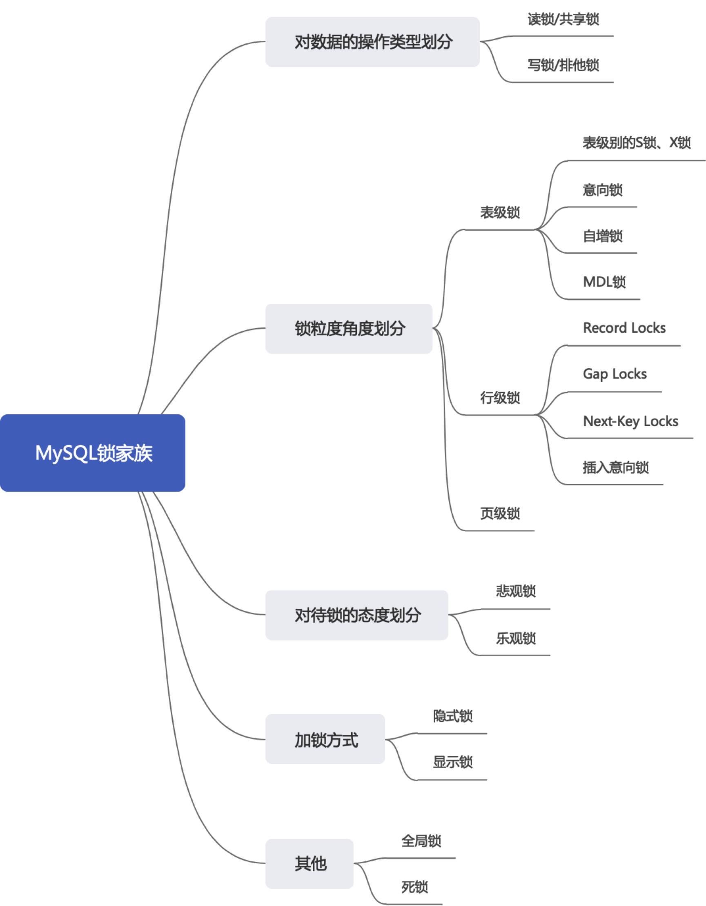
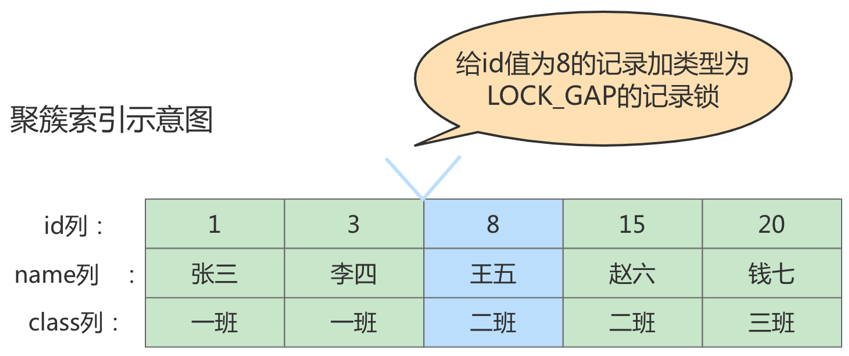

## 锁

### 1. 概述

在数据库中，除传统的计算资源（如CPU、RAM、I/O等）的争用以外，数据也是一种供许多用户共享的资源。为保证数据的一致性，需要对 并发操作进行控制 ，因此产生了 锁 。同时 锁机制 也为实现MySQL的各个隔离级别提供了保证。 锁冲突 也是影响数据库 并发访问性能 的一个重要因素。所以锁对数据库而言显得尤其重要，也更加复杂。

### 2. MySQL并发事务访问相同记录

并发事务访问相同记录的情况大致可以划分为3种：

#### 2.1 读-读情况

读-读 情况，即并发事务相继 读取相同的记录 。读取操作本身不会对记录有任何影响，并不会引起什么问题，所以允许这种情况的发生。

#### 2.2 写-写情况

写-写 情况，即并发事务相继对相同的记录做出改动。

在这种情况下会发生 脏写 的问题，任何一种隔离级别都不允许这种问题的发生。所以在多个未提交事务相继对一条记录做改动时，需要让它们 排队执行 ，这个排队的过程其实是通过 锁 来实现的。这个所谓的锁其实是一个 内存中的结构 ，在事务执行前本来是没有锁的，也就是说一开始是有 锁结构 和记录进行关联的。

当一个事务想对这条记录做改动时，首先会看看内存中有没有与这条记录关联的 锁结构 ，当没有的时候就会在内存中生成一个 锁结构 与之关联。比如，事务 T1 要对这条记录做改动，就需要生成一个 锁结构与之关联：


小结几种说法：

* 不加锁

  意思就是不需要在内存中生成对应的 锁结构 ，可以直接执行操作。

* 获取锁成功，或者加锁成功

  意思就是在内存中生成了对应的 锁结构 ，而且锁结构的 is_waiting 属性为 false，也就是事务可以继续执行操作。

* 获取锁失败，或者加锁失败，或者没有获取到锁

  意思就是在内存中生成了对应的 锁结构 ，不过锁结构的is_waiting 属性为 true ，也就是事务需要等待，不可以继续执行操作。

#### 2.3 读-写或写-读情况

读-写 或 写-读 ，即一个事务进行读取操作，另一个进行改动操作。这种情况下可能发生 脏读 、 不可重 复读 、 幻读的问题。

各个数据库厂商对 SQL标准 的支持都可能不一样。比如MySQL在 REPEATABLE READ 隔离级别上就已经解决了 幻读 问题。

#### 2.4 并发问题解决方案

怎么解决 脏读 、 不可重复读 、 幻读 这些问题呢？其实有两种可选的解决方案：

* 方案一：读操作利用多版本并发控制（ MVCC ，下章讲解），写操作进行 加锁 。

  > 普通的SELECT语句在READ COMMITTED和REPEATABLE READ隔离级别下会使用到MVCC读取记录。
  >
  > * 在 READ COMMITTED 隔离级别下，一个事务在执行过程中每次执行SELECT操作时都会生成一个ReadView，ReadView的存在本身就保证了 事务不可以读取到未提交的事务所做的更改 ，也就是避免了脏读现象；
  > * 在 REPEATABLE READ 隔离级别下，一个事务在执行过程中只有 第一次执行SELECT操作 才会生成一个ReadView，之后的SELECT操作都 复用 这个ReadView，这样也就避免了不可重复读和幻读的问题。

* 方案二：读、写操作都采用 加锁 的方式。

* 小结对比发现：

  * 采用 MVCC 方式的话， 读-写 操作彼此并不冲突， 性能更高 。
  * 采用 加锁 方式的话， 读-写 操作彼此需要 排队执行 ，影响性能。

  一般情况下我们当然愿意采用 MVCC 来解决 读-写 操作并发执行的问题，但是业务在某些特殊情况下，要求必须采用 加锁 的方式执行。下面就讲解下MySQL中不同类别的锁。

### 3. 锁的不同分类角度

锁的分类图，如下：



#### 3.1 从数据操作的类型划分：读锁、写锁

* 读锁：也称为共享锁、英文用S 表示。针对同一份数据，多个事务的读操作可以同时进行而不会互相影响，相互不阻塞的。
* 写锁：也称为排他锁、英文用X 表示。当前写操作没有完成前，它会阻断其他写锁和读锁。这样就能确保在给定的时间里，只有一个事务能执行写入，并防止其他用户读取正在写入的同一资源。

**需要注意的是对于 InnoDB 引擎来说，读锁和写锁可以加在表上，也可以加在行上。**

#### 3.2 从数据操作的粒度划分：表级锁、页级锁、行锁

##### 1. 表锁（Table Lock）

###### ① 表级别的S锁、X锁
在对某个表执行SELECT、INSERT、DELETE、UPDATE语句时，InnoDB存储引擎是不会为这个表添加表级别的**S锁**或者**X锁**的。在对某个表执行一些诸如**ALTER TABLE 、DROP TABLE** 这类的**DDL** 语句时，其他事务对这个表并发执行诸如SELECT、INSERT、DELETE、UPDATE的语句会发生阻塞。同理，某个事务中对某个表执行SELECT、INSERT、DELETE、UPDATE语句时，在其他会话中对这个表执行**DDL** 语句也会发生阻塞。这个过程其实是通过在**server层**使用一种称之为元数据锁（英文名： Metadata Locks ，简称MDL ）结构来实现的。

一般情况下，不会使用InnoDB存储引擎提供的表级别的S锁和X锁。只会在一些特殊情况下，比方说崩溃恢复过程中用到。比如，在系统变量`autocommit=0，innodb_table_locks = 1` 时， 手动获取InnoDB存储引擎提供的表t 的S锁或者X锁可以这么写：

* `LOCK TABLES t READ` ：InnoDB存储引擎会对表t 加表级别的S锁。
* `LOCK TABLES t WRITE` ：InnoDB存储引擎会对表t 加表级别的X锁。

不过尽量避免在使用InnoDB存储引擎的表上使`用LOCK TABLES` 这样的手动锁表语句，它们并不会提供什么额外的保护，只是会降低并发能力而已。InnoDB的厉害之处还是实现了更细粒度的行锁，关于InnoDB表级别的S锁和X锁大家了解一下就可以了。

MySQL的表级锁有两种模式：（以MyISAM表进行操作的演示）

* 表共享读锁（Table Read Lock）
* 表独占写锁（Table Write Lock）

| 锁类型 | 自己可读 | 自己可写 | 自己可操作其他表 | 他人可读 | 他人可写 |
| ------ | -------- | -------- | ---------------- | -------- | -------- |
| 读锁   | 是       | 否       | 否               | 是       | 否，等   |
| 写锁   | 是       | 是       | 否               | 否，等   | 否，等   |

###### ② 意向锁 （intention lock）

InnoDB 支持**多粒度锁（multiple granularity locking）** ，它允许行级锁与表级锁共存，而意向
锁就是其中的一种**表锁**。

意向锁分为两种：

* **意向共享锁**（intention shared lock, IS）：事务有意向对表中的某些行加**共享锁**（S锁）

  ```sql
  -- 事务要获取某些行的 S 锁，必须先获得表的 IS 锁。
  SELECT column FROM table ... LOCK IN SHARE MODE;
  ```

  

* **意向排他锁**（intention exclusive lock, IX）：事务有意向对表中的某些行加**排他锁**（X锁）

  ```sql
  -- 事务要获取某些行的 X 锁，必须先获得表的 IX 锁。
  SELECT column FROM table ... FOR UPDATE;
  ```

即：意向锁是由**存储引擎自己维护**的，用户无法手动操作意向锁，在为数据行加共享 / 排他锁之前，
InooDB 会先获取该数据行**所在数据表的对应意向锁**。

**意向锁的并发性**

意向锁不会与行级的共享 / 排他锁互斥！正因为如此，意向锁并不会影响到多个事务对不同数据行加排他锁时的并发性。（不然我们直接用普通的表锁就行了）

**结论：**

1. InnoDB 支持**多粒度锁**，特定场景下，行级锁可以与表级锁共存。
2. 意向锁之间互不排斥，但除了 IS 与 S 兼容外， **意向锁会与 共享锁 / 排他锁 互斥**。
3. IX，IS是表级锁，不会和行级的X，S锁发生冲突。只会和表级的X，S发生冲突。
4. 意向锁在保证并发性的前提下，实现了**行锁和表锁共存**且**满足事务隔离性**的要求。

###### ③ 自增锁（AUTO-INC锁）

https://zhuanlan.zhihu.com/p/376811677

插入数据的方式总共分为三类，分别是**“ Simple inserts ”，“ Bulk inserts ”和“ Mixed-mode inserts ”**。

1. “Simple inserts” （简单插入）
可以预先确定要插入的行数（当语句被初始处理时）的语句。包括没有嵌套子查询的单行和多行`INSERT...VALUES()` 和`REPLACE` 语句。比如我们上面举的例子就属于该类插入，已经确定要插入的行数。
2. “Bulk inserts” （批量插入）
事先不知道要插入的行数（和所需自动递增值的数量）的语句。比如`INSERT ... SELECT` ， `REPLACE ... SELECT` 和`LOAD DATA` 语句，但不包括纯INSERT。 InnoDB在每处理一行，为AUTO_INCREMENT列分配一个新值。
3. “Mixed-mode inserts” （混合模式插入）
这些是“Simple inserts”语句但是指定部分新行的自动递增值。例如`INSERT INTO teacher (id,name) VALUES (1,'a'), (NULL,'b'), (5,'c'), (NULL,'d');` 只是指定了部分id的值。另一种类型的“混合模式插入”是 `INSERT ... ON DUPLICATE KEY UPDATE` 。

`innodb_autoinc_lock_mode`有三种取值，分别对应与不同锁定模式：

**（1）innodb_autoinc_lock_mode = 0(“传统”锁定模式)**

在此锁定模式下，所有类型的insert语句都会获得一个特殊的表级AUTO-INC锁，用于插入具有AUTO_INCREMENT列的表。这种模式其实就如我们上面的例子，即每当执行insert的时候，都会得到一个表级锁(AUTO-INC锁)，使得语句中生成的auto_increment为顺序，且在binlog中重放的时候，可以保证master与slave中数据的auto_increment是相同的。因为是表级锁，当在同一时间多个事务中执行insert的时候，对于AUTO-INC锁的争夺会限制并发能力。

**（2）innodb_autoinc_lock_mode = 1(“连续”锁定模式)**

在 MySQL 8.0 之前，连续锁定模式是默认的。在这个模式下，“bulk inserts”仍然使用AUTO-INC表级锁，并保持到语句结束。这适用于所有INSERT ... SELECT，REPLACE ... SELECT和LOAD DATA语句。同一时刻只有一个语句可以持有AUTO-INC锁。对于“Simple inserts”（要插入的行数事先已知），则通过在mutex（轻量锁） 的控制下获得所需数量的自动递增值来避免表级AUTO-INC锁， 它只在分配过程的持续时间内保持，而不是直到语句完成。不使用表级AUTO-INC锁，除非AUTO-INC锁由另一个事务保持。如果另一个事务保持AUTO-INC锁，则“Simple inserts”等待AUTO-INC锁，如同它是一个“bulk inserts”。

**（3）innodb_autoinc_lock_mode = 2(“交错”锁定模式)**

从 MySQL 8.0 开始，交错锁模式是默认设置。在此锁定模式下，自动递增值保证在所有并发执行的所有类型的insert语句中是唯一且单调递增的。但是，由于多个语句可以同时生成数字（即，跨语句交叉编号），**为任何给定语句插入的行生成的值可能不是连续的**。

###### ④ 元数据锁（MDL锁）

MySQL5.5引入了meta data lock，简称MDL锁，属于表锁范畴。MDL 的作用是，保证读写的正确性。比如，如果一个查询正在遍历一个表中的数据，而执行期间另一个线程对这个表结构做变更，增加了一列，那么查询线程拿到的结果跟表结构对不上，肯定是不行的。因此，当对一个表做增删改查操作的时候，加 MDL读锁；当要对表做结构变更操作的时候，加 MDL 写锁。

##### 2. InnoDB中的行锁

###### ① 记录锁（Record Locks）

记录锁也就是仅仅把一条记录锁上，官方的类型名称为： `LOCK_REC_NOT_GAP`


记录锁是有S锁和X锁之分的，称之为**S型记录锁**和**X型记录锁**。

* 当一个事务获取了一条记录的S型记录锁后，其他事务也可以继续获取该记录的S型记录锁，但不可以继续获取X型记录锁；
* 当一个事务获取了一条记录的X型记录锁后，其他事务既不可以继续获取该记录的S型记录锁，也不可以继续获取X型记录锁。

###### ② 间隙锁（Gap Locks）

**MySQL** 在**REPEATABLE READ** 隔离级别下是可以解决幻读问题的，解决方案有两种，可以使用**MVCC** 方案解决，也可以采用**加锁**方案解决。但是在使用加锁方案解决时有个大问题，就是事务在第一次执行读取操作时，那些幻影记录尚不存在，我们无法给这些幻影记录加上记录锁。InnoDB提出了一种称之为Gap Locks 的锁，官方的类型名称为： LOCK_GAP ，我们可以简称为gap锁。比如，把id值为8的那条记录加一个gap锁的示意图如下。




###### ③ 临键锁（Next-Key Locks）

有时候我们既想锁住某条记录，又想阻止其他事务在该记录前边的间隙插入新记录，所以InnoDB就提出了一种称之为Next-Key Locks 的锁，官方的类型名称为： LOCK_ORDINARY ，我们也可以简称为next-key锁。Next-Key Locks是在存储引擎innodb 、事务级别在可重复读的情况下使用的数据库锁，innodb默认的锁就是Next-Key locks。

```sql
begin;
select * from student where id <=8 and id > 3 for update;
```


###### ④ 插入意向锁（Insert Intention Locks）

我们说一个事务在插入一条记录时需要判断一下插入位置是不是被别的事务加了gap锁（ next-key锁也包含gap锁），如果有的话，插入操作需要等待，直到拥有gap锁的那个事务提交。但是**InnoDB规定事务在等待的时候也需要在内存中生成一个锁结构**，表明有事务想在某个间隙中插入新记录，但是现在在等待。InnoDB就把这种类型的锁命名为**Insert Intention Locks** ，官方的类型名称为：**LOCK_INSERT_INTENTION** ，我们称为插入意向锁。插入意向锁是一种Gap锁，不是意向锁，在insert操作时产生。插入意向锁是在插入一条记录行前，由 INSERT 操作产生的一种间隙锁。事实上**插入意向锁并不会阻止别的事务继续获取该记录上任何类型的锁。**

##### 3. 页锁

页锁就是在页的粒度上进行锁定，锁定的数据资源比行锁要多，因为一个页中可以有多个行记录。当我们使用页锁的时候，会出现数据浪费的现象，但这样的浪费最多也就是一个页上的数据行。页锁的开销介于表锁和行锁之间，会出现死锁。锁定粒度介于表锁和行锁之间，并发度一般。每个层级的锁数量是有限制的，因为锁会占用内存空间， 锁空间的大小是有限的。当某个层级的锁数量超过了这个层级的阈值时，就会进行锁升级。锁升级就是用更大粒度的锁替代多个更小粒度的锁，比如InnoDB 中行锁升级为表锁，这样做的好处是占用的锁空间降低了，但同时数据的并发度也下降了。

#### 3.3 从对待锁的态度划分:乐观锁、悲观锁

从对待锁的态度来看锁的话，可以将锁分成乐观锁和悲观锁，从名字中也可以看出这两种锁是两种看待数据并发的思维方式。需要注意的是，乐观锁和悲观锁并不是锁，而是锁的**设计思想**。

##### 1. 悲观锁（Pessimistic Locking）

悲观锁是一种思想，顾名思义，就是很悲观，对数据被其他事务的修改持保守态度，会通过数据库自身的锁机制来实现，从而保证数据操作的排它性。悲观锁总是假设最坏的情况，每次去拿数据的时候都认为别人会修改，所以每次在拿数据的时候都会上锁，这样别人想拿这个数据就会阻塞直到它拿到锁（共享资源每次只给一个线程使用，其它线程阻塞，用完后再把资源转让给其它线程）。比如行锁，表锁等，读锁，写锁等，都是在做操作之前先上锁，当其他线程想要访问数据时，都需要阻塞挂起。Java中synchronized 和ReentrantLock 等独占锁就是悲观锁思想的实现。

##### 2. 乐观锁（Optimistic Locking）

乐观锁认为对同一数据的并发操作不会总发生，属于小概率事件，不用每次都对数据上锁，但是在更新的时候会判断一下在此期间别人有没有去更新这个数据，也就是不采用数据库自身的锁机制，而是通过程序来实现。在程序上，我们可以采用版本号机制或者CAS机制实现。乐观锁适用于多读的应用类型，这样可以提高吞吐量。

1. 乐观锁的版本号机制

  在表中设计一个版本字段 version ，第一次读的时候，会获取 version 字段的取值。然后对数据进行更新或删除操作时，会执行`UPDATE ... SET version=version+1 WHERE version=version` 。此时如果已经有事务对这条数据进行了更改，修改就不会成功。

2. 乐观锁的时间戳机制

  时间戳和版本号机制一样，也是在更新提交的时候，将当前数据的时间戳和更新之前取得的时间戳进行比较，如果两者一致则更新成功，否则就是版本冲突。你能看到乐观锁就是程序员自己控制数据并发操作的权限，基本是通过给数据行增加一个戳（版本号或者时间戳），从而证明当前拿到的数据是否最新。

##### 3. 两种锁的适用场景

从这两种锁的设计思想中，我们总结一下乐观锁和悲观锁的适用场景：

1. 乐观锁适合读操作多的场景，相对来说写的操作比较少。它的优点在于程序实现， 不存在死锁问题，不过适用场景也会相对乐观，因为它阻止不了除了程序以外的数据库操作。
2. 悲观锁适合写操作多的场景，因为写的操作具有排它性。采用悲观锁的方式，可以在数据库层面阻止其他事务对该数据的操作权限，防止读 - 写和写 - 写的冲突。

#### 3.4 按加锁的方式划分：显式锁、隐式锁

##### 1. 隐式锁

* 情景一：对于聚簇索引记录来说，有一个trx_id 隐藏列，该隐藏列记录着最后改动该记录的事务id 。那么如果在当前事务中新插入一条聚簇索引记录后，该记录的trx_id 隐藏列代表的的就是当前事务的事务id ，如果其他事务此时想对该记录添加S锁或者X锁时，首先会看一下该记录的trx_id 隐藏列代表的事务是否是当前的活跃事务，如果是的话，那么就帮助当前事务创建一个X锁（也就是为当前事务创建一个锁结构， is_waiting 属性是false ），然后自己进入等待状态（也就是为自己也创建一个锁结构， is_waiting 属性是true ）。
* 情景二：对于二级索引记录来说，本身并没有trx_id 隐藏列，但是在二级索引页面的PageHeader 部分有一个PAGE_MAX_TRX_ID 属性，该属性代表对该页面做改动的最大的事务id ，如果PAGE_MAX_TRX_ID 属性值小于当前最小的活跃事务id ，那么说明对该页面做修改的事务都已经提交了，否则就需要在页面中定位到对应的二级索引记录，然后回表找到它对应的聚簇索引记录，然后再重复情景一的做法。

session 1:

```sql
mysql> begin;
Query OK, 0 rows affected (0.00 sec)

mysql> insert INTO student VALUES(34,"周八","二班");
Query OK, 1 row affected (0.00 sec)
```

session 2:

```sql
mysql> begin;
Query OK, 0 rows affected (0.00 sec)
mysql> select * from student lock in share mode; #执行完，当前事务被阻塞
```

执行下述语句，输出结果：

```sql
mysql> SELECT * FROM performance_schema.data_lock_waits\G;
*************************** 1. row ***************************
                        ENGINE: INNODB
       REQUESTING_ENGINE_LOCK_ID: 140562531358232:7:4:9:140562535668584
REQUESTING_ENGINE_TRANSACTION_ID: 422037508068888
            REQUESTING_THREAD_ID: 64
             REQUESTING_EVENT_ID: 6
REQUESTING_OBJECT_INSTANCE_BEGIN: 140562535668584
         BLOCKING_ENGINE_LOCK_ID: 140562531351768:7:4:9:140562535619104
  BLOCKING_ENGINE_TRANSACTION_ID: 15902
              BLOCKING_THREAD_ID: 64
               BLOCKING_EVENT_ID: 6
  BLOCKING_OBJECT_INSTANCE_BEGIN: 140562535619104
1 row in set (0.00 sec)
```

隐式锁的逻辑过程如下：

A. InnoDB的每条记录中都一个隐含的trx_id字段，这个字段存在于聚簇索引的B+Tree中。

B. 在操作一条记录前，首先根据记录中的trx_id检查该事务是否是活动的事务(未提交或回滚)。如果是活动的事务，首先将隐式锁转换为显式锁(就是为该事务添加一个锁)。

C. 检查是否有锁冲突，如果有冲突，创建锁，并设置为waiting状态。如果没有冲突不加锁，跳到E。

D. 等待加锁成功，被唤醒，或者超时。

E. 写数据，并将自己的trx_id写入trx_id字段。

##### 2. 显式锁

通过特定的语句进行加锁，我们一般称之为显示加锁，例如：

显示加共享锁：

```sql
select .... lock in share mode
```

显示加排它锁：

```sql
select .... for update
```

#### 3.5 其它锁之：全局锁

全局锁就是对**整个数据库实例**加锁。当你需要让整个库处于**只读状态**的时候，可以使用这个命令，之后其他线程的以下语句会被阻塞：数据更新语句（数据的增删改）、数据定义语句（包括建表、修改表结构等）和更新类事务的提交语句。全局锁的典型使用**场景**是：做**全库逻辑备份**。

全局锁的命令：

```sql
Flush tables with read lock
```


#### 3.6 其它锁之：死锁

死锁是指两个或多个事务在同一资源上相互占用，并请求锁定对方占用的资源，从而导致恶性循环。死锁示例：

|      | 事务1                                                        | 事务2                                   |
| ---- | ------------------------------------------------------------ | --------------------------------------- |
| 1    | start transaction;<br/>update account set money=10 where id=1; | start transaction;                      |
| 2    |                                                              | update account set money=10 where id=2; |
| 3    | update account set money=20 where id=2;                      |                                         |
| 4    |                                                              | update account set money=20 where id=1; |

这时候，事务1在等待事务2释放id=2的行锁，而事务2在等待事务1释放id=1的行锁。 事务1和事务2在互相等待对方的资源释放，就是进入了死锁状态。当出现死锁以后，有两种策略：

* 一种策略是，直接进入等待，直到超时。这个超时时间可以通过参数
* 另一种策略是，发起死锁检测，发现死锁后，主动回滚死锁链条中的某一个事务（将持有最少行级排他锁的事务进行回滚），让其他事务得以继续执行。将参数`innodb_deadlock_detect` 设置为on ，表示开启这个逻辑。

**第二种策略的成本分析**

* **方法1：如果你能确保这个业务一定不会出现死锁，可以临时把死锁检测关掉。**但是这种操作本身带有一定的风险，因为业务设计的时候一般不会把死锁当做一个严重错误，毕竟出现死锁了，就回滚，然后通过业务重试一般就没问题了，这是业务无损的。而关掉死锁检测意味着可能会出现大量的超时，这是业务有损的。
* **方法2：控制并发度。**如果并发能够控制住，比如同一行同时最多只有10个线程在更新，那么死锁检测的成本很低，就不会出现这个问题。这个并发控制要做在数据库服务端。如果你有中间件，可以考虑在中间件实现；甚至有能力修改MySQL源码的人，也可以做在MySQL里面。基本思路就是，对于相同行的更新，在进入引擎之前排队，这样在InnoDB内部就不会有大量的死锁检测工作了。

### 4. 锁的内存结构

**InnoDB** 存储引擎中的**锁结构**如下：


结构解析：
1. 锁所在的事务信息：

  不论是**表锁**还是**行锁**，都是在事务执行过程中生成的，哪个事务生成了这个**锁结构**，这里就记录这个事务的信息。

  此**锁所在的事务信息**在内存结构中只是一个指针，通过指针可以找到内存中关于该事务的更多信息，比方说事务id等。

2. 索引信息：

  对于**行锁**来说，需要记录一下加锁的记录是属于哪个索引的。这里也是一个指针。

3. 表锁／行锁信息：

  **表锁结构**和**行锁结构**在这个位置的内容是不同的：

  * 表锁：记载着是对哪个表加的锁，还有其他的一些信息。

  * 行锁：记载了三个重要的信息：

    * **Space ID** ：记录所在表空间。

    * **Page Number** ：记录所在页号。

    * **n_bits** ：对于行锁来说，一条记录就对应着一个比特位，一个页面中包含很多记录，用不同的比特位来区分到底是哪一条记录加了锁。为此在行锁结构的末尾放置了一堆比特位，这个n_bits 属性代表使用了多少比特位。

      > n_bits的值一般都比页面中记录条数多一些。主要是为了之后在页面中插入了新记录后也不至于重新分配锁结构

4. type_mode ：这是一个32位的数，被分成了lock_mode 、lock_type 和rec_lock_type 三个部分，如图所示：

  

  * 锁的模式（ lock_mode ），占用低4位，可选的值如下：

    * LOCK_IS （十进制的0 ）：表示共享意向锁，也就是IS锁。
    * LOCK_IX （十进制的1 ）：表示独占意向锁，也就是IX锁。
    * LOCK_S （十进制的2 ）：表示共享锁，也就是S锁。
    * LOCK_X （十进制的3 ）：表示独占锁，也就是X锁。
    * LOCK_AUTO_INC （十进制的4 ）：表示AUTO-INC锁。

    在InnoDB存储引擎中，LOCK_IS，LOCK_IX，LOCK_AUTO_INC都算是表级锁的模式，LOCK_S和LOCK_X既可以算是表级锁的模式，也可以是行级锁的模式。

  * 锁的类型（ lock_type ），占用第5～8位，不过现阶段只有第5位和第6位被使用：
    * LOCK_TABLE （十进制的16 ），也就是当第5个比特位置为1时，表示表级锁。
    * LOCK_REC （十进制的32 ），也就是当第6个比特位置为1时，表示行级锁。
  * 行锁的具体类型（ rec_lock_type ），使用其余的位来表示。只有在lock_type 的值为LOCK_REC 时，也就是只有在该锁为行级锁时，才会被细分为更多的类型：
    * LOCK_ORDINARY （十进制的0 ）：表示next-key锁。
    * LOCK_GAP （十进制的512 ）：也就是当第10个比特位置为1时，表示gap锁。
    * LOCK_REC_NOT_GAP （十进制的1024 ）：也就是当第11个比特位置为1时，表示正经记录锁。
    * LOCK_INSERT_INTENTION （十进制的2048 ）：也就是当第12个比特位置为1时，表示插入意向锁。其他的类型：还有一些不常用的类型我们就不多说了。
  * is_waiting 属性呢？基于内存空间的节省，所以把is_waiting 属性放到了type_mode 这个32位的数字中：
    * LOCK_WAIT （十进制的256 ） ：当第9个比特位置为1 时，表示is_waiting 为true ，也就是当前事务尚未获取到锁，处在等待状态；当这个比特位为0 时，表示is_waiting 为false ，也就是当前事务获取锁成功。

5. 其他信息：为了更好的管理系统运行过程中生成的各种锁结构而设计了各种哈希表和链表。

6. 一堆比特位

  如果是行锁结构的话，在该结构末尾还放置了一堆比特位，比特位的数量是由上边提到的n_bits 属性表示的。InnoDB数据页中的每条记录在记录头信息中都包含一个heap_no 属性，伪记录Infimum 的heap_no 值为0 ，Supremum 的heap_no 值为1 ，之后每插入一条记录， heap_no 值就增1。锁结构最后的一堆比特位就对应着一个页面中的记录，一个比特位映射一个heap_no ，即一个比特位映射到页内的一条记录。

### 5. 锁监控

关于MySQL锁的监控，我们一般可以通过检查InnoDB_row_lock 等状态变量来分析系统上的行锁的争夺情况

```sql
show status like 'innodb_row_lock%';
+-------------------------------+--------+
| Variable_name                 | Value  |
+-------------------------------+--------+
| Innodb_row_lock_current_waits | 0      |
| Innodb_row_lock_time          | 131819 |
| Innodb_row_lock_time_avg      | 5272   |
| Innodb_row_lock_time_max      | 37131  |
| Innodb_row_lock_waits         | 25     |
+-------------------------------+--------+
5 rows in set (0.00 sec)
```

对各个状态量的说明如下：

* Innodb_row_lock_current_waits：当前正在等待锁定的数量；
* Innodb_row_lock_time ：从系统启动到现在锁定总时间长度；（等待总时长）
* Innodb_row_lock_time_avg ：每次等待所花平均时间；（等待平均时长）
* Innodb_row_lock_time_max：从系统启动到现在等待最常的一次所花的时间；
* Innodb_row_lock_waits ：系统启动后到现在总共等待的次数；（等待总次数）

对于这5个状态变量，比较重要的3个见上面（橙色）。

**其他监控方法：**

MySQL把事务和锁的信息记录在了`information_schema` 库中，涉及到的三张表分别是`INNODB_TRX` 、`INNODB_LOCKS` 和`INNODB_LOCK_WAITS` 。

MySQL5.7及之前，可以通过`information_schema.INNODB_LOCKS`查看事务的锁情况，但只能看到阻塞事务的锁；如果事务并未被阻塞，则在该表中看不到该事务的锁情况。

MySQL8.0删除了`information_schema.INNODB_LOCKS`，添加了`performance_schema.data_locks` ，可以通过`performance_schema.data_locks`查看事务的锁情况，和MySQL5.7及之前不同，`performance_schema.data_locks`不但可以看到阻塞该事务的锁，还可以看到该事务所持有的锁。

同时，`information_schema.INNODB_LOCK_WAITS`也被`performance_schema.data_lock_waits` 所代替。

