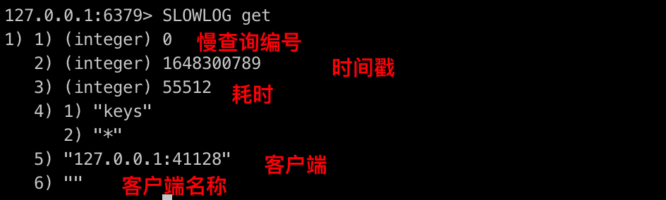

## Redis优雅的Key结构

* 遵循基本格式: [业务名称]:[数据名]:[id]
* 长度不超过44字节
* 不包含特殊字符

## BigKey

### BigKey的判定

BigKey通常以key的大小和key中的成员数量来综合判定，例如：

* key本身的数据量过大：一个String类型的key，它的值为5MB
* key中成员数量过多：一个ZSET类型的key，它的成员数量为10000个
* key中成员数据量过大：一个Hash类型的key，它的成员数量虽然只有1000个，但是这些成员的Value总大小为100MB

推荐值：

* 单个key的value小于10KB
* 对于集合类型的key，建议元素数量小于1000

### BigKey的危害

* 网络阻塞
* 数据倾斜
* Redis阻塞
* CPU压力

### 如何发现BigKey

* redis-cli --bigkeys

  遍历分析所有key，并返回key的整体统计信息与每个数据类型的Top1的big key

  ```
  redis-cli --bigkeys -h redis-w43bi668e1c5-proxy-nlb.jvessel-open-hb.jdcloud.com -a xxx
  ```

* scan扫描

  编程实现，利用scan扫描Redis中所有的key，利用strlen、hlen等命令判断key的长度（此处不建议使用memory usage）

* 第三方工具

  Redis-Rdb-Tools分析RDB快照文件，全面分析内存使用情况

* 网络监控

  自定义工具，监控进出Redis的网络数据，超出预警值时主动告警

### 如何删除BigKey

* Redis 3.0及以下版本

  如果是集合类型，则遍历BigKey的元素，先逐个删除子元素，最后删除BigKey

* Redis 4.0以后

  Redis在4.0后提供了异步删除的命令：unlink

## 选择恰当的数据类型

**案例一：存储一个User对象，有三种方式：**

**方式一：json字符串**

| key    | value                     |
| ------ | ------------------------- |
| user:1 | {"name":"jack", "age":21} |

优点：实现简单粗暴

缺点：数据耦合，不够灵活

**方式二：字段打散**

| key         | value |
| ----------- | ----- |
| user:1:name | jack  |
| user:1:age  | 21    |

优点：可以灵活的访问对象字段

缺点：占用空间大，没办法做统一控制

**方式三：hash**

| key    | field | value |
| ------ | ----- | ----- |
| user:1 | name  | jack  |
|        | age   | 21    |

优点：底层使用ziplist，占用空间小，可以灵活访问对象的任意字段

缺点：代码相对复杂

**案例二：假如有hash类型的key，其中有100w对field和value，field是自增的id，这个key存在什么问题？如何优化？**

| key     | field     | value       |
| ------- | --------- | ----------- |
| somekey | id:0      | value0      |
|         | ...       | ...         |
|         | id:999999 | value999999 |

存在的问题：

① hash的entry数量超过500时，会使用哈希表而不是ziplist，占用内存多

② 可以通过`hash-max-ziplist-entries` 配置entry上限，但是如果entry过多就会导致BigKey问题

```
config get  hash-max-ziplist-entries
```

如何解决：拆分为小的hash，将id / 100作为key，id % 100 作为field，这样每100个元素为一个hash

| key   | field   | value    |
| ----- | ------- | -------- |
| key:0 | key:00  | value0   |
|       | ...     | ...      |
|       | id:99   | value99  |
| key:1 | key:100 | value100 |
|       | ...     | ...      |
|       | key:199 | value199 |

## 批处理优化

批处理的方案

1. 原生的M操作
2. pipeline批处理

注意：

1. 批处理时不建议一次携带太多命令
2. pipeline的多个命令之间不具备原子性

### 集群批处理优化

## 服务端优化

### 持久化配置

Redis的持久化虽然可以保证数据安全，但也会带来很多额外的开销，因此持久化请遵循下列建议∶

1. 用来做缓存的Redis实例尽量不要开启持久化功能
2. 建议关闭RDB持久化功能，使用AOF持久化
3. 利用脚本定期在slave节点做RDB，实现数据备份
4. 设置合理的rewrite阈值，避免频繁的bgrewrite
5. 配置no-appendfsync-on-rewrite=yes，禁止在rewrite期间做aof，避免因AOF引起的阻塞部署有关建议∶
   1. Redis实例的物理机要预留足够内存，应对fork和rewrite
   2. 单个Redis实例内存上限不要太大，例如4G或8G。可以加快fork的速度、减少主从同步、数据迁移压力
   3. 不要与CPU密集型应用部署在一起
   4. 不要与高硬盘负载应用一起部署。例如∶数据库、消息队列

### 慢查询

慢日志配置

* `slowlog-log-slower-than` : 慢查询阈值，单位是微妙。默认10000，建议1000
* `slowlog-max-len` : 慢查询日志（本质上是一个队列）的长度。默认是128，建议1000

```
> config get slowlog-max-len
1) "slowlog-max-len"
2) "1024"
> config get slowlog-log-slower-than
1) "slowlog-log-slower-than"
2) "10000"
```



### 命令及安全配置

1. Redis一定要设置密码
2. 禁止线上使用下面命令∶keys、flushall、flushdb、config set等命令。可以利用rename-Command禁用。
3. bind∶限制网卡，禁止外网网卡访问
4. 开启防火墙
5. 不要使用Root账户启动Redis
6. 尽量不是有默认的端口

### 内存配置

当Redis内存不足时，可能导致Key频繁被删除、响应时间变长、QPS不稳定等问题。当内存使用率达到90%以上时就需要我们警惕，并快速定位到内存占用的原因。

| 内存占用   | 说明                                                         |
| ---------- | ------------------------------------------------------------ |
| 数据内存   | 是Redis最主要的部分，存储Redis的键值信息。主要问题是BigKey问题、内存碎片问题 |
| 进程内存   | Redis主进程本身运行肯定需要占用内存，如代码、常量池等等;这部分内存大约几兆，在大多数生产环境中与Redis数据占用的内存相比可以忽略。 |
| 缓冲区内存 | 一般包括客户端缓冲区、AOF缓冲区、复制缓冲区等。客户端缓冲区又包括输入缓冲区和输出缓冲区两种。这部分内存占用波动较大，不当使用BigKey，可能导致内存溢出。 |

#### 数据内存

Redis提供了一些命令，可以查看Redis目前的内存分配状态：

* info memory

  ```
  > info memory
  # Memory
  used_memory:91307560
  used_memory_human:87.08M
  used_memory_rss:100130816
  used_memory_rss_human:95.49M
  used_memory_peak:91493744
  used_memory_peak_human:87.26M
  used_memory_peak_perc:99.80%
  used_memory_overhead:65148010
  used_memory_startup:6274304
  used_memory_dataset:26159550
  used_memory_dataset_perc:30.76%
  used_memory_lua:37888
  used_memory_lua_human:37.00K
  maxmemory:1073741824
  maxmemory_human:1.00G
  maxmemory_policy:volatile-lru
  mem_fragmentation_ratio:1.10
  mem_allocator:jemalloc-4.0.3
  active_defrag_running:0
  lazyfree_pending_objects:0
  ```

  

* memory xxx

  ```
  > memory stats
   1) "peak.allocated"  // Redis进程自启动以来消耗内存的峰值
   2) (integer) 91493744
   3) "total.allocated" // Redis使用其分配器分配的总字节数，即当前的总内存使用量
   4) (integer) 91307560
   5) "startup.allocated" // Redis启动时消耗的初始内存字节数
   6) (integer) 6274304
   7) "replication.backlog" // 复制积压缓冲区大小
   8) (integer) 58720256
   9) "clients.slaves" // 主从复制中所有从节点的读写缓冲区大小
  10) (integer) 49630
  11) "clients.normal" // 除从节点外，所有其他客户端的读写缓冲区大小
  12) (integer) 100204
  13) "aof.buffer" // AOF持久化使用的缓存和AOF重写时产生的缓存
  14) (integer) 0
  15) "db.0" // 业务数据库的数量
  16) 1) "overhead.hashtable.main" // 当前数据库的hash链表开销内存总和，即元数据内存
      2) (integer) 3584
      3) "overhead.hashtable.expires" // 用于存储key的过期时间所消耗的内存
      4) (integer) 32
  17) "overhead.total"  // 数值 = startup.allocated + replication.backlog + clients.slaves + clients.normal + aof.buffer + db.x
  18) (integer) 65148010
  19) "keys.count" // 当前Redis实例的key总数
  20) (integer) 64
  21) "keys.bytes-per-key" // 当前Redis实例每个key的平均大小，计算公式: (total.allocated - startup.allocated) / keys.count
  22) (integer) 1328644
  23) "dataset.bytes" // 纯业务数据占用的内存大小
  24) (integer) 26159550
  25) "dataset.percentage" // 纯业务数据占用的内存比例，计算公式：dataset.bytes * 100 / (total.allocated - startup.allocated)
  26) "30.763904571533203"
  27) "peak.percentage" // 当前总内存与历史峰值的比例，计算公式：total.allocated * 100 / peak.allocated
  28) "99.7965087890625"
  29) "fragmentation" // 内存的碎片率
  30) "1.0966306924819946"
  ```

  

#### 内存缓冲区

* **复制缓冲区：**主从复制的repl backlog buf，如果太小可能导致频繁的全量复制，影响性能。通过repl-backlog-size来设置，默认1mb

* **AOF缓冲区：**AOF刷盘之前的缓存区域，AOF执行rewrite的缓冲区。无法设置容量上限

* **客户端缓冲区：**分为输入缓冲区和输出缓冲区，输入缓冲区最大1G且不能设置。输出缓冲区可以设置

  ```
  # Both the hard or the soft limit can be disabled by setting them to zero.
  client-output-buffer-limit normal 0 0 0
  client-output-buffer-limit slave 256mb 64mb 60
  client-output-buffer-limit pubsub 32mb 8mb 60
  ```

  配置说明：

  ```
  client-output-buffer-limit <class> <hard limit> <soft limit> <soft seconds>
  
  <class>:
  	normal: 普通客户端
  	replica：主从复制客户端
  	pubsub：pubsub客户端
  <hard limit>：缓冲区上限在超过limit后断开客户端
  <soft limit> <soft second>：缓冲区上限在超过soft limit并且持续了soft second后断开客户端连接
  ```

  查看当前客户端列表信息，

  ```
  > client list
  id=109 addr=192.168.1.171:59910 fd=1110 name= age=10 idle=4 flags=N db=0 sub=0 psub=0 multi=0 qbuf=0 qbuf-free=32768 obl=0 oll=0 omem=0 events=rw cmd=client
  id=88 addr=192.168.18.24:38500 fd=1089 name= age=7364461 idle=2 flags=N db=0 sub=0 psub=0 multi=0 qbuf=0 qbuf-free=32768 obl=0 oll=0 omem=0 events=rw cmd=info
  id=100 addr=192.168.18.24:57788 fd=1101 name= age=5809195 idle=2 flags=N db=0 sub=0 psub=0 multi=0 qbuf=0 qbuf-free=32768 obl=0 oll=0 omem=0 events=rw cmd=info
  ```

  ```
  > info clients
  # Clients
  connected_clients:4
  client_longest_output_list:0
  client_biggest_input_buf:0
  blocked_clients:0
  ```


### 集群最佳实践

##### 集群完整性问题

在Redis默认配置中，如果发现任意一个插槽不可用，则整个集群都会停止对外服务，可以配置`cluster-require-full-coverage` 修改

##### 集群带宽问题

集群节点之间会不断的互相Ping来确定集群中其它节点的状态。每次Ping携带的信息至少包括：

* 插槽信息
* 集群状态信息

集群中节点越多，集群状态信息数据量也越大，10个节点的相关信息可能达到1kb，此时每次集群互通需要的带宽会非常高。

解决途径∶

① 避免大集群，集群节点数不要太多，最好少于1000，如果业务庞大，则建立多个集群。

② 避免在单个物理机中运行太多Redis实例

③ 配置合适的`cluster-node-timeout`值

##### 集群还是主从

集群虽然具备高可用特性，能实现自动故障恢复，但是如果使用不当，也会存在一些问题：

①集群完整性问题

② 集群带宽问题

③ 数据倾斜问题

④ 客户端性能问题

⑤ 命令的集群兼容性问题

⑥ lua和事务问题

> 单体Redis（主从Redis）已经能达到万级别的QPS，并且也具备很强的高可用特性。如果主从能满足业务需求的情况下，尽量不搭建Redis集群。