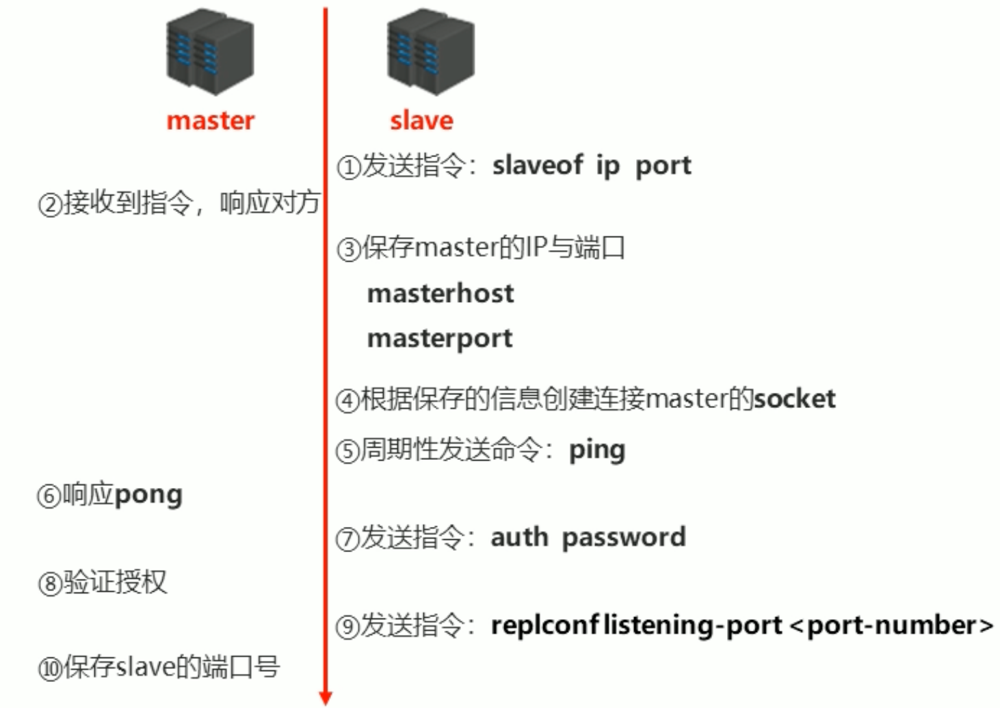
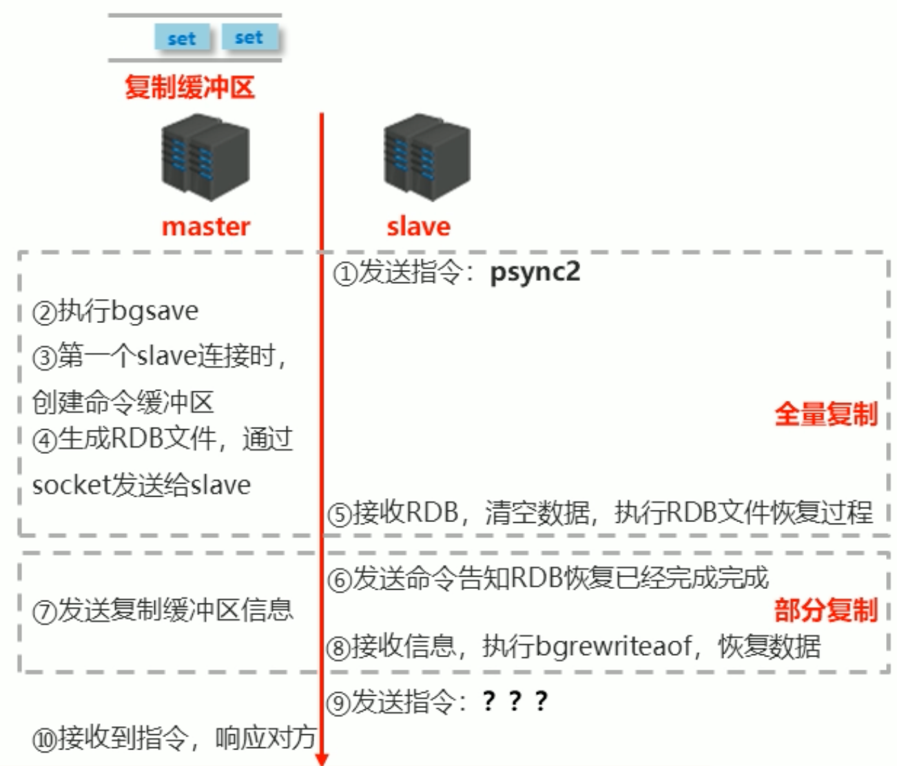
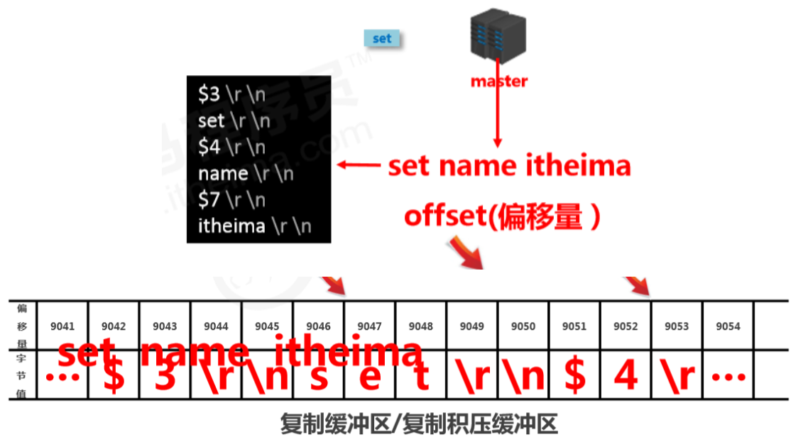
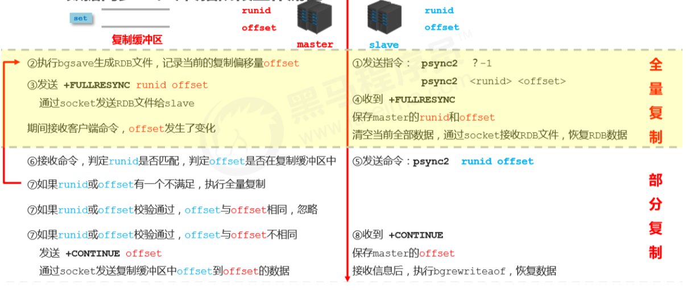
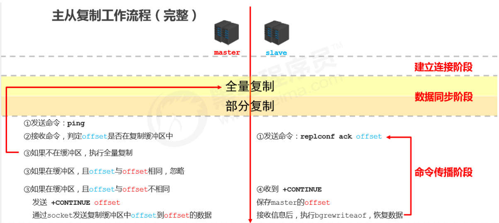

## Redis简介

### Redis应用

* 为热点数据加速查询（主要场景），如热点商品、热点新闻、热点资讯、推广类等高访问量信息
* 任务队列：秒杀、抢购、购票排队
* 即时信息查询：排行榜、网站访问统计、公交到站信息、在线人数信息、设备信号
* 时效性信息控制：验证码、投票控制
* 分布式数据共享：如分布式集群架构中的session分离
* 消息队列
* 分布式锁

## Redis下载安装

官方文档：http://redis.cn/commands.html

```bash
wget http://download.redis.io/releases/redis-4.0.13.tar.gz
tar -zxf redis-4.0.13.tar.gz
cd redis-4.0.13 && make
make PREFIX=/usr/local/redis install
```

## Redis配置文件

```
# redis绑定的主机地址
bind 127.0.0.1

port 6379

# 是否以守护进程的方式启动
daemonize no

# 当redis以守护进程方式运行时，redis默认会把pid写入指定的文件中
pidfile /var/run/redis_6379.pid

# 客户端闲置多长时间后关闭连接，如果指定为0，表示关闭该功能
timeout 0

# 指定Redis日志级别.
# debug (a lot of information, useful for development/testing)
# verbose (many rarely useful info, but not a mess like the debug level)
# notice (moderately verbose, what you want in production probably)
# warning (only very important / critical messages are logged)
loglevel notice

# 指定日志记录位置。默认为""，表示标准输出。
# 如果配置redis为守护进程方式运行，并且这里配置为标准输出，则日志将会被发给/dev/null
logfile ""

# 设置数据库的数量。默认数据库为0，可以使用SELECT <dbid>命令在连接上指定数据库id
# databases 16

# 指定在多长时间内，有多少次更新操作，就将数据同步到数据文件，可以多个条件配合
# save 900 1
# save 300 10
# save 60 10000
# save <seconds> <changes>

# 指定存储至本地数据库时是否压缩数据，默认是yes。
# redis采用LZF压缩算法压缩，如果为了节省CPU时间，可以设置为no关闭该选项，但会导致数据库文件变的巨大
rdbcompression yes

# 指定本地数据库文件名，默认值为dump.rdb
dbfilename dump.rdb

# 指定本地数据库存放目录
dir ./

# 设置当本机为slave服务时，设置master服务的ip地址以及端口，在redis启动时，它会自动从master进行数据同步
slaveof <masterip> <masterport>

# 当master服务设置了密码保护时，slave连接master的密码
masterauth <master-password>

# 设置redis连接密码，如果配置了连接密码，客户端在连接redis时需要通过AUTH <password>命令提供密码
requirepass foobared

# master端直接将RDB file传到slave socket，不需要与disk进行交互。
# 无磁盘diskless方式适合磁盘读写速度慢但网络带宽非常高的环境
repl-diskless-sync no

# 设置同一时间最大客户端连接数，默认无限制。
# redis可以同时打开的客户端连接数为Redis进程可以打开的最大文件描述符数，如果设置maxclients 0，表示不做限制。
# 当客户端连接数达到上限时，redis会关闭新的连接，并向客户端返回max number of clients reached错误信息
maxclients 10000

# 指定redis最大内存限制，redis在启动时，会把数据加载到内存中。
# 达到最大内存后，redis会先尝试清除已到期或即将到期的Key，
# 当此方法处理后，仍然到达最大内存设置，将无法再进行写入操作，但仍然可以进行读取操作。
# Redis新的vm机制，会把key存放内存，value存放在swap区
maxmemory <bytes>

# 指定是否在每次更新操作后进行日志记录。
# Redis在默认情况下是异步的把数据写入磁盘，如果不开启，可能会在断电时导致一段时间内的数据丢失。
# 因为redis本身同步数据文件是按save条件来同步的。
appendonly no

# 指定更新日志文件名，默认为appendonly.aof
appendfilename "appendonly.aof"

# 指定更新日志条件
# no: 表示等操作系统进行数据缓存同步到磁盘(快)
# always: 表示每次更新操作后手动调用fsync()将数据写到磁盘(慢，安全)
# everysec: 表示每秒同步一次(折中，默认值)
appendfsync everysec

# volatile-lru: 设定超时时间的数据中，删除最不常使用的数据
# allkeys-lru: 查询所有的key中最近最不常使用的数据进行删除，这是应用最广泛的策略
# volatile-lfu: 从所有配置了过期时间的key中驱逐使用频率最低的key，4版本新增
# allkeys-lfu从: 所有key中驱逐使用频率最低的key，4版本新增
# volatile-random: 在配置了过期时间的数据中随机删除
# allkeys-random: 从所有key中，随机删除
# volatile-ttl: 将所有设置过期时间的数据排序，将马上将要过期的数据进行删除
# noeviction: 不会进行删除操作，如果内存溢出则报错返回
maxmemory-policy noeviction

```

## redis-cli

**批量插入数据**

```bash
cat correct6.txt |redis-cli -a 'Lxy320826!!' --pipe
```


## 主从复制

### 主从复制的作用

* 读写分离：master写、slave读，提高服务器的读写负载能力
* 负载均衡：基于主从结构，配合读写分离，由slave分担master负载，并根据需求的变化，改变slave的数量，通过多个从节点分担数据读取负载，大大提高Redis服务器并发量与数据吞吐量
* 故障恢复：当master出现问题时，由slave提供服务，实现快速的故障恢复
* 数据冗余：实现数据热备份，是持久化之外的一种数据冗余方式
* 高可用：基于主从复制，构建哨兵模式与集群，实现Redis的高可用方案

### 主从复制工作流程

主从复制大体上可以分为3个阶段

1. 建立连接阶段
2. 数据同步阶段
3. 命令传播阶段

#### 建立连接阶段

**工作流程**



**slave连接master的三种方式**

1. 客户端发送命令

   ```bash
   slaveof <masterip> <masterport>
   ```

2. 启动服务时指定参数

   ```bash
   redis-server --slaveof <masterip> <masterport>
   ```

3. 在服务配置文件中指定

   ```
   slaveof <masterip> <masterport>
   masterauth <master passwd>
   ```

**slave断开master连接**

```
slaveof no one
```

#### 数据同步阶段

**工作流程**

1. 请求同步数据
2. 创建RDB同步数据
3. 恢复RDB同步数据
4. 请求部分同步数据
5. 恢复部分同步数据

至此，数据同步工作完成

>状态
>salve：具有master的全部数据，包含RDB过程接收的数据
>master：保存slave当前数据同步的位置
>总体：完成了数据克隆




* 全量复制

  将master执行bgsave之前，master中所有的数据同步到slave中

* 部分复制（增量复制）

  将master执行bgsave操作中，新加入的数据（复制缓冲区中的数据）传给slave，slave通过bgrewriteaof指令来恢复数据

##### master阶段说明

1. 如果master数据量巨大，数据同步阶段应**避开流量高峰期**，**避免**造成master**阻塞**，影响业务正常执行 

2. 复制缓冲区大小设定不合理，会导致数据溢出。如进行全量复制周期太长，进行部分复制时发现数据已经存在丢失的情况，必须进行第二次全量复制，致使slave陷入**死循环**状态。

   ```
   repl-backlog-size 1mb
   ```

3. master单机内存占用主机内存的比例不应过大，建议使用50%-70%的内存，留下30%-50%的内存用于执 行bgsave命令和创建复制缓冲区

##### slave阶段说明

1. 为避免slave进行全量复制、部分复制时服务器响应阻塞或数据不同步，**建议关闭**此期间的对外服务 

   ```
   slave-serve-stale-data yes|no
   ```

2. 数据同步阶段，master发送给slave信息可以理解master是slave的一个客户端，主动向slave发送命令

3. 多个slave同时对master请求数据同步，master发送的RDB文件增多，会对带宽造成巨大冲击，如果master带宽不足，因此数据同步需要根据业务需求，适量错峰 

4. slave过多时，建议调整拓扑结构，由一主多从结构变为树状结构，中间的节点既是master，也是 slave。注意使用树状结构时，由于层级深度，导致深度越高的slave与最顶层master间数据同步延迟较大，**数据一致性变差，应谨慎选择**

#### 命令传播阶段

- 当master数据库状态被修改后，导致主从服务器数据库状态不一致，此时需要让主从数据同步到一致的状态，**同步**的动作称为**命令传播**
- master将接收到的数据变更命令发送给slave，slave接收命令后执行命令

##### 命令传播阶段的部分复制

- 命令传播阶段出现了断网现象 
  - 网络闪断闪连 
  - 短时间网络中断 
  - 长时间网络中断 

- 部分复制的**三个核心要素**
  - 服务器的运行 id（run id） 
  - 主服务器的复制积压缓冲区 
  - 主从服务器的复制偏移量 

##### 服务器运行ID（runid)

- 概念：服务器运行ID是每一台服务器每次运行的身份识别码，一台服务器多次运行可以生成多个运行id 

- 组成：运行id由40位字符组成，是一个随机的十六进制字符 例如

  fdc9ff13b9bbaab28db42b3d50f852bb5e3fcdce 

- 作用：运行id被用于在服务器间进行传输，识别身份 

  如果想两次操作均对同一台服务器进行，必须每次操作携带对应的运行id，用于对方识别 

- 实现方式：运行id在每台服务器启动时自动生成的，master在首次连接slave时，会将自己的运行ID发送给slave，slave保存此ID，通过**info Server**命令，可以查看节点的runid 

##### 复制缓冲区

- 概念：复制缓冲区，又名复制积压缓冲区，是一个**先进先出（FIFO）的队列**，用于存储服务器执行过的命 令，每次传播命令，master都会将传播的命令记录下来，并存储在复制缓冲区 

- 由来：每台服务器启动时，如果开启有AOF或被连接成为master节点，即创建复制缓冲区 

- 作用：用于保存master收到的所有指令（仅影响数据变更的指令，例如set，select） 

- 数据来源：当master接收到主客户端的指令时，除了将指令执行，会将该指令存储到缓冲区中

- 工作原理

  - 由偏移量和字节值组成

  - 通过offset区分不同的slave当前数据传播的差异

  - master记录已发送的信息对应的offset

  - slave记录已接收的信息对应的offset

    

##### 主从服务器复制偏移量

- 概念：一个数字，描述复制缓冲区中的指令字节位置 
- 分类： 
  - master复制偏移量：记录发送给所有slave的指令字节对应的位置（多个） 
  - slave复制偏移量：记录slave接收master发送过来的指令字节对应的位置（一个） 
- 数据来源： master端：发送一次记录一次。slave端：接收一次记录一次 
- 作用：**同步信息**，比对master与slave的差异，当slave断线后，恢复数据使用 

##### 数据同步+命令传播阶段工作流程



#### 心跳机制

- 进入**命令传播阶段候**，master与slave间需要进行信息交换，使用心跳机制进行维护，实现双方连接保持在线
- master心跳：
  - 指令：PING
  - 周期：由repl-ping-slave-period决定，默认10秒
  - 作用：判断slave是否在线
  - 查询：INFO replication 获取slave最后一次连接时间间隔，lag项维持在0或1视为正常
- slave心跳任务
  - 指令：REPLCONF ACK {offset}
  - 周期：1秒
  - 作用1：汇报slave自己的复制偏移量，获取最新的数据变更指令
  - 作用2：判断master是否在线

##### 心跳阶段注意事项

- 当slave多数掉线，或延迟过高时，master为保障数据稳定性，将拒绝所有信息同步操作

  ```
  min-slaves-to-write 2
  min-slaves-max-lag 8
  ```

  slave数量少于2个，或者所有slave的延迟都大于等于8秒时，强制关闭master写功能，停止数据同步

- slave数量由slave发送**REPLCONF ACK**命令做确认

- slave延迟由slave发送**REPLCONF ACK**命令做确认

#### 完整流程




#### 主从复制常见问题

##### 频繁的全量复制

伴随着系统的运行，master的数据量会越来越大，一旦master重启，runid将发生变化，会导致全部slave的全量复制操作

**内部优化调整方案**

1. master内部创建master_replid变量，使用runid相同的策略生成，长度41位，并发送给所有slave
2. 在master关闭时执行命令`shutdown save` ，进行RDB持久化，将runid和offset保存到RDB文件中。通过`redis-check-rdb` 命令可以查看该信息

### 主从复制优化

1. 在master中配置`repl-diskless-sync yes`启用无磁盘复制，避免全量同步时的磁盘IO
2. Redis单节点上的内存占用不要太大，减少RDB导致的过多磁盘IO
3. 适当提高`repl_baklog`的大小，发现slave宕机时尽快实现故障恢复，尽可能避免全量同步
4. 限制一个master上的slave的数量，如果实在是太多slave，则可以采用主-从-从链式结构，减少master压力


