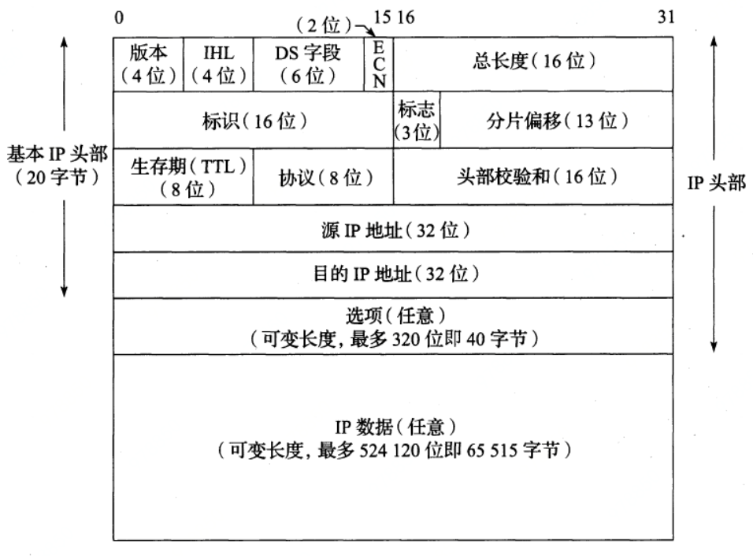

# tcp/ip详解读书笔记

数据帧：

数据帧的分用过程

当目的主机收到一个以太网数据帧时，数据就开始从协议栈中由底向上升，同时去掉各
层协议加上的报文首部。每层协议盒都要去检查报文首部中的协议标识，以确定接收数据的
上层协议。这个过程称作分用（Demultiplexing）

## 数据链路层

802.2：定义以下三种网络的共同特性

802.3：CSMA/CD载波侦听多路访问/冲突检测

802.4：令牌总线

802.5：令牌环

802.3标准定义的帧最小38字节，以太网帧最小是46字节

802.3帧格式

以太网帧格式

### SLIP（Serial Line IP）：串行线路IP

SLIP协议定义的帧格式：

速率：19200b/s

SLIP的缺陷：

1. 每一端必须知道对方的IP地址。没有办法把本端的IP地址通知给另一端。

2. 数据帧中没有类型字段（类似于以太网中的类型字段）。如果一条串行线路用于SLIP，
   那么它不能同时使用其他协议。

3. SLIP没有在数据帧中加上检验和（类似于以太网中的CRC字段）。如果SLIP传输的报
   文被线路噪声影响而发生错误，只能通过上层协议来发现（另一种方法是，新型的调制解调
   器可以检测并纠正错误报文）。这样，上层协议提供某种形式的CRC就显得很重要。

### CSLIP：压缩的SLIP

压缩传输的字节数

### PPP：点对点协议

数据帧格式

转义过程

### MTU

以太网和802.3对数据帧的长度都有一个限制，其最大值分别是1500和1492字节。链路层的这个特性称作MTU，最大传输单元。不同类型的网络大多数都有一个上限。

## 网络层

### IP数据包结构

版本：协议版本号，0100，IPv4

IHL首部长度：指的是IP数据报首部的长度。表示32位字的个数，比如0101，表示5*4=20字节，也就是IP首部占20字节大小。最大是1111,15 * 4 = 60字节

DS：区分服务字段，6个bit位

在一个类别中,较高丢弃优先级的数据报优先于那些较低丢弃优先级的数据报处理(即以较高优先级转发)

结合流量类别和丢弃优先级,名称AF妒对应于保证转发类别;的丢弃优先级jo例如,一个标记为AF32的数据报的流量类别为3,丢弃优先级为2

ECN：显示拥塞通知字段

总长度：指整个IP数据报的长度（不包括填充字段），单位是字节。最大可表示2 ^ 16 - 1 = 65535字节。如果IP数据报的长度不足46字节，则MAC子层会在数据最后填充数据来保证最小帧大小为64字节。但是该字段

标识：唯一标识主机发送的每一份数据报

TTL：设置了数据报可以经过的最多路由器数

协议：上层协议类型

首部校验和：是根据I P首部计算的检验和码。它不对首部后面的数据进行计算。

选项：

## ARP

### 帧格式

帧类型：APR是0x0806

硬件类型：1，表示以太网类型

协议类型：0x0800，表示IP

硬件地址长度：以太网的值为6

协议地址长度：IP是4,

op：操作字段指出四种操作类型，它们是ARP请求（值为1）、ARP应答（值为2）、RARP请求（值为3）和RARP应答（值为4）

发送端硬件地址：

发送端协议地址：

目的端硬件地址：

目的端协议地址：

## DHCP

### 报文格式

## gittest

