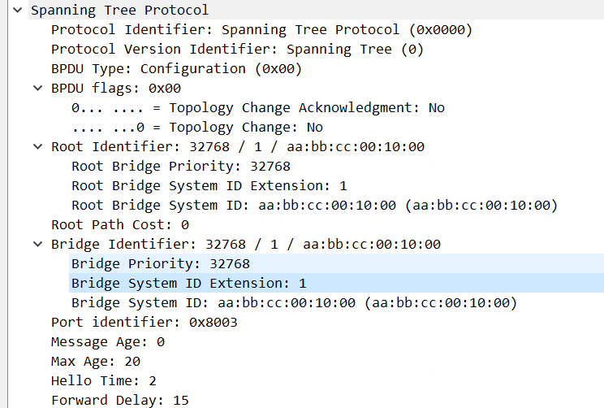
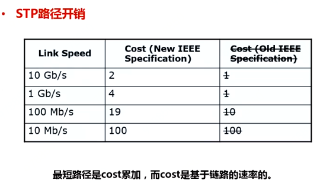
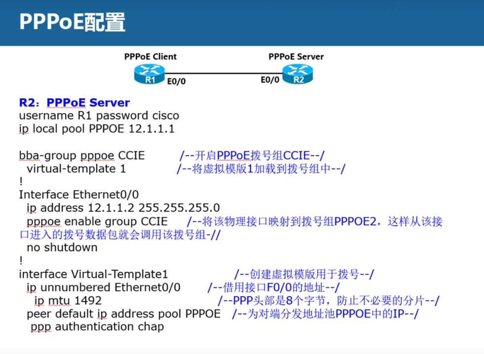
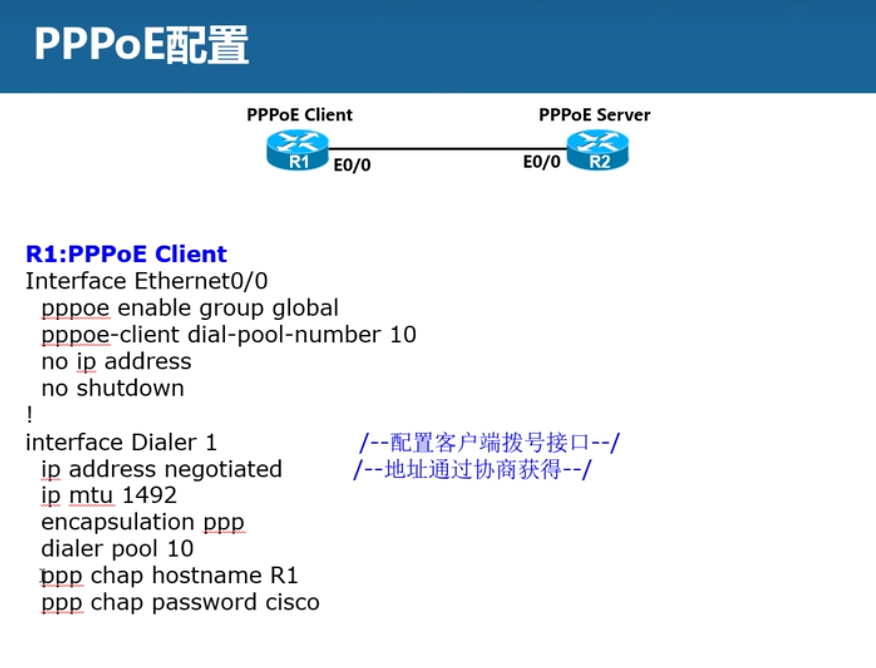

## EIGRP

### EIGRP数据包

Hello

更新

查询

应答

确认（ACK）

### EIGRP的metric

### DUAL算法

后继路由器(S)

可行距离(FD)

可行后继路由器(FS)

通告距离(AD)

可行条件(FC)

### 不等价负载均衡

## OSPF

### OSPF报文

Hello

DBD

LSR

LSU

LSAck

### 邻居状态机

down

ATT

init

2-way

ex-start

change

loading

full

### OSPF区域

### OSPF三张表

邻居表

拓扑表

OSPF路由表

### OSPF基本运行步骤

Hello报文建立邻接关系

## VLAN

### VTP

作用：

vtp修剪

## STP协议

### STP的分类

### STP如何防止环路步骤

1. 每个广播域选择一个根桥
2. 每个非根桥上，选择一个根端口（RP）
3. 每个段选择一个指定端口
4. 阻塞其它端口

### STP字段



### 根桥的选举

每个交换机都有一个bridgeId，bridgeId有三部分组成：优先级（4bit），扩展系统id（12bit），mac地址（48bit）。从前到后依次比较，小的选举为根桥。

为什么优先级只有4bit，但是报文中，值却那么大呢？因为该值需要乘上4096。所以最终，优先级的可选值只有以下16个值：

```
SW3(config)#span vlan 1 priority 11
% Bridge Priority must be in increments of 4096.
% Allowed values are: 
  0     4096  8192  12288 16384 20480 24576 28672
  32768 36864 40960 45056 49152 53248 57344 61440
```

查看当前的根桥：

```
SW3#show spanning-tree vlan 1    

VLAN0001
  Spanning tree enabled protocol ieee
  Root ID    Priority    1
             Address     aabb.cc00.3000
             This bridge is the root
             Hello Time   2 sec  Max Age 20 sec  Forward Delay 15 sec

  Bridge ID  Priority    1      (priority 0 sys-id-ext 1)
             Address     aabb.cc00.3000
             Hello Time   2 sec  Max Age 20 sec  Forward Delay 15 sec
             Aging Time  300 sec

Interface           Role Sts Cost      Prio.Nbr Type
------------------- ---- --- --------- -------- --------------------------------
Et0/0               Desg FWD 100       128.1    Shr 
Et0/1               Desg FWD 100       128.2    Shr 
Et0/2               Desg FWD 100       128.3    Shr 
Et0/3               Desg FWD 100       128.4    Shr 
```

### 选举根端口

1. 根据cost值，判断非根桥上，哪个端口距离根桥更近，更近的那个是根端口
2. 如果cost一样，则判断从上游收到的bpdu中，那个接口收到的bridgeID小，哪个接口就是根端口。
3. 如果桥ID一样，则比较最低端口的ID。



查看端口优先级

```
SW2#show spanning-tree vlan 1

VLAN0001
  Spanning tree enabled protocol ieee
  Root ID    Priority    1
             Address     aabb.cc00.3000
             Cost        100
             Port        2 (Ethernet0/1)
             Hello Time   2 sec  Max Age 20 sec  Forward Delay 15 sec

  Bridge ID  Priority    32769  (priority 32768 sys-id-ext 1)
             Address     aabb.cc00.2000
             Hello Time   2 sec  Max Age 20 sec  Forward Delay 15 sec
             Aging Time  300 sec

Interface           Role Sts Cost      Prio.Nbr Type
------------------- ---- --- --------- -------- --------------------------------
Et0/0               Altn BLK 100       128.1    Shr 
Et0/1               Root FWD 100       128.2    Shr 
Et0/2               Desg FWD 100       128.3    Shr 
Et0/3               Desg FWD 100       128.4    Shr 
```


修改端口优先级：

```
SW2(config-if)#spanning-tree vlan 1 port-priority ?
  <0-192>  port priority in increments of 64
```

### 选举指定端口（DP）

1. 根桥上端口都是指定端口
2. 两个非根桥之间，先比较cost值，小的是指定端口，如果cost相同，比较各自的bridgeID

### STP端口状态

STP，如果一条链路down了，需要50s才能完成切换。

block	20s

listen	15s

learning    15s

forwarding

### 在所有access接口开启portfast和bpduguard

```
SW2(config)#spanning-tree portfast default
SW2(config)#spanning-tree portfast bpduguard default
```

## 链路捆绑

### EC

### VSS

### 级联

### 堆叠

## 热备技术

### FHRP（首跳冗余）

#### HSRP

1. 实体：active路由器、standby路由器、virtual路由器、其他HSRP路由器

2. active和standby通过Hello报文，224.0.0.2地址通信，UDP=1985，间隔3s
3. active路由器竞争：先比较优先级（0-255，默认100），优先级相同，比较IP地址，ip地址大的成为active
4. standby路由器监听224.0.0.2的hello消息，一旦发现active出现问题（holdtime=10s），立马从standby升级为active

#### VRRP

#### track技术

### GLBP

## DHCP

1. 启动DHCP服务
2. 配置地址池(网段或者单独绑定)
3. 配置DHCP中继
4. 客户端配置DHCP获取

## ACL

#### 标准ACL

#### 扩展ACL

## PPP

## PPPoE配置

服务端（ISP）配置



客户端配置



## VPN

### GRE

