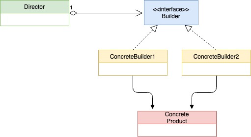

## 建造者模式

建造者模式是一种创建型模式，主要用来创建比较复杂的对象。

建造者模式的使用场景：

1. 建造者模式通常适用于有多个构造器参数或者需要较多构建步骤的场景。使用建造者模式可以精简构造器参数的数量，让构建过程更有条理。
2. 可以为同一个产品提供两个不同的实现。比如，在下面的代码中，为`house`类型创建了两个不同的实现：通过iglooBuilder构建的igloo（冰屋），以及通过cabinBuilder构建的cabin（木屋）
3. 可以应用于构建过程不允许被中断的场景。仍然参考刚才的代码，`house`类型的对象要么彻底完成，要么压根没有创建，不会存在中间状态，这是因为struct `director`封装了相应的过程，中间状态仅存在于ConcreteBuilder中。

下面是UML类图:



代码大致如下：

house.go:

```go
package builder

type house struct {
    windowType string
    doorType string
    floor int
}
```

ibuilder.go

```go
package builder

type iHouseBuilder interface {
    setWindowType()
    setDoorType()
    setFloor()
    getHouse() house
}
```

house_builder.go

```go
package builder

type houseBuilder struct {
    house
}

func NewHouseBuilder() *houseBuilder {
    return &houseBuilder{}
}

func (h *houseBuilder) setWindowType() {
    h.house.windowType = "窗户"
}

func (h *houseBuilder) setDoorType() {
    h.house.doorType = "门"
}

func (h *houseBuilder) setFloor() {
    h.house.floor = 1
}

func (h *houseBuilder) getHouse() house {
    return h.house
}
```

director.go

```go
package builder

type director struct {
    builder iHouseBuilder
}

func NewDirector(b iHouseBuilder) *director {
    return &director{
        builder: b,
    }
}

func (d *director) BuildHouse() house {
    d.builder.setDoorType()
    d.builder.setWindowType()
    d.builder.setFloor()
    return d.builder.getHouse()
}
```

user_test.go

```go
package builder

import (
    "fmt"
    "testing"
)

func TestBuild(t *testing.T) {
    d := NewDirector(NewHouseBuilder())
    h := d.BuildHouse()
    fmt.Printf("%#v\n", h)
}
```

