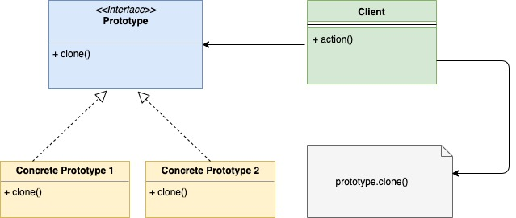

## 原型模式

原型模式也是一种创建型模式，它可以帮助我们优雅地创建对象的拷贝。在这种设计模式里面，将克隆某个对象的职责交给了要被克隆的这个对象。被克隆的对象需要提供一个`clone()`方法。通过这个方法可以返回该对象的拷贝。

原型模式的使用场景：

1. 创建新对象的操作比较耗资源（如数据库操作）或代价比较高时。比较起从头创建新对象，克隆对象明显更加可取
2. 要被克隆的对象创建起来比较复杂时：比如对象克隆的过程中存在深度拷贝或分层拷贝时；又比如要被克隆的对象存在无法被直接访问到的私有成员时。

原型模式的UML类图：



```go
package main

import "fmt"

// Cloneable 原型对象需要实现的接口
type Cloneable interface {
    Clone() Cloneable
}

type PrototypeManager struct {
    prototypes map[string]Cloneable
}

// NewPrototypeManager 构造初始化
func NewPrototypeManager() *PrototypeManager {
    return &PrototypeManager{
        prototypes: make(map[string]Cloneable),
    }
}

func (p *PrototypeManager) Get(name string) Cloneable {
    return p.prototypes[name]
}

func (p *PrototypeManager) Set(name string, prototype Cloneable) {
    p.prototypes[name] = prototype
}

type Type1 struct {
    name string
}

func (t *Type1) Clone() Cloneable {
    //tc := *t
    //return &tc // 深复制
    return t // 浅复制
}

type Type2 struct {
    name string
}

func (t *Type2) Clone() Cloneable {
    tc := *t
    return &tc
}

func main() {
    mgr := NewPrototypeManager()
    t1 := &Type1{name: "type1"}
    mgr.Set("t1", t1)
    t11 := mgr.Get("t1")
    t22 := t11.Clone()
    if t11 == t22 {
        fmt.Println("浅复制")
    } else {
        fmt.Println("深复制")
    }
}
```

