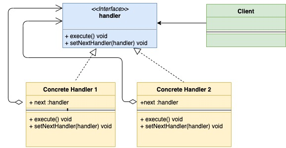
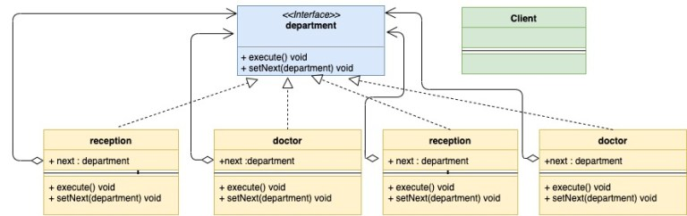

## 责任链模式

责任链模式是一种行为型设计模式。在这种模式中，会为请求创建一条由多个Handler组成的链路。每一个进入的请求，都会经过这条链路。这条链路上的Handler可以选择如下操作：

- 处理请求或跳过处理
- 决定是否将请求传给这条链路上的下一个Handler

下面是责任链模式的用例图：



以医院为例。在一个医院中会有如下职责成员：

1. 挂号处
2. 医生
3. 收银处
4. 药房

当病人来医院看病时，他会先去挂号处挂号，然后找医生看病，看完病后去收银处缴费，最后去药房拿药。在这个过程中，病人需要经过一个由四个职责部门组成的链条。病人在一个职责部门的事务结束后才能进入后续的职责部门，在这个过程中我们可以清晰地看到一条职责链。

现在可以说说责任链模式的适用场景了：

1. 当一个请求需要经过多个环节的处理时；
2. 因为有多个对象可以处理某个请求，但我们并不想让客户端选择处理请求的对象，同时我们还想将客户端和处理器解耦，此时我们可以选择职责链模式：客户端只需要和职责链中的第一个处理器接触就可以了。

下面是病人到医院看病这个实例的类图：



实现代码如下：

department.go

```go
type department interface {
    execute(*patient)
    setNext(department)
}
```

medical.go

```go
import "fmt"
 
type medical struct {
    next department
}

func (m *medical) execute(p *patient) {
    if p.medicineDone {
        fmt.Println("Medicine already given to patient")
        m.next.execute(p)
        return
    }
    fmt.Println("Medical giving medicine to patient")
    p.medicineDone = true
    m.next.execute(p)
}

func (m *medical) setNext(next department) {
    m.next = next
}
```

cashier.go

```go
import "fmt"

type cashier struct {
    next department
}

func (c *cashier) execute(p *patient) {
    if p.paymentDone {
        fmt.Println("Payment Done")
    }
    fmt.Println("Cashier getting money from patient patient")
    c.next.execute(p)
}

func (c *cashier) setNext(next department) {
    c.next = next
}
```

doctor.go

```go
import "fmt"

type doctor struct {
    next department
}

func (d *doctor) execute(p *patient) {
    if p.doctorCheckUpDone {
        fmt.Println("Doctor checkup already done")
        d.next.execute(p)
        return
    }
    fmt.Println("Doctor checking patient")
    p.doctorCheckUpDone = true
    d.next.execute(p)
}

func (d *doctor) setNext(next department) {
    d.next = next
}
```

reception.go

```go
import "fmt"
 
type reception struct {
    next department
}
 
func (r *reception) execute(p *patient) {
    if p.registrationDone {
        fmt.Println("Patient registration already done")
        r.next.execute(p)
        return
    }
    fmt.Println("Reception registering patient")
    p.registrationDone = true
    r.next.execute(p)
}
 
func (r *reception) setNext(next department) {
    r.next = next
}
```

patient.go

```go
type patient struct {
    name              string
    registrationDone  bool
    doctorCheckUpDone bool
    medicineDone      bool
    paymentDone       bool
}
```

main.go

```go
func main() {

    medical := &medical{}

    //Set next for cashier department
    cashier := &cashier{}
    cashier.setNext(medical)
    //Set next for doctor department
    doctor := &doctor{}
    doctor.setNext(cashier)
    //Set next for reception department
    reception := &reception{}
    reception.setNext(doctor)

    patient := &patient{name: "abc"}
    //Patient visiting
    reception.execute(patient)
}
```

执行结果如下：

```
Reception registering patient
Doctor checking patient
Cashier getting money from patient patient
Medical giving medicine to patient
```

